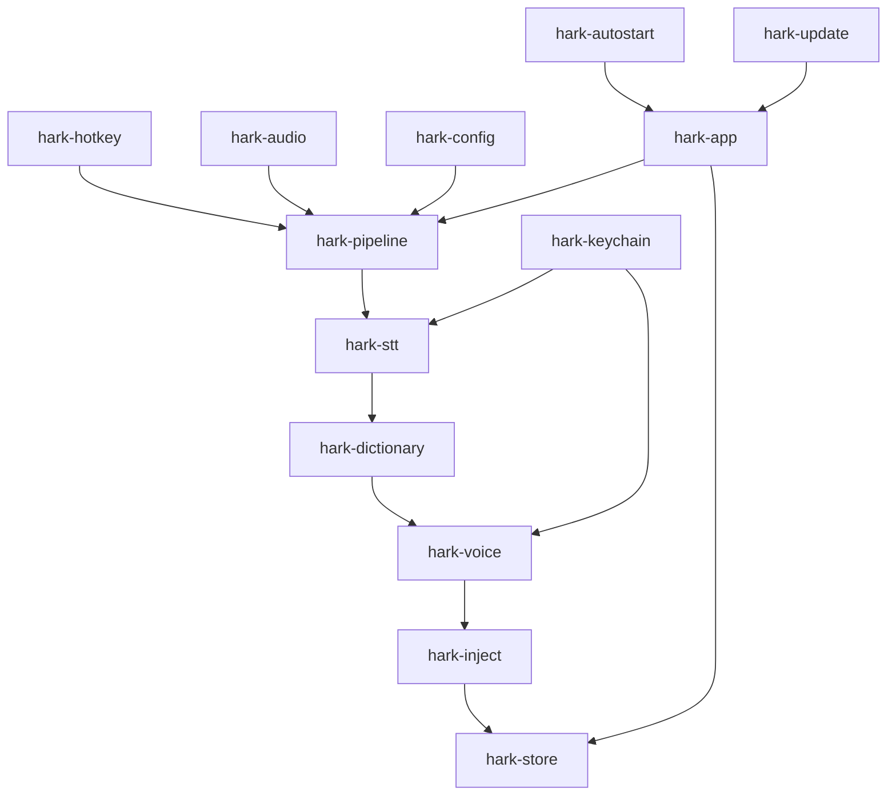
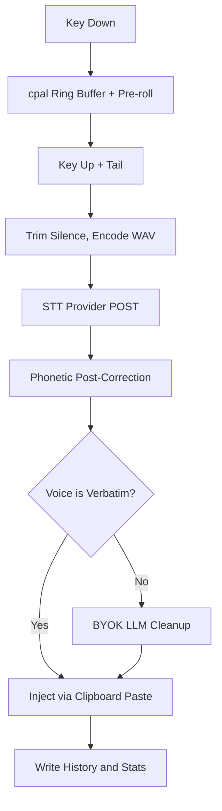

<!-- PAGE_ID: hark_01_overview -->

Relevant source files

The following files were used as evidence for this page:

- [README.md:1-13](https://github.com/BoardPandas/Hark/blob/1c1738716fa4cd758b0c26ec94d0873d1bc35ac1/README.md#L1-L13)
- [README.md:15-31](https://github.com/BoardPandas/Hark/blob/1c1738716fa4cd758b0c26ec94d0873d1bc35ac1/README.md#L15-L31)
- [README.md:35-57](https://github.com/BoardPandas/Hark/blob/1c1738716fa4cd758b0c26ec94d0873d1bc35ac1/README.md#L35-L57)
- [README.md:96-117](https://github.com/BoardPandas/Hark/blob/1c1738716fa4cd758b0c26ec94d0873d1bc35ac1/README.md#L96-L117)
- [README.md:137-141](https://github.com/BoardPandas/Hark/blob/1c1738716fa4cd758b0c26ec94d0873d1bc35ac1/README.md#L137-L141)
- [package.json:1-6](https://github.com/BoardPandas/Hark/blob/1c1738716fa4cd758b0c26ec94d0873d1bc35ac1/package.json#L1-L6)
- [Cargo.toml:1-17](https://github.com/BoardPandas/Hark/blob/1c1738716fa4cd758b0c26ec94d0873d1bc35ac1/Cargo.toml#L1-L17)
- [Cargo.toml:19-28](https://github.com/BoardPandas/Hark/blob/1c1738716fa4cd758b0c26ec94d0873d1bc35ac1/Cargo.toml#L19-L28)
- [CLAUDE.md:1-5](https://github.com/BoardPandas/Hark/blob/1c1738716fa4cd758b0c26ec94d0873d1bc35ac1/CLAUDE.md#L1-L5)
- [CLAUDE.md:9-20](https://github.com/BoardPandas/Hark/blob/1c1738716fa4cd758b0c26ec94d0873d1bc35ac1/CLAUDE.md#L9-L20)
- [CLAUDE.md:24-27](https://github.com/BoardPandas/Hark/blob/1c1738716fa4cd758b0c26ec94d0873d1bc35ac1/CLAUDE.md#L24-L27)

# Hark, Overview

> **Related Pages**: [Architecture](core/ARCHITECTURE.md), [Getting Started](GETTING_STARTED.md), [Glossary](GLOSSARY.md)

---

<!-- BEGIN:AUTOGEN hark_01_overview_introduction -->
## Introduction

Hark is a single-user, push-to-talk voice dictation desktop app for Windows and macOS, written in Rust ([CLAUDE.md:3](https://github.com/BoardPandas/Hark/blob/1c1738716fa4cd758b0c26ec94d0873d1bc35ac1/CLAUDE.md#L3)). The user holds a key, speaks, releases it, and polished English text is injected at the cursor in whatever app has focus ([README.md:3](https://github.com/BoardPandas/Hark/blob/1c1738716fa4cd758b0c26ec94d0873d1bc35ac1/README.md#L3)).

Transcription is bring-your-own-key (BYOK) cloud: the user supplies their own speech-to-text provider key rather than Hark running a local model or operating any server ([README.md:3](https://github.com/BoardPandas/Hark/blob/1c1738716fa4cd758b0c26ec94d0873d1bc35ac1/README.md#L3); [package.json:5](https://github.com/BoardPandas/Hark/blob/1c1738716fa4cd758b0c26ec94d0873d1bc35ac1/package.json#L5)). History, stats, and the dictionary are local-only and never leave the machine, while the optional cleanup pass uses the user's own LLM key ([README.md:3](https://github.com/BoardPandas/Hark/blob/1c1738716fa4cd758b0c26ec94d0873d1bc35ac1/README.md#L3), [CLAUDE.md:3](https://github.com/BoardPandas/Hark/blob/1c1738716fa4cd758b0c26ec94d0873d1bc35ac1/CLAUDE.md#L3)). This is a pivot from an earlier on-device STT design, dated 2026-07-15 ([CLAUDE.md:3](https://github.com/BoardPandas/Hark/blob/1c1738716fa4cd758b0c26ec94d0873d1bc35ac1/CLAUDE.md#L3)). The project is described as "Wispr Flow-style dictation, scoped to one user, English-only, and local-first" ([README.md:5](https://github.com/BoardPandas/Hark/blob/1c1738716fa4cd758b0c26ec94d0873d1bc35ac1/README.md#L5)), and is explicitly a native desktop app with no web frontend, server, database service, auth service, or hosting platform ([CLAUDE.md:5](https://github.com/BoardPandas/Hark/blob/1c1738716fa4cd758b0c26ec94d0873d1bc35ac1/CLAUDE.md#L5)).

Sources: [README.md:1-5](https://github.com/BoardPandas/Hark/blob/1c1738716fa4cd758b0c26ec94d0873d1bc35ac1/README.md#L1-L5), [package.json:1-6](https://github.com/BoardPandas/Hark/blob/1c1738716fa4cd758b0c26ec94d0873d1bc35ac1/package.json#L1-L6), [CLAUDE.md:1-5](https://github.com/BoardPandas/Hark/blob/1c1738716fa4cd758b0c26ec94d0873d1bc35ac1/CLAUDE.md#L1-L5)
<!-- END:AUTOGEN hark_01_overview_introduction -->

---

<!-- BEGIN:AUTOGEN hark_01_overview_principles -->
## Design Principles

Five stated principles shape every implementation decision in Hark ([README.md:7-13](https://github.com/BoardPandas/Hark/blob/1c1738716fa4cd758b0c26ec94d0873d1bc35ac1/README.md#L7-L13)):

- **Speed is the product.** All perceived latency lives in the release-to-inject window, so the whole pipeline is structured to keep that window small ([README.md:9](https://github.com/BoardPandas/Hark/blob/1c1738716fa4cd758b0c26ec94d0873d1bc35ac1/README.md#L9)).
- **Local-first where it counts.** History, stats, and the dictionary never leave the machine; transcription goes only to the STT provider the user chooses, under the user's own key, and there are no Hark-operated servers ([README.md:10](https://github.com/BoardPandas/Hark/blob/1c1738716fa4cd758b0c26ec94d0873d1bc35ac1/README.md#L10)).
- **Lean.** A single Rust process (an always-on tray daemon plus a native window opened on demand) with no webview, browser tab, or JS toolchain ([README.md:11](https://github.com/BoardPandas/Hark/blob/1c1738716fa4cd758b0c26ec94d0873d1bc35ac1/README.md#L11)).
- **English done well.** Accuracy is prioritized over broad language support ([README.md:12](https://github.com/BoardPandas/Hark/blob/1c1738716fa4cd758b0c26ec94d0873d1bc35ac1/README.md#L12)).
- **Data, not code, for anything tunable.** The dictionary and voice presets are config, so editing them never touches the pipeline ([README.md:13](https://github.com/BoardPandas/Hark/blob/1c1738716fa4cd758b0c26ec94d0873d1bc35ac1/README.md#L13)).

The same latency principle is restated as the project's "one hard rule" alongside the main-thread/worker-thread split: all perceived latency is release-to-inject (WAV encode, one HTTPS POST, inject), so the app reuses one long-lived HTTP client and allows at most one retry, on timeout only, with history/stats writes deferred until after injection ([CLAUDE.md:26-27](https://github.com/BoardPandas/Hark/blob/1c1738716fa4cd758b0c26ec94d0873d1bc35ac1/CLAUDE.md#L26-L27)).

Sources: [README.md:7-13](https://github.com/BoardPandas/Hark/blob/1c1738716fa4cd758b0c26ec94d0873d1bc35ac1/README.md#L7-L13), [CLAUDE.md:24-27](https://github.com/BoardPandas/Hark/blob/1c1738716fa4cd758b0c26ec94d0873d1bc35ac1/CLAUDE.md#L24-L27)
<!-- END:AUTOGEN hark_01_overview_principles -->

---

<!-- BEGIN:AUTOGEN hark_01_overview_stack -->
## Technology Stack

Hark is a desktop app with no web infrastructure: no server, database service, auth, or hosting platform ([README.md:17](https://github.com/BoardPandas/Hark/blob/1c1738716fa4cd758b0c26ec94d0873d1bc35ac1/README.md#L17)). The stack is a single Cargo workspace ([Cargo.toml:1-17](https://github.com/BoardPandas/Hark/blob/1c1738716fa4cd758b0c26ec94d0873d1bc35ac1/Cargo.toml#L1-L17)):

| Layer | Choice | Source |
|---|---|---|
| Language / process model | Rust; single process, UI on main thread, pipeline on worker threads | ([README.md:21](https://github.com/BoardPandas/Hark/blob/1c1738716fa4cd758b0c26ec94d0873d1bc35ac1/README.md#L21), [CLAUDE.md:11](https://github.com/BoardPandas/Hark/blob/1c1738716fa4cd758b0c26ec94d0873d1bc35ac1/CLAUDE.md#L11)) |
| Audio | `cpal` (16 kHz mono ring buffer, pre-roll + tail) | ([README.md:22](https://github.com/BoardPandas/Hark/blob/1c1738716fa4cd758b0c26ec94d0873d1bc35ac1/README.md#L22), [CLAUDE.md:12](https://github.com/BoardPandas/Hark/blob/1c1738716fa4cd758b0c26ec94d0873d1bc35ac1/CLAUDE.md#L12)) |
| Push-to-talk | Native low-level key hooks: CGEventTap (macOS), `WH_KEYBOARD_LL` (Windows), not the `global-hotkey` crate | ([README.md:23](https://github.com/BoardPandas/Hark/blob/1c1738716fa4cd758b0c26ec94d0873d1bc35ac1/README.md#L23), [CLAUDE.md:13](https://github.com/BoardPandas/Hark/blob/1c1738716fa4cd758b0c26ec94d0873d1bc35ac1/CLAUDE.md#L13)) |
| STT | BYOK cloud via an `SttProvider` trait: OpenAI-compatible `/audio/transcriptions` adapter (OpenAI, Groq) + Deepgram nova-3 adapter (`keyterm` biasing); no local model | ([README.md:24](https://github.com/BoardPandas/Hark/blob/1c1738716fa4cd758b0c26ec94d0873d1bc35ac1/README.md#L24), [CLAUDE.md:14](https://github.com/BoardPandas/Hark/blob/1c1738716fa4cd758b0c26ec94d0873d1bc35ac1/CLAUDE.md#L14)) |
| STT transport | `reqwest` blocking + multipart + rustls on worker threads; one long-lived client; no global tokio runtime | ([README.md:25](https://github.com/BoardPandas/Hark/blob/1c1738716fa4cd758b0c26ec94d0873d1bc35ac1/README.md#L25), [CLAUDE.md:15](https://github.com/BoardPandas/Hark/blob/1c1738716fa4cd758b0c26ec94d0873d1bc35ac1/CLAUDE.md#L15)) |
| Dictionary | Phonetic post-correction (primary, provider-agnostic) + per-provider biasing (OpenAI/Groq `prompt`, Deepgram `keyterm`) | ([README.md:26](https://github.com/BoardPandas/Hark/blob/1c1738716fa4cd758b0c26ec94d0873d1bc35ac1/README.md#L26), [CLAUDE.md:16](https://github.com/BoardPandas/Hark/blob/1c1738716fa4cd758b0c26ec94d0873d1bc35ac1/CLAUDE.md#L16)) |
| Cleanup / voices | BYOK, OpenAI-compatible chat endpoint (optional); one low-temp call | ([README.md:27](https://github.com/BoardPandas/Hark/blob/1c1738716fa4cd758b0c26ec94d0873d1bc35ac1/README.md#L27), [CLAUDE.md:17](https://github.com/BoardPandas/Hark/blob/1c1738716fa4cd758b0c26ec94d0873d1bc35ac1/CLAUDE.md#L17)) |
| Injection | Clipboard paste (stash to set to paste to restore); `enigo` keystroke fallback | ([README.md:28](https://github.com/BoardPandas/Hark/blob/1c1738716fa4cd758b0c26ec94d0873d1bc35ac1/README.md#L28), [CLAUDE.md:18](https://github.com/BoardPandas/Hark/blob/1c1738716fa4cd758b0c26ec94d0873d1bc35ac1/CLAUDE.md#L18)) |
| Tray + UI | `tray-icon` + `eframe`/`egui` (native, no webview) | ([README.md:29](https://github.com/BoardPandas/Hark/blob/1c1738716fa4cd758b0c26ec94d0873d1bc35ac1/README.md#L29), [CLAUDE.md:19](https://github.com/BoardPandas/Hark/blob/1c1738716fa4cd758b0c26ec94d0873d1bc35ac1/CLAUDE.md#L19)) |
| Storage | `rusqlite` (history + stats); TOML (settings + dictionary) | ([README.md:30](https://github.com/BoardPandas/Hark/blob/1c1738716fa4cd758b0c26ec94d0873d1bc35ac1/README.md#L30), [CLAUDE.md:20](https://github.com/BoardPandas/Hark/blob/1c1738716fa4cd758b0c26ec94d0873d1bc35ac1/CLAUDE.md#L20)) |
| Key storage | `keyring` to macOS Keychain / Windows Credential Manager | ([README.md:31](https://github.com/BoardPandas/Hark/blob/1c1738716fa4cd758b0c26ec94d0873d1bc35ac1/README.md#L31), [CLAUDE.md:20](https://github.com/BoardPandas/Hark/blob/1c1738716fa4cd758b0c26ec94d0873d1bc35ac1/CLAUDE.md#L20)) |

The workspace requires Rust 1.97+ because `libsqlite3-sys` 0.38.1 (bundled SQLite via `rusqlite`) uses `cfg_select!`, which is unstable before that version ([Cargo.toml:25-27](https://github.com/BoardPandas/Hark/blob/1c1738716fa4cd758b0c26ec94d0873d1bc35ac1/Cargo.toml#L25-L27)).

Sources: [README.md:15-31](https://github.com/BoardPandas/Hark/blob/1c1738716fa4cd758b0c26ec94d0873d1bc35ac1/README.md#L15-L31), [CLAUDE.md:9-20](https://github.com/BoardPandas/Hark/blob/1c1738716fa4cd758b0c26ec94d0873d1bc35ac1/CLAUDE.md#L9-L20), [Cargo.toml:19-28](https://github.com/BoardPandas/Hark/blob/1c1738716fa4cd758b0c26ec94d0873d1bc35ac1/Cargo.toml#L19-L28)
<!-- END:AUTOGEN hark_01_overview_stack -->

---

<!-- BEGIN:AUTOGEN hark_01_overview_layout -->
## Crate Layout

Hark is one Cargo workspace of 13 member crates plus a top-level `config/` directory of defaults ([Cargo.toml:3-17](https://github.com/BoardPandas/Hark/blob/1c1738716fa4cd758b0c26ec94d0873d1bc35ac1/Cargo.toml#L3-L17); [README.md:100-117](https://github.com/BoardPandas/Hark/blob/1c1738716fa4cd758b0c26ec94d0873d1bc35ac1/README.md#L100-L117)):

| Crate | Responsibility |
|---|---|
| `hark-app` | Main-thread event loop, worker orchestration, single-instance guard, and the egui settings/history/stats window ([README.md:102-103](https://github.com/BoardPandas/Hark/blob/1c1738716fa4cd758b0c26ec94d0873d1bc35ac1/README.md#L102-L103)) |
| `hark-hotkey` | Native push-to-talk key hooks (`WH_KEYBOARD_LL` / CGEventTap) ([README.md:104](https://github.com/BoardPandas/Hark/blob/1c1738716fa4cd758b0c26ec94d0873d1bc35ac1/README.md#L104)) |
| `hark-audio` | `cpal` ring buffer, pre-roll + tail ([README.md:105](https://github.com/BoardPandas/Hark/blob/1c1738716fa4cd758b0c26ec94d0873d1bc35ac1/README.md#L105)) |
| `hark-stt` | `SttProvider` trait + adapters (OpenAI-compatible, Deepgram) ([README.md:106](https://github.com/BoardPandas/Hark/blob/1c1738716fa4cd758b0c26ec94d0873d1bc35ac1/README.md#L106)) |
| `hark-dictionary` | Phonetic post-correction + per-provider biasing terms ([README.md:107](https://github.com/BoardPandas/Hark/blob/1c1738716fa4cd758b0c26ec94d0873d1bc35ac1/README.md#L107)) |
| `hark-voice` | Voice presets + BYOK cleanup adapter ([README.md:108](https://github.com/BoardPandas/Hark/blob/1c1738716fa4cd758b0c26ec94d0873d1bc35ac1/README.md#L108)) |
| `hark-inject` | Clipboard paste + `enigo` fallback ([README.md:109](https://github.com/BoardPandas/Hark/blob/1c1738716fa4cd758b0c26ec94d0873d1bc35ac1/README.md#L109)) |
| `hark-pipeline` | Release-to-inject orchestration across worker threads ([README.md:110](https://github.com/BoardPandas/Hark/blob/1c1738716fa4cd758b0c26ec94d0873d1bc35ac1/README.md#L110)) |
| `hark-store` | `rusqlite` (history + stats) ([README.md:111](https://github.com/BoardPandas/Hark/blob/1c1738716fa4cd758b0c26ec94d0873d1bc35ac1/README.md#L111)) |
| `hark-config` | TOML settings + dictionary load/save ([README.md:112](https://github.com/BoardPandas/Hark/blob/1c1738716fa4cd758b0c26ec94d0873d1bc35ac1/README.md#L112)) |
| `hark-keychain` | `keyring` wrapper (BYOK key in the OS keychain) ([README.md:113](https://github.com/BoardPandas/Hark/blob/1c1738716fa4cd758b0c26ec94d0873d1bc35ac1/README.md#L113)) |
| `hark-autostart` | Launch-at-login (Windows registry / macOS login item) ([README.md:114](https://github.com/BoardPandas/Hark/blob/1c1738716fa4cd758b0c26ec94d0873d1bc35ac1/README.md#L114)) |
| `hark-update` | In-app update checker + Windows self-update ([README.md:115](https://github.com/BoardPandas/Hark/blob/1c1738716fa4cd758b0c26ec94d0873d1bc35ac1/README.md#L115)) |

`config/` holds the default `config.toml` and dictionary shipped with the app ([README.md:116](https://github.com/BoardPandas/Hark/blob/1c1738716fa4cd758b0c26ec94d0873d1bc35ac1/README.md#L116)).

Sources: [Cargo.toml:1-17](https://github.com/BoardPandas/Hark/blob/1c1738716fa4cd758b0c26ec94d0873d1bc35ac1/Cargo.toml#L1-L17), [README.md:96-117](https://github.com/BoardPandas/Hark/blob/1c1738716fa4cd758b0c26ec94d0873d1bc35ac1/README.md#L96-L117)
<!-- END:AUTOGEN hark_01_overview_layout -->

---

<!-- BEGIN:AUTOGEN hark_01_overview_hotpath -->
## The Hot Path

The release-to-inject flow is the app's single latency-critical path, run entirely on worker threads while the tray daemon owns it ([README.md:57](https://github.com/BoardPandas/Hark/blob/1c1738716fa4cd758b0c26ec94d0873d1bc35ac1/README.md#L57)). It begins buffering on key down and ends with an injected, polished transcript ([README.md:37-55](https://github.com/BoardPandas/Hark/blob/1c1738716fa4cd758b0c26ec94d0873d1bc35ac1/README.md#L37-L55)):

- On key down, `cpal` starts filling a ring buffer that already holds roughly 200-300 ms of pre-roll audio ([README.md:38-39](https://github.com/BoardPandas/Hark/blob/1c1738716fa4cd758b0c26ec94d0873d1bc35ac1/README.md#L38-L39)).
- On key up, roughly 150 ms of trailing audio is appended, then leading/trailing silence is trimmed and the clip is encoded to WAV ([README.md:40-42](https://github.com/BoardPandas/Hark/blob/1c1738716fa4cd758b0c26ec94d0873d1bc35ac1/README.md#L40-L42)).
- One HTTPS POST is sent to the user's configured STT provider, carrying biasing terms (`prompt` or `keyterm`) and reusing a keep-alive client with at most one retry on timeout ([README.md:43-44](https://github.com/BoardPandas/Hark/blob/1c1738716fa4cd758b0c26ec94d0873d1bc35ac1/README.md#L43-L44); [CLAUDE.md:27](https://github.com/BoardPandas/Hark/blob/1c1738716fa4cd758b0c26ec94d0873d1bc35ac1/CLAUDE.md#L27)).
- The transcript is phonetically corrected against the dictionary; if the active voice is Verbatim the corrected text is injected as-is, otherwise a single low-temperature BYOK LLM call applies the voice template, dictionary terms, and transcript ([README.md:46-50](https://github.com/BoardPandas/Hark/blob/1c1738716fa4cd758b0c26ec94d0873d1bc35ac1/README.md#L46-L50)).
- Injection happens via clipboard paste (stash, set, paste, restore) ([README.md:52](https://github.com/BoardPandas/Hark/blob/1c1738716fa4cd758b0c26ec94d0873d1bc35ac1/README.md#L52)).
- History (if capture is enabled) and lifetime stats are written only after injection, keeping storage I/O off the hot path ([README.md:54](https://github.com/BoardPandas/Hark/blob/1c1738716fa4cd758b0c26ec94d0873d1bc35ac1/README.md#L54); [CLAUDE.md:27](https://github.com/BoardPandas/Hark/blob/1c1738716fa4cd758b0c26ec94d0873d1bc35ac1/CLAUDE.md#L27)).

Sources: [README.md:35-57](https://github.com/BoardPandas/Hark/blob/1c1738716fa4cd758b0c26ec94d0873d1bc35ac1/README.md#L35-L57), [CLAUDE.md:26-27](https://github.com/BoardPandas/Hark/blob/1c1738716fa4cd758b0c26ec94d0873d1bc35ac1/CLAUDE.md#L26-L27)
<!-- END:AUTOGEN hark_01_overview_hotpath -->

---

<!-- BEGIN:AUTOGEN hark_01_overview_navigate -->
## Where to Start

| Goal | Start Here |
|---|---|
| Understand process/thread structure and the pipeline in depth | [Architecture](core/ARCHITECTURE.md) |
| Install or build the app locally | [Getting Started](GETTING_STARTED.md) |
| Look up a domain term or acronym | [Glossary](GLOSSARY.md) |
| Understand settings, defaults, and the BYOK keychain | [Configuration and Secrets](core/CONFIGURATION.md) |
| Understand the SQLite history/stats schema | [Data Storage](core/DATA_STORAGE.md) |
| Understand a specific pipeline stage (audio, STT, dictionary, cleanup, injection) | see the `features/` pages |

Sources: navigation curated by doc-sync from [`Docs/_toc.yaml`](_toc.yaml)
<!-- END:AUTOGEN hark_01_overview_navigate -->

---
</content>
