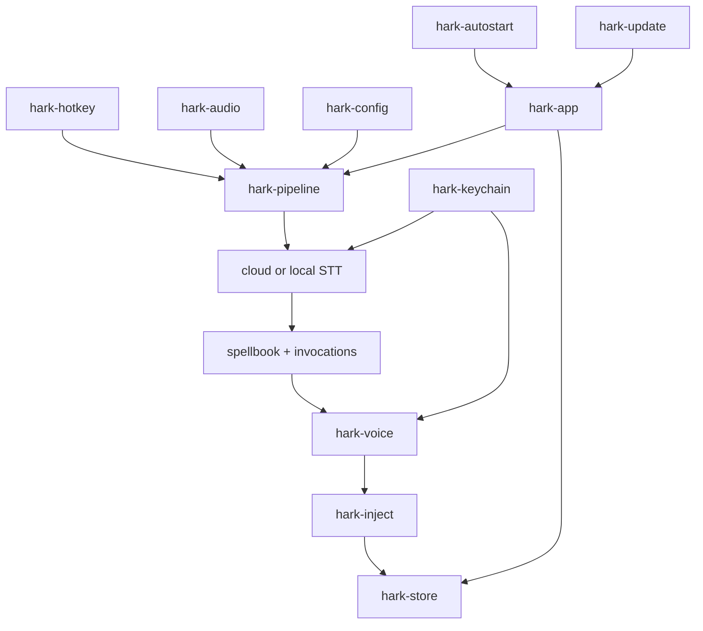
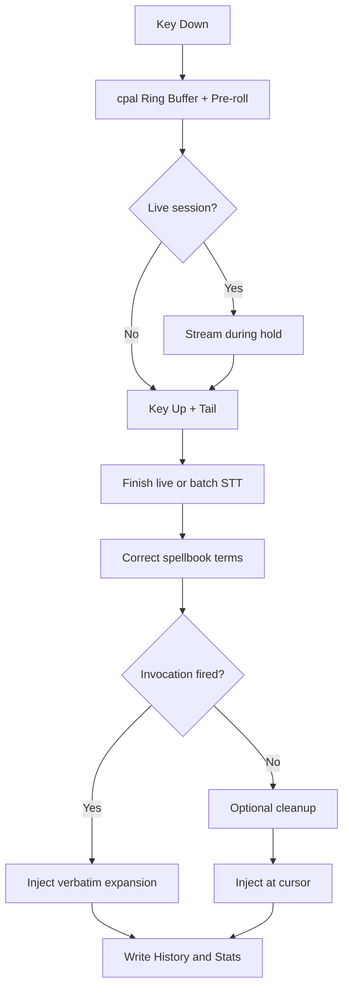

<!-- PAGE_ID: hark_01_overview -->

Relevant source files

The following files were used as evidence for this page:

- [README.md:1-34](../README.md#L1-L34)
- [README.md:36-63](../README.md#L36-L63)
- [README.md:149-175](../README.md#L149-L175)
- [README.md:177-209](../README.md#L177-L209)
- [README.md:219-223](../README.md#L219-L223)
- [package.json:1-10](../package.json#L1-L10)
- [Cargo.toml:1-30](../Cargo.toml#L1-L30)
- [CLAUDE.md:1-24](../CLAUDE.md#L1-L24)
- [CLAUDE.md:26-46](../CLAUDE.md#L26-L46)
- [AGENTS.md:1-80](../AGENTS.md#L1-L80)

# Hark, Overview

> **Related Pages**: [Architecture](core/ARCHITECTURE.md), [Getting Started](GETTING_STARTED.md), [Glossary](GLOSSARY.md)

---

<!-- BEGIN:AUTOGEN hark_01_overview_introduction -->
## Introduction

Hark is a single-user, system-wide push-to-talk dictation app for Windows, macOS, and Linux. The user holds a configured chord, speaks, releases it, and Hark injects polished English text at the cursor in the focused application ([README.md:1-5](../README.md#L1-L5)).

Windows and Linux currently implement the full push-to-talk path. macOS has native UI, tray, keychain, and injection work, but the CGEventTap hotkey hook remains an explicit platform seam, so it is not yet end-to-end ready ([README.md:3](../README.md#L3), [hark-hotkey/lib.rs:258-285](../crates/hark-hotkey/src/lib.rs#L258-L285)).

Cloud transcription is bring-your-own-key, with Deepgram, OpenAI, Groq, OpenAI-compatible endpoints, and Gemini Live supported. An optional Parakeet engine can instead run locally as a cloud backup or the primary recognizer ([README.md:21-28](../README.md#L21-L28), [README.md:188-209](../README.md#L188-L209)). History, stats, settings, the spellbook, and invocations stay on the machine; Hark operates no server, account system, hosted database, or browser frontend ([README.md:7-17](../README.md#L7-L17)).

The application is one native Rust process: an always-on tray daemon plus an egui window opened on demand. Optional cleanup uses the user's own provider key, and Gemini Live Smart mode may perform that formatting in the transcription turn itself ([CLAUDE.md:3-22](../CLAUDE.md#L3-L22)).

Sources: [README.md:1-17](../README.md#L1-L17), [README.md:188-209](../README.md#L188-L209), [CLAUDE.md:1-22](../CLAUDE.md#L1-L22)
<!-- END:AUTOGEN hark_01_overview_introduction -->

---

<!-- BEGIN:AUTOGEN hark_01_overview_principles -->
## Design Principles

Five stated principles shape implementation decisions in Hark ([README.md:7-13](../README.md#L7-L13)):

- **Speed is the product.** Perceived latency is measured from key release to text injection ([README.md:9](../README.md#L9)).
- **Local-first where it counts.** User state stays local; cloud audio or cleanup text goes only to the provider the user configured ([README.md:10](../README.md#L10)).
- **Lean.** Hark is a native process without a webview, browser tab, or operated backend ([README.md:11](../README.md#L11)).
- **English done well.** Accuracy is prioritized over broad language support ([README.md:12](../README.md#L12)).
- **Data, not code, for tunable behavior.** Vocabulary, invocations, and voice choices are configuration rather than pipeline forks ([README.md:13](../README.md#L13)).

The latency rule now has two transport shapes: batch adapters reuse a long-lived HTTP client, while Gemini Live streams during the hold and finalizes after release. Both keep network work off the UI thread, allow at most one retry or replay, and defer history/stat writes until after injection ([CLAUDE.md:26-30](../CLAUDE.md#L26-L30)).

Sources: [README.md:7-13](../README.md#L7-L13), [CLAUDE.md:26-30](../CLAUDE.md#L26-L30)
<!-- END:AUTOGEN hark_01_overview_principles -->

---

<!-- BEGIN:AUTOGEN hark_01_overview_stack -->
## Technology Stack

Hark is a desktop app with no web infrastructure: no server, database service, auth service, or hosting platform ([README.md:15-17](../README.md#L15-L17)). The implementation is one Cargo workspace ([Cargo.toml:1-19](../Cargo.toml#L1-L19)):

| Layer | Choice | Source |
|---|---|---|
| Language / process model | Rust; single process, UI on main thread, pipeline on worker threads | ([README.md:21](../README.md#L21), [CLAUDE.md:11](../CLAUDE.md#L11)) |
| Audio | `cpal`; device-rate capture, ring buffer, and per-clip 16 kHz mono resampling | ([README.md](../README.md#tech-stack), [CLAUDE.md](../CLAUDE.md#stack)) |
| Push-to-talk | `WH_KEYBOARD_LL` on Windows and evdev on Linux; CGEventTap is the pending macOS seam | ([README.md](../README.md#tech-stack), [hark-hotkey/lib.rs:258-285](../crates/hark-hotkey/src/lib.rs#L258-L285)) |
| STT (cloud, primary) | Deepgram, Whisper-family OpenAI-compatible endpoints, OpenAI `gpt-transcribe`, and Gemini Live | ([README.md:24](../README.md#L24), [CLAUDE.md:14](../CLAUDE.md#L14)) |
| STT (on-device, optional) | `hark-local-stt`: sherpa-onnx Parakeet behind the `engine` feature, enabled by `hark-app`'s default `local-engine` feature. Opt-in at runtime via `[local_stt] mode` (Off / Backup / Primary) | ([hark-app/Cargo.toml:69-70](../crates/hark-app/Cargo.toml#L69-L70), [hark-local-stt/Cargo.toml:37](../crates/hark-local-stt/Cargo.toml#L37), [hark-config/src/local.rs:14](../crates/hark-config/src/local.rs#L14)) |
| STT transport | Blocking `reqwest` batch adapters plus a private current-thread Tokio/WebSocket runtime inside Gemini Live | ([README.md:25](../README.md#L25), [CLAUDE.md:16](../CLAUDE.md#L16)) |
| Text processing | Spellbook correction, exact/fuzzy invocation matching, and optional cleanup voices | ([README.md:26-28](../README.md#L26-L28), [CLAUDE.md:17-19](../CLAUDE.md#L17-L19)) |
| Injection | Clipboard stash/set/paste/restore with platform key synthesis | ([README.md:29](../README.md#L29), [CLAUDE.md:20](../CLAUDE.md#L20)) |
| Tray + UI | `tray-icon` + `eframe`/`egui` (native, no webview) | ([README.md:30](../README.md#L30), [CLAUDE.md:21](../CLAUDE.md#L21)) |
| Persistence | `rusqlite`, TOML, and the operating-system keychain | ([README.md:31-32](../README.md#L31-L32), [CLAUDE.md:22](../CLAUDE.md#L22)) |

The workspace declares Rust 1.97 as its minimum supported toolchain ([Cargo.toml:21-30](../Cargo.toml#L21-L30)).

Sources: [README.md:15-32](../README.md#L15-L32), [CLAUDE.md:9-22](../CLAUDE.md#L9-L22), [Cargo.toml:1-30](../Cargo.toml#L1-L30)
<!-- END:AUTOGEN hark_01_overview_stack -->

---

<!-- BEGIN:AUTOGEN hark_01_overview_layout -->
## Crate Layout

Hark is one Cargo workspace with 15 member crates and one application binary ([Cargo.toml:1-19](../Cargo.toml#L1-L19)). The crates fall into eight responsibility groups:

| Area | Crates | Responsibility |
|---|---|---|
| Shell | `hark-app`, `hark-single-instance` | Native UI/tray orchestration and the one-process guard |
| Input | `hark-hotkey`, `hark-audio` | Chord observation and continuous microphone capture |
| Recognition | `hark-stt`, `hark-local-stt` | Cloud adapters, live streaming, and optional Parakeet decoding |
| Text | `hark-spellbook`, `hark-voice` | Correction, invocations, and cleanup |
| Output | `hark-inject` | Clipboard and synthesized-key text injection |
| Orchestration | `hark-pipeline` | State machine, transport selection, retry/fallback, and reporting |
| State | `hark-config`, `hark-keychain`, `hark-store` | Settings, secrets, history, and statistics |
| Desktop integration | `hark-autostart`, `hark-update` | Login startup and platform update behavior |

```mermaid
graph TD
    Hotkey["hark-hotkey"] --> Pipeline["hark-pipeline"]
    Audio["hark-audio"] --> Pipeline
    Config["hark-config"] --> Pipeline
    Pipeline --> Stt["cloud or local STT"]
    Stt --> Spellbook["spellbook + invocations"]
    Spellbook --> Voice["hark-voice"]
    Voice --> Inject["hark-inject"]
    Inject --> Store["hark-store"]
    Keychain["hark-keychain"] --> Stt
    Keychain --> Voice
    App["hark-app"] --> Pipeline
    App --> Store
    Autostart["hark-autostart"] --> App
    Update["hark-update"] --> App
```

`config/` holds the shipped TOML defaults, while `installer/` and `packaging/` contain platform distribution assets ([README.md:149-175](../README.md#L149-L175)).

Sources: [Cargo.toml:1-19](../Cargo.toml#L1-L19), [README.md:149-175](../README.md#L149-L175)
<!-- END:AUTOGEN hark_01_overview_layout -->

---

<!-- BEGIN:AUTOGEN hark_01_overview_hotpath -->
## The Hot Path

The release-to-inject flow is the app's latency-critical path. Capture begins before the user speaks, and Gemini Live may upload audio during the hold; all network, recognition, correction, cleanup, and injection work remains off the UI thread ([README.md:36-63](../README.md#L36-L63), [CLAUDE.md:26-30](../CLAUDE.md#L26-L30)):

```mermaid
graph TD
    KeyDown["Key Down"] --> RingBuffer["cpal Ring Buffer + Pre-roll"]
    RingBuffer --> Live{"Live session?"}
    Live -->|"Yes"| Stream["Stream during hold"]
    Live -->|"No"| KeyUp["Key Up + Tail"]
    Stream --> KeyUp
    KeyUp --> Recognize["Finish live or batch STT"]
    Recognize --> Correct["Correct spellbook terms"]
    Correct --> Invoke{"Invocation fired?"}
    Invoke -->|"Yes"| Verbatim["Inject verbatim expansion"]
    Invoke -->|"No"| Cleanup["Optional cleanup"]
    Cleanup --> Inject["Inject at cursor"]
    Verbatim --> History
    Inject --> History["Write History and Stats"]
```

- Key-down marks the capture window and, for Gemini Live, opens the single-use session that streams while the chord is held ([README.md:38-42](../README.md#L38-L42)).
- Key-up appends the configured tail, then either finalizes the live turn or sends the preserved finished clip through a batch adapter. A failed live attempt may replay the clip, but no dictation receives more than one retry or replay ([README.md:42-46](../README.md#L42-L46), [CLAUDE.md:30](../CLAUDE.md#L30)).
- The spellbook corrects the transcript before invocation matching. A fired invocation injects its expansion verbatim and bypasses cleanup ([README.md:48-56](../README.md#L48-L56)).
- Non-invocation text may receive optional provider cleanup before clipboard injection; provider-cleaned Gemini output is not cleaned twice ([README.md:53-58](../README.md#L53-L58), [README.md:221-223](../README.md#L221-L223)).
- History and lifetime statistics are written only after injection, keeping storage I/O outside perceived latency ([README.md:58-60](../README.md#L58-L60), [CLAUDE.md:30](../CLAUDE.md#L30)).

Sources: [README.md:36-63](../README.md#L36-L63), [CLAUDE.md:26-30](../CLAUDE.md#L26-L30)
<!-- END:AUTOGEN hark_01_overview_hotpath -->

---

<!-- BEGIN:AUTOGEN hark_01_overview_navigate -->
## Where to Start

| Goal | Start Here |
|---|---|
| Give an AI agent the fastest safe orientation | [Agent Guide](../AGENTS.md) |
| Understand process/thread structure and the pipeline in depth | [Architecture](core/ARCHITECTURE.md) |
| Install or build the app locally | [Getting Started](GETTING_STARTED.md) |
| Look up a domain term or acronym | [Glossary](GLOSSARY.md) |
| Understand settings, defaults, and the BYOK keychain | [Configuration and Secrets](core/CONFIGURATION.md) |
| Understand the SQLite history/stats schema | [Data Storage](core/DATA_STORAGE.md) |
| Understand a specific pipeline stage (audio, STT, spellbook, cleanup, injection) | see the `features/` pages |

Sources: navigation curated by doc-sync from [`Docs/_toc.yaml`](_toc.yaml)
<!-- END:AUTOGEN hark_01_overview_navigate -->

---
</content>
