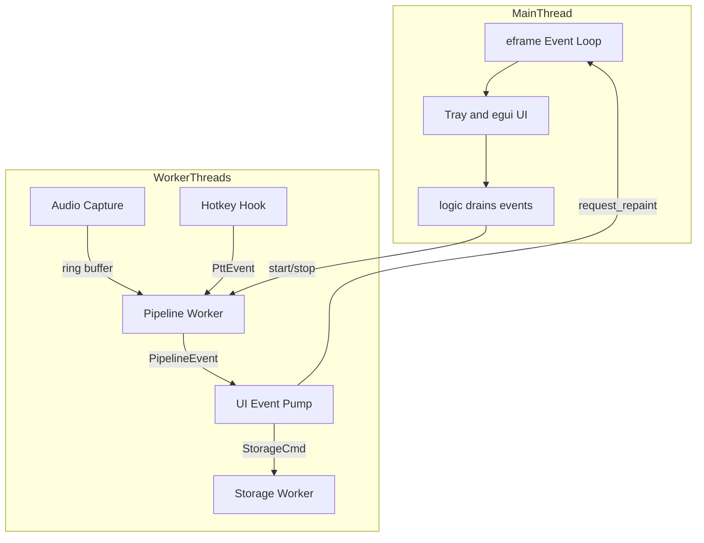
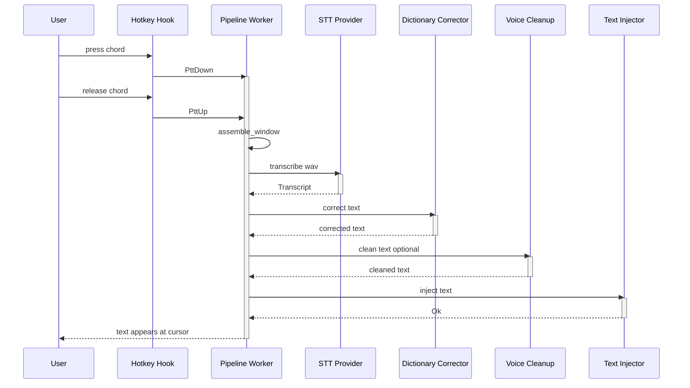
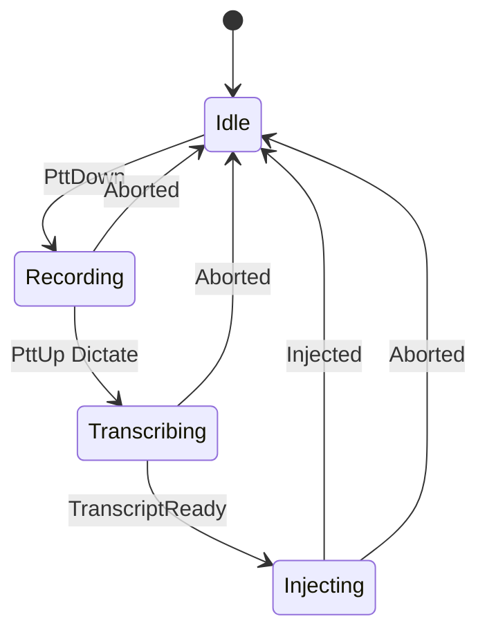

<!-- PAGE_ID: hark_02_architecture -->
<details>
<summary>Relevant source files</summary>

The following files were used as evidence for this page:

- [crates/hark-app/src/main.rs:1-49](https://github.com/BoardPandas/Hark/blob/1c1738716fa4cd758b0c26ec94d0873d1bc35ac1/crates/hark-app/src/main.rs#L1-L49)
- [crates/hark-app/src/app.rs:1-317](https://github.com/BoardPandas/Hark/blob/1c1738716fa4cd758b0c26ec94d0873d1bc35ac1/crates/hark-app/src/app.rs#L1-L317)
- [crates/hark-app/src/pipeline.rs:1-374](https://github.com/BoardPandas/Hark/blob/1c1738716fa4cd758b0c26ec94d0873d1bc35ac1/crates/hark-app/src/pipeline.rs#L1-L374)
- [crates/hark-pipeline/src/lib.rs:1-405](https://github.com/BoardPandas/Hark/blob/1c1738716fa4cd758b0c26ec94d0873d1bc35ac1/crates/hark-pipeline/src/lib.rs#L1-L405)
- [crates/hark-pipeline/src/worker.rs:1-522](https://github.com/BoardPandas/Hark/blob/1c1738716fa4cd758b0c26ec94d0873d1bc35ac1/crates/hark-pipeline/src/worker.rs#L1-L522)
- [crates/hark-pipeline/src/state.rs:1-189](https://github.com/BoardPandas/Hark/blob/1c1738716fa4cd758b0c26ec94d0873d1bc35ac1/crates/hark-pipeline/src/state.rs#L1-L189)
- [crates/hark-pipeline/src/events.rs:1-89](https://github.com/BoardPandas/Hark/blob/1c1738716fa4cd758b0c26ec94d0873d1bc35ac1/crates/hark-pipeline/src/events.rs#L1-L89)
- [crates/hark-pipeline/src/retry.rs:1-125](https://github.com/BoardPandas/Hark/blob/1c1738716fa4cd758b0c26ec94d0873d1bc35ac1/crates/hark-pipeline/src/retry.rs#L1-L125)

</details>

# Architecture

> **Related Pages**: [Overview](../OVERVIEW.md), [Audio Capture](../features/AUDIO_CAPTURE.md), [Transcription](../features/TRANSCRIPTION.md), [Text Injection](../features/TEXT_INJECTION.md)

---

<!-- BEGIN:AUTOGEN hark_02_architecture_process_model -->
## Process and Threading Model

Hark is a single process. The main thread owns the eframe event loop, the tray, and all egui painting; the entire dictation pipeline (hotkey hook, audio capture, STT, and injection) runs on worker threads behind channels, never touching the UI directly.

`main()` initializes logging, keeps a console only in debug builds (`windows_subsystem = "windows"` applies to release builds only), and builds an `eframe::NativeOptions` window that starts hidden before handing control to `eframe::run_native`, which owns the main thread for the rest of the process's life (([main.rs:11](https://github.com/BoardPandas/Hark/blob/1c1738716fa4cd758b0c26ec94d0873d1bc35ac1/crates/hark-app/src/main.rs#L11)), ([main.rs:22-47](https://github.com/BoardPandas/Hark/blob/1c1738716fa4cd758b0c26ec94d0873d1bc35ac1/crates/hark-app/src/main.rs#L22-L47))).

`HarkApp::new` runs inside eframe's creation callback, on that same main thread: it loads settings, opens the storage worker, and constructs `PipelineController`, which starts the worker-thread pipeline immediately unless the config failed to load (([app.rs:44-57](https://github.com/BoardPandas/Hark/blob/1c1738716fa4cd758b0c26ec94d0873d1bc35ac1/crates/hark-app/src/app.rs#L44-L57))). The tray is created lazily on the *first* `logic` callback rather than in `new`, specifically because only once the event loop is running is the main-thread guarantee (the hard macOS requirement) actually satisfied (([app.rs:116-138](https://github.com/BoardPandas/Hark/blob/1c1738716fa4cd758b0c26ec94d0873d1bc35ac1/crates/hark-app/src/app.rs#L116-L138))).

Every frame, `eframe::App::logic` drains pipeline events, polls the updater, applies tray actions, and handles window-close, all main-thread work; `eframe::App::ui` handles painting separately:

```rust
fn logic(&mut self, ctx: &egui::Context, _frame: &mut eframe::Frame) {
    self.ensure_tray(ctx);
    self.pipeline.drain_events();
    self.updater.poll();
    self.handle_tray_actions(ctx);
    self.handle_close(ctx);
    self.show_recording_overlay(ctx);
    if let Some(tray) = &mut self.tray {
        tray.apply(
            self.pipeline.status(),
            &self.settings.hotkey.ptt_key,
            self.settings.voice.default,
        );
    }
}
```

(([app.rs:271-286](https://github.com/BoardPandas/Hark/blob/1c1738716fa4cd758b0c26ec94d0873d1bc35ac1/crates/hark-app/src/app.rs#L271-L286)))

Field declaration order in `HarkApp` is load-bearing for shutdown: `pipeline` is declared before `storage` so it drops first, joining its worker threads (and thus its event pump, which holds a storage sender) before `StorageHandle::drop` joins the storage worker to flush the final write (([app.rs:21-25](https://github.com/BoardPandas/Hark/blob/1c1738716fa4cd758b0c26ec94d0873d1bc35ac1/crates/hark-app/src/app.rs#L21-L25)), ([app.rs:310-317](https://github.com/BoardPandas/Hark/blob/1c1738716fa4cd758b0c26ec94d0873d1bc35ac1/crates/hark-app/src/app.rs#L310-L317))).



Sources: [main.rs:11-47](https://github.com/BoardPandas/Hark/blob/1c1738716fa4cd758b0c26ec94d0873d1bc35ac1/crates/hark-app/src/main.rs#L11-L47), [app.rs:21-25](https://github.com/BoardPandas/Hark/blob/1c1738716fa4cd758b0c26ec94d0873d1bc35ac1/crates/hark-app/src/app.rs#L21-L25), [app.rs:44-138](https://github.com/BoardPandas/Hark/blob/1c1738716fa4cd758b0c26ec94d0873d1bc35ac1/crates/hark-app/src/app.rs#L44-L138), [app.rs:271-317](https://github.com/BoardPandas/Hark/blob/1c1738716fa4cd758b0c26ec94d0873d1bc35ac1/crates/hark-app/src/app.rs#L271-L317)
<!-- END:AUTOGEN hark_02_architecture_process_model -->

---

<!-- BEGIN:AUTOGEN hark_02_architecture_pipeline -->
## The Release-to-Inject Pipeline

`hark_pipeline::run` builds the shared HTTP client and STT adapter, starts continuous audio capture, spawns the native hotkey listener, and spawns the one long-lived worker thread that turns a captured clip into injected text; the calling thread only blocks until these pieces are up (([lib.rs:220-278](https://github.com/BoardPandas/Hark/blob/1c1738716fa4cd758b0c26ec94d0873d1bc35ac1/crates/hark-pipeline/src/lib.rs#L220-L278))).

The worker's main loop receives push-to-talk edges, advances the pure state machine, and on a completed press/release cycle runs `dictate`, which performs the whole release-to-inject sequence in one function: assemble the audio window, gate on silence/length, encode to WAV, transcribe (with at most one retry), run the dictionary correction pass, optionally run voice cleanup, run the dictionary pass again, and inject (([worker.rs:56-92](https://github.com/BoardPandas/Hark/blob/1c1738716fa4cd758b0c26ec94d0873d1bc35ac1/crates/hark-pipeline/src/worker.rs#L56-L92)), ([worker.rs:111-118](https://github.com/BoardPandas/Hark/blob/1c1738716fa4cd758b0c26ec94d0873d1bc35ac1/crates/hark-pipeline/src/worker.rs#L111-L118))):

```rust
/// One full dictation: assemble -> gate -> encode -> transcribe -> inject.
/// Always returns the post-dictation state (Idle via Injected or Aborted).
/// Every exit reports its outcome on the events channel (best-effort).
fn dictate(worker: &Worker, down_abs: u64, up_abs: u64, state: PipelineState) -> PipelineState {
```

(([worker.rs:111-114](https://github.com/BoardPandas/Hark/blob/1c1738716fa4cd758b0c26ec94d0873d1bc35ac1/crates/hark-pipeline/src/worker.rs#L111-L114)))

Two connections are pre-warmed before the loop starts processing chord edges: the STT provider's base URL always, and the cleanup provider's base URL only when it differs from the STT host, so the first cleaned dictation also skips a cold TLS handshake (([worker.rs:59-66](https://github.com/BoardPandas/Hark/blob/1c1738716fa4cd758b0c26ec94d0873d1bc35ac1/crates/hark-pipeline/src/worker.rs#L59-L66)), ([worker.rs:94-109](https://github.com/BoardPandas/Hark/blob/1c1738716fa4cd758b0c26ec94d0873d1bc35ac1/crates/hark-pipeline/src/worker.rs#L94-L109))).



Sources: [lib.rs:220-278](https://github.com/BoardPandas/Hark/blob/1c1738716fa4cd758b0c26ec94d0873d1bc35ac1/crates/hark-pipeline/src/lib.rs#L220-L278), [worker.rs:56-118](https://github.com/BoardPandas/Hark/blob/1c1738716fa4cd758b0c26ec94d0873d1bc35ac1/crates/hark-pipeline/src/worker.rs#L56-L118), [worker.rs:94-109](https://github.com/BoardPandas/Hark/blob/1c1738716fa4cd758b0c26ec94d0873d1bc35ac1/crates/hark-pipeline/src/worker.rs#L94-L109)
<!-- END:AUTOGEN hark_02_architecture_pipeline -->

---

<!-- BEGIN:AUTOGEN hark_02_architecture_state -->
## Pipeline State Machine

The dictation cycle is modeled as a pure, total state machine with no I/O and no clocks: every `(state, event)` pair is defined, so a stray or reordered hook event can never panic the worker (([state.rs:1-13](https://github.com/BoardPandas/Hark/blob/1c1738716fa4cd758b0c26ec94d0873d1bc35ac1/crates/hark-pipeline/src/state.rs#L1-L13)), ([state.rs:46-49](https://github.com/BoardPandas/Hark/blob/1c1738716fa4cd758b0c26ec94d0873d1bc35ac1/crates/hark-pipeline/src/state.rs#L46-L49))).

```rust
pub fn advance(state: PipelineState, event: Event) -> (PipelineState, Action) {
    use Event::*;
    use PipelineState::*;
    match (state, event) {
        // The happy path.
        (Idle, PttDown { at_abs }) => (Recording { down_abs: at_abs }, Action::None),
        (Recording { down_abs }, PttUp { at_abs }) => (
            Transcribing,
            Action::Dictate {
                down_abs,
                up_abs: at_abs,
            },
        ),
        (Transcribing, TranscriptReady) => (Injecting, Action::None),
        (Injecting, Injected) => (Idle, Action::None),
```

(([state.rs:49-63](https://github.com/BoardPandas/Hark/blob/1c1738716fa4cd758b0c26ec94d0873d1bc35ac1/crates/hark-pipeline/src/state.rs#L49-L63)))

| State | Meaning | Source |
|---|---|---|
| `Idle` | Listening; no chord held | ([state.rs:9](https://github.com/BoardPandas/Hark/blob/1c1738716fa4cd758b0c26ec94d0873d1bc35ac1/crates/hark-pipeline/src/state.rs#L9)) |
| `Recording { down_abs }` | Chord held; capturing audio from the sample index the press was observed at | ([state.rs:10](https://github.com/BoardPandas/Hark/blob/1c1738716fa4cd758b0c26ec94d0873d1bc35ac1/crates/hark-pipeline/src/state.rs#L10)) |
| `Transcribing` | Chord released; STT request in flight | ([state.rs:11](https://github.com/BoardPandas/Hark/blob/1c1738716fa4cd758b0c26ec94d0873d1bc35ac1/crates/hark-pipeline/src/state.rs#L11)) |
| `Injecting` | Transcript received; injecting into the focused app | ([state.rs:12](https://github.com/BoardPandas/Hark/blob/1c1738716fa4cd758b0c26ec94d0873d1bc35ac1/crates/hark-pipeline/src/state.rs#L12)) |

Every state can abort straight back to `Idle` on `Event::Aborted` (silence-gated, transcription failure, empty transcript, or injection failure), and a duplicate `PttDown` while already `Recording` keeps the *original* `down_abs`, not the new one, so the pre-roll window stays anchored to the real press (([state.rs:65-74](https://github.com/BoardPandas/Hark/blob/1c1738716fa4cd758b0c26ec94d0873d1bc35ac1/crates/hark-pipeline/src/state.rs#L65-L74))). New chord presses that arrive while `Transcribing` or `Injecting` is in flight are explicitly ignored rather than queued (([state.rs:78-79](https://github.com/BoardPandas/Hark/blob/1c1738716fa4cd758b0c26ec94d0873d1bc35ac1/crates/hark-pipeline/src/state.rs#L78-L79))).



The `events.rs` module defines the `PipelineEvent` payload the worker emits at the same points the state machine moves (`Recording`, `Processing`, `Injected`, `Failed`), plus the `DictationRecord` that flows to history and the `FailStage` labels used for the `Aborted` transitions (([events.rs:37-68](https://github.com/BoardPandas/Hark/blob/1c1738716fa4cd758b0c26ec94d0873d1bc35ac1/crates/hark-pipeline/src/events.rs#L37-L68))).

Sources: [state.rs:1-88](https://github.com/BoardPandas/Hark/blob/1c1738716fa4cd758b0c26ec94d0873d1bc35ac1/crates/hark-pipeline/src/state.rs#L1-L88), [events.rs:37-68](https://github.com/BoardPandas/Hark/blob/1c1738716fa4cd758b0c26ec94d0873d1bc35ac1/crates/hark-pipeline/src/events.rs#L37-L68)
<!-- END:AUTOGEN hark_02_architecture_state -->

---

<!-- BEGIN:AUTOGEN hark_02_architecture_events -->
## Events and UI Bridge

The pipeline talks to the UI only through an advisory, non-blocking event channel; nothing about dictation behavior depends on whether anyone is listening on the other end (([events.rs:1-4](https://github.com/BoardPandas/Hark/blob/1c1738716fa4cd758b0c26ec94d0873d1bc35ac1/crates/hark-pipeline/src/events.rs#L1-L4))). `PipelineEvent` is deliberately small: `Recording`, `Processing`, `Injected(DictationRecord)`, and `Failed { stage, detail }` (([events.rs:56-68](https://github.com/BoardPandas/Hark/blob/1c1738716fa4cd758b0c26ec94d0873d1bc35ac1/crates/hark-pipeline/src/events.rs#L56-L68))). `DictationRecord` carries the actual transcript content and has no `Debug` impl on purpose, so it cannot leak into a log line via `{:?}` (([events.rs:6-35](https://github.com/BoardPandas/Hark/blob/1c1738716fa4cd758b0c26ec94d0873d1bc35ac1/crates/hark-pipeline/src/events.rs#L6-L35))).

On the app side, `PipelineController` owns the UI-facing end of that channel and maps every `PipelineEvent` onto a `PipelineStatus` the footer renders, via the pure, independently-tested `next_status` function:

```rust
fn next_status(event: PipelineEvent) -> PipelineStatus {
    match event {
        PipelineEvent::Recording => PipelineStatus::Recording,
        PipelineEvent::Processing => PipelineStatus::Processing,
        PipelineEvent::Injected(_) => PipelineStatus::Idle,
        PipelineEvent::Failed { stage, detail } => match stage {
            FailStage::Gated | FailStage::EmptyTranscript => PipelineStatus::Idle,
            FailStage::Audio | FailStage::Transcribe | FailStage::Inject => {
                PipelineStatus::Errored {
                    key_related: detail.to_ascii_lowercase().contains("key"),
                    detail,
                }
            }
        },
    }
}
```

(([pipeline.rs:159-180](https://github.com/BoardPandas/Hark/blob/1c1738716fa4cd758b0c26ec94d0873d1bc35ac1/crates/hark-app/src/pipeline.rs#L159-L180)))

| `PipelineStatus` | Meaning | Source |
|---|---|---|
| `Idle` | Running, waiting for the chord | ([pipeline.rs:17](https://github.com/BoardPandas/Hark/blob/1c1738716fa4cd758b0c26ec94d0873d1bc35ac1/crates/hark-app/src/pipeline.rs#L17)) |
| `Recording` | Chord held, capturing | ([pipeline.rs:19](https://github.com/BoardPandas/Hark/blob/1c1738716fa4cd758b0c26ec94d0873d1bc35ac1/crates/hark-app/src/pipeline.rs#L19)) |
| `Processing` | Chord released, request in flight | ([pipeline.rs:21](https://github.com/BoardPandas/Hark/blob/1c1738716fa4cd758b0c26ec94d0873d1bc35ac1/crates/hark-app/src/pipeline.rs#L21)) |
| `Errored { detail, key_related }` | Running, but the last dictation failed; sticky until the next dictation | ([pipeline.rs:23-24](https://github.com/BoardPandas/Hark/blob/1c1738716fa4cd758b0c26ec94d0873d1bc35ac1/crates/hark-app/src/pipeline.rs#L23-L24)) |
| `Stopped { detail, key_related }` | Not running (no key, startup failure, or config error) | ([pipeline.rs:26](https://github.com/BoardPandas/Hark/blob/1c1738716fa4cd758b0c26ec94d0873d1bc35ac1/crates/hark-app/src/pipeline.rs#L26)) |

Delivery runs through a dedicated `hark-ui-event-pump` thread rather than directly: it forwards every event to the UI channel, tees `Injected` records to the storage thread, and calls `request_repaint()` per event, the sanctioned way to wake the egui event loop from another thread (([pipeline.rs:189-216](https://github.com/BoardPandas/Hark/blob/1c1738716fa4cd758b0c26ec94d0873d1bc35ac1/crates/hark-app/src/pipeline.rs#L189-L216))). `PipelineController::drain_events`, called every frame from `App::logic`, then applies `next_status` with a non-blocking `try_recv` loop, so an `Errored` status stands until it is naturally replaced by the next dictation's event (([pipeline.rs:144-155](https://github.com/BoardPandas/Hark/blob/1c1738716fa4cd758b0c26ec94d0873d1bc35ac1/crates/hark-app/src/pipeline.rs#L144-L155))).

Sources: [events.rs:1-68](https://github.com/BoardPandas/Hark/blob/1c1738716fa4cd758b0c26ec94d0873d1bc35ac1/crates/hark-pipeline/src/events.rs#L1-L68), [pipeline.rs:11-27](https://github.com/BoardPandas/Hark/blob/1c1738716fa4cd758b0c26ec94d0873d1bc35ac1/crates/hark-app/src/pipeline.rs#L11-L27), [pipeline.rs:144-216](https://github.com/BoardPandas/Hark/blob/1c1738716fa4cd758b0c26ec94d0873d1bc35ac1/crates/hark-app/src/pipeline.rs#L144-L216)
<!-- END:AUTOGEN hark_02_architecture_events -->

---

<!-- BEGIN:AUTOGEN hark_02_architecture_retry -->
## Retry and Latency Discipline

Latency is the product: the pipeline allows at most one retry per dictation, and only for failure classes where an immediate retry can plausibly succeed, timeouts and connect-class transport errors. A 4xx (bad key, rate limit) is never retried, since it will not improve in 200 ms and a 429 retry storm only worsens the limit (([retry.rs:1-6](https://github.com/BoardPandas/Hark/blob/1c1738716fa4cd758b0c26ec94d0873d1bc35ac1/crates/hark-pipeline/src/retry.rs#L1-L6))).

```rust
pub fn should_retry(error: &SttError) -> bool {
    match error {
        SttError::Timeout { .. } => true,
        SttError::Http { detail, .. } => detail.starts_with(CONNECT_CLASS_PREFIX),
        SttError::Auth { .. }
        | SttError::RateLimited { .. }
        | SttError::BadAudio(_)
        | SttError::Provider { .. } => false,
    }
}
```

(([retry.rs:18-27](https://github.com/BoardPandas/Hark/blob/1c1738716fa4cd758b0c26ec94d0873d1bc35ac1/crates/hark-pipeline/src/retry.rs#L18-L27)))

| `SttError` variant | Retried? | Why |
|---|---|---|
| `Timeout` | Yes | The request may not have reached the provider ([retry.rs:20](https://github.com/BoardPandas/Hark/blob/1c1738716fa4cd758b0c26ec94d0873d1bc35ac1/crates/hark-pipeline/src/retry.rs#L20)) |
| `Http` (connect-class: DNS, refused, unreachable, TLS setup) | Yes | Prefixed `"connect failed"` by `hark-stt`'s transport mapping; a contract test pins this string ([retry.rs:13](https://github.com/BoardPandas/Hark/blob/1c1738716fa4cd758b0c26ec94d0873d1bc35ac1/crates/hark-pipeline/src/retry.rs#L13), [retry.rs:21](https://github.com/BoardPandas/Hark/blob/1c1738716fa4cd758b0c26ec94d0873d1bc35ac1/crates/hark-pipeline/src/retry.rs#L21)) |
| `Http` (mid-body transport failure) | No | The request may have already reached the provider ([retry.rs:21](https://github.com/BoardPandas/Hark/blob/1c1738716fa4cd758b0c26ec94d0873d1bc35ac1/crates/hark-pipeline/src/retry.rs#L21)) |
| `Auth` | No | A bad key will not fix itself in 200 ms ([retry.rs:22-25](https://github.com/BoardPandas/Hark/blob/1c1738716fa4cd758b0c26ec94d0873d1bc35ac1/crates/hark-pipeline/src/retry.rs#L22-L25)) |
| `RateLimited` | No | Retrying immediately worsens the limit ([retry.rs:22-25](https://github.com/BoardPandas/Hark/blob/1c1738716fa4cd758b0c26ec94d0873d1bc35ac1/crates/hark-pipeline/src/retry.rs#L22-L25)) |
| `BadAudio` / `Provider` | No | Not transient failure classes ([retry.rs:22-25](https://github.com/BoardPandas/Hark/blob/1c1738716fa4cd758b0c26ec94d0873d1bc35ac1/crates/hark-pipeline/src/retry.rs#L22-L25)) |

The retry itself is applied exactly once, wrapped tightly around the transcribe call in the worker: `transcribe_with_retry` calls the provider, and on a `should_retry`-eligible error logs a warning and calls it exactly one more time, there is no loop, so a third attempt is structurally impossible (([worker.rs:272-283](https://github.com/BoardPandas/Hark/blob/1c1738716fa4cd758b0c26ec94d0873d1bc35ac1/crates/hark-pipeline/src/worker.rs#L272-L283))).

This discipline is reinforced elsewhere in the pipeline: `hark_pipeline::run` builds one shared `reqwest::blocking::Client` for the whole process lifetime rather than per dictation, so keep-alive and TLS session resumption carry across requests (([lib.rs:231](https://github.com/BoardPandas/Hark/blob/1c1738716fa4cd758b0c26ec94d0873d1bc35ac1/crates/hark-pipeline/src/lib.rs#L231))), and history/stats writes happen only after the `Injected` event fires, off the release-to-inject hot path (([worker.rs:171-198](https://github.com/BoardPandas/Hark/blob/1c1738716fa4cd758b0c26ec94d0873d1bc35ac1/crates/hark-pipeline/src/worker.rs#L171-L198))).

Sources: [retry.rs:1-27](https://github.com/BoardPandas/Hark/blob/1c1738716fa4cd758b0c26ec94d0873d1bc35ac1/crates/hark-pipeline/src/retry.rs#L1-L27), [worker.rs:171-198](https://github.com/BoardPandas/Hark/blob/1c1738716fa4cd758b0c26ec94d0873d1bc35ac1/crates/hark-pipeline/src/worker.rs#L171-L198), [worker.rs:272-283](https://github.com/BoardPandas/Hark/blob/1c1738716fa4cd758b0c26ec94d0873d1bc35ac1/crates/hark-pipeline/src/worker.rs#L272-L283)
<!-- END:AUTOGEN hark_02_architecture_retry -->

---

<!-- BEGIN:AUTOGEN hark_02_architecture_failure -->
## Failure Modes

Every way a dictation can end without injecting is an explicit, named `FailStage`, carried on the `PipelineEvent::Failed` event alongside a detail string that is safe to display and safe to log (labels and summaries only, never key material or transcript content) (([events.rs:37-54](https://github.com/BoardPandas/Hark/blob/1c1738716fa4cd758b0c26ec94d0873d1bc35ac1/crates/hark-pipeline/src/events.rs#L37-L54))).

| `FailStage` | Trigger | User-visible surface |
|---|---|---|
| `Gated` | Clip too short or silent; no request sent | Informational: back to `Idle`, not an error banner ([pipeline.rs:169](https://github.com/BoardPandas/Hark/blob/1c1738716fa4cd758b0c26ec94d0873d1bc35ac1/crates/hark-app/src/pipeline.rs#L169)) |
| `Audio` | Window assembly failed (ring buffer / resample error) | `Errored` status in the footer ([pipeline.rs:170-177](https://github.com/BoardPandas/Hark/blob/1c1738716fa4cd758b0c26ec94d0873d1bc35ac1/crates/hark-app/src/pipeline.rs#L170-L177)) |
| `Transcribe` | STT request failed after the one eligible retry | `Errored`; `key_related` flips true if the detail mentions "key" ([pipeline.rs:170-177](https://github.com/BoardPandas/Hark/blob/1c1738716fa4cd758b0c26ec94d0873d1bc35ac1/crates/hark-app/src/pipeline.rs#L170-L177)) |
| `EmptyTranscript` | Provider returned an empty transcript | Informational: back to `Idle`, not an error banner ([pipeline.rs:169](https://github.com/BoardPandas/Hark/blob/1c1738716fa4cd758b0c26ec94d0873d1bc35ac1/crates/hark-app/src/pipeline.rs#L169)) |
| `Inject` | Injection into the focused app failed | `Errored` status in the footer ([pipeline.rs:170-177](https://github.com/BoardPandas/Hark/blob/1c1738716fa4cd758b0c26ec94d0873d1bc35ac1/crates/hark-app/src/pipeline.rs#L170-L177)) |

Two other failure surfaces sit outside the per-dictation `FailStage` set. First, `PipelineState::advance` treats every unexpected `(state, event)` pair, a stray `PttUp` with no matching `PttDown`, a completion event arriving in the wrong stage, as inert rather than a panic, so a hook-thread race can never bring the worker down (([state.rs:46-49](https://github.com/BoardPandas/Hark/blob/1c1738716fa4cd758b0c26ec94d0873d1bc35ac1/crates/hark-pipeline/src/state.rs#L46-L49)), ([state.rs:65-87](https://github.com/BoardPandas/Hark/blob/1c1738716fa4cd758b0c26ec94d0873d1bc35ac1/crates/hark-pipeline/src/state.rs#L65-L87))). Second, `hark_pipeline::run` itself can fail to start at all (bad hotkey chord, capture device error, invalid provider config); that surfaces as a `PipelineError` to the caller rather than a pipeline event, and `PipelineController::start` maps it onto `PipelineStatus::Stopped` so the app keeps running with a visible cause instead of a dead pipeline (([lib.rs:29-39](https://github.com/BoardPandas/Hark/blob/1c1738716fa4cd758b0c26ec94d0873d1bc35ac1/crates/hark-pipeline/src/lib.rs#L29-L39)), ([pipeline.rs:117-123](https://github.com/BoardPandas/Hark/blob/1c1738716fa4cd758b0c26ec94d0873d1bc35ac1/crates/hark-app/src/pipeline.rs#L117-L123))).

Within `dictate`, every exit path reports its outcome on the events channel before returning, using a shared closure so no failure branch can silently skip the report (([worker.rs:114-137](https://github.com/BoardPandas/Hark/blob/1c1738716fa4cd758b0c26ec94d0873d1bc35ac1/crates/hark-pipeline/src/worker.rs#L114-L137))):

```rust
let fail = |stage: FailStage, detail: String| {
    let _ = worker.events.send(PipelineEvent::Failed { stage, detail });
};
```

(([worker.rs:116-118](https://github.com/BoardPandas/Hark/blob/1c1738716fa4cd758b0c26ec94d0873d1bc35ac1/crates/hark-pipeline/src/worker.rs#L116-L118)))

Because every send on the events channel is `let _ =` best-effort, a disconnected UI receiver degrades to a no-op rather than a panic or a block, verified directly against a dropped channel (([events.rs:80-87](https://github.com/BoardPandas/Hark/blob/1c1738716fa4cd758b0c26ec94d0873d1bc35ac1/crates/hark-pipeline/src/events.rs#L80-L87))).

Sources: [events.rs:37-87](https://github.com/BoardPandas/Hark/blob/1c1738716fa4cd758b0c26ec94d0873d1bc35ac1/crates/hark-pipeline/src/events.rs#L37-L87), [state.rs:46-87](https://github.com/BoardPandas/Hark/blob/1c1738716fa4cd758b0c26ec94d0873d1bc35ac1/crates/hark-pipeline/src/state.rs#L46-L87), [lib.rs:29-39](https://github.com/BoardPandas/Hark/blob/1c1738716fa4cd758b0c26ec94d0873d1bc35ac1/crates/hark-pipeline/src/lib.rs#L29-L39), [pipeline.rs:117-180](https://github.com/BoardPandas/Hark/blob/1c1738716fa4cd758b0c26ec94d0873d1bc35ac1/crates/hark-app/src/pipeline.rs#L117-L180), [worker.rs:114-137](https://github.com/BoardPandas/Hark/blob/1c1738716fa4cd758b0c26ec94d0873d1bc35ac1/crates/hark-pipeline/src/worker.rs#L114-L137)
<!-- END:AUTOGEN hark_02_architecture_failure -->

---
