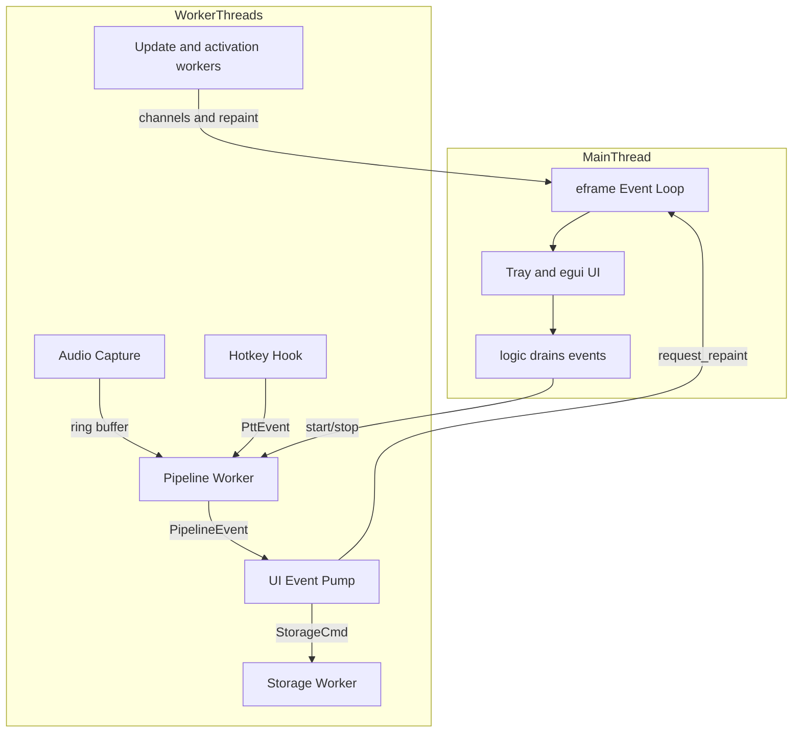
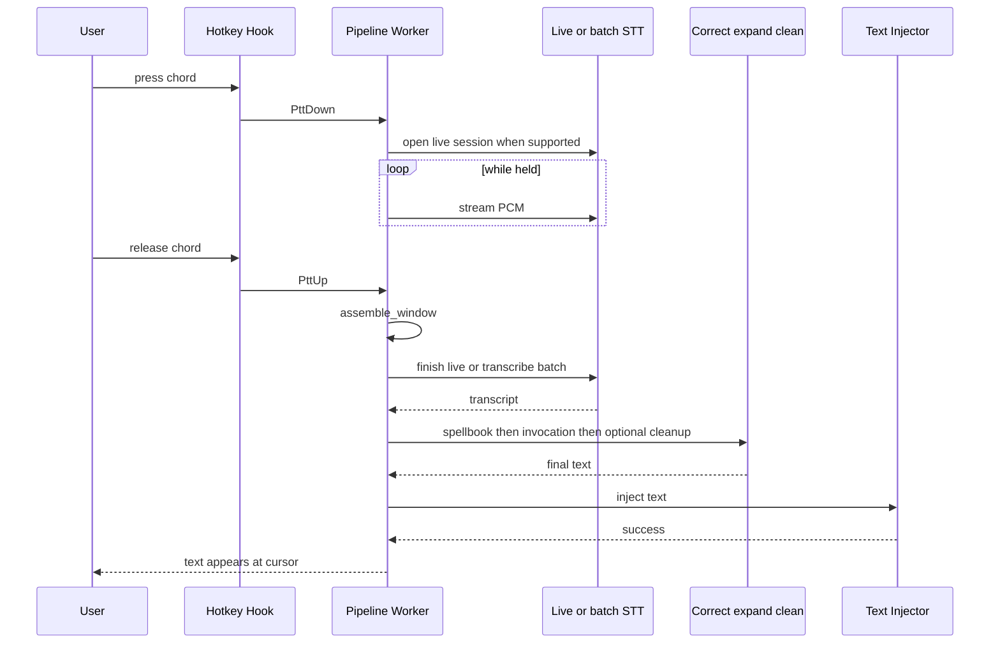
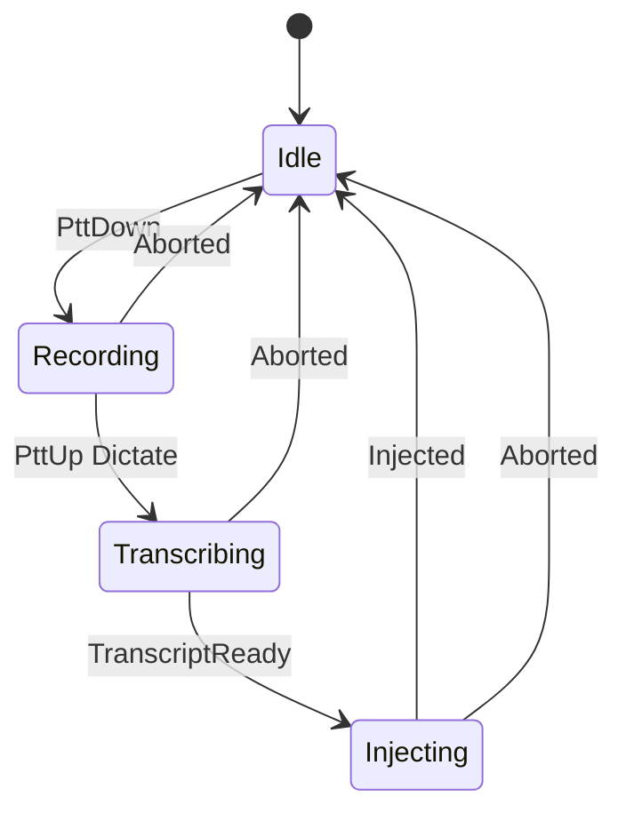

<!-- PAGE_ID: hark_02_architecture -->

Relevant source files

The following files were used as evidence for this page:

- [crates/hark-app/src/main.rs](../../crates/hark-app/src/main.rs)
- [crates/hark-app/src/app.rs](../../crates/hark-app/src/app.rs)
- [crates/hark-app/src/pipeline.rs](../../crates/hark-app/src/pipeline.rs)
- [crates/hark-pipeline/src/lib.rs](../../crates/hark-pipeline/src/lib.rs)
- [crates/hark-pipeline/src/worker.rs](../../crates/hark-pipeline/src/worker.rs)
- [crates/hark-pipeline/src/stream.rs](../../crates/hark-pipeline/src/stream.rs)
- [crates/hark-pipeline/src/state.rs](../../crates/hark-pipeline/src/state.rs)
- [crates/hark-pipeline/src/events.rs](../../crates/hark-pipeline/src/events.rs)
- [crates/hark-pipeline/src/retry.rs](../../crates/hark-pipeline/src/retry.rs)

# Architecture

> **Related Pages**: [Overview](../OVERVIEW.md), [Audio Capture](../features/AUDIO_CAPTURE.md), [Transcription](../features/TRANSCRIPTION.md), [Text Injection](../features/TEXT_INJECTION.md)

---

<!-- BEGIN:AUTOGEN hark_02_architecture_process_model -->
## Process and Threading Model

Hark is one desktop process. The main thread owns eframe, egui, the tray, window state, and UI-side orchestration. Hotkey capture, audio capture, dictation, storage, update checks, and single-instance activation listening run behind channels on worker threads; the UI never performs provider I/O ([main.rs:1-10](../../crates/hark-app/src/main.rs#L1-L10), [app.rs:19-58](../../crates/hark-app/src/app.rs#L19-L58), [pipeline.rs:1-3](../../crates/hark-app/src/pipeline.rs#L1-L3)).

Startup acquires the single-instance guard, starts the root viewport hidden, and enters `eframe::run_native`. If another normal launch finds Hark running, it signals that instance to show its window and exits; updater and autostart launches deliberately stay silent ([main.rs:39-85](../../crates/hark-app/src/main.rs#L39-L85), [main.rs:87-123](../../crates/hark-app/src/main.rs#L87-L123)). `HarkApp::new` loads settings, opens storage, starts the pipeline, and starts the activation listener. The tray is created on the first event-loop callback so the macOS main-thread requirement is satisfied ([app.rs:61-143](../../crates/hark-app/src/app.rs#L61-L143), [app.rs:145-167](../../crates/hark-app/src/app.rs#L145-L167)).

Field order is part of shutdown correctness: pipeline and listener handles are declared before the channels and storage handles they feed, so their bounded drops run first ([app.rs:19-58](../../crates/hark-app/src/app.rs#L19-L58)).

```mermaid
graph TD
    subgraph MainThread
        A["eframe Event Loop"] --> B["Tray and egui UI"]
        B --> C["logic drains events"]
    end
    subgraph WorkerThreads
        D["Audio Capture"]
        E["Hotkey Hook"]
        F["Pipeline Worker"]
        G["UI Event Pump"]
        H["Storage Worker"]
        I["Update and activation workers"]
    end
    C -->|"start/stop"| F
    D -->|"ring buffer"| F
    E -->|"PttEvent"| F
    F -->|"PipelineEvent"| G
    G -->|"request_repaint"| A
    G -->|"StorageCmd"| H
    I -->|"channels and repaint"| A
```

Sources: [main.rs:39-123](../../crates/hark-app/src/main.rs#L39-L123), [app.rs:19-167](../../crates/hark-app/src/app.rs#L19-L167), [pipeline.rs:1-66](../../crates/hark-app/src/pipeline.rs#L1-L66)
<!-- END:AUTOGEN hark_02_architecture_process_model -->

---

<!-- BEGIN:AUTOGEN hark_02_architecture_pipeline -->
## The Release-to-Inject Pipeline

`hark_pipeline::run` builds the shared blocking HTTP client, cleanup plan, batch STT adapter, optional live adapter, continuous capture, native hook, and long-lived worker. A local-primary configuration is keyless and does not construct a cloud adapter; cloud-backed modes resolve their secret before the hook starts ([lib.rs:432-541](../../crates/hark-pipeline/src/lib.rs#L432-L541)).

With Gemini Live, key-down opens a live session and pumps resampled PCM from the ring while the user is speaking. The live path is only an accelerator: failure to open, send, keep up, or finish drops back to the ordinary batch path because streaming reads rather than consumes the ring ([stream.rs:1-25](../../crates/hark-pipeline/src/stream.rs#L1-L25), [stream.rs:44-130](../../crates/hark-pipeline/src/stream.rs#L44-L130)). Other providers begin at key-up.

After release the worker assembles and gates the same audio window, finalizes live STT or encodes WAV and runs batch/local STT, corrects the transcript, expands invocations, conditionally applies voice cleanup, injects the final text, and emits a history record. A replay after live failure consumes the same single retry budget as any batch retry ([worker.rs:324-532](../../crates/hark-pipeline/src/worker.rs#L324-L532)).

```mermaid
sequenceDiagram
    participant User
    participant Hook as Hotkey Hook
    participant Worker as Pipeline Worker
    participant STT as Live or batch STT
    participant Text as Correct expand clean
    participant Inject as Text Injector

    User->>Hook: press chord
    Hook->>Worker: PttDown
    Worker->>STT: open live session when supported
    loop while held
        Worker->>STT: stream PCM
    end
    User->>Hook: release chord
    Hook->>Worker: PttUp
    Worker->>Worker: assemble_window
    Worker->>STT: finish live or transcribe batch
    STT-->>Worker: transcript
    Worker->>Text: spellbook then invocation then optional cleanup
    Text-->>Worker: final text
    Worker->>Inject: inject text
    Inject-->>Worker: success
    Worker-->>User: text appears at cursor
```

Sources: [lib.rs:432-541](../../crates/hark-pipeline/src/lib.rs#L432-L541), [worker.rs:170-228](../../crates/hark-pipeline/src/worker.rs#L170-L228), [worker.rs:324-532](../../crates/hark-pipeline/src/worker.rs#L324-L532), [stream.rs:1-148](../../crates/hark-pipeline/src/stream.rs#L1-L148)
<!-- END:AUTOGEN hark_02_architecture_pipeline -->

---

<!-- BEGIN:AUTOGEN hark_02_architecture_state -->
## Pipeline State Machine

The dictation cycle is a pure, total state machine: every `(state, event)` pair is defined, so duplicate, stray, or reordered hook events are inert rather than fatal ([state.rs:46-87](../../crates/hark-pipeline/src/state.rs#L46-L87)).

| State | Meaning | Source |
|---|---|---|
| `Idle` | Listening; no chord held | [state.rs:9](../../crates/hark-pipeline/src/state.rs#L9) |
| `Recording { down_abs }` | Chord held; capture continues and live STT may be pumping | [state.rs:10](../../crates/hark-pipeline/src/state.rs#L10) |
| `Transcribing` | Release observed; live finalization, local STT, or batch STT is running | [state.rs:11](../../crates/hark-pipeline/src/state.rs#L11) |
| `Injecting` | Text is ready and injection is running | [state.rs:12](../../crates/hark-pipeline/src/state.rs#L12) |

Every state aborts directly to `Idle`. A duplicate down edge preserves the original sample index, and presses arriving while transcription or injection is in flight are ignored rather than queued ([state.rs:65-86](../../crates/hark-pipeline/src/state.rs#L65-L86)).

```mermaid
stateDiagram-v2
    [*] --> Idle
    Idle --> Recording : PttDown
    Recording --> Transcribing : PttUp Dictate
    Transcribing --> Injecting : TranscriptReady
    Injecting --> Idle : Injected
    Recording --> Idle : Aborted
    Transcribing --> Idle : Aborted
    Injecting --> Idle : Aborted
```

`PipelineEvent` is an advisory UI protocol, not the state machine itself. It also reports local-model loading and shortcut interception, neither of which changes the dictation states ([events.rs:75-97](../../crates/hark-pipeline/src/events.rs#L75-L97)).

Sources: [state.rs:1-88](../../crates/hark-pipeline/src/state.rs#L1-L88), [events.rs:75-97](../../crates/hark-pipeline/src/events.rs#L75-L97)
<!-- END:AUTOGEN hark_02_architecture_state -->

---

<!-- BEGIN:AUTOGEN hark_02_architecture_events -->
## Events and UI Bridge

The pipeline sends best-effort events through a non-blocking channel. `DictationRecord` intentionally has no `Debug` implementation, preventing transcript content from entering logs through accidental debug formatting ([events.rs:1-40](../../crates/hark-pipeline/src/events.rs#L1-L40)).

| `PipelineStatus` | Meaning | Source |
|---|---|---|
| `Idle` | Running and waiting for the chord |
| `Recording` | Chord held and capturing |
| `Processing` | Release observed; STT and downstream work are running |
| `LoadingModel` | The local model is loading for its first dictation |
| `Hint` | A non-error outcome such as audio too quiet or an abandoned hold |
| `Errored` | The last dictation failed; sticky until the next dictation |
| `Stopped` | Pipeline is not running because startup or configuration failed |

The event-pump thread forwards events, stores successful records, and requests an egui repaint. `PipelineController::drain_events` maps them to the statuses above. `ShortcutIntercepted` is advisory: it records a warning without stopping dictation or replacing the current status ([pipeline.rs:220-298](../../crates/hark-app/src/pipeline.rs#L220-L298), [pipeline.rs:300-338](../../crates/hark-app/src/pipeline.rs#L300-L338)).

Sources: [events.rs:1-97](../../crates/hark-pipeline/src/events.rs#L1-L97), [pipeline.rs:12-39](../../crates/hark-app/src/pipeline.rs#L12-L39), [pipeline.rs:220-338](../../crates/hark-app/src/pipeline.rs#L220-L338)
<!-- END:AUTOGEN hark_02_architecture_events -->

---

<!-- BEGIN:AUTOGEN hark_02_architecture_retry -->
## Retry and Latency Discipline

Latency is the product, so a dictation has one retry budget. Only timeouts and connect-class transport errors are eligible; authentication, rate limiting, bad audio, provider errors, and mid-request transport failures are not ([retry.rs:1-27](../../crates/hark-pipeline/src/retry.rs#L1-L27)).

| `SttError` variant | Retried? | Why |
|---|---|---|
| `Timeout` | Yes | The request may not have reached the provider |
| `Http` with `connect failed` prefix | Yes | DNS, refused, unreachable, or TLS setup may be transient |
| Other `Http` | No | The request may already have reached the provider |
| `Auth`, `RateLimited`, `BadAudio`, `Provider` | No | An immediate replay cannot safely repair them |

A failed live session may fall back to batch, but that replay consumes the one retry. The batch helper has no loop and can make at most one additional call ([worker.rs:417-448](../../crates/hark-pipeline/src/worker.rs#L417-L448), [worker.rs:730-746](../../crates/hark-pipeline/src/worker.rs#L730-L746)). The shared client preserves connections across dictations, and streaming uploads most audio before release when available ([lib.rs:432-445](../../crates/hark-pipeline/src/lib.rs#L432-L445), [stream.rs:138-148](../../crates/hark-pipeline/src/stream.rs#L138-L148)).

Sources: [retry.rs:1-27](../../crates/hark-pipeline/src/retry.rs#L1-L27), [worker.rs:417-448](../../crates/hark-pipeline/src/worker.rs#L417-L448), [worker.rs:730-746](../../crates/hark-pipeline/src/worker.rs#L730-L746), [stream.rs:138-148](../../crates/hark-pipeline/src/stream.rs#L138-L148)
<!-- END:AUTOGEN hark_02_architecture_retry -->

---

<!-- BEGIN:AUTOGEN hark_02_architecture_failure -->
## Failure Modes

Every non-injecting outcome has an explicit `FailStage`. Details are display-safe summaries; key material, raw audio, and transcript content remain absent from logs ([events.rs:42-73](../../crates/hark-pipeline/src/events.rs#L42-L73)).

| `FailStage` | Trigger | User-visible surface |
|---|---|---|
| `GatedTooShort` | Tap or misfire | Return quietly to `Idle` |
| `GatedTooQuiet` | No speech-level signal | Show a non-error microphone hint |
| `Audio` | Window assembly or resampling failed | Show `Errored` |
| `Transcribe` | STT failed after its retry budget | Show `Errored` |
| `EmptyTranscript` | Provider returned no text | Return to `Idle` |
| `Inject` | Focused-app injection failed | Show `Errored` |
| `Abandoned` | Release was lost and the hold exceeded its maximum | Show a non-error hint |
| `Internal` | A dictation panicked | Show `Errored`; keep the worker alive |

`dictate_guarded` catches per-dictation panics, emits `Internal`, and returns the state machine to `Idle` rather than killing the long-lived worker ([worker.rs:285-320](../../crates/hark-pipeline/src/worker.rs#L285-L320)). Startup errors are separate: `PipelineController::start` maps a bad key, bad provider configuration, or capture failure to `Stopped`, leaving the application usable ([pipeline.rs:120-176](../../crates/hark-app/src/pipeline.rs#L120-L176)). Pipeline drop uses bounded joins so a stuck request cannot hold application shutdown forever ([lib.rs:121-165](../../crates/hark-pipeline/src/lib.rs#L121-L165)).

Sources: [events.rs:42-97](../../crates/hark-pipeline/src/events.rs#L42-L97), [state.rs:46-87](../../crates/hark-pipeline/src/state.rs#L46-L87), [pipeline.rs:120-176](../../crates/hark-app/src/pipeline.rs#L120-L176), [worker.rs:285-320](../../crates/hark-pipeline/src/worker.rs#L285-L320), [lib.rs:121-165](../../crates/hark-pipeline/src/lib.rs#L121-L165)
<!-- END:AUTOGEN hark_02_architecture_failure -->

---
