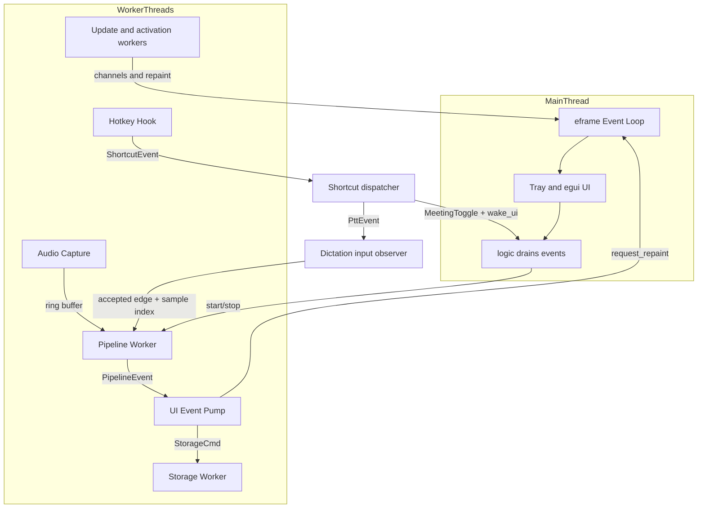
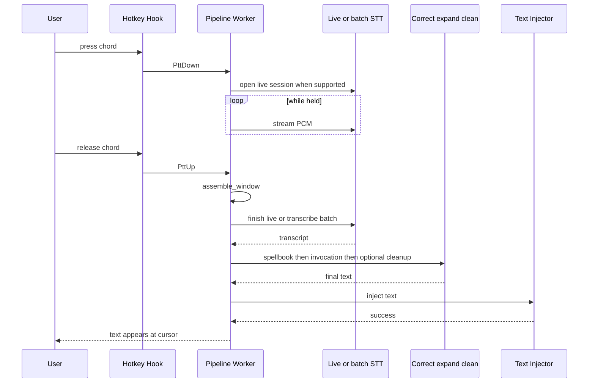
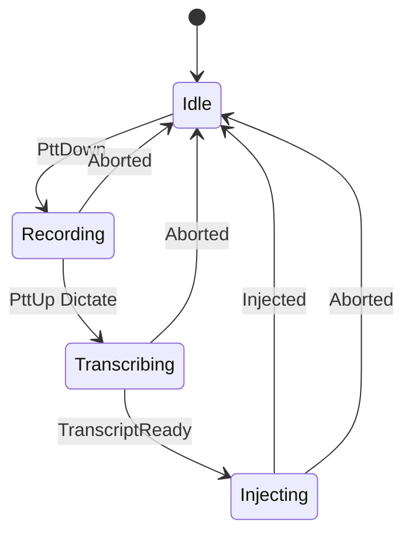

<!-- PAGE_ID: hark_02_architecture -->

Relevant source files

The following files were used as evidence for this page:

- [crates/hark-app/src/main.rs](../../crates/hark-app/src/main.rs)
- [crates/hark-app/src/app.rs](../../crates/hark-app/src/app.rs)
- [crates/hark-app/src/pipeline.rs](../../crates/hark-app/src/pipeline.rs)
- [crates/hark-pipeline/src/lib.rs](../../crates/hark-pipeline/src/lib.rs)
- [crates/hark-pipeline/src/worker.rs](../../crates/hark-pipeline/src/worker.rs)
- [crates/hark-pipeline/src/input.rs](../../crates/hark-pipeline/src/input.rs)
- [crates/hark-pipeline/src/lifecycle.rs](../../crates/hark-pipeline/src/lifecycle.rs)
- [crates/hark-pipeline/src/stream.rs](../../crates/hark-pipeline/src/stream.rs)
- [crates/hark-pipeline/src/state.rs](../../crates/hark-pipeline/src/state.rs)
- [crates/hark-pipeline/src/events.rs](../../crates/hark-pipeline/src/events.rs)
- [crates/hark-pipeline/src/retry.rs](../../crates/hark-pipeline/src/retry.rs)
- [crates/hark-pipeline/src/meeting/mod.rs](../../crates/hark-pipeline/src/meeting/mod.rs)
- [crates/hark-pipeline/src/meeting/coordinator.rs](../../crates/hark-pipeline/src/meeting/coordinator.rs)
- [crates/hark-app/src/meeting.rs](../../crates/hark-app/src/meeting.rs)

# Architecture

Meeting capture and provider processing use independent workers. A saved-recording
worker can refine retained audio while a new call records; the storage worker
atomically replaces the saved transcript and its search index. Registry events
wake the detector, with independent debounce/auto-stop deadlines and a polling
backstop. The optional Gemini worker processes bounded mono windows and requests
remote cleanup; a failed pass preserves the prior live transcript.

> **Related Pages**: [Overview](../OVERVIEW.md), [Audio Capture](../features/AUDIO_CAPTURE.md), [Transcription](../features/TRANSCRIPTION.md), [Text Injection](../features/TEXT_INJECTION.md), [Meetings](../features/MEETINGS.md)

---

<!-- BEGIN:AUTOGEN hark_02_architecture_process_model -->
## Process and Threading Model

Hark is one desktop process. The main thread owns eframe, egui, the tray, window state, and UI-side orchestration. Hotkey capture, audio capture, dictation, meeting capture, storage, update checks, and single-instance activation listening run behind channels on worker threads; the UI never performs provider I/O ([main.rs:1-10](../../crates/hark-app/src/main.rs#L1-L10), [app.rs](../../crates/hark-app/src/app.rs), [pipeline.rs](../../crates/hark-app/src/pipeline.rs)).

Startup acquires the single-instance guard, starts the root viewport hidden, and enters `eframe::run_native`. If another normal launch finds Hark running, it signals that instance to show its window and exits; updater and autostart launches deliberately stay silent ([main.rs:41-87](../../crates/hark-app/src/main.rs#L41-L87), [main.rs:89-125](../../crates/hark-app/src/main.rs#L89-L125)). `HarkApp::new` loads settings, opens storage, starts the pipeline and the meeting coordinator, and starts the activation listener. The tray is created on the first event-loop callback so the macOS main-thread requirement is satisfied ([app.rs](../../crates/hark-app/src/app.rs), [app.rs](../../crates/hark-app/src/app.rs)).

`PipelineController` owns the shared listener independently of dictation startup. `spawn_shared_listener` emits `ShortcutEvent`s; an app dispatcher forwards dictation edges into `run_with_input` and meeting toggles to the UI, waking the root viewport even when hidden. `App::logic` forwards each toggle to the meeting coordinator, which decides start versus stop from its current state. Missing dictation credentials or a busy dictation worker therefore do not disable meeting controls ([app dispatcher and tests](../../crates/hark-app/src/pipeline.rs), [UI event drain](../../crates/hark-app/src/app.rs), [externally owned pipeline input](../../crates/hark-pipeline/src/lib.rs)).

On macOS, the Quartz event tap owns a worker-thread run loop. AppKit permission controls, native share picker, and overlay placement stay on the main thread. The export worker presents an asynchronous save sheet through the main queue and waits off the UI thread. Microphone authorization is checked before the dictation stream starts; Settings offers permission requests and an explicit retry ([Mac bridge](../../crates/hark-app/src/macos.rs), [native UI](../../crates/hark-app/src/macos/native.m)).

Field order is part of shutdown correctness: the shared listener closes before the dictation worker; pipeline, meeting, and listener handles are declared before the channels and storage handles they feed, so their bounded drops run first — dropping `MeetingController` closes a meeting in progress and lets its final writes reach the storage worker before that worker is joined ([app.rs](../../crates/hark-app/src/app.rs)).

Meeting mode (plan `tasks/2026-09-26-plan-meeting-transcription.md`) is deliberately a separate set of worker threads (the coordinator also announces a pending auto-stop, `AutoStopPending`/`AutoStopCancelled`, once per change rather than per observation; those events are UI-only and never reach the database), not a mode of the dictation pipeline above: `hark-pipeline::meeting::run` starts a **coordinator** thread that owns the detector and the active recording and drains capture every 100 ms, one **live transcriber** thread per meeting that runs chunks through the STT provider FIFO across both channels, and one **finisher** thread per meeting for the after-call work (the selected Deepgram/Gemini final pass, the summary, the MP3 archive), so an older meeting can still be finishing while a new one starts recording ([meeting/mod.rs](../../crates/hark-pipeline/src/meeting/mod.rs)). On the UI side, `hark-app`'s `MeetingController` is the same shape as `PipelineController`: a pump thread receives `MeetingEvent`s, tees database writes to the storage worker, forwards the rest to the UI, and wakes it with `wake_ui` so a hidden window still records every line and shows the detection prompt ([meeting.rs](../../crates/hark-app/src/meeting.rs)). Push-to-talk dictation keeps its own one-shot state machine untouched; their capture and processing state stays separate. They share the app-owned keyboard listener, and meeting toggles do not wait for dictation input to drain.

```mermaid
graph TD
    subgraph MainThread
        A["eframe Event Loop"] --> B["Tray and egui UI"]
        B --> C["logic drains events"]
    end
    subgraph WorkerThreads
        D["Audio Capture"]
        E["Hotkey Hook"]
        F["Pipeline Worker"]
        G["UI Event Pump"]
        H["Storage Worker"]
        I["Update and activation workers"]
    end
    C -->|"start/stop"| F
    D -->|"ring buffer"| F
    E -->|"ShortcutEvent"| J["Shortcut dispatcher"]
    J -->|"PttEvent"| K["Dictation input observer"]
    K -->|"accepted edge + sample index"| F
    J -->|"MeetingToggle + wake_ui"| C
    F -->|"PipelineEvent"| G
    G -->|"request_repaint"| A
    G -->|"StorageCmd"| H
    I -->|"channels and repaint"| A
```

Sources: [main.rs:41-125](../../crates/hark-app/src/main.rs#L41-L125), [app.rs](../../crates/hark-app/src/app.rs), [pipeline.rs](../../crates/hark-app/src/pipeline.rs), [meeting/mod.rs](../../crates/hark-pipeline/src/meeting/mod.rs), [hark-app/src/meeting.rs](../../crates/hark-app/src/meeting.rs)

Optional meeting echo cancellation is constructed, processed, reset, and dropped
on the meeting worker. The recorder feeds captured playback as a reference and
filters only microphone audio before its spool and live chunker. It uses paired
160-sample frames at 16 kHz with bounded queues; neither the audio callback nor
the dictation worker runs the engine. The existing first-delivery timeline and
automatic engine delay estimate do not provide hardware timestamp pairing or
device-clock drift correction ([recorder](../../crates/hark-pipeline/src/meeting/recorder.rs),
[pairing and bypass](../../crates/hark-pipeline/src/meeting/echo.rs),
[AEC wrapper](../../crates/hark-audio/src/meeting_aec.rs)).

A 128-sample (8 ms) original-microphone guard compensates the engine's fixed
output latency, separately from the 250 ms reference-pairing wait. Startup and
reset discard leading delayed output; stop or fallback writes the retained
original guard before pending microphone audio and any incomplete final frame.
Each drain snapshots which tracks will close before flushing their resampler
and AEC tails. A device error that arrives later is handled by the next drain,
so closure cannot skip that flush ([echo handling](../../crates/hark-pipeline/src/meeting/echo.rs),
[recorder](../../crates/hark-pipeline/src/meeting/recorder.rs)).
<!-- END:AUTOGEN hark_02_architecture_process_model -->

---

<!-- BEGIN:AUTOGEN hark_02_architecture_pipeline -->
## The Release-to-Inject Pipeline

`hark_pipeline::run` builds the shared blocking HTTP client, cleanup plan, batch STT adapter, optional live adapter, continuous capture, native hook, and long-lived worker. A local-primary configuration is keyless and does not construct a cloud adapter; cloud-backed modes resolve their secret before the hook starts ([lib.rs](../../crates/hark-pipeline/src/lib.rs)).

A small input worker observes edges independently of blocking transcription. It stamps accepted edges with the ring's current absolute position and reserves the entire hold/completion cycle before forwarding key-down. A hold begun while occupied stays rejected through release, even if the previous dictation finishes during that hold. Aborted and completed cycles reopen admission ([input](../../crates/hark-pipeline/src/input.rs), [lifecycle](../../crates/hark-pipeline/src/lifecycle.rs), [worker](../../crates/hark-pipeline/src/worker.rs)).

With Gemini Live, key-down opens a live session and pumps resampled PCM from the ring while the user is speaking. The live path is only an accelerator: failure to open, send, keep up, or finish drops back to the ordinary batch path because streaming reads rather than consumes the ring ([stream.rs:1-25](../../crates/hark-pipeline/src/stream.rs#L1-L25), [stream.rs:44-130](../../crates/hark-pipeline/src/stream.rs#L44-L130)). Other providers begin at key-up.

After release the worker assembles and gates the same audio window, finalizes live STT or encodes WAV and runs batch/local STT, corrects the transcript, expands invocations, conditionally applies voice cleanup (discarding a response that grew the text or answered it instead of editing it), injects the final text, and emits a history record. A replay after live failure consumes the same single retry budget as any batch retry ([worker.rs:324-532](../../crates/hark-pipeline/src/worker.rs#L324-L532)).

```mermaid
sequenceDiagram
    participant User
    participant Hook as Hotkey Hook
    participant Worker as Pipeline Worker
    participant STT as Live or batch STT
    participant Text as Correct expand clean
    participant Inject as Text Injector

    User->>Hook: press chord
    Hook->>Worker: PttDown
    Worker->>STT: open live session when supported
    loop while held
        Worker->>STT: stream PCM
    end
    User->>Hook: release chord
    Hook->>Worker: PttUp
    Worker->>Worker: assemble_window
    Worker->>STT: finish live or transcribe batch
    STT-->>Worker: transcript
    Worker->>Text: spellbook then invocation then optional cleanup
    Text-->>Worker: final text
    Worker->>Inject: inject text
    Inject-->>Worker: success
    Worker-->>User: text appears at cursor
```

Sources: [lib.rs](../../crates/hark-pipeline/src/lib.rs), [worker.rs:170-228](../../crates/hark-pipeline/src/worker.rs#L170-L228), [worker.rs:324-532](../../crates/hark-pipeline/src/worker.rs#L324-L532), [stream.rs:1-148](../../crates/hark-pipeline/src/stream.rs#L1-L148)
<!-- END:AUTOGEN hark_02_architecture_pipeline -->

---

<!-- BEGIN:AUTOGEN hark_02_architecture_state -->
## Pipeline State Machine

The dictation cycle is a pure, total state machine: every `(state, event)` pair is defined, so duplicate, stray, or reordered hook events are inert rather than fatal ([state.rs:46-87](../../crates/hark-pipeline/src/state.rs#L46-L87)).

| State | Meaning | Source |
|---|---|---|
| `Idle` | Listening; no chord held | [state.rs:9](../../crates/hark-pipeline/src/state.rs#L9) |
| `Recording { down_abs }` | Chord held; capture continues and live STT may be pumping | [state.rs:10](../../crates/hark-pipeline/src/state.rs#L10) |
| `Transcribing` | Release observed; live finalization, local STT, or batch STT is running | [state.rs:11](../../crates/hark-pipeline/src/state.rs#L11) |
| `Injecting` | Text is ready and injection is running | [state.rs:12](../../crates/hark-pipeline/src/state.rs#L12) |

Every state aborts directly to `Idle`. A duplicate down edge preserves the original sample index. The input observer rejects busy holds before queueing, because the synchronous worker cannot drain hotkeys during transcription or injection ([state](../../crates/hark-pipeline/src/state.rs), [input admission](../../crates/hark-pipeline/src/input.rs)).

```mermaid
stateDiagram-v2
    [*] --> Idle
    Idle --> Recording : PttDown
    Recording --> Transcribing : PttUp Dictate
    Transcribing --> Injecting : TranscriptReady
    Injecting --> Idle : Injected
    Recording --> Idle : Aborted
    Transcribing --> Idle : Aborted
    Injecting --> Idle : Aborted
```

`PipelineEvent` is an advisory UI protocol, not the state machine itself. It also reports local-model loading and shortcut interception, neither of which changes the dictation states ([events.rs:75-97](../../crates/hark-pipeline/src/events.rs#L75-L97)).

Sources: [state.rs:1-88](../../crates/hark-pipeline/src/state.rs#L1-L88), [events.rs:75-97](../../crates/hark-pipeline/src/events.rs#L75-L97)
<!-- END:AUTOGEN hark_02_architecture_state -->

---

<!-- BEGIN:AUTOGEN hark_02_architecture_events -->
## Events and UI Bridge

The pipeline sends best-effort events through a non-blocking channel. `DictationRecord` intentionally has no `Debug` implementation, preventing transcript content from entering logs through accidental debug formatting ([events.rs:1-40](../../crates/hark-pipeline/src/events.rs#L1-L40)).

| `PipelineStatus` | Meaning | Source |
|---|---|---|
| `Idle` | Running and waiting for the chord |
| `Recording` | Chord held and capturing |
| `Processing` | Release observed; STT and downstream work are running |
| `LoadingModel` | The local model is loading for its first dictation |
| `Hint` | A non-error outcome such as audio too quiet or an abandoned hold |
| `Errored` | The last dictation failed; sticky until the next dictation |
| `Stopped` | Pipeline is not running because startup or configuration failed |

The event-pump thread forwards events, stores successful records, and requests an egui repaint. `PipelineController::drain_events` maps them to the statuses above. `ShortcutIntercepted` is advisory: it records a warning without stopping dictation or replacing the current status ([pipeline.rs](../../crates/hark-app/src/pipeline.rs), [pipeline.rs](../../crates/hark-app/src/pipeline.rs)).

Sources: [events.rs:1-97](../../crates/hark-pipeline/src/events.rs#L1-L97), [pipeline.rs](../../crates/hark-app/src/pipeline.rs), [pipeline.rs](../../crates/hark-app/src/pipeline.rs)
`DictationRecord` now also carries measured Spellbook replacement counts and an optional foreground app label. With `[insights] track_apps` enabled, the pipeline requests one app-identity snapshot at engagement from a bounded helper worker, polls its result only after insertion, and drops unfinished/late metadata. This probe never reads window titles, runs continuously, or blocks audio/hooks/injection. Disabled tracking makes no OS request. Wayland and remote X11 identities remain unknown ([probe](../../crates/hark-pipeline/src/foreground.rs), [worker](../../crates/hark-pipeline/src/worker.rs)).

The event pump forwards completed records to the storage worker for transcript capture, numeric event storage, and lifetime counters. Home/Insights query that worker through reply channels; aggregation and opted-in word analysis stay off the egui thread, and results explicitly wake the root viewport. Cached UI queries change with generation, selected range, local date, or text-analysis choice ([storage](../../crates/hark-app/src/storage/mod.rs), [cache](../../crates/hark-app/src/ui/insights_cache.rs)).
<!-- END:AUTOGEN hark_02_architecture_events -->

---

<!-- BEGIN:AUTOGEN hark_02_architecture_retry -->
## Retry and Latency Discipline

Latency is the product, so a dictation has one retry budget. Only timeouts and connect-class transport errors are eligible; authentication, rate limiting, bad audio, provider errors, and mid-request transport failures are not ([retry.rs:1-27](../../crates/hark-pipeline/src/retry.rs#L1-L27)).

| `SttError` variant | Retried? | Why |
|---|---|---|
| `Timeout` | Yes | The request may not have reached the provider |
| `Http` with `connect failed` prefix | Yes | DNS, refused, unreachable, or TLS setup may be transient |
| Other `Http` | No | The request may already have reached the provider |
| `Auth`, `RateLimited`, `BadAudio`, `Provider` | No | An immediate replay cannot safely repair them |

A failed live session may fall back to batch, but that replay consumes the one retry. The batch helper has no loop and can make at most one additional call ([worker.rs:417-448](../../crates/hark-pipeline/src/worker.rs#L417-L448), [worker.rs:730-746](../../crates/hark-pipeline/src/worker.rs#L730-L746)). The shared client preserves connections across dictations, and streaming uploads most audio before release when available ([lib.rs](../../crates/hark-pipeline/src/lib.rs), [stream.rs:138-148](../../crates/hark-pipeline/src/stream.rs#L138-L148)).

Sources: [retry.rs:1-27](../../crates/hark-pipeline/src/retry.rs#L1-L27), [worker.rs:417-448](../../crates/hark-pipeline/src/worker.rs#L417-L448), [worker.rs:730-746](../../crates/hark-pipeline/src/worker.rs#L730-L746), [stream.rs:138-148](../../crates/hark-pipeline/src/stream.rs#L138-L148)
`LiveTurn` retains whether a session was attempted independently of its pump. A failed open or mid-hold send therefore permits one batch replay and no further batch retry. Cancellation is rechecked before retries, local fallback, cleanup, and injection; a response already in flight may finish but cannot start the next stage after cancellation ([stream](../../crates/hark-pipeline/src/stream.rs), [worker](../../crates/hark-pipeline/src/worker.rs)).
<!-- END:AUTOGEN hark_02_architecture_retry -->

---

<!-- BEGIN:AUTOGEN hark_02_architecture_failure -->
## Failure Modes

Every non-injecting outcome has an explicit `FailStage`. Details are display-safe summaries; key material, raw audio, and transcript content remain absent from logs ([events.rs:42-73](../../crates/hark-pipeline/src/events.rs#L42-L73)).

| `FailStage` | Trigger | User-visible surface |
|---|---|---|
| `GatedTooShort` | Tap or misfire | Return quietly to `Idle` |
| `GatedTooQuiet` | No speech-level signal | Show a non-error microphone hint |
| `Audio` | Window assembly or resampling failed | Show `Errored` |
| `Transcribe` | STT failed after its retry budget | Show `Errored` |
| `EmptyTranscript` | Provider returned no text | Return to `Idle` |
| `Inject` | Focused-app injection failed | Show `Errored` |
| `Abandoned` | Release was lost and the hold exceeded its maximum | Show a non-error hint |
| `Internal` | A dictation panicked | Show `Errored`; keep the worker alive |

`dictate_guarded` catches per-dictation panics, emits `Internal`, and returns the state machine to `Idle` rather than killing the long-lived worker ([worker.rs:285-320](../../crates/hark-pipeline/src/worker.rs#L285-L320)). Startup errors are separate: `PipelineController::start` maps a bad key, bad provider configuration, or capture failure to `Stopped`, leaving the application usable ([pipeline.rs](../../crates/hark-app/src/pipeline.rs)). Pipeline drop uses bounded joins so a stuck request cannot hold application shutdown forever ([lib.rs](../../crates/hark-pipeline/src/lib.rs)).

Sources: [events.rs:42-97](../../crates/hark-pipeline/src/events.rs#L42-L97), [state.rs:46-87](../../crates/hark-pipeline/src/state.rs#L46-L87), [pipeline.rs](../../crates/hark-app/src/pipeline.rs), [worker.rs:285-320](../../crates/hark-pipeline/src/worker.rs#L285-L320), [lib.rs](../../crates/hark-pipeline/src/lib.rs)
Drop marks the run cancelled before its bounded join. Injection admission and cancellation share an atomic state: cancellation that wins prevents clipboard mutation; an already-admitted paste finishes restoration. A worker-only mutex serializes paste transactions across old and new pipeline runs without making stop acquire that lock. Externally supplied input must close its sender before dropping the handle ([lifecycle](../../crates/hark-pipeline/src/lifecycle.rs), [pipeline handle](../../crates/hark-pipeline/src/lib.rs), [regressions](../../crates/hark-pipeline/src/worker/recovery_tests.rs)).
<!-- END:AUTOGEN hark_02_architecture_failure -->

---
