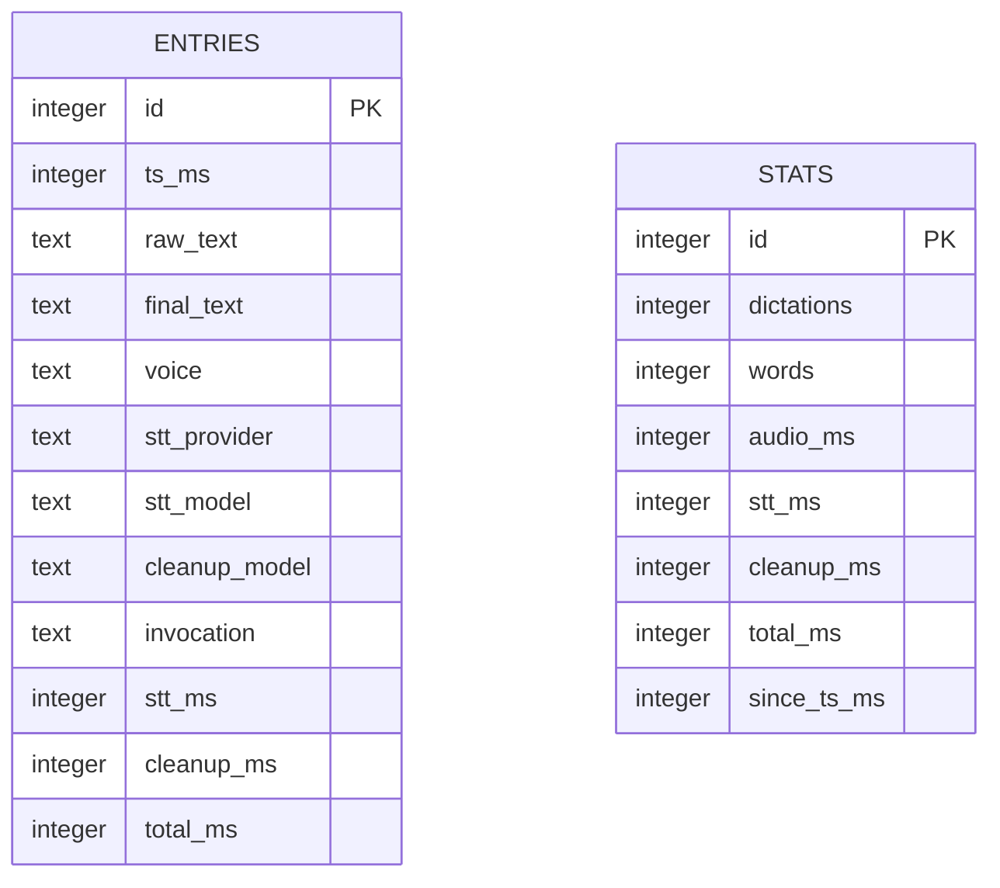

<!-- PAGE_ID: hark_05_data_storage -->
<details>
<summary>Relevant source files</summary>

The following files were used as evidence for this page:

- [crates/hark-store/src/lib.rs:1-377](https://github.com/BoardPandas/Hark/blob/1c1738716fa4cd758b0c26ec94d0873d1bc35ac1/crates/hark-store/src/lib.rs#L1-L377)
- [crates/hark-store/migrations/001_init.sql:1-31](https://github.com/BoardPandas/Hark/blob/1c1738716fa4cd758b0c26ec94d0873d1bc35ac1/crates/hark-store/migrations/001_init.sql#L1-L31)
- [crates/hark-store/migrations/002_stats_total_ms.sql:1-8](https://github.com/BoardPandas/Hark/blob/1c1738716fa4cd758b0c26ec94d0873d1bc35ac1/crates/hark-store/migrations/002_stats_total_ms.sql#L1-L8)
- [crates/hark-store/tests/store.rs:1-375](https://github.com/BoardPandas/Hark/blob/1c1738716fa4cd758b0c26ec94d0873d1bc35ac1/crates/hark-store/tests/store.rs#L1-L375)
- [crates/hark-app/src/storage.rs:1-346](https://github.com/BoardPandas/Hark/blob/1c1738716fa4cd758b0c26ec94d0873d1bc35ac1/crates/hark-app/src/storage.rs#L1-L346)
- [crates/hark-app/src/app.rs:248-269](https://github.com/BoardPandas/Hark/blob/1c1738716fa4cd758b0c26ec94d0873d1bc35ac1/crates/hark-app/src/app.rs#L248-L269)
- [crates/hark-config/src/lib.rs:434-455](https://github.com/BoardPandas/Hark/blob/1c1738716fa4cd758b0c26ec94d0873d1bc35ac1/crates/hark-config/src/lib.rs#L434-L455)
- [crates/hark-pipeline/src/events.rs:6-35](https://github.com/BoardPandas/Hark/blob/1c1738716fa4cd758b0c26ec94d0873d1bc35ac1/crates/hark-pipeline/src/events.rs#L6-L35)

</details>

# Data Storage

> **Related Pages**: [Architecture](ARCHITECTURE.md), [Configuration and Secrets](CONFIGURATION.md), [Desktop UI](../features/DESKTOP_UI.md)

---

<!-- BEGIN:AUTOGEN hark_05_data_storage_overview -->
## Overview

Hark's dictation history and lifetime stats live in a single local SQLite database, opened and migrated by the `hark-store` crate's `Store` type ([lib.rs:106-150](https://github.com/BoardPandas/Hark/blob/1c1738716fa4cd758b0c26ec94d0873d1bc35ac1/crates/hark-store/src/lib.rs#L106-L150)). The database is the sanctioned transcript store: `NewDictation` and `Entry`, the two types that carry transcript text, deliberately omit `Debug` so a stray `{:?}` in a log line cannot leak dictation content ([lib.rs:9-11](https://github.com/BoardPandas/Hark/blob/1c1738716fa4cd758b0c26ec94d0873d1bc35ac1/crates/hark-store/src/lib.rs#L9-L11)).

Storage is plaintext and single-user by design; there is no per-row encryption or multi-tenant isolation, consistent with Hark being a single-user desktop app. The database file is opened at `<data-dir>/hark.db`, where `<data-dir>` is resolved by `hark_config::default_data_dir()` and joined with `hark.db` when the app starts the storage worker ([app.rs:251-258](https://github.com/BoardPandas/Hark/blob/1c1738716fa4cd758b0c26ec94d0873d1bc35ac1/crates/hark-app/src/app.rs#L251-L258)):

| Platform | Data directory |
|---|---|
| Windows | `%APPDATA%\hark` ([lib.rs:438-440](https://github.com/BoardPandas/Hark/blob/1c1738716fa4cd758b0c26ec94d0873d1bc35ac1/crates/hark-config/src/lib.rs#L438-L440)) |
| macOS | `~/Library/Application Support/hark` ([lib.rs:442-449](https://github.com/BoardPandas/Hark/blob/1c1738716fa4cd758b0c26ec94d0873d1bc35ac1/crates/hark-config/src/lib.rs#L442-L449)) |
| Linux (XDG) | `$XDG_DATA_HOME/hark` ([lib.rs:451-454](https://github.com/BoardPandas/Hark/blob/1c1738716fa4cd758b0c26ec94d0873d1bc35ac1/crates/hark-config/src/lib.rs#L451-L454)) |

If the OS gives no home directory (e.g. headless CI), `default_data_dir()` returns `None` and history/stats are disabled for the session rather than failing dictation itself ([app.rs:248-256](https://github.com/BoardPandas/Hark/blob/1c1738716fa4cd758b0c26ec94d0873d1bc35ac1/crates/hark-app/src/app.rs#L248-L256)).

Sources: [crates/hark-store/src/lib.rs:1-16](https://github.com/BoardPandas/Hark/blob/1c1738716fa4cd758b0c26ec94d0873d1bc35ac1/crates/hark-store/src/lib.rs#L1-L16), [crates/hark-app/src/app.rs:248-269](https://github.com/BoardPandas/Hark/blob/1c1738716fa4cd758b0c26ec94d0873d1bc35ac1/crates/hark-app/src/app.rs#L248-L269), [crates/hark-config/src/lib.rs:434-455](https://github.com/BoardPandas/Hark/blob/1c1738716fa4cd758b0c26ec94d0873d1bc35ac1/crates/hark-config/src/lib.rs#L434-L455)
<!-- END:AUTOGEN hark_05_data_storage_overview -->

---

<!-- BEGIN:AUTOGEN hark_05_data_storage_schema -->
## Schema

The schema is defined by three embedded, immutable migrations applied in order at open time; the array index plus one becomes the resulting `PRAGMA user_version`, and an applied migration file is never edited or renumbered ([lib.rs:22-28](https://github.com/BoardPandas/Hark/blob/bcfcc3fef6f02252870fc3f06440d99992818ade/crates/hark-store/src/lib.rs#L22-L28), [lib.rs:159-170](https://github.com/BoardPandas/Hark/blob/bcfcc3fef6f02252870fc3f06440d99992818ade/crates/hark-store/src/lib.rs#L159-L170)).

Migration 001 creates the two tables:

```sql
CREATE TABLE entries (
  id            INTEGER PRIMARY KEY,
  ts_ms         INTEGER NOT NULL,
  raw_text      TEXT NOT NULL,
  final_text    TEXT NOT NULL,        -- equals raw_text when no cleanup ran
  voice         TEXT NOT NULL,
  stt_provider  TEXT NOT NULL,
  stt_model     TEXT NOT NULL,
  cleanup_model TEXT,                 -- NULL when cleanup did not run
  stt_ms        INTEGER NOT NULL,
  cleanup_ms    INTEGER,              -- NULL when cleanup did not run
  total_ms      INTEGER NOT NULL
);
CREATE INDEX idx_entries_ts ON entries(ts_ms);

CREATE TABLE stats (
  id            INTEGER PRIMARY KEY CHECK (id = 1),
  dictations    INTEGER NOT NULL DEFAULT 0,
  words         INTEGER NOT NULL DEFAULT 0,
  audio_ms      INTEGER NOT NULL DEFAULT 0,
  stt_ms        INTEGER NOT NULL DEFAULT 0,
  cleanup_ms    INTEGER NOT NULL DEFAULT 0,
  since_ts_ms   INTEGER NOT NULL
);
```

([crates/hark-store/migrations/001_init.sql:4-31](https://github.com/BoardPandas/Hark/blob/1c1738716fa4cd758b0c26ec94d0873d1bc35ac1/crates/hark-store/migrations/001_init.sql#L4-L31))

Migration 002 adds a `total_ms` sum column to `stats` so the UI can derive average release-to-inject latency from real totals instead of an `stt_ms + cleanup_ms` approximation that would silently omit encode and inject time; rows recorded before this migration contribute `0` to the sum ([crates/hark-store/migrations/002_stats_total_ms.sql:1-8](https://github.com/BoardPandas/Hark/blob/1c1738716fa4cd758b0c26ec94d0873d1bc35ac1/crates/hark-store/migrations/002_stats_total_ms.sql#L1-L8)):

```sql
ALTER TABLE stats ADD COLUMN total_ms INTEGER NOT NULL DEFAULT 0;
```

Migration 003 adds a nullable `invocation` column to `entries`, recording the trigger phrase when a dictation's text was pasted from an invocation rather than transcribed. There is no `DEFAULT` and no backfill: every pre-003 row genuinely is "not an invocation", which is exactly `NULL` ([crates/hark-store/migrations/003_entries_invocation.sql:1-6](https://github.com/BoardPandas/Hark/blob/bcfcc3fef6f02252870fc3f06440d99992818ade/crates/hark-store/migrations/003_entries_invocation.sql#L1-L6)):

```sql
ALTER TABLE entries ADD COLUMN invocation TEXT;
```

The column also changes how `words` is counted. `Store::record` credits `raw_text` instead of `final_text` when `invocation` is set, because the Stats page values every word at 1500 ms and a two-word trigger producing a 300-word expansion would otherwise fabricate roughly seven and a half minutes of "time saved" ([lib.rs:346-359](https://github.com/BoardPandas/Hark/blob/bcfcc3fef6f02252870fc3f06440d99992818ade/crates/hark-store/src/lib.rs#L346-L359)). See [Invocations](../features/INVOCATIONS.md).

`stats` is a singleton table keyed on the fixed id `1` (`CHECK (id = 1)`); the row is seeded with `INSERT OR IGNORE` at open time because `since_ts_ms` needs the wall clock, and an existing row (and its counters) is preserved across reopens ([lib.rs:143-148](https://github.com/BoardPandas/Hark/blob/1c1738716fa4cd758b0c26ec94d0873d1bc35ac1/crates/hark-store/src/lib.rs#L143-L148), [migrations/001_init.sql:19-22](https://github.com/BoardPandas/Hark/blob/1c1738716fa4cd758b0c26ec94d0873d1bc35ac1/crates/hark-store/migrations/001_init.sql#L19-L22)).



`entries` and `stats` have no foreign-key relationship; they are independent by design so that "clear history" and "reset stats" can each mutate one table without touching the other ([lib.rs:12-13](https://github.com/BoardPandas/Hark/blob/1c1738716fa4cd758b0c26ec94d0873d1bc35ac1/crates/hark-store/src/lib.rs#L12-L13)).

Sources: [crates/hark-store/src/lib.rs:22-28](https://github.com/BoardPandas/Hark/blob/bcfcc3fef6f02252870fc3f06440d99992818ade/crates/hark-store/src/lib.rs#L22-L28), [crates/hark-store/src/lib.rs:140-170](https://github.com/BoardPandas/Hark/blob/bcfcc3fef6f02252870fc3f06440d99992818ade/crates/hark-store/src/lib.rs#L140-L170), [crates/hark-store/migrations/001_init.sql:1-31](https://github.com/BoardPandas/Hark/blob/1c1738716fa4cd758b0c26ec94d0873d1bc35ac1/crates/hark-store/migrations/001_init.sql#L1-L31), [crates/hark-store/migrations/002_stats_total_ms.sql:1-8](https://github.com/BoardPandas/Hark/blob/1c1738716fa4cd758b0c26ec94d0873d1bc35ac1/crates/hark-store/migrations/002_stats_total_ms.sql#L1-L8), [crates/hark-store/migrations/003_entries_invocation.sql:1-6](https://github.com/BoardPandas/Hark/blob/bcfcc3fef6f02252870fc3f06440d99992818ade/crates/hark-store/migrations/003_entries_invocation.sql#L1-L6)
<!-- END:AUTOGEN hark_05_data_storage_schema -->

---

<!-- BEGIN:AUTOGEN hark_05_data_storage_history -->
## History API

`Store` exposes a small, synchronous API over `rusqlite::Connection`, opened in WAL mode with `synchronous = NORMAL` and a 5-second busy timeout so the writer and reader connections can coexist ([lib.rs:29](https://github.com/BoardPandas/Hark/blob/1c1738716fa4cd758b0c26ec94d0873d1bc35ac1/crates/hark-store/src/lib.rs#L29), [lib.rs:133-139](https://github.com/BoardPandas/Hark/blob/1c1738716fa4cd758b0c26ec94d0873d1bc35ac1/crates/hark-store/src/lib.rs#L133-L139)).

| Function | Signature | Behavior |
|---|---|---|
| `record` | `fn record(&mut self, d: &NewDictation, capture: bool) -> Result<(), StoreError>` | Inserts one `entries` row only when `capture` is true, then updates `stats` in the same transaction ([lib.rs:168-204](https://github.com/BoardPandas/Hark/blob/1c1738716fa4cd758b0c26ec94d0873d1bc35ac1/crates/hark-store/src/lib.rs#L168-L204)) |
| `entries` | `fn entries(&self, search: Option<&str>, limit: u32, offset: u32) -> Result<Vec<Entry>, StoreError>` | One page of history, newest first (`ORDER BY ts_ms DESC, id DESC`); `search` filters case-insensitively over `raw_text` and `final_text` with LIKE wildcards escaped ([lib.rs:225-269](https://github.com/BoardPandas/Hark/blob/1c1738716fa4cd758b0c26ec94d0873d1bc35ac1/crates/hark-store/src/lib.rs#L225-L269)) |
| `entry_count` | `fn entry_count(&self, search: Option<&str>) -> Result<u64, StoreError>` | Total rows matching the same search semantics as `entries` ([lib.rs:272-286](https://github.com/BoardPandas/Hark/blob/1c1738716fa4cd758b0c26ec94d0873d1bc35ac1/crates/hark-store/src/lib.rs#L272-L286)) |
| `delete_entry` | `fn delete_entry(&mut self, id: i64) -> Result<bool, StoreError>` | Deletes one row by id; returns `false` (not an error) when the id does not exist ([lib.rs:289-294](https://github.com/BoardPandas/Hark/blob/1c1738716fa4cd758b0c26ec94d0873d1bc35ac1/crates/hark-store/src/lib.rs#L289-L294)) |
| `clear_entries` | `fn clear_entries(&mut self) -> Result<usize, StoreError>` | Deletes every row in `entries`; never touches `stats` ([lib.rs:297-299](https://github.com/BoardPandas/Hark/blob/1c1738716fa4cd758b0c26ec94d0873d1bc35ac1/crates/hark-store/src/lib.rs#L297-L299)) |

Search text is passed through `escape_like`, which prefixes `%`, `_`, and `\` with a backslash so a query like `"100% off"` matches the literal percent sign instead of acting as a SQL wildcard ([lib.rs:340-349](https://github.com/BoardPandas/Hark/blob/1c1738716fa4cd758b0c26ec94d0873d1bc35ac1/crates/hark-store/src/lib.rs#L340-L349)); the LIKE clauses use `ESCAPE '\\'` to match ([lib.rs:252-253](https://github.com/BoardPandas/Hark/blob/1c1738716fa4cd758b0c26ec94d0873d1bc35ac1/crates/hark-store/src/lib.rs#L252-L253)). This is exercised directly in `search_treats_like_wildcards_literally`, where a `"100%"` entry matches `"100% off"` but not a `"salexoff"` row that would otherwise satisfy a naive `_`-as-wildcard search ([tests/store.rs:146-160](https://github.com/BoardPandas/Hark/blob/1c1738716fa4cd758b0c26ec94d0873d1bc35ac1/crates/hark-store/tests/store.rs#L146-L160)).

Pagination is newest-first and stable across pages, confirmed by `entries_page_newest_first`, which inserts five rows and reads them back across three `limit=2` pages in descending `ts_ms` order ([tests/store.rs:90-111](https://github.com/BoardPandas/Hark/blob/1c1738716fa4cd758b0c26ec94d0873d1bc35ac1/crates/hark-store/tests/store.rs#L90-L111)).

Sources: [crates/hark-store/src/lib.rs:168-299](https://github.com/BoardPandas/Hark/blob/1c1738716fa4cd758b0c26ec94d0873d1bc35ac1/crates/hark-store/src/lib.rs#L168-L299), [crates/hark-store/src/lib.rs:338-349](https://github.com/BoardPandas/Hark/blob/1c1738716fa4cd758b0c26ec94d0873d1bc35ac1/crates/hark-store/src/lib.rs#L338-L349), [crates/hark-store/tests/store.rs:90-175](https://github.com/BoardPandas/Hark/blob/1c1738716fa4cd758b0c26ec94d0873d1bc35ac1/crates/hark-store/tests/store.rs#L90-L175)
<!-- END:AUTOGEN hark_05_data_storage_history -->

---

<!-- BEGIN:AUTOGEN hark_05_data_storage_stats -->
## Lifetime Stats

`Stats` is a plain, `Debug`-derivable struct of numeric counters (safe to log, unlike `Entry`/`NewDictation`) ([lib.rs:82-94](https://github.com/BoardPandas/Hark/blob/1c1738716fa4cd758b0c26ec94d0873d1bc35ac1/crates/hark-store/src/lib.rs#L82-L94)):

```rust
#[derive(Debug, Clone, Copy, PartialEq, Eq)]
pub struct Stats {
    pub dictations: i64,
    pub words: i64,
    pub audio_ms: i64,
    pub stt_ms: i64,
    pub cleanup_ms: i64,
    /// Sum of release-to-inject wall times (migration 002); entries recorded
    /// before 002 contribute 0, so a derived average converges upward.
    pub total_ms: i64,
    pub since_ts_ms: i64,
}
```

Every call to `record` updates the singleton `stats` row in the same transaction as the (optional) `entries` insert, incrementing `dictations` by one and adding `word_count(final_text)`, `audio_ms`, `stt_ms`, `cleanup_ms.unwrap_or(0)`, and `total_ms` to their respective counters ([lib.rs:189-201](https://github.com/BoardPandas/Hark/blob/1c1738716fa4cd758b0c26ec94d0873d1bc35ac1/crates/hark-store/src/lib.rs#L189-L201)). Word counting is a deliberately simple whitespace split of the final (injected) text, not a billing-grade tokenizer ([lib.rs:332-336](https://github.com/BoardPandas/Hark/blob/1c1738716fa4cd758b0c26ec94d0873d1bc35ac1/crates/hark-store/src/lib.rs#L332-L336)).

Critically, stats update even when `capture` is `false`: with capture off, no `entries` row is written (no transcript content persisted) but the numeric counters still tick ([lib.rs:14-15](https://github.com/BoardPandas/Hark/blob/1c1738716fa4cd758b0c26ec94d0873d1bc35ac1/crates/hark-store/src/lib.rs#L14-L15), [lib.rs:165-204](https://github.com/BoardPandas/Hark/blob/1c1738716fa4cd758b0c26ec94d0873d1bc35ac1/crates/hark-store/src/lib.rs#L165-L204)). This is confirmed by `capture_off_ticks_stats_but_stores_no_content`, which records with `capture=false` and asserts `entry_count() == 0` while `stats().dictations == 1` ([tests/store.rs:61-74](https://github.com/BoardPandas/Hark/blob/1c1738716fa4cd758b0c26ec94d0873d1bc35ac1/crates/hark-store/tests/store.rs#L61-L74)).

`reset_stats(now_ms)` ("Reset stats" in the UI) zeroes all six counters and restarts `since_ts_ms` to `now_ms`, but never touches `entries` ([lib.rs:320-329](https://github.com/BoardPandas/Hark/blob/1c1738716fa4cd758b0c26ec94d0873d1bc35ac1/crates/hark-store/src/lib.rs#L320-L329)); `reset_stats_leaves_history_untouched` confirms three prior entries survive a reset ([tests/store.rs:198-223](https://github.com/BoardPandas/Hark/blob/1c1738716fa4cd758b0c26ec94d0873d1bc35ac1/crates/hark-store/tests/store.rs#L198-L223)). Symmetrically, `clear_entries` ("Clear history") never touches `stats`; `clear_history_leaves_stats_untouched` confirms `stats().dictations` still reflects all prior recordings after the entries table is emptied ([tests/store.rs:178-196](https://github.com/BoardPandas/Hark/blob/1c1738716fa4cd758b0c26ec94d0873d1bc35ac1/crates/hark-store/tests/store.rs#L178-L196)).

Sources: [crates/hark-store/src/lib.rs:82-94](https://github.com/BoardPandas/Hark/blob/1c1738716fa4cd758b0c26ec94d0873d1bc35ac1/crates/hark-store/src/lib.rs#L82-L94), [crates/hark-store/src/lib.rs:165-204](https://github.com/BoardPandas/Hark/blob/1c1738716fa4cd758b0c26ec94d0873d1bc35ac1/crates/hark-store/src/lib.rs#L165-L204), [crates/hark-store/src/lib.rs:301-329](https://github.com/BoardPandas/Hark/blob/1c1738716fa4cd758b0c26ec94d0873d1bc35ac1/crates/hark-store/src/lib.rs#L301-L329), [crates/hark-store/tests/store.rs:61-223](https://github.com/BoardPandas/Hark/blob/1c1738716fa4cd758b0c26ec94d0873d1bc35ac1/crates/hark-store/tests/store.rs#L61-L223)
<!-- END:AUTOGEN hark_05_data_storage_stats -->

---

<!-- BEGIN:AUTOGEN hark_05_data_storage_retention -->
## Retention and Pruning

`Retention` carries the policy `Store::prune` executes; validation (both fields `>= 1`) lives in `hark-config`, not the store, which executes whatever it is given ([lib.rs:96-104](https://github.com/BoardPandas/Hark/blob/1c1738716fa4cd758b0c26ec94d0873d1bc35ac1/crates/hark-store/src/lib.rs#L96-L104)):

```rust
#[derive(Debug, Clone, Copy)]
pub struct Retention {
    /// Keep at most this many newest entries.
    pub max_entries: u32,
    /// Delete entries strictly older than this many days.
    pub max_age_days: u32,
}
```

`prune(retention, now_ms)` applies both rules in one transaction and returns the total rows deleted ([lib.rs:208-220](https://github.com/BoardPandas/Hark/blob/1c1738716fa4cd758b0c26ec94d0873d1bc35ac1/crates/hark-store/src/lib.rs#L208-L220)):

1. **By age**: `DELETE FROM entries WHERE ts_ms < cutoff`, where `cutoff = now_ms - max_age_days * 86_400_000`. The boundary is strict: a row exactly at the cutoff is kept, confirmed by `prune_by_age_is_a_strict_boundary` ([tests/store.rs:225-251](https://github.com/BoardPandas/Hark/blob/1c1738716fa4cd758b0c26ec94d0873d1bc35ac1/crates/hark-store/tests/store.rs#L225-L251)).
2. **By count**: `DELETE FROM entries WHERE id IN (SELECT id FROM entries ORDER BY ts_ms DESC, id DESC LIMIT -1 OFFSET max_entries)`, which keeps the newest `max_entries` rows and deletes everything past that offset ([lib.rs:212-217](https://github.com/BoardPandas/Hark/blob/1c1738716fa4cd758b0c26ec94d0873d1bc35ac1/crates/hark-store/src/lib.rs#L212-L217)); `prune_by_count_keeps_the_newest` confirms the three newest of ten rows survive a `max_entries: 3` policy ([tests/store.rs:253-273](https://github.com/BoardPandas/Hark/blob/1c1738716fa4cd758b0c26ec94d0873d1bc35ac1/crates/hark-store/tests/store.rs#L253-L273)).

Both rules combine in a single `prune` call, and pruning never touches the `stats` table, confirmed by `prune_applies_both_rules_and_stats_survive` ([tests/store.rs:275-308](https://github.com/BoardPandas/Hark/blob/1c1738716fa4cd758b0c26ec94d0873d1bc35ac1/crates/hark-store/tests/store.rs#L275-L308)).

Sources: [crates/hark-store/src/lib.rs:96-104](https://github.com/BoardPandas/Hark/blob/1c1738716fa4cd758b0c26ec94d0873d1bc35ac1/crates/hark-store/src/lib.rs#L96-L104), [crates/hark-store/src/lib.rs:206-220](https://github.com/BoardPandas/Hark/blob/1c1738716fa4cd758b0c26ec94d0873d1bc35ac1/crates/hark-store/src/lib.rs#L206-L220), [crates/hark-store/tests/store.rs:225-308](https://github.com/BoardPandas/Hark/blob/1c1738716fa4cd758b0c26ec94d0873d1bc35ac1/crates/hark-store/tests/store.rs#L225-L308)
<!-- END:AUTOGEN hark_05_data_storage_retention -->

---

<!-- BEGIN:AUTOGEN hark_05_data_storage_integration -->
## App Integration

`hark-app`'s `storage` module owns the two-connection pattern described in the crate doc comment: a dedicated storage worker thread owns the writer `Store`, and the UI thread owns a reader `Store` for paged queries, so there is exactly one writer at all times ([storage.rs:1-8](https://github.com/BoardPandas/Hark/blob/1c1738716fa4cd758b0c26ec94d0873d1bc35ac1/crates/hark-app/src/storage.rs#L1-L8)). `spawn(db_path, ctx)` opens both connections (creating the database and applying migrations) and starts the worker thread named `"hark-storage"` ([storage.rs:112-128](https://github.com/BoardPandas/Hark/blob/1c1738716fa4cd758b0c26ec94d0873d1bc35ac1/crates/hark-app/src/storage.rs#L112-L128)); the app calls it with `<data-dir>/hark.db` at startup ([app.rs:251-269](https://github.com/BoardPandas/Hark/blob/1c1738716fa4cd758b0c26ec94d0873d1bc35ac1/crates/hark-app/src/app.rs#L251-L269)).

Mutations are funneled through an `mpsc` channel of `StorageCmd` values ([storage.rs:22-38](https://github.com/BoardPandas/Hark/blob/1c1738716fa4cd758b0c26ec94d0873d1bc35ac1/crates/hark-app/src/storage.rs#L22-L38)):

```rust
pub enum StorageCmd {
    /// Persist one completed dictation, then prune.
    Record {
        record: Box<DictationRecord>,
        capture: bool,
        retention: Retention,
    },
    /// Re-apply retention now. Sent on every pipeline start so a lowered cap
    /// takes effect at save/startup, not at the next dictation.
    Prune(Retention),
    /// History panel: delete one entry.
    DeleteEntry(i64),
    /// History panel "Clear all": entries only, stats untouched.
    ClearEntries,
    /// Stats panel "Reset stats": counters only, entries untouched.
    ResetStats,
}
```

Every `StorageCmd::Record` carries the `capture`/`retention` policy that was active when its pipeline run started, rather than reading a shared, possibly-racing cell, because a settings change restarts the pipeline ([storage.rs:19-21](https://github.com/BoardPandas/Hark/blob/1c1738716fa4cd758b0c26ec94d0873d1bc35ac1/crates/hark-app/src/storage.rs#L19-L21)). `record_policy(settings)` and `retention(settings)` derive that policy from `Settings::history` ([storage.rs:48-60](https://github.com/BoardPandas/Hark/blob/1c1738716fa4cd758b0c26ec94d0873d1bc35ac1/crates/hark-app/src/storage.rs#L48-L60)).

Writes happen strictly after text injection by construction: the sole source of `Record` commands is the pipeline's post-inject `Injected` event, carrying a `DictationRecord` ([storage.rs:1-5](https://github.com/BoardPandas/Hark/blob/1c1738716fa4cd758b0c26ec94d0873d1bc35ac1/crates/hark-app/src/storage.rs#L1-L5), [events.rs:6-11](https://github.com/BoardPandas/Hark/blob/1c1738716fa4cd758b0c26ec94d0873d1bc35ac1/crates/hark-pipeline/src/events.rs#L6-L11)). The worker loop applies each command and, on any actual change, bumps an atomic generation counter and calls `ctx.request_repaint()` so the history/stats panels refresh without polling ([storage.rs:130-149](https://github.com/BoardPandas/Hark/blob/1c1738716fa4cd758b0c26ec94d0873d1bc35ac1/crates/hark-app/src/storage.rs#L130-L149)); `StorageHandle::generation()` lets UI pages know when to re-query ([storage.rs:85-88](https://github.com/BoardPandas/Hark/blob/1c1738716fa4cd758b0c26ec94d0873d1bc35ac1/crates/hark-app/src/storage.rs#L85-L88)). A failed write is logged and otherwise ignored so a history-write failure never disturbs dictation, which already completed before the write ran ([storage.rs:144-146](https://github.com/BoardPandas/Hark/blob/1c1738716fa4cd758b0c26ec94d0873d1bc35ac1/crates/hark-app/src/storage.rs#L144-L146)).

`StorageHandle`'s `Drop` impl disconnects the sender and joins the worker thread so pending writes commit before the process exits; `HarkApp` declares the pipeline before this handle so the event pump (which holds a sender clone) is gone by the time `Drop` runs, letting the worker's `recv` loop end as soon as the queue drains ([storage.rs:96-107](https://github.com/BoardPandas/Hark/blob/1c1738716fa4cd758b0c26ec94d0873d1bc35ac1/crates/hark-app/src/storage.rs#L96-L107)).

Sources: [crates/hark-app/src/storage.rs:1-149](https://github.com/BoardPandas/Hark/blob/1c1738716fa4cd758b0c26ec94d0873d1bc35ac1/crates/hark-app/src/storage.rs#L1-L149), [crates/hark-app/src/app.rs:248-269](https://github.com/BoardPandas/Hark/blob/1c1738716fa4cd758b0c26ec94d0873d1bc35ac1/crates/hark-app/src/app.rs#L248-L269), [crates/hark-pipeline/src/events.rs:6-35](https://github.com/BoardPandas/Hark/blob/1c1738716fa4cd758b0c26ec94d0873d1bc35ac1/crates/hark-pipeline/src/events.rs#L6-L35)
<!-- END:AUTOGEN hark_05_data_storage_integration -->

---
