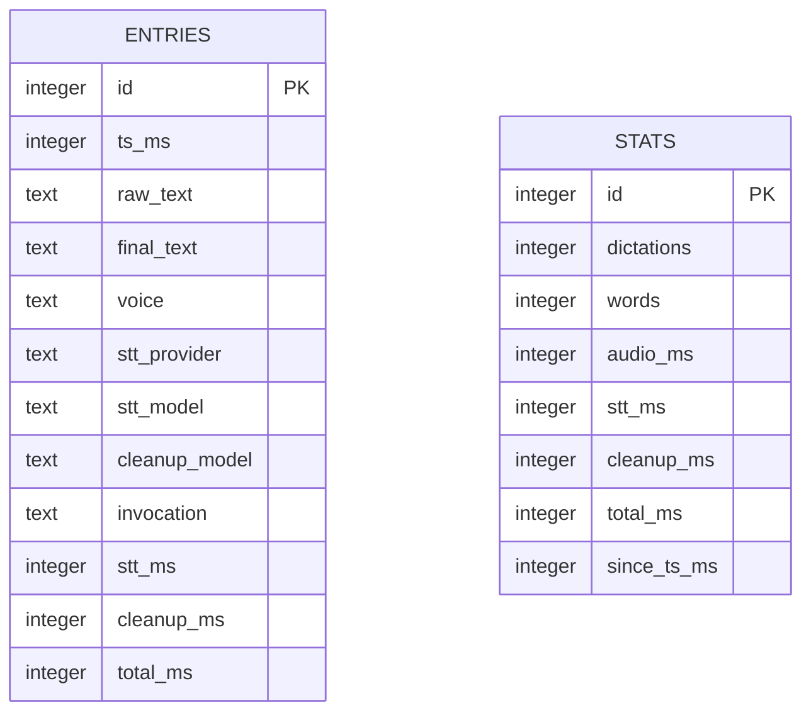

<!-- PAGE_ID: hark_05_data_storage -->

Relevant source files

The following files were used as evidence for this page:

- [crates/hark-store/src/lib.rs:1-400](../../crates/hark-store/src/lib.rs#L1-L400)
- [crates/hark-store/migrations/001_init.sql:1-31](../../crates/hark-store/migrations/001_init.sql#L1-L31)
- [crates/hark-store/migrations/002_stats_total_ms.sql:1-8](../../crates/hark-store/migrations/002_stats_total_ms.sql#L1-L8)
- [crates/hark-store/migrations/003_entries_invocation.sql:1-6](../../crates/hark-store/migrations/003_entries_invocation.sql#L1-L6)
- [crates/hark-store/tests/store.rs:1-465](../../crates/hark-store/tests/store.rs#L1-L465)
- [crates/hark-app/src/storage.rs:1-420](../../crates/hark-app/src/storage.rs#L1-L420)
- [crates/hark-app/src/app.rs:389-409](../../crates/hark-app/src/app.rs#L389-L409)
- [crates/hark-config/src/lib.rs:376-400](../../crates/hark-config/src/lib.rs#L376-L400)
- [crates/hark-config/src/lib.rs:713-742](../../crates/hark-config/src/lib.rs#L713-L742)
- [crates/hark-pipeline/src/events.rs:6-40](../../crates/hark-pipeline/src/events.rs#L6-L40)

# Data Storage

> **Related Pages**: [Architecture](ARCHITECTURE.md), [Configuration and Secrets](CONFIGURATION.md), [Desktop UI](../features/DESKTOP_UI.md)

---

<!-- BEGIN:AUTOGEN hark_05_data_storage_overview -->
## Overview

Hark stores dictation history and lifetime counters in one local SQLite file, `<data-dir>/hark.db`. `Store::open` creates the parent directory, opens the database, applies embedded migrations, and seeds the singleton stats row. The transcript-bearing `NewDictation` and `Entry` types intentionally do not implement `Debug`, which keeps a reflexive debug log from exposing dictation text ([lib.rs:1-15](../../crates/hark-store/src/lib.rs#L1-L15), [lib.rs:50-86](../../crates/hark-store/src/lib.rs#L50-L86), [lib.rs:116-168](../../crates/hark-store/src/lib.rs#L116-L168)).

The implementation is local plaintext SQLite; it has no app-layer row encryption or multi-user isolation. History capture and numeric stats are separate controls: disabling capture prevents transcript rows from being stored, while non-content counters still advance ([lib.rs:171-210](../../crates/hark-store/src/lib.rs#L171-L210)).

| Platform | Data directory |
|---|---|
| Windows | `%APPDATA%\hark` |
| macOS | `~/Library/Application Support/hark` |
| Linux | `$XDG_DATA_HOME/hark` when that variable is absolute; otherwise `~/.local/share/hark` |

The platform resolution lives in `default_data_dir`; if no OS data directory can be resolved, startup disables history and stats for that session without disabling dictation ([lib.rs:713-742](../../crates/hark-config/src/lib.rs#L713-L742), [app.rs:389-409](../../crates/hark-app/src/app.rs#L389-L409)).

Sources: [crates/hark-store/src/lib.rs:1-15](../../crates/hark-store/src/lib.rs#L1-L15), [crates/hark-store/src/lib.rs:116-168](../../crates/hark-store/src/lib.rs#L116-L168), [crates/hark-config/src/lib.rs:713-742](../../crates/hark-config/src/lib.rs#L713-L742), [crates/hark-app/src/app.rs:389-409](../../crates/hark-app/src/app.rs#L389-L409)
<!-- END:AUTOGEN hark_05_data_storage_overview -->

---

<!-- BEGIN:AUTOGEN hark_05_data_storage_schema -->
## Schema

The schema is an append-only sequence of three embedded migrations. `PRAGMA user_version` records how many have been applied; opening an older database runs only the remaining migrations, each in its own transaction ([lib.rs:22-28](../../crates/hark-store/src/lib.rs#L22-L28), [lib.rs:158-168](../../crates/hark-store/src/lib.rs#L158-L168)).

| Migration | Change | Compatibility behavior |
|---|---|---|
| `001_init.sql` | Creates `entries`, its timestamp index, and singleton `stats` | The app seeds stats row `id = 1` without replacing existing counters ([001_init.sql:1-31](../../crates/hark-store/migrations/001_init.sql#L1-L31), [lib.rs:147-154](../../crates/hark-store/src/lib.rs#L147-L154)) |
| `002_stats_total_ms.sql` | Adds `stats.total_ms NOT NULL DEFAULT 0` | Existing counters survive; pre-migration dictations contribute zero to the new sum ([002_stats_total_ms.sql:1-8](../../crates/hark-store/migrations/002_stats_total_ms.sql#L1-L8), [store.rs:427-465](../../crates/hark-store/tests/store.rs#L427-L465)) |
| `003_entries_invocation.sql` | Adds nullable `entries.invocation` | Existing rows read as non-invocations; new rows round-trip the trigger ([003_entries_invocation.sql:1-6](../../crates/hark-store/migrations/003_entries_invocation.sql#L1-L6), [store.rs:378-424](../../crates/hark-store/tests/store.rs#L378-L424)) |

```mermaid
erDiagram
    ENTRIES {
        integer id PK
        integer ts_ms
        text raw_text
        text final_text
        text voice
        text stt_provider
        text stt_model
        text cleanup_model
        text invocation
        integer stt_ms
        integer cleanup_ms
        integer total_ms
    }
    STATS {
        integer id PK
        integer dictations
        integer words
        integer audio_ms
        integer stt_ms
        integer cleanup_ms
        integer total_ms
        integer since_ts_ms
    }
```

`entries` and `stats` intentionally have no foreign-key relationship. Clearing history deletes only entries; resetting stats changes only the fixed stats row ([lib.rs:296-336](../../crates/hark-store/src/lib.rs#L296-L336)). `audio_ms` feeds lifetime stats but is not stored on each history entry ([lib.rs:50-68](../../crates/hark-store/src/lib.rs#L50-L68)).

Sources: [crates/hark-store/src/lib.rs:22-28](../../crates/hark-store/src/lib.rs#L22-L28), [crates/hark-store/src/lib.rs:139-168](../../crates/hark-store/src/lib.rs#L139-L168), [crates/hark-store/migrations/001_init.sql:1-31](../../crates/hark-store/migrations/001_init.sql#L1-L31), [crates/hark-store/migrations/002_stats_total_ms.sql:1-8](../../crates/hark-store/migrations/002_stats_total_ms.sql#L1-L8), [crates/hark-store/migrations/003_entries_invocation.sql:1-6](../../crates/hark-store/migrations/003_entries_invocation.sql#L1-L6)
<!-- END:AUTOGEN hark_05_data_storage_schema -->

---

<!-- BEGIN:AUTOGEN hark_05_data_storage_history -->
## History API

Every `Store` owns one synchronous `rusqlite::Connection`. File-backed connections request WAL mode, use `synchronous = NORMAL`, and wait up to five seconds when the database is busy, which supports the app's one-writer/one-reader arrangement ([lib.rs:30-30](../../crates/hark-store/src/lib.rs#L30-L30), [lib.rs:139-145](../../crates/hark-store/src/lib.rs#L139-L145)).

| Method | Behavior |
|---|---|
| `record(d, capture)` | In one transaction, optionally inserts the content row and always updates numeric stats ([lib.rs:171-210](../../crates/hark-store/src/lib.rs#L171-L210)) |
| `entries(search, limit, offset)` | Returns newest first by `(ts_ms DESC, id DESC)`; searches both raw and final text ([lib.rs:229-277](../../crates/hark-store/src/lib.rs#L229-L277)) |
| `entry_count(search)` | Counts rows using the same blank/search semantics as `entries` ([lib.rs:279-294](../../crates/hark-store/src/lib.rs#L279-L294)) |
| `delete_entry(id)` | Deletes one row and returns `false` when it was already absent ([lib.rs:296-302](../../crates/hark-store/src/lib.rs#L296-L302)) |
| `clear_entries()` | Deletes all history rows without changing lifetime stats ([lib.rs:304-307](../../crates/hark-store/src/lib.rs#L304-L307)) |

Search is a case-insensitive SQLite `LIKE` substring match. `%`, `_`, and `\` in user input are escaped, so they remain literal characters rather than becoming pattern operators ([lib.rs:256-265](../../crates/hark-store/src/lib.rs#L256-L265), [lib.rs:361-371](../../crates/hark-store/src/lib.rs#L361-L371)). Tests cover stable newest-first pagination and wildcard escaping ([store.rs:91-161](../../crates/hark-store/tests/store.rs#L91-L161)).

Sources: [crates/hark-store/src/lib.rs:139-145](../../crates/hark-store/src/lib.rs#L139-L145), [crates/hark-store/src/lib.rs:171-307](../../crates/hark-store/src/lib.rs#L171-L307), [crates/hark-store/src/lib.rs:361-371](../../crates/hark-store/src/lib.rs#L361-L371), [crates/hark-store/tests/store.rs:91-176](../../crates/hark-store/tests/store.rs#L91-L176)
<!-- END:AUTOGEN hark_05_data_storage_history -->

---

<!-- BEGIN:AUTOGEN hark_05_data_storage_stats -->
## Lifetime Stats

`Stats` contains only numbers and is safe to debug-format: dictations, words, audio time, STT time, cleanup time, release-to-inject time, and the timestamp from which the counters apply ([lib.rs:88-100](../../crates/hark-store/src/lib.rs#L88-L100)). A `record` call updates those counters in the same transaction as the optional entry insert, so capture-off mode persists no transcript content but still measures usage ([lib.rs:171-210](../../crates/hark-store/src/lib.rs#L171-L210), [store.rs:62-75](../../crates/hark-store/tests/store.rs#L62-L75)).

Word counting is intentionally simple whitespace tokenization. Ordinary dictations credit `final_text`, the text actually injected. When an invocation fires, stats instead credit `raw_text`, the words spoken; otherwise a short trigger expanding to a long canned response would falsely inflate the UI's estimated time saved ([lib.rs:340-359](../../crates/hark-store/src/lib.rs#L340-L359), [store.rs:337-364](../../crates/hark-store/tests/store.rs#L337-L364)).

`reset_stats(now_ms)` zeroes all accumulated counters and restarts `since_ts_ms`, without deleting history. Conversely, deleting or clearing history leaves the counters intact ([lib.rs:304-336](../../crates/hark-store/src/lib.rs#L304-L336), [store.rs:178-224](../../crates/hark-store/tests/store.rs#L178-L224)).

Sources: [crates/hark-store/src/lib.rs:88-100](../../crates/hark-store/src/lib.rs#L88-L100), [crates/hark-store/src/lib.rs:171-210](../../crates/hark-store/src/lib.rs#L171-L210), [crates/hark-store/src/lib.rs:309-359](../../crates/hark-store/src/lib.rs#L309-L359), [crates/hark-store/tests/store.rs:337-364](../../crates/hark-store/tests/store.rs#L337-L364)
<!-- END:AUTOGEN hark_05_data_storage_stats -->

---

<!-- BEGIN:AUTOGEN hark_05_data_storage_retention -->
## Retention and Pruning

`Retention` combines `max_entries` and `max_age_days`; configuration validation requires both to be at least one, while the store simply executes the supplied policy. Defaults are 1,000 entries and 90 days ([lib.rs:102-110](../../crates/hark-store/src/lib.rs#L102-L110), [lib.rs:376-400](../../crates/hark-config/src/lib.rs#L376-L400)).

`Store::prune` applies both rules in one transaction:

1. Delete rows with `ts_ms < now_ms - max_age_days * 86_400_000`. The boundary is strict, so an entry exactly at the cutoff remains.
2. Order the survivors newest-first by timestamp and id, then delete everything after `max_entries`.

The return value is the total number of deleted rows. Pruning never changes lifetime stats, even when both rules remove history in the same call ([lib.rs:213-227](../../crates/hark-store/src/lib.rs#L213-L227), [store.rs:226-309](../../crates/hark-store/tests/store.rs#L226-L309)).

The app prunes after every recorded dictation and also sends a standalone prune when a pipeline starts, so lowering retention takes effect after save/startup rather than waiting for another dictation ([storage.rs:29-48](../../crates/hark-app/src/storage.rs#L29-L48), [storage.rs:185-205](../../crates/hark-app/src/storage.rs#L185-L205)).

Sources: [crates/hark-store/src/lib.rs:102-110](../../crates/hark-store/src/lib.rs#L102-L110), [crates/hark-store/src/lib.rs:213-227](../../crates/hark-store/src/lib.rs#L213-L227), [crates/hark-store/tests/store.rs:226-309](../../crates/hark-store/tests/store.rs#L226-L309), [crates/hark-app/src/storage.rs:185-205](../../crates/hark-app/src/storage.rs#L185-L205)
<!-- END:AUTOGEN hark_05_data_storage_retention -->

---

<!-- BEGIN:AUTOGEN hark_05_data_storage_integration -->
## App Integration

`hark-app` uses two connections: the `hark-storage` worker owns the sole writer, while the UI owns a reader for history and stats queries. All mutations travel through `StorageCmd`; successful changes increment an atomic generation counter and wake egui so cached panels re-query without polling ([storage.rs:1-8](../../crates/hark-app/src/storage.rs#L1-L8), [storage.rs:72-105](../../crates/hark-app/src/storage.rs#L72-L105), [storage.rs:134-183](../../crates/hark-app/src/storage.rs#L134-L183)).

`Record` carries the capture and retention policy from the pipeline run that produced it. The worker stamps the record at persistence time, writes it, then prunes. Records originate only from the post-injection `PipelineEvent::Injected`, so a storage failure cannot undo or block text that has already reached the focused application ([storage.rs:29-70](../../crates/hark-app/src/storage.rs#L29-L70), [storage.rs:185-225](../../crates/hark-app/src/storage.rs#L185-L225), [events.rs:75-90](../../crates/hark-pipeline/src/events.rs#L75-L90)).

Shutdown is bounded. Dropping `StorageHandle` removes its sender and normally joins the worker after every queued write drains. If an abandoned pipeline request keeps another sender alive, the handle waits only 500 ms, logs a warning, and leaves that worker rather than holding application exit open indefinitely ([storage.rs:20-27](../../crates/hark-app/src/storage.rs#L20-L27), [storage.rs:108-131](../../crates/hark-app/src/storage.rs#L108-L131)). Tests cover both the normal final-write flush and the bounded abandoned-sender case ([storage.rs:265-293](../../crates/hark-app/src/storage.rs#L265-L293)).

Sources: [crates/hark-app/src/storage.rs:1-225](../../crates/hark-app/src/storage.rs#L1-L225), [crates/hark-app/src/storage.rs:265-293](../../crates/hark-app/src/storage.rs#L265-L293), [crates/hark-pipeline/src/events.rs:75-90](../../crates/hark-pipeline/src/events.rs#L75-L90)
<!-- END:AUTOGEN hark_05_data_storage_integration -->

---
