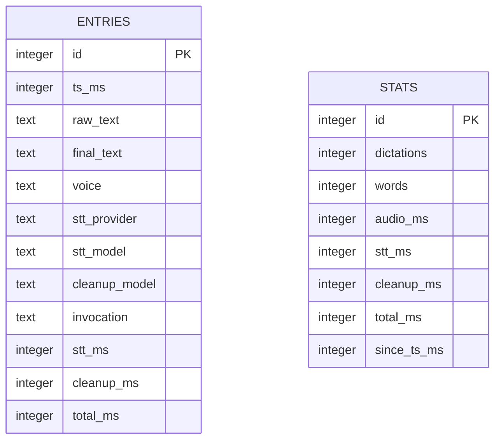

<!-- PAGE_ID: hark_05_data_storage -->

Relevant source files

The following files were used as evidence for this page:

- [crates/hark-store/src/lib.rs:1-400](../../crates/hark-store/src/lib.rs#L1-L400)
- [crates/hark-store/migrations/001_init.sql:1-31](../../crates/hark-store/migrations/001_init.sql#L1-L31)
- [crates/hark-store/migrations/002_stats_total_ms.sql:1-8](../../crates/hark-store/migrations/002_stats_total_ms.sql#L1-L8)
- [crates/hark-store/migrations/003_entries_invocation.sql:1-6](../../crates/hark-store/migrations/003_entries_invocation.sql#L1-L6)
- [crates/hark-store/migrations/004_meetings.sql](../../crates/hark-store/migrations/004_meetings.sql)
- [Numeric Insights migration](../../crates/hark-store/migrations/005_insight_events.sql), [persistence](../../crates/hark-store/src/insights/persistence.rs), [queries](../../crates/hark-store/src/insights/query.rs), and [word analysis](../../crates/hark-store/src/insights/patterns.rs)
- [Insights regression tests](../../crates/hark-store/tests/insights.rs)
- [crates/hark-store/src/meetings.rs](../../crates/hark-store/src/meetings.rs)
- [crates/hark-store/tests/store.rs:1-465](../../crates/hark-store/tests/store.rs#L1-L465)
- [crates/hark-app/src/storage/mod.rs:1-249](../../crates/hark-app/src/storage/mod.rs#L1-L249)
- [crates/hark-app/src/storage/meetings.rs](../../crates/hark-app/src/storage/meetings.rs)
- [crates/hark-app/src/app.rs](../../crates/hark-app/src/app.rs)
- [crates/hark-config/src/lib.rs](../../crates/hark-config/src/lib.rs)
- [crates/hark-config/src/lib.rs](../../crates/hark-config/src/lib.rs)
- [crates/hark-pipeline/src/events.rs:6-40](../../crates/hark-pipeline/src/events.rs#L6-L40)

# Data Storage

Config schema 6 adds optional microphone echo reduction, defaulting off, while
preserving explicit meeting preferences and the schema-5 Gemini model setting.
TOML remains at schema 6; the separate SQLite schema now includes migration 005
for bounded numeric Insights and a tracking-coverage timestamp.
Migration attempts a versioned TOML backup before saving; failure keeps
the in-memory settings usable, and a failed backup leaves the original file alone
([config persistence](../../crates/hark-config/src/lib.rs),
[migration fixtures](../../crates/hark-config/src/meeting.rs)).

> **Related Pages**: [Architecture](ARCHITECTURE.md), [Configuration and Secrets](CONFIGURATION.md), [Desktop UI](../features/DESKTOP_UI.md)

---

<!-- BEGIN:AUTOGEN hark_05_data_storage_overview -->
## Overview

Hark stores dictation history, bounded numeric Insights, and lifetime counters in one local SQLite file, `<data-dir>/hark.db`. `Store::open` creates the parent directory, opens the database, applies embedded migrations, and seeds the singleton stats row. The transcript-bearing `NewDictation` and `Entry` types intentionally do not implement `Debug`, which keeps a reflexive debug log from exposing dictation text ([lib.rs:1-15](../../crates/hark-store/src/lib.rs#L1-L15), [lib.rs:50-86](../../crates/hark-store/src/lib.rs#L50-L86), [lib.rs:116-168](../../crates/hark-store/src/lib.rs#L116-L168)).

The implementation is local plaintext SQLite; it has no app-layer row encryption or multi-user isolation. History capture and numeric stats are separate controls: disabling capture prevents transcript rows from being stored, while numeric Insights and lifetime counters still advance ([lib.rs:171-210](../../crates/hark-store/src/lib.rs#L171-L210)).

The same database also holds meeting transcripts and notes (migration 004; see [Schema](#schema)). Meeting audio itself is not a database column: it lives on disk under `<data_dir>/meetings/<id>/`, and `hark-app/src/storage/meetings.rs` is the one writer for both the meeting's rows and its audio folder, so a size check against the filesystem and the database's idea of which meetings exist never disagree ([storage/meetings.rs](../../crates/hark-app/src/storage/meetings.rs)).

| Platform | Data directory |
|---|---|
| Windows | `%APPDATA%\hark` |
| macOS | `~/Library/Application Support/hark` |
| Linux | `$XDG_DATA_HOME/hark` when that variable is absolute; otherwise `~/.local/share/hark` |

The platform resolution lives in `default_data_dir`; if no OS data directory can be resolved, startup disables history and stats for that session without disabling dictation ([lib.rs](../../crates/hark-config/src/lib.rs), [app.rs](../../crates/hark-app/src/app.rs)).

Sources: [crates/hark-store/src/lib.rs:1-15](../../crates/hark-store/src/lib.rs#L1-L15), [crates/hark-store/src/lib.rs:116-168](../../crates/hark-store/src/lib.rs#L116-L168), [crates/hark-config/src/lib.rs](../../crates/hark-config/src/lib.rs), [crates/hark-app/src/app.rs](../../crates/hark-app/src/app.rs)
<!-- END:AUTOGEN hark_05_data_storage_overview -->

---

<!-- BEGIN:AUTOGEN hark_05_data_storage_schema -->
## Schema

The schema is an append-only sequence of five embedded migrations. `PRAGMA user_version` records how many have been applied; opening an older database runs only the remaining migrations, each in its own transaction ([lib.rs:22-28](../../crates/hark-store/src/lib.rs#L22-L28), [lib.rs:158-168](../../crates/hark-store/src/lib.rs#L158-L168)).

| Migration | Change | Compatibility behavior |
|---|---|---|
| `001_init.sql` | Creates `entries`, its timestamp index, and singleton `stats` | The app seeds stats row `id = 1` without replacing existing counters ([001_init.sql:1-31](../../crates/hark-store/migrations/001_init.sql#L1-L31), [lib.rs:147-154](../../crates/hark-store/src/lib.rs#L147-L154)) |
| `002_stats_total_ms.sql` | Adds `stats.total_ms NOT NULL DEFAULT 0` | Existing counters survive; pre-migration dictations contribute zero to the new sum ([002_stats_total_ms.sql:1-8](../../crates/hark-store/migrations/002_stats_total_ms.sql#L1-L8), [store.rs:427-465](../../crates/hark-store/tests/store.rs#L427-L465)) |
| `003_entries_invocation.sql` | Adds nullable `entries.invocation` | Existing rows read as non-invocations; new rows round-trip the trigger ([003_entries_invocation.sql:1-6](../../crates/hark-store/migrations/003_entries_invocation.sql#L1-L6), [store.rs:378-424](../../crates/hark-store/tests/store.rs#L378-L424)) |
| `004_meetings.sql` | Adds `meetings`, `meeting_segments`, `meeting_speakers`, and an external-content FTS5 index over segment text | A fresh table set; nothing pre-existing to migrate. `meeting_segments`/`meeting_speakers` cascade-delete with their meeting, which only takes effect because `Store::init` now turns `PRAGMA foreign_keys` on for every connection ([004_meetings.sql](../../crates/hark-store/migrations/004_meetings.sql), [lib.rs:152-154](../../crates/hark-store/src/lib.rs#L152-L154)) |
| `005_insight_events.sql` | Adds indexed `insight_events` and singleton `insight_tracking` | Backfills retained, post-reset history within 366 days; keeps historical duration, corrections, and app identity NULL. Does not increment existing lifetime counters ([migration](../../crates/hark-store/migrations/005_insight_events.sql), [backfill](../../crates/hark-store/src/insights/persistence.rs)) |

Meeting search does not need a `LIKE` fallback: the FTS5 module is compiled into the SQLite Hark bundles, which `hark-store/tests/meetings.rs` asserts directly rather than assuming ([meetings.rs](../../crates/hark-store/src/meetings.rs)). `meeting_segments_fts` is kept in sync by the standard insert/delete/update trigger trio rather than by application code, so a segment written through any path is searchable ([004_meetings.sql](../../crates/hark-store/migrations/004_meetings.sql)).

```mermaid
erDiagram
    ENTRIES {
        integer id PK
        integer ts_ms
        text raw_text
        text final_text
        text voice
        text stt_provider
        text stt_model
        text cleanup_model
        text invocation
        integer stt_ms
        integer cleanup_ms
        integer total_ms
    }
    STATS {
        integer id PK
        integer dictations
        integer words
        integer audio_ms
        integer stt_ms
        integer cleanup_ms
        integer total_ms
        integer since_ts_ms
    }
```

`entries`, `stats`, and `insight_events` intentionally have independent lifecycles. Clearing history deletes only entries; resetting stats zeroes the fixed stats row, deletes numeric events, and restarts the tracking timestamp ([lib.rs:296-336](../../crates/hark-store/src/lib.rs#L296-L336)). `audio_ms` feeds lifetime stats and new numeric events, but is not stored on each transcript history entry ([lib.rs:50-68](../../crates/hark-store/src/lib.rs#L50-L68)).

Sources: [crates/hark-store/src/lib.rs:22-28](../../crates/hark-store/src/lib.rs#L22-L28), [crates/hark-store/src/lib.rs:139-168](../../crates/hark-store/src/lib.rs#L139-L168), [crates/hark-store/migrations/001_init.sql:1-31](../../crates/hark-store/migrations/001_init.sql#L1-L31), [crates/hark-store/migrations/002_stats_total_ms.sql:1-8](../../crates/hark-store/migrations/002_stats_total_ms.sql#L1-L8), [crates/hark-store/migrations/003_entries_invocation.sql:1-6](../../crates/hark-store/migrations/003_entries_invocation.sql#L1-L6), [crates/hark-store/migrations/004_meetings.sql](../../crates/hark-store/migrations/004_meetings.sql), [crates/hark-store/src/meetings.rs](../../crates/hark-store/src/meetings.rs)

Explicit meeting reprocessing uses `reprocess_meeting_segments`: segment replacement and deletion of old speaker renames happen in the same transaction, with FTS updated by the segment triggers. Notes and title are untouched. A failed insert rolls the whole transaction back. The app's storage worker acknowledges this commit before the meeting UI reports rerun success ([store implementation](../../crates/hark-store/src/meetings.rs), [rollback and preservation tests](../../crates/hark-store/tests/meetings.rs), [storage acknowledgement](../../crates/hark-app/src/storage/meetings.rs)).
<!-- END:AUTOGEN hark_05_data_storage_schema -->

---

<!-- BEGIN:AUTOGEN hark_05_data_storage_history -->
## History API

Every `Store` owns one synchronous `rusqlite::Connection`. File-backed connections request WAL mode, use `synchronous = NORMAL`, and wait up to five seconds when the database is busy, which supports the app's one-writer/one-reader arrangement ([lib.rs:30-30](../../crates/hark-store/src/lib.rs#L30-L30), [lib.rs:139-145](../../crates/hark-store/src/lib.rs#L139-L145)).

| Method | Behavior |
|---|---|
| `record(d, capture)` | In one transaction, optionally inserts the content row, always records a numeric event, and updates lifetime stats ([lib.rs:171-210](../../crates/hark-store/src/lib.rs#L171-L210)) |
| `entries(search, limit, offset)` | Returns newest first by `(ts_ms DESC, id DESC)`; searches both raw and final text ([lib.rs:229-277](../../crates/hark-store/src/lib.rs#L229-L277)) |
| `entry_count(search)` | Counts rows using the same blank/search semantics as `entries` ([lib.rs:279-294](../../crates/hark-store/src/lib.rs#L279-L294)) |
| `delete_entry(id)` | Deletes one row and returns `false` when it was already absent ([lib.rs:296-302](../../crates/hark-store/src/lib.rs#L296-L302)) |
| `clear_entries()` | Deletes all history rows without changing numeric Insights or lifetime stats ([lib.rs:304-307](../../crates/hark-store/src/lib.rs#L304-L307)) |

Search is a case-insensitive SQLite `LIKE` substring match. `%`, `_`, and `\` in user input are escaped, so they remain literal characters rather than becoming pattern operators ([lib.rs:256-265](../../crates/hark-store/src/lib.rs#L256-L265), [lib.rs:361-371](../../crates/hark-store/src/lib.rs#L361-L371)). Tests cover stable newest-first pagination and wildcard escaping ([store.rs:91-161](../../crates/hark-store/tests/store.rs#L91-L161)).

Sources: [crates/hark-store/src/lib.rs:139-145](../../crates/hark-store/src/lib.rs#L139-L145), [crates/hark-store/src/lib.rs:171-307](../../crates/hark-store/src/lib.rs#L171-L307), [crates/hark-store/src/lib.rs:361-371](../../crates/hark-store/src/lib.rs#L361-L371), [crates/hark-store/tests/store.rs:91-176](../../crates/hark-store/tests/store.rs#L91-L176)
<!-- END:AUTOGEN hark_05_data_storage_history -->

---

<!-- BEGIN:AUTOGEN hark_05_data_storage_stats -->
## Lifetime Stats and Detailed Insights

`Stats` holds lifetime counts and summed durations: dictations, words, captured audio, STT, cleanup, release-to-inject time, and the timestamp from which counters apply. Recording a completed dictation updates those counters, its numeric event, and the optional transcript row in one transaction. History capture controls only the transcript row.

Word counting uses whitespace tokenization. Ordinary dictations credit inserted `final_text`; invocation dictations credit `raw_text` so a short trigger does not inflate dictated-word totals. Numeric events also store the full inserted word count when an invocation fired. The UI calls this **Words in invocation output**: anywhere-scope invocations include surrounding speech, so it is not a count of only the configured expansion.

Each numeric event records timestamp, words, measured clip duration, completion latency, provider/voice labels, invocation flag/output word count, actual Spellbook replacements, and an optional foreground app label. Neither transcript text, invocation phrases, expansion text, window/document titles, nor audio is copied into that table. Correction totals include both local Spellbook passes; they do not estimate cloud cleanup edits or transcription accuracy.

Migration 005 backfills only surviving history within retention and at or after the last stats reset. Recoverable counts and latency remain usable; unknown duration, correction counts, and app labels stay NULL. `insight_tracking.since_ts_ms` starts when complete numeric recording begins, separately from the oldest backfilled row. The query reports coverage for selected and preceding periods rather than treating sparse legacy history as a complete record.

### Aggregation and interpretation

`Store::insights` builds day buckets in the requested local timezone, including empty dates. Selected periods are inclusive calendar days ending today; UI choices are 7, 30, and 90 days. Activity covers 366 local dates. Current streak ends today, or yesterday if today is empty; longest streak is the longest observed run within retained numeric history. It is not an all-time streak claim.

Pace divides words from measured rows by those rows' clip durations. Estimated time saved subtracts measured clip duration from a 40 WPM typing baseline and floors at zero; missing durations are excluded from both numerator and denominator. Clip time includes capture padding. Median/p95 use recorded completion latencies; these are not failure-rate statistics. Provider, voice, optional app, and busiest-hour aggregates use the same selected period; absent app labels are counted separately.

Opted-in word analysis reads retained history on the worker, using final text for ordinary dictations and spoken raw text for invocations. It excludes common words, counts two-/three-word phrases, and bounds work to 5,000 recent entries and 200,000 tokens. Results report how much retained history was analyzed and whether truncated. Derived words/phrases are not persisted or uploaded.

### Reset and deletion

`reset_stats(now_ms)` zeroes lifetime counters, removes all numeric events/app labels, and restarts numeric tracking. It preserves transcripts, Spellbook, and invocations. Consequently opted-in word analysis can still calculate results from retained transcripts after a numeric reset. Deleting or clearing history removes the text available to that analysis but preserves numeric details until they expire or are reset.

Sources: [store lifecycle](../../crates/hark-store/src/lib.rs), [Insights types](../../crates/hark-store/src/insights/types.rs), [queries](../../crates/hark-store/src/insights/query.rs), [word analysis](../../crates/hark-store/src/insights/patterns.rs), [migration/backfill](../../crates/hark-store/src/insights/persistence.rs), [regression tests](../../crates/hark-store/tests/insights.rs).
<!-- END:AUTOGEN hark_05_data_storage_stats -->

---

<!-- BEGIN:AUTOGEN hark_05_data_storage_retention -->
## Retention and Pruning

`Retention` combines `max_entries` and `max_age_days`; configuration validation requires both to be at least one, while the store simply executes the supplied policy. Defaults are 1,000 entries and 90 days ([lib.rs:102-110](../../crates/hark-store/src/lib.rs#L102-L110), [lib.rs](../../crates/hark-config/src/lib.rs)).

`Store::prune` applies both rules in one transaction:

1. Delete rows with `ts_ms < now_ms - max_age_days * 86_400_000`. The boundary is strict, so an entry exactly at the cutoff remains.
2. Order the survivors newest-first by timestamp and id, then delete everything after `max_entries`.

The return value includes deleted history rows and expired numeric Insight events. Pruning never changes lifetime stats, even when both rules remove history in the same call ([lib.rs:213-227](../../crates/hark-store/src/lib.rs#L213-L227), [store.rs:226-309](../../crates/hark-store/tests/store.rs#L226-L309)).

The app prunes after every recorded dictation and also sends a standalone prune when a pipeline starts, so lowering retention takes effect after save/startup rather than waiting for another dictation ([storage/mod.rs:33-54](../../crates/hark-app/src/storage/mod.rs#L33-L54), [storage/mod.rs:204-225](../../crates/hark-app/src/storage/mod.rs#L204-L225)).

Numeric Insights have a separate fixed 366-day retention. Events older than `now_ms - 366 × 86,400,000` are physically pruned when opening the database or applying retention after a recording/pipeline start. Insights queries exclude expired rows even before that pruning; lifetime counters are unaffected. Transcript retention and capture settings do not remove these numeric rows. Calendar grouping follows local dates even though expiry is a fixed elapsed-time cutoff ([persistence](../../crates/hark-store/src/insights/persistence.rs), [query](../../crates/hark-store/src/insights/query.rs)).

Meeting audio has its own, separate cap: a circular limit in megabytes (`[meeting] audio_cap_mb`, default 5 GB), enforced against actual bytes on disk rather than a database column, and it only ever deletes audio, never a transcript, note, or segment row. See [Meetings](../features/MEETINGS.md#storage-and-the-audio-cap) for the eviction rules ([hark-meeting/src/storage.rs:1-9](../../crates/hark-meeting/src/storage.rs#L1-L9)).

Sources: [crates/hark-store/src/lib.rs:102-110](../../crates/hark-store/src/lib.rs#L102-L110), [crates/hark-store/src/lib.rs:213-227](../../crates/hark-store/src/lib.rs#L213-L227), [crates/hark-store/tests/store.rs:226-309](../../crates/hark-store/tests/store.rs#L226-L309), [crates/hark-app/src/storage/mod.rs:204-225](../../crates/hark-app/src/storage/mod.rs#L204-L225), [crates/hark-meeting/src/storage.rs:1-9](../../crates/hark-meeting/src/storage.rs#L1-L9)
<!-- END:AUTOGEN hark_05_data_storage_retention -->

---

<!-- BEGIN:AUTOGEN hark_05_data_storage_integration -->
## App Integration

`hark-app` retains a reader for existing history/meeting views, while the `hark-storage` worker owns the sole writer and all new Insights aggregation/text analysis. `StorageCmd::GetInsights` and `GetRecentEntries` return results through reply channels, and completion explicitly wakes the root viewport. All mutations travel through `StorageCmd`; successful changes increment an atomic generation counter so cached panels can refresh ([storage/mod.rs:1-10](../../crates/hark-app/src/storage/mod.rs#L1-L10), [storage/mod.rs:78-112](../../crates/hark-app/src/storage/mod.rs#L78-L112), [storage/mod.rs:140-200](../../crates/hark-app/src/storage/mod.rs#L140-L200)).

`Record` carries the capture and retention policy from the pipeline run that produced it. The worker stamps the record at persistence time, writes it, then prunes. The numeric correction and optional app fields are carried directly with `DictationRecord`. Records originate only from the post-injection `PipelineEvent::Injected`, so a storage failure cannot undo or block text that has already reached the focused application ([storage/mod.rs:33-76](../../crates/hark-app/src/storage/mod.rs#L33-L76), [storage/mod.rs:204-244](../../crates/hark-app/src/storage/mod.rs#L204-L244), [events.rs:75-90](../../crates/hark-pipeline/src/events.rs#L75-L90)).

Home/Insights caches re-query when generation, selected range, local date, or text-analysis choice changes. An obsolete reply is discarded rather than overwriting a newer range. Foreground-app collection is a separate opt-in one-shot worker query at engagement; injection never waits for it. Late, unavailable, unsupported, or disabled app identity remains unknown. No extra permissions, window titles, or provider calls are introduced for Insights ([cache](../../crates/hark-app/src/ui/insights_cache.rs), [app probe](../../crates/hark-pipeline/src/foreground.rs)).

Shutdown is bounded. Dropping `StorageHandle` removes its sender and normally joins the worker after every queued write drains. If an abandoned pipeline request keeps another sender alive, the handle waits only 500 ms, logs a warning, and leaves that worker rather than holding application exit open indefinitely ([storage/mod.rs:24-31](../../crates/hark-app/src/storage/mod.rs#L24-L31), [storage/mod.rs:114-138](../../crates/hark-app/src/storage/mod.rs#L114-L138)). Tests cover both the normal final-write flush and the bounded abandoned-sender case ([storage/mod.rs:289-317](../../crates/hark-app/src/storage/mod.rs#L289-L317)).

`StorageCmd::Meeting` carries the same guarantee for meeting rows and audio: `storage::meetings::apply` is the one function that touches both the `meetings`/`meeting_segments` tables and the `<data_dir>/meetings/<id>/` folder, called from the same worker thread and after the same generation bump, so the Meetings page never has to reconcile two write paths ([storage/mod.rs:9-10](../../crates/hark-app/src/storage/mod.rs#L9-L10), [storage/mod.rs:52-53](../../crates/hark-app/src/storage/mod.rs#L52-L53), [storage/meetings.rs](../../crates/hark-app/src/storage/meetings.rs), [storage/meetings.rs](../../crates/hark-app/src/storage/meetings.rs)).

Meeting deletion has an explicit reply channel. The worker deletes the recording directory before the database row, treating only an already-absent recording directory as benign. Filesystem failure preserves the meeting row and its relation to any remaining audio, permitting a retry instead of leaving unknown orphaned audio. Filesystem removal and the database write are not one transaction: partial audio removal cannot be undone, and a later database failure is reported separately so a retry can finish the row deletion. The worker wakes the root viewport even when deletion fails without changing the generation; the detail view waits for acknowledgement before claiming success ([deletion implementation and fixtures](../../crates/hark-app/src/storage/meetings.rs), [worker wakeup](../../crates/hark-app/src/storage/mod.rs), [UI reply handling](../../crates/hark-app/src/ui/meetings/detail.rs)).

Sources: [crates/hark-app/src/storage/mod.rs:1-249](../../crates/hark-app/src/storage/mod.rs#L1-L249), [crates/hark-app/src/storage/mod.rs:289-317](../../crates/hark-app/src/storage/mod.rs#L289-L317), [crates/hark-app/src/storage/meetings.rs](../../crates/hark-app/src/storage/meetings.rs), [crates/hark-pipeline/src/events.rs:75-90](../../crates/hark-pipeline/src/events.rs#L75-L90)
<!-- END:AUTOGEN hark_05_data_storage_integration -->

---

Gemini playback-speaker IDs reserve the high bit and encode the five-minute window
alongside its local speaker number. They remain separate identities in storage,
rename controls, and exports; no cross-window match is implied
([parse](../../crates/hark-stt/src/meeting_gemini.rs),
[label](../../crates/hark-meeting/src/export.rs)).

Mac native capture and UI use the same local history and meeting storage workers as Windows. Permission changes restart capture without replacing the data directory. Updates stage their DMG outside the signed app and replace only the app bundle; settings, keychain credentials, meeting audio and history remain in their existing OS locations ([app lifecycle](../../crates/hark-app/src/app.rs), [Mac updater](../../crates/hark-update/src/macos.rs)).
