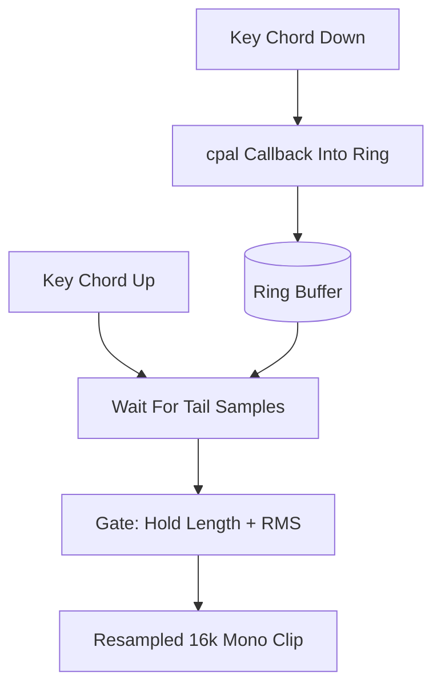

<!-- PAGE_ID: hark_06_audio_capture -->
<details>
<summary>Relevant source files</summary>

The following files were used as evidence for this page:

- [crates/hark-audio/src/lib.rs:1-211](https://github.com/BoardPandas/Hark/blob/1c1738716fa4cd758b0c26ec94d0873d1bc35ac1/crates/hark-audio/src/lib.rs#L1-L211)
- [crates/hark-audio/src/ring.rs:1-249](https://github.com/BoardPandas/Hark/blob/1c1738716fa4cd758b0c26ec94d0873d1bc35ac1/crates/hark-audio/src/ring.rs#L1-L249)
- [crates/hark-audio/src/window.rs:1-234](https://github.com/BoardPandas/Hark/blob/1c1738716fa4cd758b0c26ec94d0873d1bc35ac1/crates/hark-audio/src/window.rs#L1-L234)
- [crates/hark-audio/src/level.rs:1-99](https://github.com/BoardPandas/Hark/blob/1c1738716fa4cd758b0c26ec94d0873d1bc35ac1/crates/hark-audio/src/level.rs#L1-L99)
- [crates/hark-audio/src/resample.rs:1-189](https://github.com/BoardPandas/Hark/blob/1c1738716fa4cd758b0c26ec94d0873d1bc35ac1/crates/hark-audio/src/resample.rs#L1-L189)
- [crates/hark-audio/src/capture_win.rs:1-280](https://github.com/BoardPandas/Hark/blob/1c1738716fa4cd758b0c26ec94d0873d1bc35ac1/crates/hark-audio/src/capture_win.rs#L1-L280)
- [crates/hark-hotkey/src/lib.rs:1-83](https://github.com/BoardPandas/Hark/blob/1c1738716fa4cd758b0c26ec94d0873d1bc35ac1/crates/hark-hotkey/src/lib.rs#L1-L83)
- [crates/hark-hotkey/src/hook_win.rs:1-217](https://github.com/BoardPandas/Hark/blob/1c1738716fa4cd758b0c26ec94d0873d1bc35ac1/crates/hark-hotkey/src/hook_win.rs#L1-L217)
- [crates/hark-hotkey/src/edges.rs:1-476](https://github.com/BoardPandas/Hark/blob/1c1738716fa4cd758b0c26ec94d0873d1bc35ac1/crates/hark-hotkey/src/edges.rs#L1-L476)
- [config/default-config.toml:29-34](https://github.com/BoardPandas/Hark/blob/1c1738716fa4cd758b0c26ec94d0873d1bc35ac1/config/default-config.toml#L29-L34)

</details>

# Audio Capture and Push-to-Talk

> **Related Pages**: [Architecture](../core/ARCHITECTURE.md), [Configuration and Secrets](../core/CONFIGURATION.md), [Transcription](TRANSCRIPTION.md)

---

<!-- BEGIN:AUTOGEN hark_06_audio_capture_overview -->
## Overview

Audio capture is the first stage of Hark's release-to-inject pipeline: a `cpal` input stream feeds a lock-free ring buffer at the device's native rate, and a held key chord marks which slice of that ring becomes one dictation clip. Two crates split the responsibility: `hark-audio` owns the ring, the pre-roll/tail window math, the silence gate, resampling, and the live cpal stream, while `hark-hotkey` owns the native low-level key hook that produces clean chord engage/disengage edges (`crates/hark-audio/src/lib.rs:1-8`, `crates/hark-hotkey/src/lib.rs:1-8`).

`hark-audio`'s pure modules (`ring`, `window`, `resample`) contain no I/O and are unit-tested on any machine; only `capture_win.rs` touches cpal and is verifiable solely on real hardware ([lib.rs:1-8](https://github.com/BoardPandas/Hark/blob/1c1738716fa4cd758b0c26ec94d0873d1bc35ac1/crates/hark-audio/src/lib.rs#L1-L8)). `assemble_window` is the one function the pipeline worker calls per press/release pair: it composes pre-roll + hold + tail into a range, blocks (bounded) for the tail to arrive, gates on hold duration and loudness, and resamples the survivor to 16 kHz mono ([lib.rs:60-119](https://github.com/BoardPandas/Hark/blob/1c1738716fa4cd758b0c26ec94d0873d1bc35ac1/crates/hark-audio/src/lib.rs#L60-L119)).



Sources: [lib.rs:1-119](https://github.com/BoardPandas/Hark/blob/1c1738716fa4cd758b0c26ec94d0873d1bc35ac1/crates/hark-audio/src/lib.rs#L1-L119), [hotkey/lib.rs:1-83](https://github.com/BoardPandas/Hark/blob/1c1738716fa4cd758b0c26ec94d0873d1bc35ac1/crates/hark-hotkey/src/lib.rs#L1-L83)
<!-- END:AUTOGEN hark_06_audio_capture_overview -->

---

<!-- BEGIN:AUTOGEN hark_06_audio_capture_ring -->
## Ring Buffer and Pre-roll

The ring is a lock-free SPSC (single producer, single consumer) buffer backed by a fixed `Box<[AtomicU32]>` of `f32` bit patterns, plus one `AtomicU64` absolute write counter ([ring.rs:14-32](https://github.com/BoardPandas/Hark/blob/1c1738716fa4cd758b0c26ec94d0873d1bc35ac1/crates/hark-audio/src/ring.rs#L14-L32)). The producer half (`Producer`, held only by the cpal callback) performs relaxed atomic stores and one release store of the counter per push, with no allocation and no locks, satisfying the cpal #970 constraint that a blocking or allocating callback can silently stop the stream ([ring.rs:1-8](https://github.com/BoardPandas/Hark/blob/1c1738716fa4cd758b0c26ec94d0873d1bc35ac1/crates/hark-audio/src/ring.rs#L1-L8), [ring.rs:52-64](https://github.com/BoardPandas/Hark/blob/1c1738716fa4cd758b0c26ec94d0873d1bc35ac1/crates/hark-audio/src/ring.rs#L52-L64)). `push_interleaved` downmixes multi-channel frames to mono by averaging, still allocation-free, and drops a trailing partial frame ([ring.rs:69-84](https://github.com/BoardPandas/Hark/blob/1c1738716fa4cd758b0c26ec94d0873d1bc35ac1/crates/hark-audio/src/ring.rs#L69-L84)).

The consumer half (`Consumer`) exposes `total_written`, `oldest_available`, and `read_range`, which detects both "not yet produced" and "already overwritten" ranges, plus a mid-copy overwrite via a re-check of the counter after the copy loop ([ring.rs:92-140](https://github.com/BoardPandas/Hark/blob/1c1738716fa4cd758b0c26ec94d0873d1bc35ac1/crates/hark-audio/src/ring.rs#L92-L140)).

Pre-roll and tail are pure sample-index arithmetic in `window.rs`, expressed as milliseconds converted against the live device rate:

| Function | Purpose | Source |
|---|---|---|
| `ms_to_samples(ms, rate)` | Convert wall-clock ms to a sample count at `rate` | [window.rs:29-31](https://github.com/BoardPandas/Hark/blob/1c1738716fa4cd758b0c26ec94d0873d1bc35ac1/crates/hark-audio/src/window.rs#L29-L31) |
| `window_bounds(down_abs, up_abs, rate, params)` | Compute `[start, end)` covering pre-roll + hold + tail, clamped at absolute zero and capped at `max_hold_s` (anchored to release, not press) | [window.rs:42-57](https://github.com/BoardPandas/Hark/blob/1c1738716fa4cd758b0c26ec94d0873d1bc35ac1/crates/hark-audio/src/window.rs#L42-L57) |
| `ring_capacity(rate, params)` | Ring size (samples) that always retains a maximal window plus 1 s of copy slack | [window.rs:62-67](https://github.com/BoardPandas/Hark/blob/1c1738716fa4cd758b0c26ec94d0873d1bc35ac1/crates/hark-audio/src/window.rs#L62-L67) |
| `ring_seconds(params)` | Same sizing expressed in whole seconds, for callers that must size the ring before the device rate is known | [window.rs:73-75](https://github.com/BoardPandas/Hark/blob/1c1738716fa4cd758b0c26ec94d0873d1bc35ac1/crates/hark-audio/src/window.rs#L73-L75) |

A hold longer than `max_hold_s` keeps the *most recent* audio: the effective start moves forward to `up_abs - max_hold`, matching what the identically-sized ring buffer still holds anyway ([window.rs:33-57](https://github.com/BoardPandas/Hark/blob/1c1738716fa4cd758b0c26ec94d0873d1bc35ac1/crates/hark-audio/src/window.rs#L33-L57)). A press right after process launch clamps the pre-roll at absolute sample zero rather than underflowing ([window.rs:54](https://github.com/BoardPandas/Hark/blob/1c1738716fa4cd758b0c26ec94d0873d1bc35ac1/crates/hark-audio/src/window.rs#L54), verified in [lib.rs:181-196](https://github.com/BoardPandas/Hark/blob/1c1738716fa4cd758b0c26ec94d0873d1bc35ac1/crates/hark-audio/src/lib.rs#L181-L196)).

`assemble_window` reads the window from the ring only after waiting (bounded to `tail_ms + 1000` ms) for `total_written()` to reach `end`, since the tail extends past the release instant and those samples are still arriving ([lib.rs:82-94](https://github.com/BoardPandas/Hark/blob/1c1738716fa4cd758b0c26ec94d0873d1bc35ac1/crates/hark-audio/src/lib.rs#L82-L94)). A stalled stream (device lost, cpal #970) surfaces as `AssembleError::StreamStalled`, never a silent hang ([lib.rs:43-53](https://github.com/BoardPandas/Hark/blob/1c1738716fa4cd758b0c26ec94d0873d1bc35ac1/crates/hark-audio/src/lib.rs#L43-L53)).

Sources: [ring.rs:1-141](https://github.com/BoardPandas/Hark/blob/1c1738716fa4cd758b0c26ec94d0873d1bc35ac1/crates/hark-audio/src/ring.rs#L1-L141), [window.rs:1-116](https://github.com/BoardPandas/Hark/blob/1c1738716fa4cd758b0c26ec94d0873d1bc35ac1/crates/hark-audio/src/window.rs#L1-L116)
<!-- END:AUTOGEN hark_06_audio_capture_ring -->

---

<!-- BEGIN:AUTOGEN hark_06_audio_capture_device -->
## Device Capture and Resampling

`capture_win.rs` is the only file in `hark-audio` allowed to touch cpal ([CLAUDE.md rule](../../crates/hark-audio/CLAUDE.md)). The stream is built and owned on a dedicated `hark-audio-capture` thread so WASAPI's COM apartment has exactly one owner: sharing a thread with egui/winit or the keyboard hook risks `RPC_E_CHANGED_MODE` if the other occupant initializes COM in a different mode first ([capture_win.rs:1-9](https://github.com/BoardPandas/Hark/blob/1c1738716fa4cd758b0c26ec94d0873d1bc35ac1/crates/hark-audio/src/capture_win.rs#L1-L9)). `list_input_devices` and `start` both spawn dedicated threads for the same reason ([capture_win.rs:84-101](https://github.com/BoardPandas/Hark/blob/1c1738716fa4cd758b0c26ec94d0873d1bc35ac1/crates/hark-audio/src/capture_win.rs#L84-L101), [capture_win.rs:110-153](https://github.com/BoardPandas/Hark/blob/1c1738716fa4cd758b0c26ec94d0873d1bc35ac1/crates/hark-audio/src/capture_win.rs#L110-L153)).

Device and format selection:

| Step | Behavior | Source |
|---|---|---|
| `select_device` | Matches a configured device name against `Display` names from `host.input_devices()`; falls back to the OS default with a `log::warn!` if the name is stale (mic unplugged) rather than failing the pipeline | [capture_win.rs:191-213](https://github.com/BoardPandas/Hark/blob/1c1738716fa4cd758b0c26ec94d0873d1bc35ac1/crates/hark-audio/src/capture_win.rs#L191-L213) |
| `build_stream` format check | Requires `SampleFormat::F32` explicitly; if the device default is an integer format, searches `supported_input_configs()` for an F32 config at the same rate, else returns `CaptureError::NoF32Config` | [capture_win.rs:219-249](https://github.com/BoardPandas/Hark/blob/1c1738716fa4cd758b0c26ec94d0873d1bc35ac1/crates/hark-audio/src/capture_win.rs#L219-L249) |
| Ring sizing | `ring_seconds * sample_rate` once the live rate resolves | [capture_win.rs:255-256](https://github.com/BoardPandas/Hark/blob/1c1738716fa4cd758b0c26ec94d0873d1bc35ac1/crates/hark-audio/src/capture_win.rs#L255-L256) |

The input callback itself is the hot path: it calls `producer.push_interleaved(data, channels)` then `level.observe(data)`, both relaxed-atomics-only operations, with no allocation, locks, or syscalls ([capture_win.rs:262-267](https://github.com/BoardPandas/Hark/blob/1c1738716fa4cd758b0c26ec94d0873d1bc35ac1/crates/hark-audio/src/capture_win.rs#L262-L267)). A stream error callback (device lost) only sets an `AtomicBool` and logs ([capture_win.rs:269-274](https://github.com/BoardPandas/Hark/blob/1c1738716fa4cd758b0c26ec94d0873d1bc35ac1/crates/hark-audio/src/capture_win.rs#L269-L274)); `CaptureHandle::stream_errored()` surfaces it to the pipeline ([capture_win.rs:61-65](https://github.com/BoardPandas/Hark/blob/1c1738716fa4cd758b0c26ec94d0873d1bc35ac1/crates/hark-audio/src/capture_win.rs#L61-L65)).

```rust
// crates/hark-audio/src/capture_win.rs:262-268
move |data: &[f32], _info: &cpal::InputCallbackInfo| {
    // Hot path: relaxed atomic stores only (cpal #970). The level
    // meter is the same discipline (a bounded scan + one relaxed
    // store) and is advisory-only, so it never affects the ring.
    producer.push_interleaved(data, channels);
    level.observe(data);
},
```

WASAPI shared mode does not resample for you and rarely offers 16 kHz, so devices commonly run at 48 kHz (exact 3:1) or 44.1 kHz (non-integer ratio) and `resample::resample_to_16k` handles both via rubato's `Fft` resampler ([resample.rs:1-8](https://github.com/BoardPandas/Hark/blob/1c1738716fa4cd758b0c26ec94d0873d1bc35ac1/crates/hark-audio/src/resample.rs#L1-L8)). It uses rubato 4.0's `process_all()` whole-clip path rather than a single oversized `process()` call, because `process_all` trims the FFT startup delay and returns the exact `ceil(len * 16000 / src_rate)` output frame count; a naive call would leave leading silence and truncate the tail ([resample.rs:40-71](https://github.com/BoardPandas/Hark/blob/1c1738716fa4cd758b0c26ec94d0873d1bc35ac1/crates/hark-audio/src/resample.rs#L40-L71)). `resampled_len` exposes that exact formula for window-budget math elsewhere ([resample.rs:73-79](https://github.com/BoardPandas/Hark/blob/1c1738716fa4cd758b0c26ec94d0873d1bc35ac1/crates/hark-audio/src/resample.rs#L73-L79)).

The `LevelMeter` is a single-value peak amplitude, written from the callback and read from the UI thread to drive the recording overlay's audio-reactive pulse; it is deliberately advisory and lossy, entirely decoupled from the ring's dictation audio ([level.rs:1-13](https://github.com/BoardPandas/Hark/blob/1c1738716fa4cd758b0c26ec94d0873d1bc35ac1/crates/hark-audio/src/level.rs#L1-L13), [level.rs:40-51](https://github.com/BoardPandas/Hark/blob/1c1738716fa4cd758b0c26ec94d0873d1bc35ac1/crates/hark-audio/src/level.rs#L40-L51)).

Sources: [capture_win.rs:1-281](https://github.com/BoardPandas/Hark/blob/1c1738716fa4cd758b0c26ec94d0873d1bc35ac1/crates/hark-audio/src/capture_win.rs#L1-L281), [resample.rs:1-80](https://github.com/BoardPandas/Hark/blob/1c1738716fa4cd758b0c26ec94d0873d1bc35ac1/crates/hark-audio/src/resample.rs#L1-L80), [level.rs:1-59](https://github.com/BoardPandas/Hark/blob/1c1738716fa4cd758b0c26ec94d0873d1bc35ac1/crates/hark-audio/src/level.rs#L1-L59)
<!-- END:AUTOGEN hark_06_audio_capture_device -->

---

<!-- BEGIN:AUTOGEN hark_06_audio_capture_hotkey -->
## Push-to-Talk Key Hooks

Hark uses a native low-level key hook, `WH_KEYBOARD_LL` on Windows, rather than the `global-hotkey` crate, because reliable held-key press/release semantics require observing raw key edges directly ([hotkey/lib.rs:1-7](https://github.com/BoardPandas/Hark/blob/1c1738716fa4cd758b0c26ec94d0873d1bc35ac1/crates/hark-hotkey/src/lib.rs#L1-L7)). `spawn_listener(chord, tx)` is the platform seam: `hook_win.rs` implements it now, and a future `hook_mac.rs` (CGEventTap) slots in behind the identical signature without touching the pipeline ([hotkey/lib.rs:50-64](https://github.com/BoardPandas/Hark/blob/1c1738716fa4cd758b0c26ec94d0873d1bc35ac1/crates/hark-hotkey/src/lib.rs#L50-L64)). A second entry point, `spawn_capture`, drives the settings UI's "record a shortcut" flow over the same hook infrastructure ([hotkey/lib.rs:66-83](https://github.com/BoardPandas/Hark/blob/1c1738716fa4cd758b0c26ec94d0873d1bc35ac1/crates/hark-hotkey/src/lib.rs#L66-L83)).

The hook installs on a dedicated thread whose entire body is the `GetMessageW`/`DispatchMessageW` loop, because `WH_KEYBOARD_LL` delivers callbacks only while its installing thread is pumping messages; that thread must never sleep, park, or do other work ([hook_win.rs:1-16](https://github.com/BoardPandas/Hark/blob/1c1738716fa4cd758b0c26ec94d0873d1bc35ac1/crates/hark-hotkey/src/hook_win.rs#L1-L16), [hook_win.rs:149-157](https://github.com/BoardPandas/Hark/blob/1c1738716fa4cd758b0c26ec94d0873d1bc35ac1/crates/hark-hotkey/src/hook_win.rs#L149-L157)). The callback must stay fast, since Windows silently removes low-level hooks that exceed `LowLevelHooksTimeout`: it maps the virtual-key code, feeds the state machine, sends on the channel, and returns ([hook_win.rs:73-103](https://github.com/BoardPandas/Hark/blob/1c1738716fa4cd758b0c26ec94d0873d1bc35ac1/crates/hark-hotkey/src/hook_win.rs#L73-L103)). It always calls `CallNextHookEx`, so Hark only observes keys and never swallows them ([hook_win.rs:14-16](https://github.com/BoardPandas/Hark/blob/1c1738716fa4cd758b0c26ec94d0873d1bc35ac1/crates/hark-hotkey/src/hook_win.rs#L14-L16), [hook_win.rs:102](https://github.com/BoardPandas/Hark/blob/1c1738716fa4cd758b0c26ec94d0873d1bc35ac1/crates/hark-hotkey/src/hook_win.rs#L102)).

`vk_to_key` maps the small set of chord-capable virtual keys (modifiers, Caps Lock, F1..F24) and ignores everything else, including typing keys such as `V` (the paste key) so the hook can never interfere with normal typing ([hook_win.rs:35-53](https://github.com/BoardPandas/Hark/blob/1c1738716fa4cd758b0c26ec94d0873d1bc35ac1/crates/hark-hotkey/src/hook_win.rs#L35-L53), [hook_win.rs:210-216](https://github.com/BoardPandas/Hark/blob/1c1738716fa4cd758b0c26ec94d0873d1bc35ac1/crates/hark-hotkey/src/hook_win.rs#L210-L216)):

```rust
// crates/hark-hotkey/src/hook_win.rs:39-51
let key = match vk {
    VK_LCONTROL => PttKeyCode::LCtrl,
    VK_RCONTROL => PttKeyCode::RCtrl,
    VK_LSHIFT => PttKeyCode::LShift,
    VK_RSHIFT => PttKeyCode::RShift,
    VK_LMENU => PttKeyCode::LAlt,
    VK_RMENU => PttKeyCode::RAlt,
    VK_LWIN => PttKeyCode::LWin,
    VK_RWIN => PttKeyCode::RWin,
    VK_CAPITAL => PttKeyCode::CapsLock,
    v if (f_first..=f_last).contains(&v.0) => PttKeyCode::F((v.0 - f_first + 1) as u8),
    _ => return None,
};
```

Per-hook-thread state is thread-local (`HOOK_STATE`), holding either a `ChordTracker` (push-to-talk mode) or a raw-edge forwarder (capture mode), since the LL hook callback carries no user pointer but always runs on its installing thread ([hook_win.rs:55-71](https://github.com/BoardPandas/Hark/blob/1c1738716fa4cd758b0c26ec94d0873d1bc35ac1/crates/hark-hotkey/src/hook_win.rs#L55-L71)). `LLKHF_INJECTED` events are always tagged `injected` and fed through, so Hark's own synthesized Ctrl+V paste can never re-trigger push-to-talk ([hook_win.rs:12-13](https://github.com/BoardPandas/Hark/blob/1c1738716fa4cd758b0c26ec94d0873d1bc35ac1/crates/hark-hotkey/src/hook_win.rs#L12-L13), [hook_win.rs:77](https://github.com/BoardPandas/Hark/blob/1c1738716fa4cd758b0c26ec94d0873d1bc35ac1/crates/hark-hotkey/src/hook_win.rs#L77)). A send error (receiver gone) posts `WM_QUIT` to shut the hook thread down cleanly rather than hooking keys forever ([hook_win.rs:83-98](https://github.com/BoardPandas/Hark/blob/1c1738716fa4cd758b0c26ec94d0873d1bc35ac1/crates/hark-hotkey/src/hook_win.rs#L83-L98)).

Sources: [hotkey/lib.rs:1-83](https://github.com/BoardPandas/Hark/blob/1c1738716fa4cd758b0c26ec94d0873d1bc35ac1/crates/hark-hotkey/src/lib.rs#L1-L83), [hook_win.rs:1-217](https://github.com/BoardPandas/Hark/blob/1c1738716fa4cd758b0c26ec94d0873d1bc35ac1/crates/hark-hotkey/src/hook_win.rs#L1-L217)
<!-- END:AUTOGEN hark_06_audio_capture_hotkey -->

---

<!-- BEGIN:AUTOGEN hark_06_audio_capture_edges -->
## Chord Edge Detection

`edges.rs` is pure state-machine logic with no platform dependency, converting a stream of raw per-key events into clean `PttEvent::Down` / `PttEvent::Up` edges ([edges.rs:1-11](https://github.com/BoardPandas/Hark/blob/1c1738716fa4cd758b0c26ec94d0873d1bc35ac1/crates/hark-hotkey/src/edges.rs#L1-L11)). `PttChord` holds 1..=4 distinct `PttKeyCode`s and parses config strings like `"LCtrl+LWin"` (case-insensitive, whitespace-tolerant, deduping repeats, capped at 4 keys) via `PttChord::parse` ([edges.rs:69-92](https://github.com/BoardPandas/Hark/blob/1c1738716fa4cd758b0c26ec94d0873d1bc35ac1/crates/hark-hotkey/src/edges.rs#L69-L92)).

`ChordTracker` is the engage/disengage state machine:

| Semantic | Behavior | Source |
|---|---|---|
| Engage | Fires `PttEvent::Down` when the LAST chord member goes down (all held) | [edges.rs:183-187](https://github.com/BoardPandas/Hark/blob/1c1738716fa4cd758b0c26ec94d0873d1bc35ac1/crates/hark-hotkey/src/edges.rs#L183-L187) |
| Disengage | Fires `PttEvent::Up` when the FIRST chord member is released | [edges.rs:189-192](https://github.com/BoardPandas/Hark/blob/1c1738716fa4cd758b0c26ec94d0873d1bc35ac1/crates/hark-hotkey/src/edges.rs#L189-L192) |
| Auto-repeat | A down event while already down produces no edge (Windows repeats `WM_KEYDOWN` while a key is held) | [edges.rs:176-180](https://github.com/BoardPandas/Hark/blob/1c1738716fa4cd758b0c26ec94d0873d1bc35ac1/crates/hark-hotkey/src/edges.rs#L176-L180) |
| Injected events | Always ignored (`injected == true`), so synthesized paste keystrokes cannot engage or disengage the chord | [edges.rs:171-173](https://github.com/BoardPandas/Hark/blob/1c1738716fa4cd758b0c26ec94d0873d1bc35ac1/crates/hark-hotkey/src/edges.rs#L171-L173) |
| Non-chord keys | Ignored entirely (position lookup returns `None`) | [edges.rs:174](https://github.com/BoardPandas/Hark/blob/1c1738716fa4cd758b0c26ec94d0873d1bc35ac1/crates/hark-hotkey/src/edges.rs#L174) |

```rust
// crates/hark-hotkey/src/edges.rs:170-195
pub fn on_event(&mut self, key: PttKeyCode, down: bool, injected: bool) -> Option<PttEvent> {
    if injected {
        return None;
    }
    let idx = self.chord.keys.iter().position(|k| *k == key)?;

    if self.member_down[idx] == down {
        return None;
    }
    self.member_down[idx] = down;

    let all_down = self.member_down.iter().all(|d| *d);
    match (self.engaged, all_down) {
        (false, true) => { self.engaged = true; Some(PttEvent::Down) }
        (true, false) => { self.engaged = false; Some(PttEvent::Up) }
        _ => None,
    }
}
```

`CaptureBuffer` powers the settings UI's "record a shortcut" flow: it collects up to 4 distinct held keys and resolves the chord at the instant the FIRST key is released (the peak), mirroring `ChordTracker`'s own engage/disengage semantics so the recorded chord behaves identically once configured ([edges.rs:207-239](https://github.com/BoardPandas/Hark/blob/1c1738716fa4cd758b0c26ec94d0873d1bc35ac1/crates/hark-hotkey/src/edges.rs#L207-L239)).

Sources: [edges.rs:1-246](https://github.com/BoardPandas/Hark/blob/1c1738716fa4cd758b0c26ec94d0873d1bc35ac1/crates/hark-hotkey/src/edges.rs#L1-L246)
<!-- END:AUTOGEN hark_06_audio_capture_edges -->

---

<!-- BEGIN:AUTOGEN hark_06_audio_capture_notes -->
## Operational Notes

`WindowParams` mirrors the `[audio]` section of `config.toml` without `hark-audio` depending on the `hark-config` crate directly ([window.rs:4-14](https://github.com/BoardPandas/Hark/blob/1c1738716fa4cd758b0c26ec94d0873d1bc35ac1/crates/hark-audio/src/window.rs#L4-L14)); each field has a matching default and a matching config key:

| `WindowParams` field | Default | Config key | Effect | Source |
|---|---|---|---|---|
| `preroll_ms` | 300 | `preroll_ms` | Audio kept from before the chord registers ([default-config.toml:30](https://github.com/BoardPandas/Hark/blob/1c1738716fa4cd758b0c26ec94d0873d1bc35ac1/config/default-config.toml#L30)) | [window.rs:9](https://github.com/BoardPandas/Hark/blob/1c1738716fa4cd758b0c26ec94d0873d1bc35ac1/crates/hark-audio/src/window.rs#L9) |
| `tail_ms` | 150 | `tail_ms` | Audio kept after release for trailing word endings ([default-config.toml:31](https://github.com/BoardPandas/Hark/blob/1c1738716fa4cd758b0c26ec94d0873d1bc35ac1/config/default-config.toml#L31)) | [window.rs:10](https://github.com/BoardPandas/Hark/blob/1c1738716fa4cd758b0c26ec94d0873d1bc35ac1/crates/hark-audio/src/window.rs#L10) |
| `max_hold_s` | 120 | `max_hold_s` | Cap on hold length; on exceed, transcribes only the most recent audio ([default-config.toml:32](https://github.com/BoardPandas/Hark/blob/1c1738716fa4cd758b0c26ec94d0873d1bc35ac1/config/default-config.toml#L32)) | [window.rs:11](https://github.com/BoardPandas/Hark/blob/1c1738716fa4cd758b0c26ec94d0873d1bc35ac1/crates/hark-audio/src/window.rs#L11) |
| `min_speech_ms` | 250 | `min_speech_ms` | Holds shorter than this are dropped before any network request ([default-config.toml:33](https://github.com/BoardPandas/Hark/blob/1c1738716fa4cd758b0c26ec94d0873d1bc35ac1/config/default-config.toml#L33)) | [window.rs:12](https://github.com/BoardPandas/Hark/blob/1c1738716fa4cd758b0c26ec94d0873d1bc35ac1/crates/hark-audio/src/window.rs#L12) |
| `silence_rms` | 0.01 | `silence_rms` | Assembled clips quieter than this RMS are dropped ([default-config.toml:34](https://github.com/BoardPandas/Hark/blob/1c1738716fa4cd758b0c26ec94d0873d1bc35ac1/config/default-config.toml#L34)) | [window.rs:13](https://github.com/BoardPandas/Hark/blob/1c1738716fa4cd758b0c26ec94d0873d1bc35ac1/crates/hark-audio/src/window.rs#L13) |

- Gating happens in two stages, and hold-length gating runs before loudness gating: `gate_hold` checks the raw down-to-up sample distance (not the padded window, which would make the check vacuous) so a misfire costs nothing, not even waiting for the tail ([window.rs:97-107](https://github.com/BoardPandas/Hark/blob/1c1738716fa4cd758b0c26ec94d0873d1bc35ac1/crates/hark-audio/src/window.rs#L97-L107), [lib.rs:74-78](https://github.com/BoardPandas/Hark/blob/1c1738716fa4cd758b0c26ec94d0873d1bc35ac1/crates/hark-audio/src/lib.rs#L74-L78)). Gating before any network call matters because Groq bills a 10 s minimum per transcription request, so a dropped misfire or silent clip is free rather than billed ([window.rs:85-87](https://github.com/BoardPandas/Hark/blob/1c1738716fa4cd758b0c26ec94d0873d1bc35ac1/crates/hark-audio/src/window.rs#L85-L87)).
- `gate_clip` runs RMS against the fully assembled device-rate window and rejects anything below `silence_rms`, with an empty clip always treated as silent ([window.rs:78-83](https://github.com/BoardPandas/Hark/blob/1c1738716fa4cd758b0c26ec94d0873d1bc35ac1/crates/hark-audio/src/window.rs#L78-L83), [window.rs:109-116](https://github.com/BoardPandas/Hark/blob/1c1738716fa4cd758b0c26ec94d0873d1bc35ac1/crates/hark-audio/src/window.rs#L109-L116)).
- `max_hold_s` truncation is anchored at release, not press: the effective window start becomes `up_abs - max_hold_samples`, so long-held dictations always transcribe the most recent audio rather than the oldest ([window.rs:33-41](https://github.com/BoardPandas/Hark/blob/1c1738716fa4cd758b0c26ec94d0873d1bc35ac1/crates/hark-audio/src/window.rs#L33-L41)).
- The ring is sized via `ring_capacity`/`ring_seconds` to always retain a maximal `(max_hold_s + preroll_ms + tail_ms)` window plus one second of slack for samples still arriving while the worker copies ([window.rs:59-75](https://github.com/BoardPandas/Hark/blob/1c1738716fa4cd758b0c26ec94d0873d1bc35ac1/crates/hark-audio/src/window.rs#L59-L75)).
- `AudioClip` deliberately has no derived `Debug`; its manual impl prints only `samples_16k_len` and `source_rate`, so a reflexive `{clip:?}` log line can never dump raw audio ([lib.rs:32-41](https://github.com/BoardPandas/Hark/blob/1c1738716fa4cd758b0c26ec94d0873d1bc35ac1/crates/hark-audio/src/lib.rs#L32-L41)).

Sources: [window.rs:1-116](https://github.com/BoardPandas/Hark/blob/1c1738716fa4cd758b0c26ec94d0873d1bc35ac1/crates/hark-audio/src/window.rs#L1-L116), [lib.rs:32-119](https://github.com/BoardPandas/Hark/blob/1c1738716fa4cd758b0c26ec94d0873d1bc35ac1/crates/hark-audio/src/lib.rs#L32-L119), [default-config.toml:29-34](https://github.com/BoardPandas/Hark/blob/1c1738716fa4cd758b0c26ec94d0873d1bc35ac1/config/default-config.toml#L29-L34)
<!-- END:AUTOGEN hark_06_audio_capture_notes -->

---
