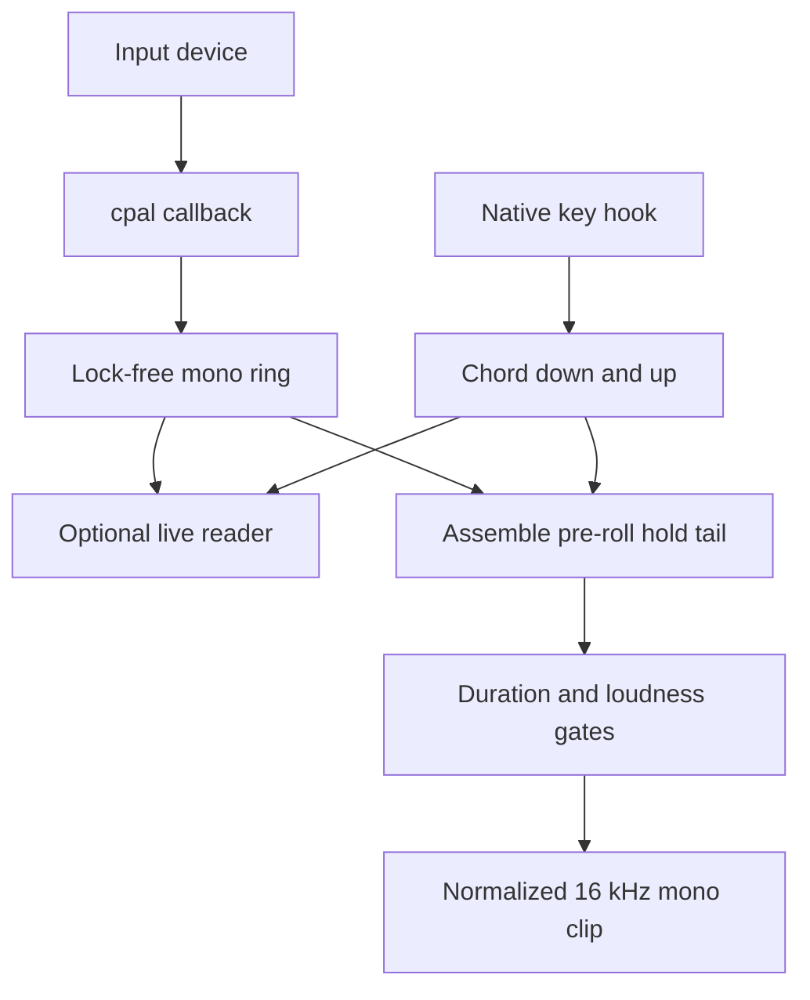

<!-- PAGE_ID: hark_06_audio_capture -->

Relevant source files

The following files were used as evidence for this page:

- [crates/hark-audio/src/lib.rs](../../crates/hark-audio/src/lib.rs)
- [crates/hark-audio/src/ring.rs](../../crates/hark-audio/src/ring.rs)
- [crates/hark-audio/src/window.rs](../../crates/hark-audio/src/window.rs)
- [crates/hark-audio/src/resample.rs](../../crates/hark-audio/src/resample.rs)
- [crates/hark-audio/src/capture_win.rs](../../crates/hark-audio/src/capture_win.rs)
- [crates/hark-hotkey/src/lib.rs](../../crates/hark-hotkey/src/lib.rs)
- [crates/hark-hotkey/src/edges.rs](../../crates/hark-hotkey/src/edges.rs)
- [crates/hark-hotkey/src/capture.rs](../../crates/hark-hotkey/src/capture.rs)
- [crates/hark-hotkey/src/hook_win.rs](../../crates/hark-hotkey/src/hook_win.rs)
- [crates/hark-hotkey/src/hook_linux.rs](../../crates/hark-hotkey/src/hook_linux.rs)
- [crates/hark-hotkey/src/keycode.rs](../../crates/hark-hotkey/src/keycode.rs)

# Audio Capture and Push-to-Talk

> **Related Pages**: [Architecture](../core/ARCHITECTURE.md), [Configuration and Secrets](../core/CONFIGURATION.md), [Transcription](TRANSCRIPTION.md)

---

<!-- BEGIN:AUTOGEN hark_06_audio_capture_overview -->
## Overview

`hark-audio` continuously captures device-rate `f32` input into a lock-free ring. `hark-hotkey` converts a configurable chord into down/up edges. On release, the pipeline assembles pre-roll, the held interval, and a short tail; gates obvious misfires and silence; normalizes and resamples the clip to 16 kHz mono; then sends it to STT ([audio/lib.rs:1-8](../../crates/hark-audio/src/lib.rs#L1-L8), [audio/lib.rs:79-159](../../crates/hark-audio/src/lib.rs#L79-L159)).

Gemini Live adds a second reader during the hold. It reads the same ring without consuming it, so finished-clip assembly remains authoritative for gates and batch fallback ([ring.rs:96-121](../../crates/hark-audio/src/ring.rs#L96-L121)).

```mermaid
graph TD
    Device["Input device"] --> Callback["cpal callback"]
    Callback --> Ring["Lock-free mono ring"]
    Hook["Native key hook"] --> Edges["Chord down and up"]
    Ring --> Stream["Optional live reader"]
    Ring --> Assemble["Assemble pre-roll hold tail"]
    Edges --> Stream
    Edges --> Assemble
    Assemble --> Gate["Duration and loudness gates"]
    Gate --> Clip["Normalized 16 kHz mono clip"]
```
<!-- END:AUTOGEN hark_06_audio_capture_overview -->

---

<!-- BEGIN:AUTOGEN hark_06_audio_capture_ring -->
## Ring Buffer and Pre-roll

The ring allocates all storage up front as atomic `f32` bit patterns plus an absolute sample counter. The callback performs no allocation, locking, or syscall: it writes samples and publishes the new counter once ([ring.rs:1-12](../../crates/hark-audio/src/ring.rs#L1-L12), [ring.rs:34-64](../../crates/hark-audio/src/ring.rs#L34-L64)).

Multi-channel devices contribute channel 0 rather than an average. Laptop microphone arrays often expose a quiet reference channel; averaging it with speech costs about 6 dB and can turn valid audio into a false silence gate ([ring.rs:66-93](../../crates/hark-audio/src/ring.rs#L66-L93), [capture_win.rs:369-388](../../crates/hark-audio/src/capture_win.rs#L369-L388)).

`Consumer::read_range` uses absolute indexes and rejects ranges that are not yet produced, already overwritten, or overwritten during the copy. Independent readers are safe because neither owns cursor state and each verifies the producer counter ([ring.rs:96-169](../../crates/hark-audio/src/ring.rs#L96-L169)).

Window size is `max_hold + pre-roll + tail + one second of slack`. A press near startup clamps pre-roll to the oldest available sample; an overlong hold keeps the most recent allowed audio ([window.rs:33-75](../../crates/hark-audio/src/window.rs#L33-L75)).
<!-- END:AUTOGEN hark_06_audio_capture_ring -->

---

<!-- BEGIN:AUTOGEN hark_06_audio_capture_device -->
## Device Capture and Resampling

Capture selects the requested input or the system input, requires an `f32` configuration at the device's default rate, and logs only diagnostic labels: device name, rate, and channel count. The callback pushes channel-0 mono samples and updates an advisory level meter ([capture_win.rs:332-405](../../crates/hark-audio/src/capture_win.rs#L332-L405)).

An `Xrun` is counted as a recovered discontinuity because cpal is already delivering packets again. Other stream errors set the fatal capture flag; treating unknown future error kinds as fatal avoids silently running against a stopped ring ([capture_win.rs:316-330](../../crates/hark-audio/src/capture_win.rs#L316-L330), [capture_win.rs:407-430](../../crates/hark-audio/src/capture_win.rs#L407-L430)).

`assemble_window` waits only for the configured tail plus one second. It then reads the device-rate window, gates it, resamples it to 16 kHz, and normalizes the actual provider buffer. A stalled producer becomes an explicit `StreamStalled` error rather than an unbounded wait ([audio/lib.rs:62-77](../../crates/hark-audio/src/lib.rs#L62-L77), [audio/lib.rs:87-159](../../crates/hark-audio/src/lib.rs#L87-L159)). The streaming path uses `StreamResampler`, whose chunked output is designed to match whole-clip resampling ([resample.rs:89-197](../../crates/hark-audio/src/resample.rs#L89-L197)).
<!-- END:AUTOGEN hark_06_audio_capture_device -->

---

<!-- BEGIN:AUTOGEN hark_06_audio_capture_hotkey -->
## Push-to-Talk Key Hooks

Windows uses a low-level keyboard hook; Linux reads evdev input. Both feed the same `PttChord` and `ChordTracker`, and both can temporarily switch into shortcut-recording mode so Settings uses real key edges rather than asking users to type names ([hotkey/lib.rs:229-285](../../crates/hark-hotkey/src/lib.rs#L229-L285), [edges.rs:20-142](../../crates/hark-hotkey/src/edges.rs#L20-L142)). macOS capture remains unsupported until a CGEventTap implementation exists.

Injected events are always ignored, so Hark's own synthesized paste cannot re-trigger push-to-talk. The tracker verifies other chord members against physical state before engagement, preventing a missed release from silently turning a multi-key chord into a one-key chord ([edges.rs:295-369](../../crates/hark-hotkey/src/edges.rs#L295-L369)).

Optional Caps Lock or Scroll Lock suppression is narrowly constrained and Windows-only. It swallows key-down only, requires a multi-key chord with exactly one suppressible lock and no Alt/Win menu modifier, and never swallows injected input. Linux leaves the setting inert because grabbing one evdev key would require grabbing the whole device ([edges.rs:183-210](../../crates/hark-hotkey/src/edges.rs#L183-L210), [edges.rs:264-285](../../crates/hark-hotkey/src/edges.rs#L264-L285), [hotkey/lib.rs:236-264](../../crates/hark-hotkey/src/lib.rs#L236-L264)).
<!-- END:AUTOGEN hark_06_audio_capture_hotkey -->

---

<!-- BEGIN:AUTOGEN hark_06_audio_capture_edges -->
## Chord Edge Detection

`ChordTracker` emits `Down` once when every configured member is held and `Up` when the first member is released. Duplicate downs, repeats, and stray releases do not create extra dictations ([edges.rs:222-369](../../crates/hark-hotkey/src/edges.rs#L222-L369)).

Two recovery signals cover hook interference:

- `UpMissed` is synthesized when periodic physical-state reconciliation finds the chord released even though no release callback arrived. The pipeline abandons an overlong unknown-release recording instead of injecting room audio.
- `Intercepted(key)` is emitted once when auto-repeat proves a key is held but the OS says it is up, evidence that another hook swallowed the press. The chord keeps working, while the UI surfaces an advisory warning ([edges.rs:161-180](../../crates/hark-hotkey/src/edges.rs#L161-L180), [edges.rs:372-460](../../crates/hark-hotkey/src/edges.rs#L372-L460)).

Fresh hook evidence outranks a contradictory key-state read for 1.5 seconds, long enough to cover the slowest configured keyboard repeat delay without turning interception into false releases ([edges.rs:213-220](../../crates/hark-hotkey/src/edges.rs#L213-L220)).
<!-- END:AUTOGEN hark_06_audio_capture_edges -->

---

<!-- BEGIN:AUTOGEN hark_06_audio_capture_notes -->
## Operational Notes

- Defaults are 300 ms pre-roll, 150 ms tail, 120-second maximum hold, 250 ms minimum speech, and a 0.01 absolute RMS threshold ([window.rs:16-25](../../crates/hark-audio/src/window.rs#L16-L25)).
- The loudness gate looks at the loudest 100 ms window, not whole-clip mean RMS. A second relative path accepts speech at least 4x above the clip's noise floor, with a dead-microphone floor, so quiet but distinct speech is not silently dropped ([window.rs:89-205](../../crates/hark-audio/src/window.rs#L89-L205)).
- Too-short and too-quiet clips make no provider request. The UI treats a tap as idle and a quiet clip as a microphone hint, not a red failure.
- Logs may include device labels, rates, channel counts, sample counts, loudness measurements, and discontinuity counts. `AudioClip` has a custom `Debug` implementation that never prints samples ([audio/lib.rs:28-59](../../crates/hark-audio/src/lib.rs#L28-L59)).
- Real-device behavior, Windows hook suppression, Linux evdev permissions, and stream recovery still require hardware/platform testing; pure ring, window, resampling, and edge semantics are unit-testable anywhere.
<!-- END:AUTOGEN hark_06_audio_capture_notes -->

---
