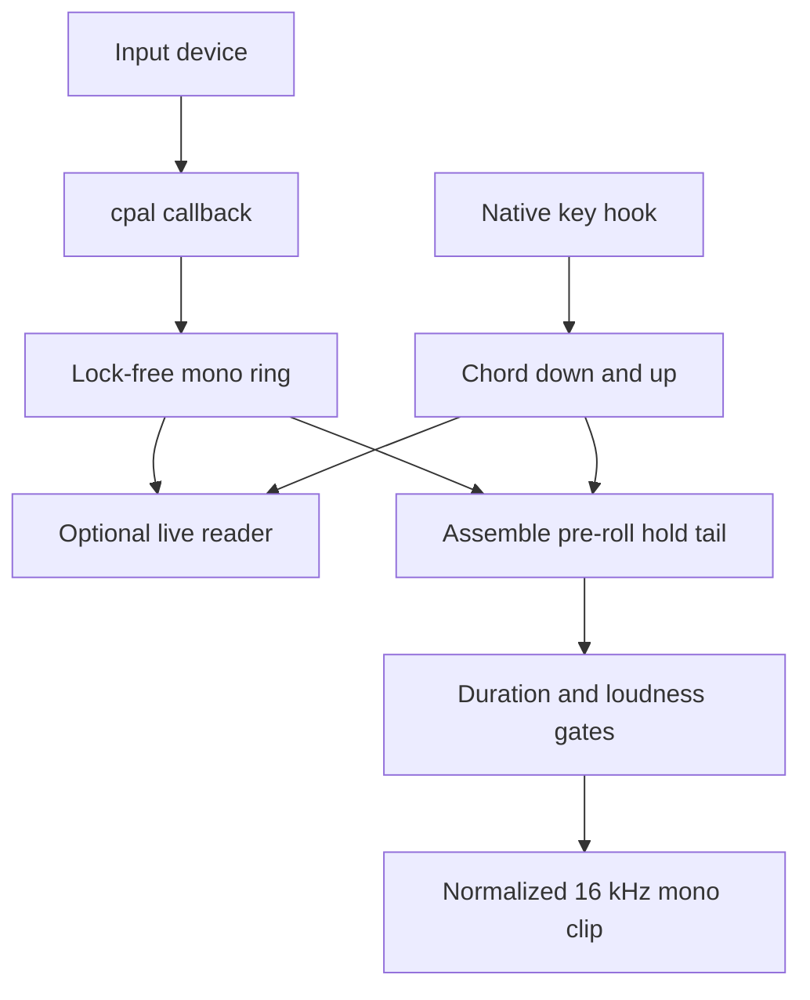

<!-- PAGE_ID: hark_06_audio_capture -->

Relevant source files

The following files were used as evidence for this page:

- [crates/hark-audio/src/lib.rs](../../crates/hark-audio/src/lib.rs)
- [crates/hark-audio/src/ring.rs](../../crates/hark-audio/src/ring.rs)
- [crates/hark-audio/src/window.rs](../../crates/hark-audio/src/window.rs)
- [crates/hark-audio/src/resample.rs](../../crates/hark-audio/src/resample.rs)
- [crates/hark-audio/src/capture_win.rs](../../crates/hark-audio/src/capture_win.rs)
- [crates/hark-audio/src/loopback_win.rs](../../crates/hark-audio/src/loopback_win.rs)
- [crates/hark-audio/src/spool.rs](../../crates/hark-audio/src/spool.rs)
- [crates/hark-audio/src/stereo.rs](../../crates/hark-audio/src/stereo.rs)
- [crates/hark-audio/src/mp3.rs](../../crates/hark-audio/src/mp3.rs)
- [crates/hark-hotkey/src/lib.rs](../../crates/hark-hotkey/src/lib.rs)
- [crates/hark-hotkey/src/edges.rs](../../crates/hark-hotkey/src/edges.rs)
- [crates/hark-hotkey/src/capture.rs](../../crates/hark-hotkey/src/capture.rs)
- [crates/hark-hotkey/src/hook_win.rs](../../crates/hark-hotkey/src/hook_win.rs)
- [crates/hark-hotkey/src/hook_linux.rs](../../crates/hark-hotkey/src/hook_linux.rs)
- [crates/hark-hotkey/src/keycode.rs](../../crates/hark-hotkey/src/keycode.rs)

# Audio Capture and Push-to-Talk

> **Related Pages**: [Architecture](../core/ARCHITECTURE.md), [Configuration and Secrets](../core/CONFIGURATION.md), [Transcription](TRANSCRIPTION.md), [Meetings](MEETINGS.md)

---

<!-- BEGIN:AUTOGEN hark_06_audio_capture_overview -->
## Overview

`hark-audio` continuously captures device-rate `f32` input into a lock-free ring. `hark-hotkey` converts a configurable chord into down/up edges. On release, the pipeline assembles pre-roll, the held interval, and a short tail; gates obvious misfires and silence; normalizes and resamples the clip to 16 kHz mono; then sends it to STT ([audio/lib.rs:1-16](../../crates/hark-audio/src/lib.rs#L1-L16), [audio/lib.rs:96-176](../../crates/hark-audio/src/lib.rs#L96-L176)).

Gemini Live adds a second reader during the hold. It reads the same ring without consuming it, so finished-clip assembly remains authoritative for gates and batch fallback ([ring.rs:96-121](../../crates/hark-audio/src/ring.rs#L96-L121)).

```mermaid
graph TD
    Device["Input device"] --> Callback["cpal callback"]
    Callback --> Ring["Lock-free mono ring"]
    Hook["Native key hook"] --> Edges["Chord down and up"]
    Ring --> Stream["Optional live reader"]
    Ring --> Assemble["Assemble pre-roll hold tail"]
    Edges --> Stream
    Edges --> Assemble
    Assemble --> Gate["Duration and loudness gates"]
    Gate --> Clip["Normalized 16 kHz mono clip"]
```
<!-- END:AUTOGEN hark_06_audio_capture_overview -->

---

<!-- BEGIN:AUTOGEN hark_06_audio_capture_ring -->
## Ring Buffer and Pre-roll

The ring allocates all storage up front as atomic `f32` bit patterns plus an absolute sample counter. The callback performs no allocation, locking, or syscall: it writes samples and publishes the new counter once ([ring.rs:1-12](../../crates/hark-audio/src/ring.rs#L1-L12), [ring.rs:34-64](../../crates/hark-audio/src/ring.rs#L34-L64)).

Multi-channel devices contribute channel 0 rather than an average. Laptop microphone arrays often expose a quiet reference channel; averaging it with speech costs about 6 dB and can turn valid audio into a false silence gate ([ring.rs:66-93](../../crates/hark-audio/src/ring.rs#L66-L93), [capture_win.rs:369-388](../../crates/hark-audio/src/capture_win.rs#L369-L388)).

`Consumer::read_range` uses absolute indexes and rejects ranges that are not yet produced, already overwritten, or overwritten during the copy. Independent readers are safe because neither owns cursor state and each verifies the producer counter ([ring.rs:96-169](../../crates/hark-audio/src/ring.rs#L96-L169)).

Window size is `max_hold + pre-roll + tail + one second of slack`. A press near startup clamps pre-roll to the oldest available sample; an overlong hold keeps the most recent allowed audio ([window.rs:33-75](../../crates/hark-audio/src/window.rs#L33-L75)).
<!-- END:AUTOGEN hark_06_audio_capture_ring -->

---

<!-- BEGIN:AUTOGEN hark_06_audio_capture_device -->
## Device Capture and Resampling

Capture selects the requested input or the system input, requires an `f32` configuration at the device's default rate, and logs only diagnostic labels: device name, rate, and channel count. The callback pushes channel-0 mono samples and updates an advisory level meter ([capture_win.rs:332-405](../../crates/hark-audio/src/capture_win.rs#L332-L405)).

An `Xrun` is counted as a recovered discontinuity because cpal is already delivering packets again. Other stream errors set the fatal capture flag; treating unknown future error kinds as fatal avoids silently running against a stopped ring ([capture_win.rs:316-330](../../crates/hark-audio/src/capture_win.rs#L316-L330), [capture_win.rs:407-430](../../crates/hark-audio/src/capture_win.rs#L407-L430)).

`assemble_window` waits only for the configured tail plus one second. It then reads the device-rate window, gates it, resamples it to 16 kHz, and normalizes the actual provider buffer. A stalled producer becomes an explicit `StreamStalled` error rather than an unbounded wait ([audio/lib.rs:69-84](../../crates/hark-audio/src/lib.rs#L69-L84), [audio/lib.rs:94-166](../../crates/hark-audio/src/lib.rs#L94-L166)). The streaming path uses `StreamResampler`, whose chunked output is designed to match whole-clip resampling ([resample.rs:89-197](../../crates/hark-audio/src/resample.rs#L89-L197)).
<!-- END:AUTOGEN hark_06_audio_capture_device -->

---

<!-- BEGIN:AUTOGEN hark_06_audio_capture_hotkey -->
## Push-to-Talk Key Hooks

The Windows hook owns a boxed shared shortcut tracker, allocated once before hook installation. Key callbacks borrow it; the larger dual-chord state does not enlarge every hook-state variant or introduce callback allocations.

Windows uses a low-level keyboard hook; Linux reads evdev input. Both feed the same `PttChord` and `ChordTracker`, and both can temporarily switch into shortcut-recording mode so Settings uses real key edges rather than asking users to type names ([hotkey/lib.rs](../../crates/hark-hotkey/src/lib.rs), [edges.rs](../../crates/hark-hotkey/src/edges.rs)). macOS uses a CGEventTap worker with the same chord tracker, shortcut recorder, and meeting toggle route. Input Monitoring access is required.

Injected events are always ignored, so Hark's own synthesized paste cannot re-trigger push-to-talk. The tracker verifies other chord members against physical state before engagement, preventing a missed release from silently turning a multi-key chord into a one-key chord ([edges.rs](../../crates/hark-hotkey/src/edges.rs)).

Optional Caps Lock or Scroll Lock suppression is narrowly constrained and Windows-only. It swallows key-down only, requires a multi-key chord with exactly one suppressible lock and no Alt/Win menu modifier, and never swallows injected input. Linux leaves the setting inert because grabbing one evdev key would require grabbing the whole device ([edges.rs](../../crates/hark-hotkey/src/edges.rs), [edges.rs](../../crates/hark-hotkey/src/edges.rs), [hotkey/lib.rs](../../crates/hark-hotkey/src/lib.rs)).
The desktop app uses `spawn_shared_listener` to share one native hook between dictation and the optional meeting toggle — the Windows low-level hook, the Linux evdev loop, and the macOS CGEventTap alike. The pure `ShortcutTracker` holds two existing chord trackers: it preserves all dictation edges and emits a meeting event only for a physical `Down` edge. Injected events and repeats remain filtered; release recovery never creates a toggle. The watchdog stays armed while either chord is engaged. Shortcut recording bypasses both trackers. Meeting keys are always observed, and dictation lock-key suppression is disabled when no dictation worker exists ([router and fixtures](../../crates/hark-hotkey/src/shortcuts.rs), [Windows hook](../../crates/hark-hotkey/src/hook_win.rs), [Linux hook](../../crates/hark-hotkey/src/hook_linux.rs), [app ownership](../../crates/hark-app/src/pipeline.rs)).

Linux routes the same shared listener through its evdev loop, and macOS through CGEventTap ([platform dispatch](../../crates/hark-hotkey/src/lib.rs)).
<!-- END:AUTOGEN hark_06_audio_capture_hotkey -->

---

<!-- BEGIN:AUTOGEN hark_06_audio_capture_edges -->
## Chord Edge Detection

`ChordTracker` emits `Down` once when every configured member is held and `Up` when the first member is released. Duplicate downs, repeats, and stray releases do not create extra dictations ([edges.rs](../../crates/hark-hotkey/src/edges.rs)).

Two recovery signals cover hook interference:

- `UpMissed` is synthesized when periodic physical-state reconciliation finds the chord released even though no release callback arrived. The pipeline abandons an overlong unknown-release recording instead of injecting room audio.
- `Intercepted(key)` is emitted once when auto-repeat proves a key is held but the OS says it is up, evidence that another hook swallowed the press. The chord keeps working, while the UI surfaces an advisory warning ([edges.rs](../../crates/hark-hotkey/src/edges.rs), [edges.rs](../../crates/hark-hotkey/src/edges.rs)).

Fresh hook evidence outranks a contradictory key-state read for 1.5 seconds, long enough to cover the slowest configured keyboard repeat delay without turning interception into false releases ([edges.rs](../../crates/hark-hotkey/src/edges.rs)).
<!-- END:AUTOGEN hark_06_audio_capture_edges -->

---

<!-- BEGIN:AUTOGEN hark_06_audio_capture_meeting -->
## Meeting Capture

Meeting mode records two channels for the length of a call, beside push-to-talk's own microphone stream and ring, and is reachable from the tray and the Meetings page (see [Meetings](MEETINGS.md)). This section covers only the capture and encoding layer in `hark-audio`; the session logic that drives it lives in `hark-meeting` and `hark-pipeline::meeting`.

- **Them (system audio):** on Windows, per-process loopback captures one process tree's audio on whichever endpoint it renders to: the meeting app's tree for a detected meeting, or everything except Hark for a manual start. Endpoint loopback of the default device would miss a meeting app that renders to the communications device, and it delivers no packets while nothing plays. Windows converts the stream to 16 kHz mono i16 and delivers packets continuously, so this channel needs no resampling and no gap padding. It runs on its own thread that owns its COM apartment, and macOS uses a Core Audio process-tap backend delivering the tap device's rate ([loopback/win.rs](../../crates/hark-audio/src/loopback/win.rs), [core_audio_mac.rs](../../crates/hark-audio/src/core_audio_mac.rs)).
- **Activation gotcha:** the activation parameters travel in a `VT_BLOB` `PROPVARIANT` that points at stack memory. In windows-rs 0.62 `PROPVARIANT`'s `Drop` frees that blob and kills the process silently, so it is held in `ManuallyDrop` ([loopback/win.rs](../../crates/hark-audio/src/loopback/win.rs)).
- **Them on Linux:** one dedicated thread owns the whole `pipewire-rs` stack. A manual start captures the monitor of the default sink (Hark renders no audio, so that is everything but Hark; the sink's name comes from the `default.audio.sink` metadata, and a mid-meeting default change rebuilds the substream, counting one discontinuity). A detected app's meeting captures that process tree's PipeWire output stream nodes directly — a plain capture with `target.object` set to the stream node's serial taps exactly that stream — attaching nodes that appear mid-meeting and falling back to the whole default sink when the tree has no stream. PipeWire's audioconvert adapter delivers 16 kHz mono f32 continuously, including through silence, so the timeline stays the sample count ([loopback/linux.rs](../../crates/hark-audio/src/loopback/linux.rs)). The facade dispatches all three backends from one seam ([loopback/mod.rs](../../crates/hark-audio/src/loopback/mod.rs)).
- **Spool:** each channel appends to `<data_dir>/meetings/<id>/{me,them}.wav` (16 kHz mono i16). The header's size fields are patched on close. At startup, `recover_all` patches the header of any spool a crash left open and leaves anything not in the spool's exact format untouched ([spool.rs:1-10](../../crates/hark-audio/src/spool.rs#L1-L10), [spool.rs:79-176](../../crates/hark-audio/src/spool.rs#L79-L176), [spool.rs:210-269](../../crates/hark-audio/src/spool.rs#L210-L269)).
- **Stereo reader:** `stereo::stereo_wav_reader` streams the two mono spools as one 16 kHz stereo WAV (L = me, R = them) without ever materializing the merged file, chunk by chunk, padding a missing or shorter channel with silence so the two channels stay time-aligned for the Deepgram multichannel final pass ([Transcription](TRANSCRIPTION.md#deepgram-and-gemini-live)). An hour of 16-bit stereo at 16 kHz is ~230 MB, too much to hold in memory for one upload ([stereo.rs:1-8](../../crates/hark-audio/src/stereo.rs#L1-L8), [stereo.rs:34-64](../../crates/hark-audio/src/stereo.rs#L34-L64)).
- **MP3 archive and export:** `mp3.rs` compresses a finished meeting's two WAV spools into one stereo 64 kbps `audio.mp3` (D9), and separately renders a mono 40 kbps MP3 or 16 kHz WAV mixdown for the Share menu's audio export (D8). Both go through `mp3lame-encoder` (LAME, LGPL — see [Release and Packaging](../operations/RELEASE_AND_PACKAGING.md#signing-and-secrets)) and decode back with `symphonia` (pure Rust) to verify a compression before deleting the WAVs. The archive uses LAME `Mode::Stereo`, never `JointStereo`: joint stereo leaks about -96 dBFS between channels, which would corrupt a Me/Them re-run through Deepgram ([mp3.rs](../../crates/hark-audio/src/mp3.rs), [mp3.rs](../../crates/hark-audio/src/mp3.rs)). `recover_meeting_dir` runs at startup before any of this is trusted: it removes an interrupted `audio.mp3.tmp`, and discards a corrupt archive from an interrupted run while keeping the WAVs so compression can retry ([mp3.rs](../../crates/hark-audio/src/mp3.rs)). Standalone MP3 files use the final flush that encodes buffered ending audio, then require a LAME timing tag. Mono exports use 40 kbps because a 32 kbps frame cannot fit that tag at 16 kHz; this preserves exact decoded duration, including very short excerpts. Existing archives are not rewritten and previously omitted endings cannot be restored.
- Loopback, spool, stereo, and MP3 encode/decode are verified by hand on a real session with `cargo run -p hark-audio --example loopback_smoke`; `cargo test` never opens an audio device but does exercise the pure spool/stereo/MP3 code against synthetic tones in a temp directory. On Linux the smoke runs unchanged (a private `PIPEWIRE_RUNTIME_DIR` stack with a null sink is enough; see `packaging/LINUX.md`).
Audio excerpts decode the saved archive or read the original spools, select exact 16 kHz PCM frames across chunk boundaries, and then write a mono WAV or re-encode mono MP3. Selection rejects empty/reversed/overflowing ranges and preserves an existing destination on failure. The returned frame count lets the matching text stop at the actual audio end, including MP3 trimming. The Gemini final-pass worker uses the same reader for independent track windows. `stereo_chunks` also exposes saved audio in chunks of at most 4096 frames per channel; archives with an incompatible sample rate or channel count are rejected ([selection and fixtures](../../crates/hark-audio/src/mp3/excerpt.rs), [decoder](../../crates/hark-audio/src/mp3.rs)).

When **Reduce speaker echo** is enabled for a meeting, `MeetingAec` runs Rust
`aec3 = 0.4.0` on its worker before microphone spool/chunking. It accepts paired
16 kHz mono render/microphone frames of exactly 160 samples, checks finite input
and output, and leaves the caller's output unchanged on an error. Render is
analyzed first. High-pass filtering is on; noise suppression, gain control, and
the extra post-filter are off. The graph is worker-owned and may allocate; it
must never run in the cpal callback ([wrapper and tests](../../crates/hark-audio/src/meeting_aec.rs)).

The pinned pipeline has 128 samples (8 ms) of processing latency, separate from
acoustic echo delay. The recorder removes the leading delayed output on startup
and reset, keeping a 128-sample original-microphone guard until corresponding
processed output arrives. This guard is separate from the 250 ms reference-pairing
wait. Stop or fallback writes the original guard before any pending microphone
audio, including the incomplete final frame. Track-close decisions are captured
once per drain so an error arriving during processing cannot bypass resampler
and AEC tail flushing ([wrapper and latency fixtures](../../crates/hark-audio/src/meeting_aec.rs),
[echo pairing](../../crates/hark-pipeline/src/meeting/echo.rs),
[recorder](../../crates/hark-pipeline/src/meeting/recorder.rs)).

See [Meetings](MEETINGS.md#reduce-speaker-echo) for the complete reset and bypass
policy. Them and dictation keep their existing audio paths. The setting defaults
off and applies next meeting.
<!-- END:AUTOGEN hark_06_audio_capture_meeting -->

---

<!-- BEGIN:AUTOGEN hark_06_audio_capture_notes -->
## Operational Notes

- Defaults are 300 ms pre-roll, 150 ms tail, 120-second maximum hold, 250 ms minimum speech, and a 0.01 absolute RMS threshold ([window.rs:16-25](../../crates/hark-audio/src/window.rs#L16-L25)).
- The loudness gate looks at the loudest 100 ms window, not whole-clip mean RMS. A second relative path accepts speech at least 4x above the clip's noise floor, with a dead-microphone floor, so quiet but distinct speech is not silently dropped ([window.rs:89-205](../../crates/hark-audio/src/window.rs#L89-L205)).
- Too-short and too-quiet clips make no provider request. The UI treats a tap as idle and a quiet clip as a microphone hint, not a red failure.
- Logs may include device labels, rates, channel counts, sample counts, loudness measurements, and discontinuity counts. `AudioClip` has a custom `Debug` implementation that never prints samples ([audio/lib.rs:45-77](../../crates/hark-audio/src/lib.rs#L45-L77)).
- Real-device behavior, Windows hook suppression, Linux evdev permissions, and stream recovery still require hardware/platform testing; pure ring, window, resampling, and edge semantics are unit-testable anywhere.
<!-- END:AUTOGEN hark_06_audio_capture_notes -->

---

## Echo-cancellation evidence and limits

The [standalone comparison](../../tools/meeting-aec-bakeoff/README.md) retains its
own workspace and lockfile for comparing Rust AEC3 and C++ WebRTC. Its historical
[results](../../tools/meeting-aec-bakeoff/RESULTS.md) cover synthetic attenuation,
near-source signal metrics, and processing time. Rust AEC3 was selected for the
optional production path; the C++ alternative remains confined to the experiment.

Production uses the existing first-delivery timeline estimate and the engine's
automatic delay estimation. It does not pair hardware timestamps or correct
device-clock drift. Bounded queues and discontinuity recovery protect the
recording path, but synthetic fixtures do not establish real-speaker
intelligibility or hour-long stability. Per-process loopback may also omit other
audible apps, leaving that audio without a cancellation reference.

## macOS native capture

CGEventTap provides keyboard and modifier transitions on a dedicated run loop, including shortcut recording and meeting toggles. Physical-state reconciliation recovers missing releases and disabled taps; synthetic injection is filtered. Mac labels use Command and Option while stored Win/Alt key tokens remain portable. Caps Lock is a toggle notification rather than a reliable held key and is rejected, along with keys absent from the native map.

Core Audio process taps capture meeting/system audio on macOS 14.2+. Native stream rate is carried into the meeting resampler; the shared 16 kHz processing, spooling and AEC paths remain unchanged. Real capture, device switching, silence alignment and permission denial require hardware smoke testing.
