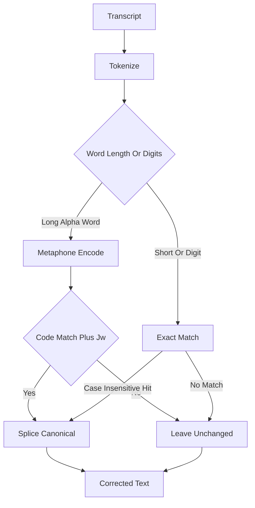

<!-- PAGE_ID: hark_08_dictionary -->
<details>
<summary>Relevant source files</summary>

The following files were used as evidence for this page:

- [crates/hark-dictionary/src/lib.rs:1-99](https://github.com/BoardPandas/Hark/blob/1c1738716fa4cd758b0c26ec94d0873d1bc35ac1/crates/hark-dictionary/src/lib.rs#L1-L99)
- [crates/hark-dictionary/src/matcher.rs:1-133](https://github.com/BoardPandas/Hark/blob/1c1738716fa4cd758b0c26ec94d0873d1bc35ac1/crates/hark-dictionary/src/matcher.rs#L1-L133)
- [crates/hark-dictionary/src/tokenize.rs:1-52](https://github.com/BoardPandas/Hark/blob/1c1738716fa4cd758b0c26ec94d0873d1bc35ac1/crates/hark-dictionary/src/tokenize.rs#L1-L52)
- [crates/hark-config/src/lib.rs:214-221](https://github.com/BoardPandas/Hark/blob/1c1738716fa4cd758b0c26ec94d0873d1bc35ac1/crates/hark-config/src/lib.rs#L214-L221)
- [crates/hark-config/src/lib.rs:517-524](https://github.com/BoardPandas/Hark/blob/1c1738716fa4cd758b0c26ec94d0873d1bc35ac1/crates/hark-config/src/lib.rs#L517-L524)
- [crates/hark-config/src/lib.rs:767-776](https://github.com/BoardPandas/Hark/blob/1c1738716fa4cd758b0c26ec94d0873d1bc35ac1/crates/hark-config/src/lib.rs#L767-L776)
- [crates/hark-pipeline/src/lib.rs:80-103](https://github.com/BoardPandas/Hark/blob/1c1738716fa4cd758b0c26ec94d0873d1bc35ac1/crates/hark-pipeline/src/lib.rs#L80-L103)
- [crates/hark-pipeline/src/lib.rs:155-166](https://github.com/BoardPandas/Hark/blob/1c1738716fa4cd758b0c26ec94d0873d1bc35ac1/crates/hark-pipeline/src/lib.rs#L155-L166)
- [crates/hark-stt/src/config.rs:11-28](https://github.com/BoardPandas/Hark/blob/1c1738716fa4cd758b0c26ec94d0873d1bc35ac1/crates/hark-stt/src/config.rs#L11-L28)
- [crates/hark-stt/src/deepgram.rs:29-47](https://github.com/BoardPandas/Hark/blob/1c1738716fa4cd758b0c26ec94d0873d1bc35ac1/crates/hark-stt/src/deepgram.rs#L29-L47)
- [crates/hark-stt/src/openai_compatible.rs:52-80](https://github.com/BoardPandas/Hark/blob/1c1738716fa4cd758b0c26ec94d0873d1bc35ac1/crates/hark-stt/src/openai_compatible.rs#L52-L80)

</details>

# Dictionary

> **Related Pages**: [Transcription](TRANSCRIPTION.md), [Voice Cleanup](VOICE_CLEANUP.md), [Configuration and Secrets](../core/CONFIGURATION.md)

---

<!-- BEGIN:AUTOGEN hark_08_dictionary_overview -->
## Overview

Hark's dictionary is one list of canonical terms (names, product words, jargon) that plays two roles in the pipeline: it corrects the transcript text after STT returns it, and it seeds the biasing hints sent to the STT provider before the request is made.

The `hark-dictionary` crate itself implements only the first role. It is pure text processing with no I/O, designed to run inside the release-to-inject latency budget on a pipeline worker thread, targeting well under 10 ms for a 100-word utterance against a 200-term dictionary ([lib.rs:1-7](https://github.com/BoardPandas/Hark/blob/1c1738716fa4cd758b0c26ec94d0873d1bc35ac1/crates/hark-dictionary/src/lib.rs#L1-L7)). It finds transcript spans that *sound like* a dictionary term but are spelled wrong, using Double Metaphone code equality confirmed by a Jaro-Winkler score, and splices in the canonical spelling ([lib.rs:9-11](https://github.com/BoardPandas/Hark/blob/1c1738716fa4cd758b0c26ec94d0873d1bc35ac1/crates/hark-dictionary/src/lib.rs#L9-L11)). The second role, generating provider biasing terms, is not implemented in this crate: it is downstream wiring that feeds the same canonical term list (`Settings.dictionary.terms`, defined in `hark-config`) into the `hark-stt` adapters as an OpenAI/Groq `prompt` string or repeated Deepgram `keyterm` parameters (see [Provider Biasing](#provider-biasing) below).



Sources: [lib.rs:1-11](https://github.com/BoardPandas/Hark/blob/1c1738716fa4cd758b0c26ec94d0873d1bc35ac1/crates/hark-dictionary/src/lib.rs#L1-L11)
<!-- END:AUTOGEN hark_08_dictionary_overview -->

---

<!-- BEGIN:AUTOGEN hark_08_dictionary_matcher -->
## Phonetic Matcher

Each word of a configured term is precomputed once, at `Corrector` construction, into one of two matching paths so the hot-path `correct()` call never re-derives them.

| Path | When chosen | Match rule |
|---|---|---|
| Exact-only | Word has `< 4` chars or contains a non-alphabetic character (digits included) ([matcher.rs:87](https://github.com/BoardPandas/Hark/blob/1c1738716fa4cd758b0c26ec94d0873d1bc35ac1/crates/hark-dictionary/src/matcher.rs#L87)) | Case-insensitive spelling equality only |
| Phonetic | Word is `>= 4` alphabetic chars and encodes to a non-empty Double Metaphone code ([matcher.rs:88-95](https://github.com/BoardPandas/Hark/blob/1c1738716fa4cd758b0c26ec94d0873d1bc35ac1/crates/hark-dictionary/src/matcher.rs#L88-L95)) | Double Metaphone primary/alternate code equality on either side, confirmed by Jaro-Winkler `>= 0.85` ([matcher.rs:14-17](https://github.com/BoardPandas/Hark/blob/1c1738716fa4cd758b0c26ec94d0873d1bc35ac1/crates/hark-dictionary/src/matcher.rs#L14-L17)) |

The threshold is a "research-informed guess, tuned at the CP6 interactive gate" and is documented as a candidate for promotion to config only if real usage demands it ([matcher.rs:14-17](https://github.com/BoardPandas/Hark/blob/1c1738716fa4cd758b0c26ec94d0873d1bc35ac1/crates/hark-dictionary/src/matcher.rs#L14-L17)). Code comparison checks all four combinations of primary/alternate on both sides, and an empty code (unencodable input) never matches anything ([matcher.rs:122-132](https://github.com/BoardPandas/Hark/blob/1c1738716fa4cd758b0c26ec94d0873d1bc35ac1/crates/hark-dictionary/src/matcher.rs#L122-L132)):

```rust
fn codes_intersect(a: &Codes, b: &Codes) -> bool {
    let pairs = [
        (&a.primary, &b.primary),
        (&a.primary, &b.alternate),
        (&a.alternate, &b.primary),
        (&a.alternate, &b.alternate),
    ];
    pairs.iter().any(|(x, y)| !x.is_empty() && x == y)
}
```

Multi-word terms are precomputed at construction and sorted longest-word-count-first, then longest-character-length first, so that overlapping terms resolve in favor of the longer match; matching consumes tokens in that order ([matcher.rs:54-84](https://github.com/BoardPandas/Hark/blob/1c1738716fa4cd758b0c26ec94d0873d1bc35ac1/crates/hark-dictionary/src/matcher.rs#L54-L84)). Equal spellings match on either path without needing the Jaro-Winkler confirmation at all ([matcher.rs:110-120](https://github.com/BoardPandas/Hark/blob/1c1738716fa4cd758b0c26ec94d0873d1bc35ac1/crates/hark-dictionary/src/matcher.rs#L110-L120)).

Sources: [matcher.rs:14-17](https://github.com/BoardPandas/Hark/blob/1c1738716fa4cd758b0c26ec94d0873d1bc35ac1/crates/hark-dictionary/src/matcher.rs#L14-L17), [matcher.rs:54-97](https://github.com/BoardPandas/Hark/blob/1c1738716fa4cd758b0c26ec94d0873d1bc35ac1/crates/hark-dictionary/src/matcher.rs#L54-L97), [matcher.rs:110-132](https://github.com/BoardPandas/Hark/blob/1c1738716fa4cd758b0c26ec94d0873d1bc35ac1/crates/hark-dictionary/src/matcher.rs#L110-L132)
<!-- END:AUTOGEN hark_08_dictionary_matcher -->

---

<!-- BEGIN:AUTOGEN hark_08_dictionary_tokenize -->
## Tokenization

A token is the comparable core of a transcript word: its byte span in the original text plus a lowercased copy for comparison. Leading and trailing punctuation is never part of the span, so replacement never needs a reattachment step ([tokenize.rs:1-7](https://github.com/BoardPandas/Hark/blob/1c1738716fa4cd758b0c26ec94d0873d1bc35ac1/crates/hark-dictionary/src/tokenize.rs#L1-L7)).

`tokenize` splits on whitespace, then splits each chunk again on interior hyphens, so a hyphen-split dictionary term like `"hark-stt"` matches both `"hark stt"` and `"hark-stt"` with one window size ([tokenize.rs:28-51](https://github.com/BoardPandas/Hark/blob/1c1738716fa4cd758b0c26ec94d0873d1bc35ac1/crates/hark-dictionary/src/tokenize.rs#L28-L51)):

```rust
pub(crate) fn tokenize(text: &str) -> Vec<Token> {
    let mut tokens = Vec::new();
    for chunk in text.split_whitespace() {
        for segment in chunk.split('-') {
            // Trim non-alphanumeric edges; what remains is the core.
            let Some(first) = segment.find(|c: char| c.is_alphanumeric()) else {
                continue; // all punctuation (or empty between hyphens)
            };
            ...
        }
    }
    tokens
}
```

| Input | Tokens produced | Behavior |
|---|---|---|
| `"modero, then"` | `["modero", "then"]` | Trailing comma stays outside the span ([tokenize.rs:73-78](https://github.com/BoardPandas/Hark/blob/1c1738716fa4cd758b0c26ec94d0873d1bc35ac1/crates/hark-dictionary/src/tokenize.rs#L73-L78)) |
| `"run hark-stt now"` | `["run", "hark", "stt", "now"]` | Interior hyphen splits into two tokens, positions preserved ([tokenize.rs:94-100](https://github.com/BoardPandas/Hark/blob/1c1738716fa4cd758b0c26ec94d0873d1bc35ac1/crates/hark-dictionary/src/tokenize.rs#L94-L100)) |
| `"don't stop"` | `["don't", "stop"]` | Interior apostrophe stays in the core ([tokenize.rs:88-91](https://github.com/BoardPandas/Hark/blob/1c1738716fa4cd758b0c26ec94d0873d1bc35ac1/crates/hark-dictionary/src/tokenize.rs#L88-L91)) |
| `"müller café."` | `["müller", "café"]` | Unicode words survive with correct spans ([tokenize.rs:109-114](https://github.com/BoardPandas/Hark/blob/1c1738716fa4cd758b0c26ec94d0873d1bc35ac1/crates/hark-dictionary/src/tokenize.rs#L109-L114)) |
| `"... -- !?"` | `[]` | All-punctuation input yields no tokens ([tokenize.rs:126-130](https://github.com/BoardPandas/Hark/blob/1c1738716fa4cd758b0c26ec94d0873d1bc35ac1/crates/hark-dictionary/src/tokenize.rs#L126-L130)) |

Sources: [tokenize.rs:1-52](https://github.com/BoardPandas/Hark/blob/1c1738716fa4cd758b0c26ec94d0873d1bc35ac1/crates/hark-dictionary/src/tokenize.rs#L1-L52), [tokenize.rs:73-130](https://github.com/BoardPandas/Hark/blob/1c1738716fa4cd758b0c26ec94d0873d1bc35ac1/crates/hark-dictionary/src/tokenize.rs#L73-L130)
<!-- END:AUTOGEN hark_08_dictionary_tokenize -->

---

<!-- BEGIN:AUTOGEN hark_08_dictionary_biasing -->
## Provider Biasing

The `hark-dictionary` crate does not generate biasing strings itself; `Corrector` is a pure text corrector with no knowledge of STT providers. The single canonical term list lives on `Settings.dictionary.terms` in `hark-config`, and both the corrector and the biasing path read from it independently, so the two roles described in [Overview](#overview) always stay in sync with one configuration list ([hark-config/src/lib.rs:214-221](https://github.com/BoardPandas/Hark/blob/1c1738716fa4cd758b0c26ec94d0873d1bc35ac1/crates/hark-config/src/lib.rs#L214-L221)).

`hark-pipeline` copies `settings.dictionary.terms` into two places when it builds the request-time config: the STT `ProviderConfig.bias_terms` field, and (when cleanup is enabled) the voice cleanup adapter's `dictionary_terms` field ([hark-pipeline/src/lib.rs:80-103](https://github.com/BoardPandas/Hark/blob/1c1738716fa4cd758b0c26ec94d0873d1bc35ac1/crates/hark-pipeline/src/lib.rs#L80-L103), [hark-pipeline/src/lib.rs:155-166](https://github.com/BoardPandas/Hark/blob/1c1738716fa4cd758b0c26ec94d0873d1bc35ac1/crates/hark-pipeline/src/lib.rs#L155-L166)):

```rust
Ok(ProviderConfig {
    kind,
    label: settings.provider.kind.label().to_string(),
    base_url,
    model: settings.provider.resolved_model(),
    api_key,
    bias_terms: settings.dictionary.terms.clone(),
})
```

Each STT adapter then maps `bias_terms` onto its own provider contract:

| Provider | Mechanism | Detail | Source |
|---|---|---|---|
| OpenAI / Groq (openai-compatible) | Multipart `prompt` field | Terms are joined into a comma-separated glossary, included in list order until an approximate 200-token (~800-char) budget is spent; terms past the budget are dropped even if a later, shorter term would fit ([openai_compatible.rs:52-80](https://github.com/BoardPandas/Hark/blob/1c1738716fa4cd758b0c26ec94d0873d1bc35ac1/crates/hark-stt/src/openai_compatible.rs#L52-L80)) |
| Deepgram | Repeated `keyterm` query parameter | One URL-encoded `keyterm` param per bias term, appended alongside `model` and `smart_format` on the `/v1/listen` URL ([deepgram.rs:29-47](https://github.com/BoardPandas/Hark/blob/1c1738716fa4cd758b0c26ec94d0873d1bc35ac1/crates/hark-stt/src/deepgram.rs#L29-L47)) |

```rust
pub fn listen_url(base_url: &str, model: &str, bias_terms: &[String]) -> Result<String, SttError> {
    let base = format!("{}/v1/listen", base_url.trim_end_matches('/'));
    let mut url = reqwest::Url::parse(&base)...?;
    {
        let mut q = url.query_pairs_mut();
        q.append_pair("model", model);
        q.append_pair("smart_format", "true");
        for term in bias_terms {
            q.append_pair("keyterm", term);
        }
    }
    Ok(url.into())
}
```

`ProviderConfig.bias_terms` is documented in `hark-stt` itself as "Dictionary-ish bias terms, mapped per adapter" ([config.rs:25-27](https://github.com/BoardPandas/Hark/blob/1c1738716fa4cd758b0c26ec94d0873d1bc35ac1/crates/hark-stt/src/config.rs#L25-L27)), and is deliberately excluded from `ProviderConfig`'s hand-written `Debug` impl only for `api_key`, not for the terms themselves, since bias terms are not secret ([config.rs:32-43](https://github.com/BoardPandas/Hark/blob/1c1738716fa4cd758b0c26ec94d0873d1bc35ac1/crates/hark-stt/src/config.rs#L32-L43)).

Sources: [hark-config/src/lib.rs:214-221](https://github.com/BoardPandas/Hark/blob/1c1738716fa4cd758b0c26ec94d0873d1bc35ac1/crates/hark-config/src/lib.rs#L214-L221), [hark-pipeline/src/lib.rs:80-103](https://github.com/BoardPandas/Hark/blob/1c1738716fa4cd758b0c26ec94d0873d1bc35ac1/crates/hark-pipeline/src/lib.rs#L80-L103), [hark-pipeline/src/lib.rs:155-166](https://github.com/BoardPandas/Hark/blob/1c1738716fa4cd758b0c26ec94d0873d1bc35ac1/crates/hark-pipeline/src/lib.rs#L155-L166), [hark-stt/src/config.rs:11-43](https://github.com/BoardPandas/Hark/blob/1c1738716fa4cd758b0c26ec94d0873d1bc35ac1/crates/hark-stt/src/config.rs#L11-L43), [hark-stt/src/deepgram.rs:29-47](https://github.com/BoardPandas/Hark/blob/1c1738716fa4cd758b0c26ec94d0873d1bc35ac1/crates/hark-stt/src/deepgram.rs#L29-L47), [hark-stt/src/openai_compatible.rs:52-80](https://github.com/BoardPandas/Hark/blob/1c1738716fa4cd758b0c26ec94d0873d1bc35ac1/crates/hark-stt/src/openai_compatible.rs#L52-L80)
<!-- END:AUTOGEN hark_08_dictionary_biasing -->

---

<!-- BEGIN:AUTOGEN hark_08_dictionary_api -->
## Public API

`hark-dictionary`'s only public type is `Corrector`. There is no separate `Dictionary` struct in this crate; the term list itself is owned by `hark-config`'s `Dictionary` settings struct (see [Provider Biasing](#provider-biasing)) and handed to `Corrector::new` as a plain `&[String]`.

| Item | Signature | Purpose | Source |
|---|---|---|---|
| `Corrector::new` | `pub fn new(terms: &[String]) -> Corrector` | Precomputes per-term phonetic codes once, at startup; not meant to be called per dictation ([lib.rs:29-37](https://github.com/BoardPandas/Hark/blob/1c1738716fa4cd758b0c26ec94d0873d1bc35ac1/crates/hark-dictionary/src/lib.rs#L29-L37)) |
| `Corrector::correct` | `pub fn correct(&self, text: &str) -> (String, usize)` | Returns the corrected text and the number of replacements made; never fails ([lib.rs:39-98](https://github.com/BoardPandas/Hark/blob/1c1738716fa4cd758b0c26ec94d0873d1bc35ac1/crates/hark-dictionary/src/lib.rs#L39-L98)) |

```rust
/// Corrects transcripts against a fixed set of canonical terms.
///
/// Construction precomputes per-term data once; `correct` is called per
/// dictation on the hot path.
pub struct Corrector {
    dm: DoubleMetaphone,
    entries: Vec<TermEntry>,
}
```

`correct` returns `(text.to_string(), 0)` unchanged whenever the dictionary is empty or the input text is empty, before any tokenization work happens ([lib.rs:45-47](https://github.com/BoardPandas/Hark/blob/1c1738716fa4cd758b0c26ec94d0873d1bc35ac1/crates/hark-dictionary/src/lib.rs#L45-L47)). Internally it tokenizes the transcript once, encodes every token's phonetic codes once, then walks entries longest-first, tracking which tokens are already consumed by an earlier (longer) match so shorter terms skip them ([lib.rs:48-83](https://github.com/BoardPandas/Hark/blob/1c1738716fa4cd758b0c26ec94d0873d1bc35ac1/crates/hark-dictionary/src/lib.rs#L48-L83)). Matched spans that are already spelled canonically are still marked "consumed" (so overlapping terms don't double-fire) but are not spliced or counted ([lib.rs:76-82](https://github.com/BoardPandas/Hark/blob/1c1738716fa4cd758b0c26ec94d0873d1bc35ac1/crates/hark-dictionary/src/lib.rs#L76-L82)).

Sources: [lib.rs:19-98](https://github.com/BoardPandas/Hark/blob/1c1738716fa4cd758b0c26ec94d0873d1bc35ac1/crates/hark-dictionary/src/lib.rs#L19-L98)
<!-- END:AUTOGEN hark_08_dictionary_api -->

---

<!-- BEGIN:AUTOGEN hark_08_dictionary_edge -->
## Edge Cases

| Case | Behavior | Source |
|---|---|---|
| Empty dictionary | `correct` returns the input unchanged with 0 replacements, checked before tokenizing | ([lib.rs:45-47](https://github.com/BoardPandas/Hark/blob/1c1738716fa4cd758b0c26ec94d0873d1bc35ac1/crates/hark-dictionary/src/lib.rs#L45-L47), test at [lib.rs:112-116](https://github.com/BoardPandas/Hark/blob/1c1738716fa4cd758b0c26ec94d0873d1bc35ac1/crates/hark-dictionary/src/lib.rs#L112-L116)) |
| Empty or all-punctuation input | Same identity short-circuit; tokenizing punctuation-only text yields no tokens | ([lib.rs:49-51](https://github.com/BoardPandas/Hark/blob/1c1738716fa4cd758b0c26ec94d0873d1bc35ac1/crates/hark-dictionary/src/lib.rs#L49-L51), [tokenize.rs:126-130](https://github.com/BoardPandas/Hark/blob/1c1738716fa4cd758b0c26ec94d0873d1bc35ac1/crates/hark-dictionary/src/tokenize.rs#L126-L130)) |
| Already-canonical spelling | Consumed so overlapping terms skip it, but spliced and counted as zero replacements ("no-op") | ([lib.rs:76-82](https://github.com/BoardPandas/Hark/blob/1c1738716fa4cd758b0c26ec94d0873d1bc35ac1/crates/hark-dictionary/src/lib.rs#L76-L82), test at [lib.rs:166-171](https://github.com/BoardPandas/Hark/blob/1c1738716fa4cd758b0c26ec94d0873d1bc35ac1/crates/hark-dictionary/src/lib.rs#L166-L171)) |
| Case-only mismatch | Exact lowercase equality still matches, so casing is normalized to the canonical spelling | (test at [lib.rs:158-163](https://github.com/BoardPandas/Hark/blob/1c1738716fa4cd758b0c26ec94d0873d1bc35ac1/crates/hark-dictionary/src/lib.rs#L158-L163)) |
| Words `<= 3` chars or containing digits | Routed to the exact-only path at construction; phonetic near-misses are never corrected | ([matcher.rs:87](https://github.com/BoardPandas/Hark/blob/1c1738716fa4cd758b0c26ec94d0873d1bc35ac1/crates/hark-dictionary/src/matcher.rs#L87), tests at [lib.rs:173-188](https://github.com/BoardPandas/Hark/blob/1c1738716fa4cd758b0c26ec94d0873d1bc35ac1/crates/hark-dictionary/src/lib.rs#L173-L188)) |
| Overlapping terms of different lengths | Entries are pre-sorted longest-word-count-first, so a multi-word term wins the overlap; the shorter term still fires elsewhere | ([matcher.rs:75-83](https://github.com/BoardPandas/Hark/blob/1c1738716fa4cd758b0c26ec94d0873d1bc35ac1/crates/hark-dictionary/src/matcher.rs#L75-L83), test at [lib.rs:264-273](https://github.com/BoardPandas/Hark/blob/1c1738716fa4cd758b0c26ec94d0873d1bc35ac1/crates/hark-dictionary/src/lib.rs#L264-L273)) |
| Legacy `bias_terms` TOML key | Not handled in this crate: `hark-config`'s `Dictionary.terms` field carries `#[serde(alias = "bias_terms")]` so pre-Phase-2 config files with a `[dictionary]\nbias_terms = [...]` section still parse, and the config is rewritten under the canonical `terms` key on next save | ([hark-config/src/lib.rs:214-221](https://github.com/BoardPandas/Hark/blob/1c1738716fa4cd758b0c26ec94d0873d1bc35ac1/crates/hark-config/src/lib.rs#L214-L221), [hark-config/src/lib.rs:517-524](https://github.com/BoardPandas/Hark/blob/1c1738716fa4cd758b0c26ec94d0873d1bc35ac1/crates/hark-config/src/lib.rs#L517-L524), [hark-config/src/lib.rs:767-776](https://github.com/BoardPandas/Hark/blob/1c1738716fa4cd758b0c26ec94d0873d1bc35ac1/crates/hark-config/src/lib.rs#L767-L776)) |

Sources: [lib.rs:45-98](https://github.com/BoardPandas/Hark/blob/1c1738716fa4cd758b0c26ec94d0873d1bc35ac1/crates/hark-dictionary/src/lib.rs#L45-L98), [matcher.rs:75-97](https://github.com/BoardPandas/Hark/blob/1c1738716fa4cd758b0c26ec94d0873d1bc35ac1/crates/hark-dictionary/src/matcher.rs#L75-L97), [hark-config/src/lib.rs:214-221](https://github.com/BoardPandas/Hark/blob/1c1738716fa4cd758b0c26ec94d0873d1bc35ac1/crates/hark-config/src/lib.rs#L214-L221), [hark-config/src/lib.rs:517-524](https://github.com/BoardPandas/Hark/blob/1c1738716fa4cd758b0c26ec94d0873d1bc35ac1/crates/hark-config/src/lib.rs#L517-L524), [hark-config/src/lib.rs:767-776](https://github.com/BoardPandas/Hark/blob/1c1738716fa4cd758b0c26ec94d0873d1bc35ac1/crates/hark-config/src/lib.rs#L767-L776)
<!-- END:AUTOGEN hark_08_dictionary_edge -->

---
