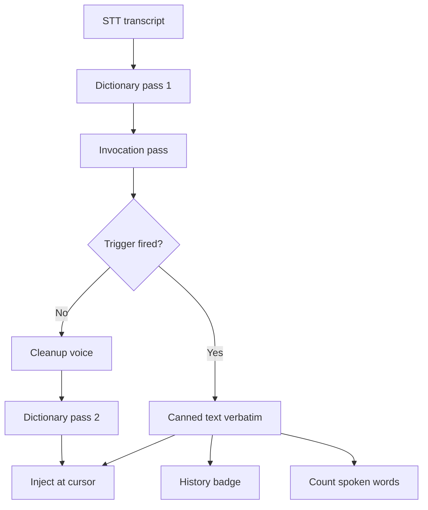

<!-- PAGE_ID: hark_08b_invocations -->
<details>
<summary>Relevant source files</summary>

The following files were used as evidence for this page:

- [crates/hark-dictionary/src/expander.rs:1-497](https://github.com/BoardPandas/Hark/blob/bcfcc3fef6f02252870fc3f06440d99992818ade/crates/hark-dictionary/src/expander.rs#L1-L497)
- [crates/hark-dictionary/src/matcher.rs:1-148](https://github.com/BoardPandas/Hark/blob/bcfcc3fef6f02252870fc3f06440d99992818ade/crates/hark-dictionary/src/matcher.rs#L1-L148)
- [crates/hark-dictionary/src/lib.rs:1-30](https://github.com/BoardPandas/Hark/blob/bcfcc3fef6f02252870fc3f06440d99992818ade/crates/hark-dictionary/src/lib.rs#L1-L30)
- [crates/hark-config/src/invocations.rs:1-60](https://github.com/BoardPandas/Hark/blob/bcfcc3fef6f02252870fc3f06440d99992818ade/crates/hark-config/src/invocations.rs#L1-L60)
- [crates/hark-config/src/lib.rs:294-330](https://github.com/BoardPandas/Hark/blob/bcfcc3fef6f02252870fc3f06440d99992818ade/crates/hark-config/src/lib.rs#L294-L330)
- [crates/hark-pipeline/src/worker.rs:218-270](https://github.com/BoardPandas/Hark/blob/bcfcc3fef6f02252870fc3f06440d99992818ade/crates/hark-pipeline/src/worker.rs#L218-L270)
- [crates/hark-pipeline/src/worker.rs:349-395](https://github.com/BoardPandas/Hark/blob/bcfcc3fef6f02252870fc3f06440d99992818ade/crates/hark-pipeline/src/worker.rs#L349-L395)
- [crates/hark-pipeline/src/lib.rs:107-143](https://github.com/BoardPandas/Hark/blob/bcfcc3fef6f02252870fc3f06440d99992818ade/crates/hark-pipeline/src/lib.rs#L107-L143)
- [crates/hark-pipeline/src/events.rs:26-35](https://github.com/BoardPandas/Hark/blob/bcfcc3fef6f02252870fc3f06440d99992818ade/crates/hark-pipeline/src/events.rs#L26-L35)
- [crates/hark-store/src/lib.rs:340-360](https://github.com/BoardPandas/Hark/blob/bcfcc3fef6f02252870fc3f06440d99992818ade/crates/hark-store/src/lib.rs#L340-L360)
- [crates/hark-store/migrations/003_entries_invocation.sql:1-6](https://github.com/BoardPandas/Hark/blob/bcfcc3fef6f02252870fc3f06440d99992818ade/crates/hark-store/migrations/003_entries_invocation.sql#L1-L6)
- [crates/hark-app/src/ui/invocations/mod.rs:1-302](https://github.com/BoardPandas/Hark/blob/bcfcc3fef6f02252870fc3f06440d99992818ade/crates/hark-app/src/ui/invocations/mod.rs#L1-L302)
- [crates/hark-app/src/ui/invocations/editor.rs:1-371](https://github.com/BoardPandas/Hark/blob/bcfcc3fef6f02252870fc3f06440d99992818ade/crates/hark-app/src/ui/invocations/editor.rs#L1-L371)
- [crates/hark-app/src/ui/pages.rs:142-160](https://github.com/BoardPandas/Hark/blob/bcfcc3fef6f02252870fc3f06440d99992818ade/crates/hark-app/src/ui/pages.rs#L142-L160)
- [config/default-config.toml:65-87](https://github.com/BoardPandas/Hark/blob/bcfcc3fef6f02252870fc3f06440d99992818ade/config/default-config.toml#L65-L87)

</details>

# Invocations

> **Related Pages**: [Dictionary](DICTIONARY.md), [Voice Cleanup](VOICE_CLEANUP.md), [Desktop UI](DESKTOP_UI.md), [Configuration and Secrets](../core/CONFIGURATION.md)

---

<!-- BEGIN:AUTOGEN hark_08b_invocations_overview -->
## Overview

An invocation pairs a spoken trigger phrase with a block of canned text. When the pipeline hears the trigger, the canned text is injected exactly as the user authored it, rather than whatever the speech-to-text provider transcribed. It is a text-expander built on top of dictation: say "access granted", get the paragraph listing what a support tech has access to.

The pass runs on the pipeline worker thread between dictionary pass 1 and the optional cleanup call ([worker.rs:222-230](https://github.com/BoardPandas/Hark/blob/bcfcc3fef6f02252870fc3f06440d99992818ade/crates/hark-pipeline/src/worker.rs#L222-L230)). Running after pass 1 is deliberate: pass 1 canonicalizes the *spoken* words, which can only help a trigger match, and the expansion is inserted afterwards so the dictionary never rewrites it ([worker.rs:349-356](https://github.com/BoardPandas/Hark/blob/bcfcc3fef6f02252870fc3f06440d99992818ade/crates/hark-pipeline/src/worker.rs#L349-L356)).



Three properties define the feature, and each is enforced by control flow rather than convention:

- **Verbatim injection.** The expansion is moved into the result string untouched; nothing downstream rewrites it ([expander.rs:159-165](https://github.com/BoardPandas/Hark/blob/bcfcc3fef6f02252870fc3f06440d99992818ade/crates/hark-dictionary/src/expander.rs#L159-L165)).
- **Cleanup is skipped entirely** when a trigger fires, so no model can reword the text and no request is billed ([worker.rs:229](https://github.com/BoardPandas/Hark/blob/bcfcc3fef6f02252870fc3f06440d99992818ade/crates/hark-pipeline/src/worker.rs#L229)).
- **Stats count what was spoken**, not what was pasted ([lib.rs:354-359](https://github.com/BoardPandas/Hark/blob/bcfcc3fef6f02252870fc3f06440d99992818ade/crates/hark-store/src/lib.rs#L354-L359)).

Sources: [worker.rs:218-270](https://github.com/BoardPandas/Hark/blob/bcfcc3fef6f02252870fc3f06440d99992818ade/crates/hark-pipeline/src/worker.rs#L218-L270), [expander.rs:1-30](https://github.com/BoardPandas/Hark/blob/bcfcc3fef6f02252870fc3f06440d99992818ade/crates/hark-dictionary/src/expander.rs#L1-L30), [lib.rs:340-360](https://github.com/BoardPandas/Hark/blob/bcfcc3fef6f02252870fc3f06440d99992818ade/crates/hark-store/src/lib.rs#L340-L360)
<!-- END:AUTOGEN hark_08b_invocations_overview -->

---

<!-- BEGIN:AUTOGEN hark_08b_invocations_matching -->
## Trigger Matching and Scope

`Expander` lives in the dictionary crate and is a second consumer of the same guarded phonetic matcher that powers term correction, not a parallel implementation of it ([expander.rs:1-12](https://github.com/BoardPandas/Hark/blob/bcfcc3fef6f02252870fc3f06440d99992818ade/crates/hark-dictionary/src/expander.rs#L1-L12)). Reuse is a safety decision: Double Metaphone code equality alone collides common words with proper nouns, so the >= 4-char / all-alphabetic gate, the digit/short-word exact-only path, and the Jaro-Winkler confirmation all have to stay on the path.

The one thing the two consumers do differently is the confirmation threshold. `window_matches` takes it as a parameter, and each caller supplies its own ([matcher.rs:106-117](https://github.com/BoardPandas/Hark/blob/bcfcc3fef6f02252870fc3f06440d99992818ade/crates/hark-dictionary/src/matcher.rs#L106-L117)):

| Consumer | Threshold | Constant | Rationale |
|---|---|---|---|
| `Corrector` (dictionary) | 0.85 | `JW_CONFIRM_THRESHOLD` ([matcher.rs:21](https://github.com/BoardPandas/Hark/blob/bcfcc3fef6f02252870fc3f06440d99992818ade/crates/hark-dictionary/src/matcher.rs#L21)) | A false positive corrupts one word |
| `Expander` (invocations) | 0.90 | `INVOCATION_JW_THRESHOLD` ([expander.rs:26](https://github.com/BoardPandas/Hark/blob/bcfcc3fef6f02252870fc3f06440d99992818ade/crates/hark-dictionary/src/expander.rs#L26)) | A false positive pastes a whole paragraph |

Scope is per-invocation and decides where a trigger may fire ([expander.rs:34-40](https://github.com/BoardPandas/Hark/blob/bcfcc3fef6f02252870fc3f06440d99992818ade/crates/hark-dictionary/src/expander.rs#L34-L40)):

| Scope | Fires when | Result |
|---|---|---|
| `Utterance` (default) | The trigger accounts for every token in the dictation | The expansion replaces the entire text ([expander.rs:155-165](https://github.com/BoardPandas/Hark/blob/bcfcc3fef6f02252870fc3f06440d99992818ade/crates/hark-dictionary/src/expander.rs#L155-L165)) |
| `Anywhere` | The trigger appears as a token window inside a longer dictation | The expansion is spliced over the matched byte span ([expander.rs:167-215](https://github.com/BoardPandas/Hark/blob/bcfcc3fef6f02252870fc3f06440d99992818ade/crates/hark-dictionary/src/expander.rs#L167-L215)) |

`expand` tokenizes once, then runs the utterance pass before the anywhere pass. A whole-dictation hit returns immediately, because the trigger has consumed every spoken word and nothing else can apply ([expander.rs:151-165](https://github.com/BoardPandas/Hark/blob/bcfcc3fef6f02252870fc3f06440d99992818ade/crates/hark-dictionary/src/expander.rs#L151-L165)). The anywhere pass reuses `Corrector::correct`'s consume-and-splice algorithm over byte spans, so punctuation and casing surrounding a match survive without a reattachment step ([expander.rs:167-172](https://github.com/BoardPandas/Hark/blob/bcfcc3fef6f02252870fc3f06440d99992818ade/crates/hark-dictionary/src/expander.rs#L167-L172)).

Entries are sorted longest-first so a multi-word trigger wins an overlap against a shorter one, matching the dictionary's ordering contract; the sort is stable, so equal-length triggers keep their configured order ([expander.rs:108-111](https://github.com/BoardPandas/Hark/blob/bcfcc3fef6f02252870fc3f06440d99992818ade/crates/hark-dictionary/src/expander.rs#L108-L111)).

Because matching runs *after* dictionary pass 1, a trigger word the provider keeps mishearing can be repaired for free by adding it to the Dictionary — the transcript is corrected before the trigger is ever compared ([expander.rs:20-25](https://github.com/BoardPandas/Hark/blob/bcfcc3fef6f02252870fc3f06440d99992818ade/crates/hark-dictionary/src/expander.rs#L20-L25)).

Sources: [expander.rs:14-215](https://github.com/BoardPandas/Hark/blob/bcfcc3fef6f02252870fc3f06440d99992818ade/crates/hark-dictionary/src/expander.rs#L14-L215), [matcher.rs:14-135](https://github.com/BoardPandas/Hark/blob/bcfcc3fef6f02252870fc3f06440d99992818ade/crates/hark-dictionary/src/matcher.rs#L14-L135)
<!-- END:AUTOGEN hark_08b_invocations_matching -->

---

<!-- BEGIN:AUTOGEN hark_08b_invocations_cleanup -->
## Why a Fired Invocation Skips Cleanup

When a trigger fires, `dictate` nulls the cleanup plan before calling `cleaned_text`, which makes it hit its passthrough on the first line ([worker.rs:222-230](https://github.com/BoardPandas/Hark/blob/bcfcc3fef6f02252870fc3f06440d99992818ade/crates/hark-pipeline/src/worker.rs#L222-L230)):

```rust
let text = corrected_text(&worker.corrector, &transcript.text);
let expanded = expanded_text(&worker.expander, text);
// Canned text is authored, not spoken: it never reaches a cleanup model
// that would rewrite it, and never pays for the call.
let plan = worker.cleanup.as_ref().filter(|_| expanded.fired.is_none());
let cleaned = cleaned_text(plan, &worker.corrector, expanded.text);
```

Sources: [worker.rs:222-230](https://github.com/BoardPandas/Hark/blob/bcfcc3fef6f02252870fc3f06440d99992818ade/crates/hark-pipeline/src/worker.rs#L222-L230)

That single `Option::filter` closes four failure modes at once ([worker.rs:359-374](https://github.com/BoardPandas/Hark/blob/bcfcc3fef6f02252870fc3f06440d99992818ade/crates/hark-pipeline/src/worker.rs#L359-L374)):

| Failure mode | What would happen without the filter |
|---|---|
| Expansion guard | `hark_voice::over_expanded` allows `max(words * ratio, words + 3)`, so a 3-word utterance expanding to 60 words gets an allowance of 6 — the expansion would be **silently discarded** in favour of the literal spoken words, at any ratio |
| Cost | A short, free, instant dictation would become a billed LLM round trip on the release-to-inject path |
| Latency and failure surface | An HTTP call that can time out or error would sit on the hot path for text that needed no model at all |
| Dictionary pass 2 | Phonetic post-correction would run over the expansion and could mangle URLs or product names inside the user's own authored text |

The protection has to be control flow rather than persuasion. Every built-in voice already carries `LENGTH_DISCIPLINE_CLAUSE`, instructing the model not to expand a short remark into a paragraph, so a "leave this untouched" prompt clause would be fighting the rest of the prompt ([worker.rs:374-378](https://github.com/BoardPandas/Hark/blob/bcfcc3fef6f02252870fc3f06440d99992818ade/crates/hark-pipeline/src/worker.rs#L374-L378), [voices.rs:127-134](https://github.com/BoardPandas/Hark/blob/bcfcc3fef6f02252870fc3f06440d99992818ade/crates/hark-voice/src/voices.rs#L127-L134)).

The regression test gives its `MockCleaner` an **empty script**, so any call to it panics — not panicking is the assertion. Its corrector is hostile in the same test, which simultaneously pins that dictionary pass 2 never runs over the expansion ([worker.rs:754-790](https://github.com/BoardPandas/Hark/blob/bcfcc3fef6f02252870fc3f06440d99992818ade/crates/hark-pipeline/src/worker.rs#L754-L790)).

**Accepted cost:** an `Anywhere` trigger inside a longer sentence means that whole dictation loses its cleanup pass, so filler words around the inserted text survive as spoken. The editor states this next to the scope control rather than leaving it to be discovered ([editor.rs:176-186](https://github.com/BoardPandas/Hark/blob/bcfcc3fef6f02252870fc3f06440d99992818ade/crates/hark-app/src/ui/invocations/editor.rs#L176-L186)).

Sources: [worker.rs:218-270](https://github.com/BoardPandas/Hark/blob/bcfcc3fef6f02252870fc3f06440d99992818ade/crates/hark-pipeline/src/worker.rs#L218-L270), [worker.rs:349-395](https://github.com/BoardPandas/Hark/blob/bcfcc3fef6f02252870fc3f06440d99992818ade/crates/hark-pipeline/src/worker.rs#L349-L395), [editor.rs:158-187](https://github.com/BoardPandas/Hark/blob/bcfcc3fef6f02252870fc3f06440d99992818ade/crates/hark-app/src/ui/invocations/editor.rs#L158-L187)
<!-- END:AUTOGEN hark_08b_invocations_cleanup -->

---

<!-- BEGIN:AUTOGEN hark_08b_invocations_config -->
## Configuration

The `[invocations]` section lives in its own module because `hark-config/src/lib.rs` was already over the project's 500-line rule ([invocations.rs:1-11](https://github.com/BoardPandas/Hark/blob/bcfcc3fef6f02252870fc3f06440d99992818ade/crates/hark-config/src/invocations.rs#L1-L11)). It is the last field on `Settings`, because it is the only section holding a TOML array-of-tables and those must follow every scalar key ([lib.rs:308-311](https://github.com/BoardPandas/Hark/blob/bcfcc3fef6f02252870fc3f06440d99992818ade/crates/hark-config/src/lib.rs#L308-L311)).

| Field | Type | Default | Meaning |
|---|---|---|---|
| `phrase` | string | `""` | What the user says; also the entry's identity ([invocations.rs:49](https://github.com/BoardPandas/Hark/blob/bcfcc3fef6f02252870fc3f06440d99992818ade/crates/hark-config/src/invocations.rs#L49)) |
| `expansion` | string | `""` | What gets injected, byte for byte; multi-line permitted ([invocations.rs:51](https://github.com/BoardPandas/Hark/blob/bcfcc3fef6f02252870fc3f06440d99992818ade/crates/hark-config/src/invocations.rs#L51)) |
| `scope` | `"utterance"` \| `"anywhere"` | `"utterance"` | Where the trigger may fire ([invocations.rs:20-27](https://github.com/BoardPandas/Hark/blob/bcfcc3fef6f02252870fc3f06440d99992818ade/crates/hark-config/src/invocations.rs#L20-L27)) |

```toml
[[invocations.entries]]
phrase = "access granted"
scope = "utterance"
expansion = """
You have access to the Support Forge tools: ticketing, remote assist,
and the asset inventory.
"""
```

Sources: [default-config.toml:65-87](https://github.com/BoardPandas/Hark/blob/bcfcc3fef6f02252870fc3f06440d99992818ade/config/default-config.toml#L65-L87)

`CONFIG_VERSION` deliberately stays at 1. The change is purely additive under `#[serde(default)]`, so pre-invocations files load unchanged and new files remain readable by older builds, which already tolerate unknown keys ([invocations.rs:1-11](https://github.com/BoardPandas/Hark/blob/bcfcc3fef6f02252870fc3f06440d99992818ade/crates/hark-config/src/invocations.rs#L1-L11)).

There is also **no `Settings::validate` rule** for invocations. Hard-rejecting a bad phrase would make a hand-edited config unloadable and strand the user with no UI to repair it, so malformed entries are skipped at build time by `Expander` instead ([invocations.rs:8-11](https://github.com/BoardPandas/Hark/blob/bcfcc3fef6f02252870fc3f06440d99992818ade/crates/hark-config/src/invocations.rs#L8-L11)). `Expander::new` skips and counts three classes of entry, never logging the text itself ([expander.rs:69-117](https://github.com/BoardPandas/Hark/blob/bcfcc3fef6f02252870fc3f06440d99992818ade/crates/hark-dictionary/src/expander.rs#L69-L117)):

- a trigger tokenizing to fewer than `MIN_TRIGGER_WORDS` (2) words ([expander.rs:31](https://github.com/BoardPandas/Hark/blob/bcfcc3fef6f02252870fc3f06440d99992818ade/crates/hark-dictionary/src/expander.rs#L31));
- an empty expansion;
- a duplicate trigger, compared as a normalized token sequence, where **first wins**.

The matcher itself is a derived artifact, rebuilt from the TOML on every pipeline start and cached nowhere, so the config file stays the single owner ([lib.rs:107-143](https://github.com/BoardPandas/Hark/blob/bcfcc3fef6f02252870fc3f06440d99992818ade/crates/hark-pipeline/src/lib.rs#L107-L143)).

Sources: [invocations.rs:1-60](https://github.com/BoardPandas/Hark/blob/bcfcc3fef6f02252870fc3f06440d99992818ade/crates/hark-config/src/invocations.rs#L1-L60), [lib.rs:294-330](https://github.com/BoardPandas/Hark/blob/bcfcc3fef6f02252870fc3f06440d99992818ade/crates/hark-config/src/lib.rs#L294-L330), [lib.rs:107-143](https://github.com/BoardPandas/Hark/blob/bcfcc3fef6f02252870fc3f06440d99992818ade/crates/hark-pipeline/src/lib.rs#L107-L143)
<!-- END:AUTOGEN hark_08b_invocations_config -->

---

<!-- BEGIN:AUTOGEN hark_08b_invocations_ui -->
## The Invocations Page

Invocations is the third entry in the sidebar nav, between Dictionary and Stats, carrying the `LIGHTNING` glyph ([pages.rs:22-52](https://github.com/BoardPandas/Hark/blob/bcfcc3fef6f02252870fc3f06440d99992818ade/crates/hark-app/src/ui/pages.rs#L22-L52), [shell.rs:179-184](https://github.com/BoardPandas/Hark/blob/bcfcc3fef6f02252870fc3f06440d99992818ade/crates/hark-app/src/ui/shell.rs#L179-L184)). The page splits across two modules so each stays inside the ~300-line UI guardrail: the list in `mod.rs` and the form in `editor.rs` ([mod.rs:1-10](https://github.com/BoardPandas/Hark/blob/bcfcc3fef6f02252870fc3f06440d99992818ade/crates/hark-app/src/ui/invocations/mod.rs#L1-L10)).

The list uses a plain `ScrollArea::vertical().show()`, never `show_rows()`. Rows are non-uniform because a warning line appears only on entries that cannot fire, and `show_rows`'s `row_height * count` arithmetic desynchronizes the scrollbar and shifts rows under the cursor for heterogeneous lists ([mod.rs:83-95](https://github.com/BoardPandas/Hark/blob/bcfcc3fef6f02252870fc3f06440d99992818ade/crates/hark-app/src/ui/invocations/mod.rs#L83-L95)).

Each row renders the trigger in monospace, a scope chip, and a whitespace-flattened one-line preview of the expansion, so a multi-line expansion cannot stretch a row ([mod.rs:96-127](https://github.com/BoardPandas/Hark/blob/bcfcc3fef6f02252870fc3f06440d99992818ade/crates/hark-app/src/ui/invocations/mod.rs#L96-L127), [mod.rs:215-224](https://github.com/BoardPandas/Hark/blob/bcfcc3fef6f02252870fc3f06440d99992818ade/crates/hark-app/src/ui/invocations/mod.rs#L215-L224)). An entry that will never arm carries an inline warning naming the reason; `skip_reason` mirrors the expander's gate and marks the *later* duplicate, matching the first-wins rule ([mod.rs:226-245](https://github.com/BoardPandas/Hark/blob/bcfcc3fef6f02252870fc3f06440d99992818ade/crates/hark-app/src/ui/invocations/mod.rs#L226-L245)).

The editor commits on an explicit **Save** and never on `lost_focus` the way the dictionary editor does. Focus is lost by clicking a scrollbar or alt-tabbing, and every commit runs `save_to_disk` plus a full `pipeline.start()` — hook, worker, and capture restart including a keychain read ([editor.rs:1-8](https://github.com/BoardPandas/Hark/blob/bcfcc3fef6f02252870fc3f06440d99992818ade/crates/hark-app/src/ui/invocations/editor.rs#L1-L8)).

| Control | Behaviour |
|---|---|
| Trigger | Single-line field with inline validation that disables Save ([editor.rs:138-154](https://github.com/BoardPandas/Hark/blob/bcfcc3fef6f02252870fc3f06440d99992818ade/crates/hark-app/src/ui/invocations/editor.rs#L138-L154), [editor.rs:272-289](https://github.com/BoardPandas/Hark/blob/bcfcc3fef6f02252870fc3f06440d99992818ade/crates/hark-app/src/ui/invocations/editor.rs#L272-L289)) |
| Scope | Two radios; `Anywhere` adds the cleanup-skip consequence note ([editor.rs:158-187](https://github.com/BoardPandas/Hark/blob/bcfcc3fef6f02252870fc3f06440d99992818ade/crates/hark-app/src/ui/invocations/editor.rs#L158-L187)) |
| Expansion | `TextEdit::multiline` at 6 rows, injected byte for byte ([editor.rs:189-205](https://github.com/BoardPandas/Hark/blob/bcfcc3fef6f02252870fc3f06440d99992818ade/crates/hark-app/src/ui/invocations/editor.rs#L189-L205)) |
| Try it | Answers "Would fire" / "Would not fire" using the real matcher ([editor.rs:207-270](https://github.com/BoardPandas/Hark/blob/bcfcc3fef6f02252870fc3f06440d99992818ade/crates/hark-app/src/ui/invocations/editor.rs#L207-L270)) |

The test panel builds its preview `Expander` only when a `preview_dirty` flag is set, never per frame, because construction encodes every trigger phonetically ([editor.rs:224-238](https://github.com/BoardPandas/Hark/blob/bcfcc3fef6f02252870fc3f06440d99992818ade/crates/hark-app/src/ui/invocations/editor.rs#L224-L238)). When a probe does not fire, `Expander::closest` supplies the near-miss hint — the nearest trigger and how close it got — because "close but rejected" is the confusing case ([expander.rs:217-241](https://github.com/BoardPandas/Hark/blob/bcfcc3fef6f02252870fc3f06440d99992818ade/crates/hark-dictionary/src/expander.rs#L217-L241), [editor.rs:255-269](https://github.com/BoardPandas/Hark/blob/bcfcc3fef6f02252870fc3f06440d99992818ade/crates/hark-app/src/ui/invocations/editor.rs#L255-L269)).

Editor validation calls `hark_dictionary::phrase_word_count` and `normalized_phrase` rather than splitting on whitespace locally, so the editor, the row warnings, and the matcher can never disagree about what counts as a word — "access-granted" is two ([expander.rs:243-257](https://github.com/BoardPandas/Hark/blob/bcfcc3fef6f02252870fc3f06440d99992818ade/crates/hark-dictionary/src/expander.rs#L243-L257)).

Persistence carries four obligations in order, and the last one is load-bearing ([pages.rs:142-160](https://github.com/BoardPandas/Hark/blob/bcfcc3fef6f02252870fc3f06440d99992818ade/crates/hark-app/src/ui/pages.rs#L142-L160)):

```rust
if views.invocations.show(ui, &mut settings.invocations) {
    views.invocations.set_notice(settings::save_to_disk(settings).err());
    pipeline.start(settings, ui.ctx());
    views.settings.draft.invocations = settings.invocations.clone();
}
```

Without that final line the Settings page keeps its pre-edit copy of the whole `Settings` struct and writes it wholesale on Save, resurrecting every deleted invocation — silent data loss with no error surfaced.

Sources: [mod.rs:1-302](https://github.com/BoardPandas/Hark/blob/bcfcc3fef6f02252870fc3f06440d99992818ade/crates/hark-app/src/ui/invocations/mod.rs#L1-L302), [editor.rs:1-371](https://github.com/BoardPandas/Hark/blob/bcfcc3fef6f02252870fc3f06440d99992818ade/crates/hark-app/src/ui/invocations/editor.rs#L1-L371), [pages.rs:142-160](https://github.com/BoardPandas/Hark/blob/bcfcc3fef6f02252870fc3f06440d99992818ade/crates/hark-app/src/ui/pages.rs#L142-L160)
<!-- END:AUTOGEN hark_08b_invocations_ui -->

---

<!-- BEGIN:AUTOGEN hark_08b_invocations_edge -->
## Edge Cases

**History and stats honesty.** `DictationRecord` carries the trigger that fired ([events.rs:26-35](https://github.com/BoardPandas/Hark/blob/bcfcc3fef6f02252870fc3f06440d99992818ade/crates/hark-pipeline/src/events.rs#L26-L35)), migration 003 adds a nullable `invocation` column with no backfill — every pre-003 row genuinely is "not an invocation" ([003_entries_invocation.sql:1-6](https://github.com/BoardPandas/Hark/blob/bcfcc3fef6f02252870fc3f06440d99992818ade/crates/hark-store/migrations/003_entries_invocation.sql#L1-L6)) — and the History row gains a badge plus a detail line naming the trigger ([row.rs:129-143](https://github.com/BoardPandas/Hark/blob/bcfcc3fef6f02252870fc3f06440d99992818ade/crates/hark-app/src/ui/history/row.rs#L129-L143)).

The stats counter is the subtle one. The Stats page values every word at 1500 ms ("time saved vs typing at 40 WPM"), so counting the injected text would let a two-word trigger producing a 300-word expansion fabricate roughly seven and a half minutes of saved time. `spoken_word_count` counts `raw_text` when an invocation fired ([lib.rs:346-359](https://github.com/BoardPandas/Hark/blob/bcfcc3fef6f02252870fc3f06440d99992818ade/crates/hark-store/src/lib.rs#L346-L359)):

```rust
fn spoken_word_count(d: &NewDictation) -> i64 {
    match d.invocation {
        Some(_) => word_count(&d.raw_text),
        None => word_count(&d.final_text),
    }
}
```

Sources: [lib.rs:354-359](https://github.com/BoardPandas/Hark/blob/bcfcc3fef6f02252870fc3f06440d99992818ade/crates/hark-store/src/lib.rs#L354-L359)

Other behaviours worth knowing:

- **Empty invocation set is a pure passthrough.** `expand` short-circuits before tokenizing when no entry is armed, mirroring `Corrector`'s fast path ([expander.rs:134-145](https://github.com/BoardPandas/Hark/blob/bcfcc3fef6f02252870fc3f06440d99992818ade/crates/hark-dictionary/src/expander.rs#L134-L145)).
- **Casing and surrounding punctuation are irrelevant** to a whole-utterance hit, because they sit outside token spans ([expander.rs:151-155](https://github.com/BoardPandas/Hark/blob/bcfcc3fef6f02252870fc3f06440d99992818ade/crates/hark-dictionary/src/expander.rs#L151-L155)).
- **Multiple different `Anywhere` triggers may fire in one dictation**; `fired` reports the first, which is enough to suppress cleanup and badge the row ([expander.rs:173-215](https://github.com/BoardPandas/Hark/blob/bcfcc3fef6f02252870fc3f06440d99992818ade/crates/hark-dictionary/src/expander.rs#L173-L215)).
- **Never log phrases or expansions.** `Invocation` derives `Debug` because `Settings` does, so a stray `{settings:?}` would dump every expansion to disk; the pipeline logs only counts and millis ([invocations.rs:39-43](https://github.com/BoardPandas/Hark/blob/bcfcc3fef6f02252870fc3f06440d99992818ade/crates/hark-config/src/invocations.rs#L39-L43), [worker.rs:376-392](https://github.com/BoardPandas/Hark/blob/bcfcc3fef6f02252870fc3f06440d99992818ade/crates/hark-pipeline/src/worker.rs#L376-L392)).

**Open hazard: fused STT+cleanup adapters.** `Transcript` carries a `cleaned` field populated only by adapters that transcribe and clean in one round trip, currently Gemini ([lib.rs:28-38](https://github.com/BoardPandas/Hark/blob/0e086b5/crates/hark-stt/src/lib.rs#L28-L38)). Nothing in `dictate` reads it yet, so the invocation skip above still governs every injected byte.

That stops being true the moment it is consumed. A fused adapter does its cleanup *inside* the transcription call — before `expanded_text` has run and before `worker.cleanup.as_ref().filter(...)` can null anything — so canned text would come back model-reworded through a path the guard never sees. Whoever wires the fused result into `dictate` has to decide what a fired invocation means there; the cheapest correct answer is to prefer `transcript.text` over `transcript.cleaned` whenever `expanded.fired.is_some()`. This is the same failure the `Option::filter` exists to prevent, arriving through a different door.

**Deferred on purpose.** Placeholders or variables in expansions (`{date}`, `{cursor}`) are not supported: they would break the byte-for-byte invariant this design's safety argument rests on. Sending trigger phrases to the STT provider as bias or keyterm hints is also deferred — biasing raises recall but also raises the odds the provider hallucinates a trigger out of similar-sounding audio, the wrong direction when a false fire pastes a paragraph.

Sources: [expander.rs:134-215](https://github.com/BoardPandas/Hark/blob/bcfcc3fef6f02252870fc3f06440d99992818ade/crates/hark-dictionary/src/expander.rs#L134-L215), [lib.rs:340-360](https://github.com/BoardPandas/Hark/blob/bcfcc3fef6f02252870fc3f06440d99992818ade/crates/hark-store/src/lib.rs#L340-L360), [003_entries_invocation.sql:1-6](https://github.com/BoardPandas/Hark/blob/bcfcc3fef6f02252870fc3f06440d99992818ade/crates/hark-store/migrations/003_entries_invocation.sql#L1-L6)
<!-- END:AUTOGEN hark_08b_invocations_edge -->

---
