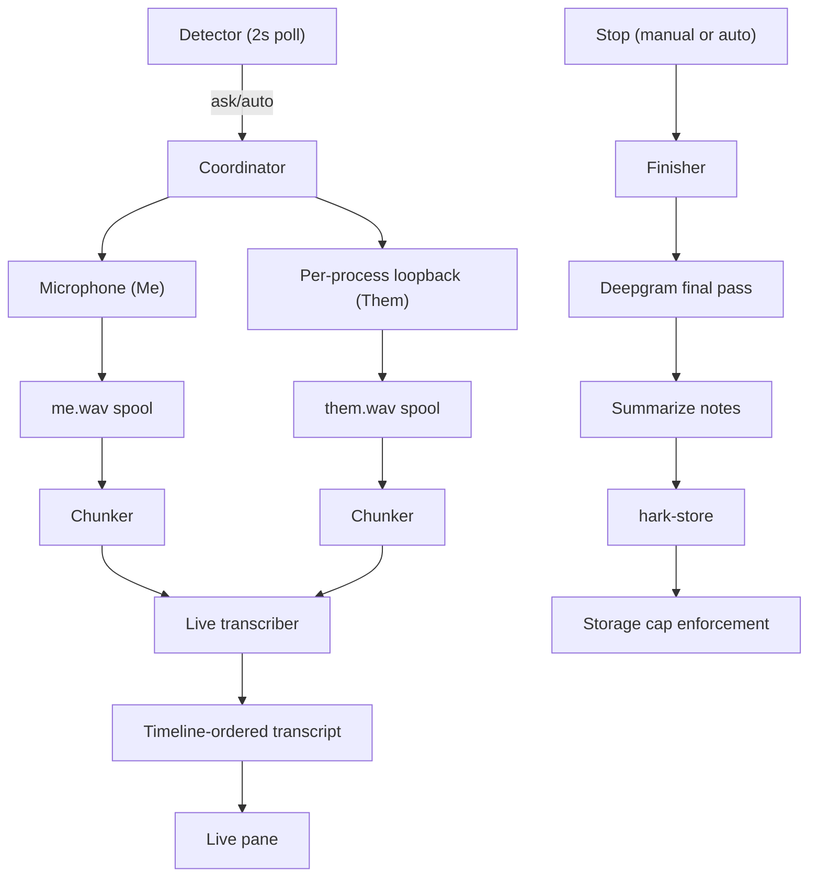

<!-- PAGE_ID: hark_15_meetings -->

Relevant source files

The following files were used as evidence for this page:

- [crates/hark-meeting/src/lib.rs](../../crates/hark-meeting/src/lib.rs)
- [crates/hark-meeting/src/session.rs](../../crates/hark-meeting/src/session.rs)
- [crates/hark-meeting/src/chunker.rs](../../crates/hark-meeting/src/chunker.rs)
- [crates/hark-meeting/src/merge.rs](../../crates/hark-meeting/src/merge.rs)
- [crates/hark-meeting/src/detect.rs](../../crates/hark-meeting/src/detect.rs)
- [crates/hark-meeting/src/probe_win.rs](../../crates/hark-meeting/src/probe_win.rs)
- [crates/hark-meeting/src/storage.rs](../../crates/hark-meeting/src/storage.rs)
- [crates/hark-meeting/src/storage_fs.rs](../../crates/hark-meeting/src/storage_fs.rs)
- [crates/hark-meeting/src/export.rs](../../crates/hark-meeting/src/export.rs)
- [crates/hark-pipeline/src/meeting/mod.rs](../../crates/hark-pipeline/src/meeting/mod.rs)
- [crates/hark-pipeline/src/meeting/coordinator.rs](../../crates/hark-pipeline/src/meeting/coordinator.rs)
- [crates/hark-pipeline/src/meeting/recorder.rs](../../crates/hark-pipeline/src/meeting/recorder.rs)
- [crates/hark-pipeline/src/meeting/live.rs](../../crates/hark-pipeline/src/meeting/live.rs)
- [crates/hark-pipeline/src/meeting/finish.rs](../../crates/hark-pipeline/src/meeting/finish.rs)
- [crates/hark-config/src/meeting.rs](../../crates/hark-config/src/meeting.rs)
- [crates/hark-store/src/meetings.rs](../../crates/hark-store/src/meetings.rs)
- [crates/hark-store/migrations/004_meetings.sql](../../crates/hark-store/migrations/004_meetings.sql)
- [crates/hark-stt/src/meeting.rs](../../crates/hark-stt/src/meeting.rs)
- [crates/hark-voice/src/summary.rs](../../crates/hark-voice/src/summary.rs)
- [crates/hark-app/src/meeting.rs](../../crates/hark-app/src/meeting.rs)
- [crates/hark-app/src/meeting_prompt.rs](../../crates/hark-app/src/meeting_prompt.rs)
- [crates/hark-app/src/storage/meetings.rs](../../crates/hark-app/src/storage/meetings.rs)
- [crates/hark-app/src/ui/meetings/mod.rs](../../crates/hark-app/src/ui/meetings/mod.rs)
- [crates/hark-app/src/ui/settings/meetings.rs](../../crates/hark-app/src/ui/settings/meetings.rs)

# Meetings

> **Related Pages**: [Architecture](../core/ARCHITECTURE.md), [Audio Capture](AUDIO_CAPTURE.md), [Transcription](TRANSCRIPTION.md), [Voice Cleanup](VOICE_CLEANUP.md), [Data Storage](../core/DATA_STORAGE.md), [Desktop UI](DESKTOP_UI.md)

---

<!-- BEGIN:AUTOGEN hark_15_meetings_overview -->
## Overview

Hark can record a meeting in any app — Teams, Zoom, a Meet tab, a Slack huddle, even an in-person conversation through the microphone alone — without a bot joining the call, and turn it into a searchable transcript with notes. The design and every decision behind it are recorded in `tasks/2026-09-26-plan-meeting-transcription.md`; this page documents the shipped result.

Meeting mode is **Windows-only for now** (`hark_pipeline::meeting::meetings_supported()` is `cfg!(windows)`). macOS is planned once Windows is stable; Linux is deferred. Elsewhere, the coordinator refuses to start with a plain "not available on this platform" error, and the UI hides the Meetings page, tray entry, and Settings section rather than showing something that cannot work ([mod.rs:149-154](../../crates/hark-pipeline/src/meeting/mod.rs#L149-L154)).

It is deliberately a second, independent system from push-to-talk dictation: its own state machine (below), its own capture streams, its own worker threads, never sharing or blocking the dictation pipeline's four-state machine. A meeting can be recording while a dictation fires, and vice versa ([mod.rs:1-23](../../crates/hark-pipeline/src/meeting/mod.rs#L1-L23)).

One `SessionState` machine per meeting — `Idle -> Recording -> Finalizing -> Summarizing -> Done | Failed` — governs a single meeting's lifecycle. It is deliberately separate from `hark-pipeline::state`'s one-shot press/release machine: a meeting is long-lived, and back-to-back meetings mean an old machine can still be summarizing while a new one starts recording ([session.rs:1-30](../../crates/hark-meeting/src/session.rs#L1-L30)). `advance` is total, so a stray or duplicate event (an auto-stop racing a manual stop, for example) is inert rather than a panic ([session.rs:88-122](../../crates/hark-meeting/src/session.rs#L88-L122)). A failed or skipped final pass or summary is *not* a `Failure`: the meeting keeps whatever it has (the live transcript, or the transcript without notes) and `Failed` is reserved for "nothing to keep" ([session.rs:32-42](../../crates/hark-meeting/src/session.rs#L32-L42)).
<!-- END:AUTOGEN hark_15_meetings_overview -->

---

<!-- BEGIN:AUTOGEN hark_15_meetings_capture -->
## Capture

Two independent channels record for the length of the call, alongside push-to-talk's own microphone stream and ring — the two never share a device handle or a buffer:

- **Me (microphone):** the Windows communications-default device by default (the same device Teams and Zoom use), or an explicit `[meeting] mic_device` override ([coordinator.rs:279-284](../../crates/hark-pipeline/src/meeting/coordinator.rs#L279-L284)).
- **Them (system audio):** per-process WASAPI loopback. A detected meeting captures just that app's process tree (`system_source = "app"`, the default); a manual start, or `system_source = "all"`, captures everything except Hark. Resolving "that app's process tree" means finding the root PID whose parent is not the same exe (covering a browser's or Teams' child processes) and falling back to "everything except Hark" if the app has no running process to target ([coordinator.rs:378-397](../../crates/hark-pipeline/src/meeting/coordinator.rs#L378-L397)). See [Audio Capture](AUDIO_CAPTURE.md#meeting-capture) for the WASAPI mechanics and the spool format both channels are written to.

`Recorder` drains both tracks every 100 ms into their WAV spool and, when a live transcript is wanted, their chunker. Both tracks sit on one timeline counted in 16 kHz samples since the meeting started; a track that opens late (the mic ready before the loopback activates, or vice versa) is padded with leading silence, and samples a stalled drain lost are replaced with silence of the same length, so a line's offset is its real time in the call and the spools stay aligned for the stereo final pass ([recorder.rs:1-10](../../crates/hark-pipeline/src/meeting/recorder.rs#L1-L10)). The meeting records with whatever opened — mic only if the loopback failed, loopback only if the mic failed — and reports why through a notice; neither failure is fatal on its own ([recorder.rs:85-89](../../crates/hark-pipeline/src/meeting/recorder.rs#L85-L89)).
<!-- END:AUTOGEN hark_15_meetings_capture -->

---

<!-- BEGIN:AUTOGEN hark_15_meetings_detection -->
## Auto-Detection

A `Detector` state machine, fed by a 2-second poll of the Windows ConsentStore microphone registry key, decides when to offer or start meeting notes. It is pure and fixture-tested; the registry read itself lives in `probe_win` and is verified by hand with `examples/detect_smoke.rs`, never in `cargo test` ([probe_win.rs:1-19](../../crates/hark-meeting/src/probe_win.rs#L1-L19)).

Rules, in the order they apply:

1. **Hark never counts as a meeting.** Its own pre-roll microphone stream holds the mic open permanently, so the detector excludes its own exe path unconditionally ([detect.rs:1-11](../../crates/hark-meeting/src/detect.rs#L1-L11)).
2. **Only `detect_apps` counts** — a built-in list of packaged/desktop app identifiers (new and classic Teams, Zoom, Webex, Slack, Discord, GoTo, RingCentral, and four browsers), user-editable in Settings. A browser only counts while one of its windows carries a meeting-title marker ("Meet -", "Microsoft Teams", "Zoom"); window titles are matched in memory and never stored or logged ([detect.rs:22-53](../../crates/hark-meeting/src/detect.rs#L22-L53)).
3. **A 5-second debounce** before a prompt or auto-start, so a quick device test or voice message never counts ([detect.rs:15-20](../../crates/hark-meeting/src/detect.rs#L15-L20)).
4. **One prompt per call.** "Not this meeting," a dismissal, or a manual stop suppresses that app until it fully releases the mic, so ending notes on a call that continues does not immediately re-prompt for it ([detect.rs:305-319](../../crates/hark-meeting/src/detect.rs#L305-L319)).
5. **Auto-stop** once the detected app has released the mic for `auto_stop_after_s` (default 60, `0` disables it); a manually started meeting is never auto-stopped, matched or not ([detect.rs:195-232](../../crates/hark-meeting/src/detect.rs#L195-L232)).

`DetectMode` is `off` / `ask` (the default, a non-modal prompt) / `auto` (starts silently, but the tray and live-pane recording indicator stay visible either way — "auto" is never invisible) ([detect.rs:107-114](../../crates/hark-meeting/src/detect.rs#L107-L114)). The detection prompt itself follows the recording overlay's rule for the same reason: one persistent, deferred viewport, registered from root `logic`, created hidden and only ever shown or hidden — see [Desktop UI](DESKTOP_UI.md#recording-overlay).
<!-- END:AUTOGEN hark_15_meetings_detection -->

---

<!-- BEGIN:AUTOGEN hark_15_meetings_live -->
## Live Transcript

Each channel's continuous audio is cut into 20–30 second chunks by a `Chunker`: the cut lands at the middle of the quietest 300 ms window inside that range, so words are rarely split mid-syllable, and no chunk ever exceeds the hard 30 s cut. A chunk with nothing in it — the loopback while the user talks, the mic while the remote side does — is dropped by the same loudest-window gate a dictation clip uses, judged over the chunk rather than a whole-clip mean, so one short answer in 30 seconds of listening is still kept. Dropped chunks still advance the timeline, so every kept chunk carries its true offset ([chunker.rs:1-15](../../crates/hark-meeting/src/chunker.rs#L1-L15), [chunker.rs:116-138](../../crates/hark-meeting/src/chunker.rs#L116-L138)).

One live-transcriber thread per meeting takes chunks from both channels in arrival order — so each channel stays sequential without the two blocking each other — and transcribes them through the same provider dictation uses (the configured cloud `SttProvider`, or the on-device engine in primary local mode). A failed chunk costs one missing live line, never audio: the spool still has it, and the final pass (if configured) re-transcribes the whole call ([hark-pipeline/src/meeting/live.rs:1-8](../../crates/hark-pipeline/src/meeting/live.rs#L1-L8)). Each transcribed line passes through the same spellbook `Corrector` a dictation uses, built from the same `settings.spellbook.corrector_entries()` — a spellbook term fixes a mishearing in a meeting exactly as it would in a dictation. **Invocations never fire in meeting mode**: a trigger phrase is dictation control flow, not a correction, and meeting mode never calls the expander.

`Transcript::insert` places each transcribed segment by its chunk's start offset as results arrive, so the transcript is always in timeline order and never needs a re-sort even though the two channels' requests race each other; a tie on the same start sample orders `Me` before `Them` regardless of which request happened to return first ([merge.rs:1-10](../../crates/hark-meeting/src/merge.rs#L1-L10), [merge.rs:60-77](../../crates/hark-meeting/src/merge.rs#L60-L77)). Blank text (a chunk that passed the loudness gate but held no words) is dropped rather than becoming an empty line.
<!-- END:AUTOGEN hark_15_meetings_live -->

---

<!-- BEGIN:AUTOGEN hark_15_meetings_final_pass -->
## Deepgram Final Pass

After the call ends, if `[meeting] final_pass = "deepgram"` (the default) and a Deepgram key exists under the keychain account `deepgram` — independent of whatever provider dictation uses, so a Gemini dictation setup can still label meeting speakers — Hark sends one `multichannel=true&diarize=true&utterances=true` request over the whole recording: left channel = Me (microphone), right = Them (system audio) ([meeting.rs:1-6](../../crates/hark-stt/src/meeting.rs#L1-L6), [meeting.rs:52-75](../../crates/hark-stt/src/meeting.rs#L52-L75)). The result replaces the live Me/Them transcript with diarized "Speaker N" utterances within Them; Deepgram diarizes channel 0 too, so `speaker` is forced to `None` there rather than splitting "Me" in two ([meeting.rs:1-6](../../crates/hark-stt/src/meeting.rs#L1-L6)).

Without a Deepgram key, or with `final_pass = "none"`, the final pass is skipped entirely and the live Me/Them transcript stands as final — never a hard failure, just a notice explaining why there are no Speaker 1/2/3 labels ([finish.rs:189-208](../../crates/hark-pipeline/src/meeting/finish.rs#L189-L208)).

The request needs its own budget: `FINAL_PASS_TIMEOUT_MS` is 900,000 ms (15 minutes), because it both uploads roughly 230 MB per recorded hour of stereo 16 kHz PCM16 and waits on Deepgram's own processing — both far past a dictation's 15-second budget ([meeting.rs:23-25](../../crates/hark-stt/src/meeting.rs#L23-L25)). The body streams rather than buffers, which reopens the multipart-masks-transport-errors failure mode even without the `multipart` feature; `classify_final_pass_error` falls back to walking the transport error's `source()` chain for the underlying `io::Error` before reporting a generic transport error ([meeting.rs:6-15](../../crates/hark-stt/src/meeting.rs#L6-L15)). Parsing clamps every utterance's timestamps into `[0, audio_ms]` — Deepgram has invented an end time past the audio length before — and drops blank transcripts ([meeting.rs:112-121](../../crates/hark-stt/src/meeting.rs#L112-L121)). Refined lines are corrected through the same spellbook `Corrector` as live lines before they reach the store ([finish.rs:228-242](../../crates/hark-pipeline/src/meeting/finish.rs#L228-L242)).
<!-- END:AUTOGEN hark_15_meetings_final_pass -->

---

<!-- BEGIN:AUTOGEN hark_15_meetings_notes -->
## Notes

If `[meeting] summary = true` (the default) and the settled transcript is non-empty, Hark makes one long-context BYOK chat-completions call — no map-reduce, since even an hour of talk fits comfortably in one request — and asks for structured notes: a short title, a plain-language summary, key points, decisions, and action items with an owner when one was named ([summary.rs:1-12](../../crates/hark-voice/src/summary.rs#L1-L12)). The response is required to be a single JSON object with an exact key shape; Hark validates it at the boundary rather than trusting the model's formatting instincts ([summary.rs:60-66](../../crates/hark-voice/src/summary.rs#L60-L66)).

The provider is resolved through the same `resolve_cleanup_provider` dictation cleanup uses, asked for as if a non-Verbatim voice were selected — a `Verbatim` dictation setup still has a text provider that can write notes, since the summary call is independent of the dictation cleanup voice ([finish.rs:256-227](../../crates/hark-pipeline/src/meeting/finish.rs#L256-L227)). `SUMMARY_TIMEOUT_MS` is 120,000 ms, far longer than dictation cleanup's 10-second budget, because this runs once after the call ends rather than on the release-to-inject path, and a long transcript can take tens of seconds for the provider to read ([summary.rs:37](../../crates/hark-voice/src/summary.rs#L37)). A failed or unconfigured summary call is not a `Failure` either: the meeting keeps its transcript with no notes, and a notice says why ([finish.rs:99-108](../../crates/hark-pipeline/src/meeting/finish.rs#L99-L108)).

The suggested title only ever applies while the meeting has none — renaming a meeting by hand is never overwritten by a later notes call ([storage/meetings.rs:79-95](../../crates/hark-app/src/storage/meetings.rs#L79-L95)). Notes are stored as JSON in `meetings.notes_json` and rendered with checkable action items on the meeting detail view.
<!-- END:AUTOGEN hark_15_meetings_notes -->

---

<!-- BEGIN:AUTOGEN hark_15_meetings_storage -->
## Storage and the Audio Cap

Meeting rows, transcript segments, renamed speakers, and notes live in the same local SQLite database as dictation history (migration 004): `meetings`, `meeting_segments`, `meeting_speakers`, and an external-content FTS5 index over segment text, kept in sync by trigger rather than application code ([004_meetings.sql:1-63](../../crates/hark-store/migrations/004_meetings.sql#L1-L63)). Meeting audio itself is never a database column — it lives on disk at `<data_dir>/meetings/<id>/` — and `hark-app/src/storage/meetings.rs` is the single writer for both, called from the same storage worker thread that writes dictation history, so a size check against the filesystem and the database's idea of which meetings exist never disagree ([storage/meetings.rs:1-9](../../crates/hark-app/src/storage/meetings.rs#L1-L9)).

The **audio cap** (`[meeting] audio_cap_mb`, default 5,120 = 5 GB, `0` = keep no audio) is a circular limit enforced against actual bytes on disk, never the database's cached byte count, because a crash or a manual delete would otherwise let the two drift ([storage.rs:1-9](../../crates/hark-meeting/src/storage.rs#L1-L9)). `plan_eviction` is the pure decision: given every recording's size and end time, a cap, and a protected-id list, it evicts whole recordings oldest-`ended_ms`-first until the total fits, and it never returns a protected id — even when that recording alone exceeds the cap, in which case eviction stops and a one-time "this meeting is larger than your storage cap" notice fires instead ([storage.rs:41-67](../../crates/hark-meeting/src/storage.rs#L41-L67)). The meeting currently recording, and any meeting still being refined or summarized, is always protected; the coordinator tracks that set and re-checks the cap every 60 seconds while a meeting records, plus at startup and whenever the cap changes in Settings ([coordinator.rs:22-23](../../crates/hark-pipeline/src/meeting/coordinator.rs#L22-L23)).

Deletion itself (`storage_fs::delete_audio`) is deliberately small and guarded: it only ever removes a real, non-symlinked directory that is a direct child of `meetings/` and is named by a plain meeting id the database knows. Anything else under `meetings/` — a stray file, an unexpected directory, a symlink — is reported, never deleted ([storage_fs.rs:1-9](../../crates/hark-meeting/src/storage_fs.rs#L1-L9), [storage_fs.rs:55-81](../../crates/hark-meeting/src/storage_fs.rs#L55-L81)). Only audio ever goes; transcripts, segments, and notes are untouched by any eviction.

Once a meeting's final pass and summary are saved, `compress_audio = true` (the default) re-encodes its two WAV spools into one stereo 64 kbps `audio.mp3` (LAME `Mode::Stereo`, verified against the WAVs' length before they are deleted), so 5 GB holds roughly 170 hours of meetings instead of about 21. See [Audio Capture](AUDIO_CAPTURE.md#meeting-capture) for the encoder, the crash-safe compress-then-verify order, and startup recovery.
<!-- END:AUTOGEN hark_15_meetings_storage -->

---

<!-- BEGIN:AUTOGEN hark_15_meetings_sharing -->
## Sharing and Export

Hark has no backend, so sharing a meeting means producing a file or clipboard text the user sends themselves. Rendering is pure: `hark_meeting::export` builds Markdown or plain text from an `ExportMeeting` value with no clock, filesystem, or clipboard access, so a transcript line can never turn into a heading, list item, or link by accident — Markdown output escapes user text, and plain text has no markup to escape ([export.rs:1-13](../../crates/hark-meeting/src/export.rs#L1-L13)). `hark-app`'s Share menu on the meeting detail view drives it: Copy as Markdown, Copy as text, Save as Markdown/text, and (while the meeting still has audio) Save audio as MP3/WAV and Show in folder ([share.rs:1-9](../../crates/hark-app/src/ui/meetings/share.rs#L1-L9), [share.rs:21-55](../../crates/hark-app/src/ui/meetings/share.rs#L21-L55)).

A speaker label is resolved once, centrally: `Me` always renders as "Me"; an undiarized `Them` line renders as "Them"; a diarized speaker renders as its rename if the user set one, else `"Speaker {n+1}"` ([export.rs:308-324](../../crates/hark-meeting/src/export.rs#L308-L324)). Export filenames go through `safe_file_name`, which strips characters Windows rejects, collapses whitespace, trims trailing dots/spaces, caps the stem at 80 characters on a char boundary, and appends an underscore if the result collides with a reserved device name like `CON` or `COM1` ([export.rs:338-343](../../crates/hark-meeting/src/export.rs#L338-L343)).

Audio export decodes the archived MP3 (or the WAV spools, if the meeting has not been compressed yet) and defaults to a mono mix of both channels, peak-normalized so the sum never clips; a stereo Me-left/Them-right option is a straight copy of the archive with no re-encode. Clipboard "Copy" sets the clipboard directly rather than going through `hark-inject`'s stash-set-paste-restore sequence, which would restore the previous clipboard and silently undo the copy.

A first-run consent card on the Meetings page reminds the user that some places require every participant's consent, with a "Copy an announcement line" button that copies `"I'm using Hark to transcribe this meeting."` to the clipboard as plain text for the user to paste themselves — a deliberate plain clipboard copy, not an `hark-inject` paste into the call, for the same restore-clobbering reason as the Share menu's Copy actions ([ui/meetings/mod.rs:323-336](../../crates/hark-app/src/ui/meetings/mod.rs#L323-L336)). The card is shown once per install until dismissed (`consent_acknowledged`), and again on demand if `consent_reminder` stays on ([ui/meetings/mod.rs:98-101](../../crates/hark-app/src/ui/meetings/mod.rs#L98-L101)).
<!-- END:AUTOGEN hark_15_meetings_sharing -->

---

<!-- BEGIN:AUTOGEN hark_15_meetings_privacy -->
## Privacy

Everything meeting mode produces stays local — the database, the audio files, the transcript — except two outbound calls the user's own BYOK keys make: the Deepgram final pass (if a Deepgram key is configured for meetings) and the notes summary call (through whichever text provider dictation cleanup would resolve to). Live transcription during the call goes to whichever `SttProvider` dictation is already configured with, or stays fully on-device if local STT is primary. No meeting audio, transcript, or note is ever sent anywhere Hark was not explicitly given a key for.

Content hygiene matches the dictation-history rule: nothing that carries meeting text derives `Debug`. `Segment`, `Chunk`, `MeetingNotes`, `MeetingSegment`, and the Deepgram `FinalSegment` all have hand-written `Debug` impls that print offsets, lengths, and counts only, never the words themselves, so a reflexive `{:?}` in a future log line cannot leak a transcript. Window titles used for browser meeting detection are matched in memory and never stored or logged. Deletions in the storage cap are logged by meeting id and byte count only, never by title or content.
<!-- END:AUTOGEN hark_15_meetings_privacy -->

---

<!-- BEGIN:AUTOGEN hark_15_meetings_operational -->
## Operational Notes

- **Windows only, for now.** `meetings_supported()` gates the tray entry, the Meetings/Settings pages, and the coordinator itself; macOS is planned once Windows is stable in daily use, Linux is deferred (see the plan's Phases section).
- **Hand checks, not `cargo test`.** Per-process loopback and the Windows ConsentStore probe need real hardware and a real call: verify them with `cargo run -p hark-audio --example loopback_smoke` and `cargo run -p hark-meeting --example detect_smoke`. `cargo test` never opens an audio device or reads the registry; it exercises the pure state machine, chunker, merge, detector, eviction, and export logic against fixtures and synthetic PCM.
- **The Deepgram final-pass key is independent of the dictation provider.** It lives under keychain account `deepgram` regardless of what STT provider dictation uses, so a Gemini-for-dictation user can still get Deepgram speaker labels for meetings, and vice versa.
- **`hark-meeting` is pure by construction**, with exactly two fenced exceptions: `storage_fs.rs` (measure and delete meeting audio) and `probe_win.rs` (read who holds the microphone). Every decision — the session machine, the chunker's cut points, the merge order, the detector's verdicts, the eviction plan, the export rendering — is tested on fixtures with no I/O, no threads, and no wall-clock time; offsets are 16 kHz sample counts throughout.
- **Finishing survives a quit or a crash.** A `.finishing` marker is written into a meeting's folder when it starts and removed only after its results (final pass, notes, archive) are sent. At startup the coordinator finishes any meeting whose folder still has it, so quitting mid-call or during a 15-minute final pass costs a re-run, never the results ([finish.rs:26-31](../../crates/hark-pipeline/src/meeting/finish.rs#L26-L31), [coordinator.rs:547-578](../../crates/hark-pipeline/src/meeting/coordinator.rs#L547-L578)). Without the live transcript at that point, notes are written only when the final pass produces a transcript.
- **Meeting mode never touches the push-to-talk pipeline.** Its own capture streams, its own state machine, its own worker threads. A dictation and a meeting can be live at the same time with no shared state.
<!-- END:AUTOGEN hark_15_meetings_operational -->

---
