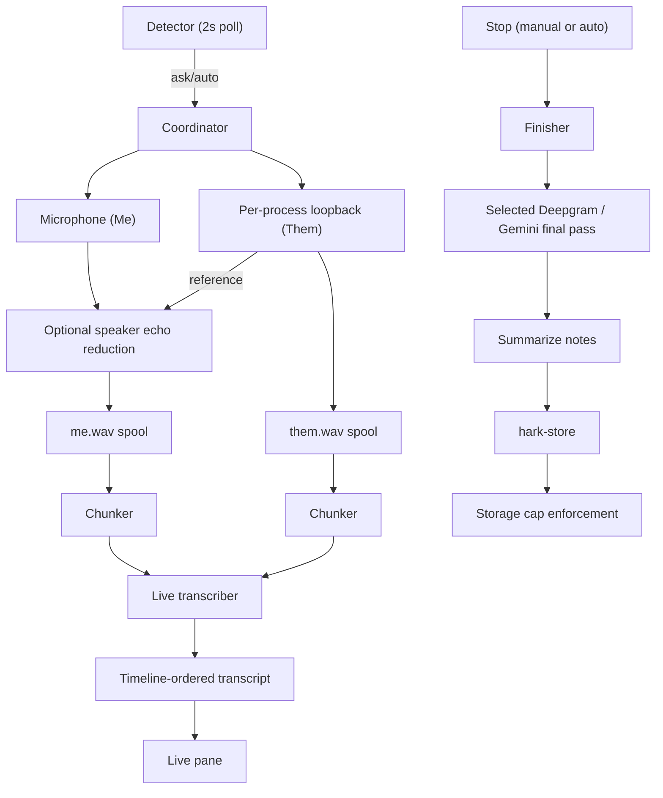

<!-- PAGE_ID: hark_15_meetings -->

Relevant source files

The following files were used as evidence for this page:

- [crates/hark-meeting/src/lib.rs](../../crates/hark-meeting/src/lib.rs)
- [crates/hark-meeting/src/session.rs](../../crates/hark-meeting/src/session.rs)
- [crates/hark-meeting/src/chunker.rs](../../crates/hark-meeting/src/chunker.rs)
- [crates/hark-meeting/src/merge.rs](../../crates/hark-meeting/src/merge.rs)
- [crates/hark-meeting/src/detect.rs](../../crates/hark-meeting/src/detect.rs)
- [crates/hark-meeting/src/probe/win.rs](../../crates/hark-meeting/src/probe/win.rs)
- [crates/hark-meeting/src/probe/mod.rs](../../crates/hark-meeting/src/probe/mod.rs)
- [crates/hark-meeting/src/storage.rs](../../crates/hark-meeting/src/storage.rs)
- [crates/hark-meeting/src/storage_fs.rs](../../crates/hark-meeting/src/storage_fs.rs)
- [crates/hark-meeting/src/export.rs](../../crates/hark-meeting/src/export.rs)
- [crates/hark-pipeline/src/meeting/mod.rs](../../crates/hark-pipeline/src/meeting/mod.rs)
- [crates/hark-pipeline/src/meeting/coordinator.rs](../../crates/hark-pipeline/src/meeting/coordinator.rs)
- [crates/hark-pipeline/src/meeting/recorder.rs](../../crates/hark-pipeline/src/meeting/recorder.rs)
- [crates/hark-pipeline/src/meeting/echo.rs](../../crates/hark-pipeline/src/meeting/echo.rs)
- [crates/hark-audio/src/meeting_aec.rs](../../crates/hark-audio/src/meeting_aec.rs)
- [crates/hark-pipeline/src/meeting/live.rs](../../crates/hark-pipeline/src/meeting/live.rs)
- [crates/hark-pipeline/src/meeting/rerun.rs](../../crates/hark-pipeline/src/meeting/rerun.rs)
- [crates/hark-pipeline/src/meeting/finish.rs](../../crates/hark-pipeline/src/meeting/finish.rs)
- [crates/hark-config/src/meeting.rs](../../crates/hark-config/src/meeting.rs)
- [crates/hark-store/src/meetings.rs](../../crates/hark-store/src/meetings.rs)
- [crates/hark-store/migrations/004_meetings.sql](../../crates/hark-store/migrations/004_meetings.sql)
- [crates/hark-stt/src/meeting.rs](../../crates/hark-stt/src/meeting.rs)
- [crates/hark-stt/src/meeting_gemini.rs](../../crates/hark-stt/src/meeting_gemini.rs)
- [crates/hark-pipeline/src/meeting/gemini_final.rs](../../crates/hark-pipeline/src/meeting/gemini_final.rs)
- [crates/hark-voice/src/summary.rs](../../crates/hark-voice/src/summary.rs)
- [crates/hark-app/src/meeting.rs](../../crates/hark-app/src/meeting.rs)
- [crates/hark-app/src/meeting_prompt.rs](../../crates/hark-app/src/meeting_prompt.rs)
- [crates/hark-app/src/storage/meetings.rs](../../crates/hark-app/src/storage/meetings.rs)
- [crates/hark-app/src/ui/meetings/mod.rs](../../crates/hark-app/src/ui/meetings/mod.rs)
- [crates/hark-app/src/ui/settings/meetings.rs](../../crates/hark-app/src/ui/settings/meetings.rs)

# Meetings

> **Related Pages**: [Architecture](../core/ARCHITECTURE.md), [Audio Capture](AUDIO_CAPTURE.md), [Transcription](TRANSCRIPTION.md), [Voice Cleanup](VOICE_CLEANUP.md), [Data Storage](../core/DATA_STORAGE.md), [Desktop UI](DESKTOP_UI.md)

---

<!-- BEGIN:AUTOGEN hark_15_meetings_overview -->
## Overview

Hark can record a meeting in any app — Teams, Zoom, a Meet tab, a Slack huddle, even an in-person conversation through the microphone alone — without a bot joining the call, and turn it into a searchable transcript with notes. The design and every decision behind it are recorded in `tasks/2026-09-26-plan-meeting-transcription.md`; this page documents the shipped result.

Meeting mode runs on **Windows, Linux, and macOS 14.2+**: the loopback module owns each platform's native-capture availability, and the coordinator, Meetings page, tray entry and Settings follow it. Elsewhere, the coordinator refuses to start with a plain "not available on this platform" error, and the UI hides those surfaces rather than showing something that cannot work ([mod.rs](../../crates/hark-pipeline/src/meeting/mod.rs)).

On Linux the two platform seams are PipeWire: system audio comes from a capture stream (the default sink's monitor for "everything but Hark", or the meeting app's own output stream nodes, converted to 16 kHz mono by PipeWire itself), and detection watches the graph's `Stream/Input/Audio` nodes instead of Core Audio capture sessions ([loopback/linux.rs](../../crates/hark-audio/src/loopback/linux.rs), [probe/linux.rs](../../crates/hark-meeting/src/probe/linux.rs)). Browser-title detection additionally needs X11 — under Wayland the probe sees no window titles, so browser-held-mic meetings are not auto-detected there while native clients (Teams, Zoom, …) detect everywhere. On macOS, Core Audio process taps carry system audio and process microphone activity feeds detection ([core_audio_mac.rs](../../crates/hark-audio/src/core_audio_mac.rs), [probe/mac.rs](../../crates/hark-meeting/src/probe/mac.rs)).

It is deliberately a second, independent system from push-to-talk dictation: its own state machine (below), its own capture streams, its own worker threads, never sharing or blocking the dictation pipeline's four-state machine. A meeting can be recording while a dictation fires, and vice versa ([mod.rs](../../crates/hark-pipeline/src/meeting/mod.rs)).

One `SessionState` machine per meeting — `Idle -> Recording -> Finalizing -> Summarizing -> Done | Failed` — governs a single meeting's lifecycle. It is deliberately separate from `hark-pipeline::state`'s one-shot press/release machine: a meeting is long-lived, and back-to-back meetings mean an old machine can still be summarizing while a new one starts recording ([session.rs:1-30](../../crates/hark-meeting/src/session.rs#L1-L30)). `advance` is total, so a stray or duplicate event (an auto-stop racing a manual stop, for example) is inert rather than a panic ([session.rs:88-122](../../crates/hark-meeting/src/session.rs#L88-L122)). A failed or skipped final pass or summary is *not* a `Failure`: the meeting keeps whatever it has (the live transcript, or the transcript without notes) and `Failed` is reserved for "nothing to keep" ([session.rs:32-42](../../crates/hark-meeting/src/session.rs#L32-L42)).
### Start / Stop Shortcut

On Windows, Linux or macOS, set **Start / stop shortcut** in Settings → Meetings to a `+`-separated chord, for example `LCtrl+F11`. Blank or **Clear** leaves it unassigned. Press once to start a manual meeting and again to stop; manual capture scope and call-adoption behavior apply. The shortcut is inactive when Meetings is disabled or unsupported, and does not depend on a dictation provider key ([settings UI](../../crates/hark-app/src/ui/settings/meetings.rs), [app routing](../../crates/hark-app/src/pipeline.rs), [coordinator toggle](../../crates/hark-pipeline/src/meeting/coordinator.rs)).

On Windows, one keyboard hook feeds both chords; Linux evdev and macOS CGEventTap feed the same shared shortcut router. Meeting toggles fire only on a physical engage edge; release, repeat, injected input, and release-recovery polling do not toggle. Equal chords and either-direction subsets are rejected regardless of key order, while distinct chords may share modifiers. The meeting chord always observes keys; the existing narrow lock-key suppression belongs only to active dictation. Recording a new dictation shortcut bypasses both trackers ([shortcut router and fixtures](../../crates/hark-hotkey/src/shortcuts.rs), [Windows hook](../../crates/hark-hotkey/src/hook_win.rs)).

Config schema 4 introduced optional `[meeting] toggle_key`, defaulting to no binding. Loading an older file backs up the original before saving the current schema (6), preserving explicit provider choices and deliberate auto-stop values. See [Configuration](../core/CONFIGURATION.md#meeting-shortcut-migration) for validation and migration details.
<!-- END:AUTOGEN hark_15_meetings_overview -->

---

<!-- BEGIN:AUTOGEN hark_15_meetings_capture -->
## Capture

Two independent channels record for the length of the call, alongside push-to-talk's own microphone stream and ring — the two never share a device handle or a buffer:

- **Me (microphone):** the Windows communications-default device by default (the same device Teams and Zoom use), or an explicit `[meeting] mic_device` override ([coordinator.rs](../../crates/hark-pipeline/src/meeting/coordinator.rs)).
- **Them (system audio):** per-process WASAPI loopback. A detected meeting captures just that app's process tree (`system_source = "app"`, the default); a manual start, or `system_source = "all"`, captures everything except Hark. Resolving "that app's process tree" means finding the root PID whose parent is not the same exe (covering a browser's or Teams' child processes) and falling back to "everything except Hark" if the app has no running process to target ([coordinator.rs](../../crates/hark-pipeline/src/meeting/coordinator.rs)). See [Audio Capture](AUDIO_CAPTURE.md#meeting-capture) for the WASAPI mechanics and the spool format both channels are written to.

`Recorder` drains both tracks every 100 ms into their WAV spool and, when a live transcript is wanted, their chunker. Both tracks use a timeline counted in 16 kHz samples since the meeting started. Initial placement estimates elapsed worker time minus captured input, including samples still buffered by Linux's mixer or the streaming resampler; buffer latency therefore does not become extra leading silence. Leading silence places a late-opening track on that timeline, and lost drain samples become same-length silence. This preserves timeline length but is not hardware timestamp alignment or drift correction. The meeting records with whatever opened — mic only if loopback failed, loopback only if the mic failed — and reports why through a notice; neither failure is fatal on its own ([recorder.rs](../../crates/hark-pipeline/src/meeting/recorder.rs)).

On Linux, simultaneous PipeWire output streams are summed on one timestamped 16 kHz timeline, so adding a second app stream does not multiply the recording's duration. Packet timestamps use the graph's monotonic clock, with a per-stream sample cursor when suitable timestamps are unavailable. Gaps become silence, output is clamped, and waiting for a silent or disappearing source is bounded to 250 ms. Stopping flushes the remaining mixed samples. This aligns the captured playback streams; it does not establish hardware alignment between the microphone and playback devices ([PipeWire capture](../../crates/hark-audio/src/loopback/linux.rs), [mixer and synthetic fixtures](../../crates/hark-audio/src/loopback/linux_mix.rs)).

The streaming resampler also flushes its filter delay when capture ends, even when the final input ended on a complete block. Output length follows the real input length; flush padding adds no duration, and a repeated drain produces no duplicate ending ([resampler and fixtures](../../crates/hark-audio/src/resample.rs)).

### Reduce Speaker Echo

Enable **Reduce speaker echo** in Settings → Meetings and save to use it from
the next meeting. The default is off (`[meeting] echo_cancellation = false`),
including when upgrading an existing configuration. It is intended for playback
through speakers; leave it off with headphones, or turn it off if the local
voice sounds worse. Only the meeting microphone is filtered. Them and
push-to-talk dictation are unchanged ([settings](../../crates/hark-app/src/ui/settings/meetings.rs),
[configuration](../../crates/hark-config/src/meeting.rs)).

The worker uses Rust `aec3 = 0.4.0` with 160-sample (10 ms) mono frames at 16 kHz,
feeding render before microphone. High-pass filtering and automatic echo-delay
estimation are enabled; separate noise suppression, gain control, and the extra
post-filter are disabled. Processing happens before the microphone spool and
live chunker, so both its retained recording and later transcription use the
processed audio; Hark does not retain a second, unprocessed mic track
([AEC wrapper](../../crates/hark-audio/src/meeting_aec.rs),
[recorder](../../crates/hark-pipeline/src/meeting/recorder.rs)).

Microphone audio waiting for its render reference is bounded to 250 ms, and
render history to two seconds. A separate **128-sample (8 ms) original-microphone
guard** covers the pinned engine's processing latency. Hark discards that leading
processed delay on startup and after reset, retaining the original microphone
samples whose delayed output has not yet arrived. This guard is separate from
the reference-pairing wait and the estimated acoustic echo delay
([wrapper](../../crates/hark-audio/src/meeting_aec.rs),
[pairing and fallback](../../crates/hark-pipeline/src/meeting/echo.rs)).

On stop or fallback, Hark writes the original guard first, followed by pending
microphone audio, including any incomplete final 10 ms frame. The ending is
therefore preserved as original audio rather than losing it behind equal input
and output sample counts. Missing reference bypasses processing, discontinuities
reset adaptation, and engine failures disable processing for the rest of the
meeting. Track-close decisions are captured once per drain; a later device error
waits for the next drain so resampler and AEC tails are flushed before the spool
and chunker close ([echo handling](../../crates/hark-pipeline/src/meeting/echo.rs),
[recorder](../../crates/hark-pipeline/src/meeting/recorder.rs)). These policies
bound waiting and preserve the ending; they do not correct device-clock drift.

The reference covers only the selected playback source. Per-process capture
cannot cancel an unrelated app's audio absent from that reference. The
[synthetic comparison](../../tools/meeting-aec-bakeoff/RESULTS.md) supported the
Rust choice and its simpler native build; real speakerphone quality and long-call
alignment remain unverified. No hardware timestamp pairing or explicit drift
correction is implemented.
<!-- END:AUTOGEN hark_15_meetings_capture -->

---

<!-- BEGIN:AUTOGEN hark_15_meetings_detection -->
## Auto-Detection

A pure `Detector` state machine receives fresh snapshots through the shared [probe facade](../../crates/hark-meeting/src/probe/mod.rs): Core Audio capture sessions on Windows, PipeWire nodes on Linux, and Core Audio process objects on macOS. On Windows the probe walks every active capture endpoint (not only the default mic, so a virtual mic such as Krisp's is covered) and keeps each audio session whose state is `AudioSessionStateActive`. A session's process is named by its package family when it has package identity (new Teams and its WebView2 helpers all report `MSTeams_8wekyb3d8bbwe`) and by exe path otherwise. A snapshot costs about 3 ms ([probe](../../crates/hark-meeting/src/probe/win.rs)).

Windows detection used to read the undocumented ConsentStore registry (`LastUsedTimeStart`/`LastUsedTimeStop`) and wake on `RegNotifyChangeKeyValue`. On Windows 11 build 26300 those values stopped changing after the updates installed on 2026-10-03, so a Teams call produced no prompt, and a manual start could not adopt the call, so it never auto-stopped. Hark 0.61.6 replaced both the read and the watcher.

Only Linux has change notification (PipeWire graph events), with a ten-second backstop for browser window-title changes and a two-second polling fallback while the watcher is down. Windows and macOS poll every two seconds; their watcher stub returns `Unsupported` and owns no worker ([coordinator](../../crates/hark-pipeline/src/meeting/coordinator.rs)). A probe error other than `Unsupported` is logged once and retried at the next poll, so a restart of the Windows audio service does not end detection for the session.

Polls alone do not land on the moment a debounce or auto-stop interval elapses. `next_observation_in_ms` therefore schedules fresh snapshots at those deadlines, preserving the five-second debounce and configurable auto-stop delay. Reopening the microphone cancels a pending stop. Recording drains remain bounded by 100 ms. Shutdown uses an explicit coordinator command, so a watcher's channel sender cannot prevent exit ([detector and deadline fixtures](../../crates/hark-meeting/src/detect.rs), [coordinator scheduling and shutdown fixtures](../../crates/hark-pipeline/src/meeting/coordinator.rs)).

`cargo test` checks the Windows process naming against the test process itself; live microphone use is checked by hand with `examples/detect_smoke.rs`.

Rules, in the order they apply:

1. **Hark never counts as a meeting.** Its own pre-roll microphone stream holds the mic open permanently, so the detector excludes its own exe path unconditionally ([detect.rs](../../crates/hark-meeting/src/detect.rs)).
2. **Only `detect_apps` counts** — a built-in list of packaged/desktop app identifiers (new and classic Teams, Zoom, Webex, Slack, Discord, GoTo, RingCentral, the Elevate desktop app, and four browsers), user-editable in Settings. A browser only counts while one of its windows carries a meeting-title marker ("Meet -", "Microsoft Teams", "Zoom", "Elevate UC"); window titles are matched in memory and never stored or logged ([detect.rs](../../crates/hark-meeting/src/detect.rs)). Serverdata's Elevate web phone is titled `Elevate UC - Google Chrome` whether idle or on a call, and Chrome held the mic only for the length of a live test call, so the marker plus the mic marks a call. Its prompt names the browser ("Chrome is using your mic"), like Meet's. The desktop app's `Elevate UC.exe` name is inferred from its product name and not yet seen on a live call, and the popup calls it "Elevate" ([mod.rs](../../crates/hark-pipeline/src/meeting/mod.rs)). Windows exposes only the front tab's title of each browser window, so a call in a background tab goes undetected; keep Elevate in its own window or install it as an app.
3. **A 5-second debounce** before a prompt or auto-start, so a quick device test or voice message never counts ([detect.rs](../../crates/hark-meeting/src/detect.rs)).
4. **One prompt per call.** "Not this meeting," a dismissal, or a manual stop suppresses that app until it fully releases the mic, so ending notes on a call that continues does not immediately re-prompt for it ([detect.rs](../../crates/hark-meeting/src/detect.rs)).
5. **Auto-stop** once the detected app has released the mic for `auto_stop_after_s` (default 15, `0` disables it). The moment the app lets go, the Meetings page says "Teams ended the call. Notes stop at 14:52:07." with a **Stop now** button, and the tray tooltip says the same; the notice clears if the app takes the mic back (a device switch mid-call). The first real test ran with a 60 s default and a silent wait, which read as auto-stop not working; a manual start **adopts the call in progress**: if a meeting app held the mic at the last check (prompted, suppressed after an unanswered prompt, or still in its debounce), the meeting auto-stops when that app hangs up, like a detected one; without a call in progress, or if the adopted app is not seen holding the mic again at the next check (the call had just ended), it is a plain manual meeting and never auto-stops ([detect.rs](../../crates/hark-meeting/src/detect.rs)). This came from the first real Meet call, started by hand after its prompt went unseen and then recorded past the hang-up. The rest of the rule set is unchanged ([detect.rs](../../crates/hark-meeting/src/detect.rs)).

`DetectMode` is `off` / `ask` (the default, a non-modal prompt) / `auto` (starts silently, but the tray and live-pane recording indicator stay visible either way — "auto" is never invisible) ([detect.rs](../../crates/hark-meeting/src/detect.rs)). The detection prompt itself follows the recording overlay's rule for the same reason: one persistent, deferred viewport, registered from root `logic`, created hidden and only ever shown or hidden — see [Desktop UI](DESKTOP_UI.md#recording-overlay). It always opens at the bottom-right of the **primary** monitor's work area, and while it waits it re-asserts always-on-top once a second without taking focus ([meeting_prompt.rs](../../crates/hark-app/src/meeting_prompt.rs)). It used to follow the monitor of the focused window, and on a tall portrait screen it opened far below the Teams window the user was watching: detected, placed and painted, yet unseen, so the notes were started by hand.
Linux microphone discovery bounds each of its two PipeWire roundtrips to one
second and exits on core connection errors. X11 title detection prefers the
EWMH managed-client lists, so it inspects browser clients rather than only their
window-manager frames. Without those lists, a cycle-safe ICCCM tree walk searches
for clients to a depth of eight and a budget of 1,024 window identifiers.
This does not add a native Wayland window-title API
([probe](../../crates/hark-meeting/src/probe/linux.rs),
[client enumeration and fixtures](../../crates/hark-meeting/src/probe/linux_windows.rs)).
<!-- END:AUTOGEN hark_15_meetings_detection -->

---

<!-- BEGIN:AUTOGEN hark_15_meetings_live -->
## Live Transcript

Each channel's continuous audio is cut into 20–30 second chunks by a `Chunker`: the cut lands at the middle of the quietest 300 ms window inside that range, so words are rarely split mid-syllable, and no chunk ever exceeds the hard 30 s cut. A chunk with nothing in it — the loopback while the user talks, the mic while the remote side does — is dropped by the same loudest-window gate a dictation clip uses, judged over the chunk rather than a whole-clip mean, so one short answer in 30 seconds of listening is still kept. Dropped chunks still advance the timeline, so every kept chunk carries its true offset ([chunker.rs:1-15](../../crates/hark-meeting/src/chunker.rs#L1-L15), [chunker.rs:116-138](../../crates/hark-meeting/src/chunker.rs#L116-L138)).

One live-transcriber thread per meeting takes chunks from both channels in arrival order — so each channel stays sequential without the two blocking each other — and transcribes them through the same provider dictation uses (the configured cloud `SttProvider`, or the on-device engine in primary local mode). A failed chunk costs one missing live line, never audio: the spool still has it, and the final pass (if configured) re-transcribes the whole call ([hark-pipeline/src/meeting/live.rs:1-8](../../crates/hark-pipeline/src/meeting/live.rs#L1-L8)). Each transcribed line passes through the same spellbook `Corrector` a dictation uses, built from the same `settings.spellbook.corrector_entries()` — a spellbook term fixes a mishearing in a meeting exactly as it would in a dictation. **Invocations never fire in meeting mode**: a trigger phrase is dictation control flow, not a correction, and meeting mode never calls the expander.

`Transcript::insert` places each transcribed segment by its chunk's start offset as results arrive, so the transcript is always in timeline order and never needs a re-sort even though the two channels' requests race each other; a tie on the same start sample orders `Me` before `Them` regardless of which request happened to return first ([merge.rs:1-10](../../crates/hark-meeting/src/merge.rs#L1-L10), [merge.rs:60-77](../../crates/hark-meeting/src/merge.rs#L60-L77)). Blank text (a chunk that passed the loudness gate but held no words) is dropped rather than becoming an empty line.
<!-- END:AUTOGEN hark_15_meetings_live -->

---

<!-- BEGIN:AUTOGEN hark_15_meetings_final_pass -->
## Deepgram Final Pass

After the call ends, if `[meeting] final_pass = "deepgram"` (the default) and a Deepgram key exists under the keychain account `deepgram` — independent of whatever provider dictation uses, so a Gemini dictation setup can still label meeting speakers — Hark sends one `multichannel=true&diarize=true&utterances=true` request over the whole recording: left channel = Me (microphone), right = Them (system audio) ([meeting.rs](../../crates/hark-stt/src/meeting.rs), [meeting.rs](../../crates/hark-stt/src/meeting.rs)). The result replaces the live Me/Them transcript with diarized "Speaker N" utterances within Them; Deepgram diarizes channel 0 too, so `speaker` is forced to `None` there rather than splitting "Me" in two ([meeting.rs](../../crates/hark-stt/src/meeting.rs)).

Without a Deepgram key, the selected Deepgram pass keeps the live transcript and reports the missing credential. `final_pass = "none"` skips automatic post-call transcription. Selecting Gemini is explicit; a missing key never silently changes the provider receiving a recording ([finish.rs](../../crates/hark-pipeline/src/meeting/finish.rs)).

The request needs its own budget: `FINAL_PASS_TIMEOUT_MS` is 900,000 ms (15 minutes), because it both uploads roughly 230 MB per recorded hour of stereo 16 kHz PCM16 and waits on Deepgram's own processing — both far past a dictation's 15-second budget ([meeting.rs](../../crates/hark-stt/src/meeting.rs)). The body streams rather than buffers, which reopens the multipart-masks-transport-errors failure mode even without the `multipart` feature; `classify_final_pass_error` falls back to walking the transport error's `source()` chain for the underlying `io::Error` before reporting a generic transport error ([meeting.rs](../../crates/hark-stt/src/meeting.rs)). Parsing clamps every utterance's timestamps into `[0, audio_ms]` — Deepgram has invented an end time past the audio length before — and drops blank transcripts ([meeting.rs](../../crates/hark-stt/src/meeting.rs)). Refined lines are corrected through the same spellbook `Corrector` as live lines before they reach the store ([finish.rs](../../crates/hark-pipeline/src/meeting/finish.rs)).
### Re-run a Saved Meeting

Open a completed meeting with retained audio and choose **Re-run final pass**. The confirmation names Deepgram, the upload, usage charges, transcript replacement, and speaker-name reset. This explicit request runs independently of the automatic `final_pass` setting and requires the Deepgram key (`HARK_DEEPGRAM_KEY` or keychain account `deepgram`). It does not regenerate notes or change the title ([detail.rs](../../crates/hark-app/src/ui/meetings/detail.rs), [rerun.rs](../../crates/hark-pipeline/src/meeting/rerun.rs)).

The worker sends the retained stereo MP3 byte for byte with `audio/mpeg`, preserving Me-left/Them-right separation. If there is no archive, it streams a stereo WAV from the original channel spools. Missing, empty, unreadable, or unsafe recording paths fail without changing the transcript. Provider failures and empty output also keep the existing transcript; invalid channel numbers and non-finite timestamps are rejected ([rerun.rs](../../crates/hark-pipeline/src/meeting/rerun.rs), [meeting.rs](../../crates/hark-stt/src/meeting.rs), [upload fixture](../../crates/hark-stt/tests/meeting_upload.rs)).

The coordinator protects the recording from audio eviction while uploading. The detail view disables repeat processing, deletion, audio exports, and speaker renaming while busy, and clears any pending speaker edit. A successful response replaces segments and clears speaker renames in one SQLite transaction; FTS follows the segment changes, while notes and title stay intact. The pump waits for the storage worker's commit acknowledgement before reporting success. After 15 seconds without an acknowledgement it reports that saving is unconfirmed; the write may still finish ([coordinator.rs](../../crates/hark-pipeline/src/meeting/coordinator.rs), [app meeting pump](../../crates/hark-app/src/meeting.rs), [store replacement and rollback tests](../../crates/hark-store/tests/meetings.rs)).
### Gemini Files final pass

Select **Use Gemini after the call** in Settings > Meetings for an alternative
post-call pass. It uses keychain account `gemini` or `HARK_GEMINI_KEY`, with the
independent `meeting.gemini_model` setting (default `gemini-3.8-flash`). The live
dictation provider/model and existing Deepgram default do not change. This choice
applies after Stop; the saved-recording **Re-run final pass** action above still
explicitly uploads to Deepgram.

The worker decodes the recording into aligned PCM chunks (symphonia 0.6 with
gapless trimming, so decoded audio starts at the recording's first sample
rather than after the encoder delay)
and visits each track
separately in five-minute windows, including the final partial window. Microphone
segments remain **Me**. Playback speakers are **Window N · Speaker M**: the same
number in another window does not establish the same person. Speaker renames
and all text/subtitle/Word exports preserve that scope
([gemini_final.rs](../../crates/hark-pipeline/src/meeting/gemini_final.rs),
[export.rs](../../crates/hark-meeting/src/export.rs)).

Uploads use the resumable Files API, then a structured Interactions request with
`store: false`. Hark allocates a content-free file name before sending audio,
validates the finalized name, rejects redirected or off-origin upload locations,
and attempts DELETE after success and failure—including malformed or lost
finalization replies. A failed deletion is reported and receives one best-effort
retry. A crash or failed cleanup can leave remote audio until provider expiry;
requesting deletion does not prove provider-side erasure
([meeting_gemini.rs](../../crates/hark-stt/src/meeting_gemini.rs)). The
cleanup rules are pinned by tests against a local mock of the Files API,
including a lost finalization reply, a failed DELETE, and an already-removed
remote file; see [Transcription](TRANSCRIPTION.md#gemini-files-meeting-adapter).

Responses must declare completion and provide valid segments. Timestamps are
clamped to the window. Conservative energy checks reject conspicuously omitted
beginnings, endings, or internal gaps, but do not prove word-for-word coverage
and can reject non-speech sounds. Any failed window discards the whole Gemini
replacement; the previous live transcript remains. A completely empty result
is also rejected. No automatic Deepgram fallback sends the audio elsewhere.

<!-- END:AUTOGEN hark_15_meetings_final_pass -->

---

<!-- BEGIN:AUTOGEN hark_15_meetings_notes -->
## Notes

If `[meeting] summary = true` (the default) and the settled transcript is non-empty, Hark makes one long-context BYOK chat-completions call — no map-reduce, since even an hour of talk fits comfortably in one request — and asks for structured notes: a short title, a plain-language summary, key points, decisions, and action items with an owner when one was named ([summary.rs:1-12](../../crates/hark-voice/src/summary.rs#L1-L12)). The response is required to be a single JSON object with an exact key shape; Hark validates it at the boundary rather than trusting the model's formatting instincts ([summary.rs:60-66](../../crates/hark-voice/src/summary.rs#L60-L66)).

The provider is resolved through the same `resolve_cleanup_provider` dictation cleanup uses, asked for as if a non-Verbatim voice were selected — a `Verbatim` dictation setup still has a text provider that can write notes, since the summary call is independent of the dictation cleanup voice ([finish.rs](../../crates/hark-pipeline/src/meeting/finish.rs)). `SUMMARY_TIMEOUT_MS` is 120,000 ms, far longer than dictation cleanup's 10-second budget, because this runs once after the call ends rather than on the release-to-inject path, and a long transcript can take tens of seconds for the provider to read ([summary.rs:37](../../crates/hark-voice/src/summary.rs#L37)). A failed or unconfigured summary call is not a `Failure` either: the meeting keeps its transcript with no notes, and a notice says why ([finish.rs](../../crates/hark-pipeline/src/meeting/finish.rs)).

The suggested title only ever applies while the meeting has none — renaming a meeting by hand is never overwritten by a later notes call ([storage/meetings.rs](../../crates/hark-app/src/storage/meetings.rs)). Notes are stored as JSON in `meetings.notes_json` and rendered with checkable action items on the meeting detail view.
<!-- END:AUTOGEN hark_15_meetings_notes -->

---

<!-- BEGIN:AUTOGEN hark_15_meetings_storage -->
## Storage and the Audio Cap

Meeting rows, transcript segments, renamed speakers, and notes live in the same local SQLite database as dictation history (migration 004): `meetings`, `meeting_segments`, `meeting_speakers`, and an external-content FTS5 index over segment text, kept in sync by trigger rather than application code ([004_meetings.sql](../../crates/hark-store/migrations/004_meetings.sql)). Meeting audio itself is never a database column — it lives on disk at `<data_dir>/meetings/<id>/`, where the id is the local start time (`20260929-140127`), suffixed `-2`, `-3`, ... when a folder of that name already exists ([coordinator.rs](../../crates/hark-pipeline/src/meeting/coordinator.rs)) — and `hark-app/src/storage/meetings.rs` is the single writer for both, called from the same storage worker thread that writes dictation history, so a size check against the filesystem and the database's idea of which meetings exist never disagree ([storage/meetings.rs](../../crates/hark-app/src/storage/meetings.rs)).

The **audio cap** (`[meeting] audio_cap_mb`, default 5,120 = 5 GB, `0` = keep no audio) is a circular limit enforced against actual bytes on disk, never the database's cached byte count, because a crash or a manual delete would otherwise let the two drift ([storage.rs:1-9](../../crates/hark-meeting/src/storage.rs#L1-L9)). `plan_eviction` is the pure decision: given every recording's size and end time, a cap, and a protected-id list, it evicts whole recordings oldest-`ended_ms`-first until the total fits, and it never returns a protected id — even when that recording alone exceeds the cap, in which case eviction stops and a one-time "this meeting is larger than your storage cap" notice fires instead ([storage.rs:41-67](../../crates/hark-meeting/src/storage.rs#L41-L67)). The meeting currently recording, and any meeting still being refined or summarized, is always protected; the coordinator tracks that set and re-checks the cap every 60 seconds while a meeting records, plus at startup and whenever the cap changes in Settings ([coordinator.rs](../../crates/hark-pipeline/src/meeting/coordinator.rs)).

Deletion itself (`storage_fs::delete_audio`) is deliberately small and guarded: it only ever removes a real, non-symlinked directory that is a direct child of `meetings/` and is named by a plain meeting id the database knows. Anything else under `meetings/` — a stray file, an unexpected directory, a symlink — is reported, never deleted ([storage_fs.rs:1-9](../../crates/hark-meeting/src/storage_fs.rs#L1-L9), [storage_fs.rs:55-81](../../crates/hark-meeting/src/storage_fs.rs#L55-L81)). Only audio ever goes; transcripts, segments, and notes are untouched by any eviction.

Deleting an entire meeting is a separate operation: the storage worker removes its audio first and only then removes the database record. A missing recording directory is safe to proceed past. Any other audio-removal failure keeps the record so the remaining audio is still known and deletion can be retried; a partial filesystem deletion is not rolled back. The detail view displays **Deleting meeting…** and returns to the list automatically only after a success reply. Failures stay visible with retry guidance, and a disconnected reply channel is reported as unconfirmed deletion ([storage command and fixtures](../../crates/hark-app/src/storage/meetings.rs), [detail view and fixtures](../../crates/hark-app/src/ui/meetings/detail.rs)).

Once a meeting's final pass and summary are saved, `compress_audio = true` (the default) re-encodes its two WAV spools into one stereo 64 kbps `audio.mp3` (LAME `Mode::Stereo`, verified against the WAVs' length before they are deleted), so 5 GB holds roughly 170 hours of meetings instead of about 21. See [Audio Capture](AUDIO_CAPTURE.md#meeting-capture) for the encoder, the crash-safe compress-then-verify order, and startup recovery.
<!-- END:AUTOGEN hark_15_meetings_storage -->

---

<!-- BEGIN:AUTOGEN hark_15_meetings_sharing -->
## Sharing and Export

The meeting detail view's **Share** menu offers Markdown/plain-text copy and save, SRT/VTT subtitles, Word documents on all three platforms, **Share with Windows**, and the native macOS share sheet. Audio retained on the device also enables whole-meeting MP3/WAV export, **Save an excerpt with audio**, and **Show audio in folder**. Export labels use speaker renames; undiarized lines stay Me/Them. Rendering and file handling are separate, and no Hark server is involved ([menu and dispatch](../../crates/hark-app/src/ui/meetings/share.rs), [pure export models](../../crates/hark-meeting/src/export.rs)).

### Subtitles

SRT and WebVTT cues use each transcript segment's start and end, sort by start time, preserve overlapping speakers, clamp to the meeting end, and omit empty or zero-length cues. Speaker/text content is escaped and whitespace normalized so content cannot inject subtitle markup or new cues. These formats use segment timing, not word-level timing ([subtitle implementation and fixtures](../../crates/hark-meeting/src/export/subtitles.rs)).

### Excerpts

Choose first/last transcript lines and **Use selected lines**, or enter start/end times such as `01:23.500`. Export creates a mono MP3 or WAV plus a `.txt` companion. The audio range is half-open `[start, end)`; it is selected in decoded 16 kHz PCM, including across codec chunks, and MP3 output is encoded again. The original stereo archive is unchanged. End-of-file clipping uses the number of audio frames actually saved to bound the matching text ([excerpt dialog](../../crates/hark-app/src/ui/meetings/share/excerpt.rs), [audio selection and tests](../../crates/hark-audio/src/mp3/excerpt.rs)).

Transcript segments intersecting that range are included in full, with their timestamps clipped and rebased to zero. Words outside an exact audio boundary may therefore appear in a crossing segment: word timestamps are not available. Meeting-wide notes are omitted. An existing companion `.txt` is never silently replaced; choose another excerpt name. If audio succeeds but transcript writing fails, the status explicitly identifies the partial result ([excerpt selection](../../crates/hark-meeting/src/export/subtitles.rs), [paired save](../../crates/hark-app/src/ui/meetings/share/excerpt.rs)).

### Word and Windows Share

Word export uses `docx-rs` 0.4.22 with default features disabled. It writes the meeting title, date/duration, notes, action items, and speaker-labelled transcript, preserving Unicode and line breaks and escaping document text. Construction and packing run on a worker; a fixture checks document XML and reopens the resulting DOCX ([Word implementation and test](../../crates/hark-app/src/ui/meetings/share/word.rs), [dependency](../../crates/hark-app/Cargo.toml)).

**Share with Windows** sends formatted meeting text to the native app chooser. Hark keeps the WinRT share source and callback alive on the main UI thread, verifies that the target window belongs to this process, and removes the callback before releasing its apartment. Opening the chooser does not itself send the content to a recipient; the user selects the destination app ([native share source](../../crates/hark-app/src/ui/meetings/share/native.rs)).

Save dialogs and encoding/writes run on workers. Export destinations cannot be inside Hark's meeting-storage directory, including through a parent symlink or junction. Text/DOCX and excerpt-audio saves use uniquely owned temporary files before replacement; failed excerpt selection leaves an existing destination intact. Whole-meeting audio exports mix both channels to mono. MP3 shares and excerpts use 40 kbps (25% larger nominal files than the previous 32 kbps) so encoder-delay/padding metadata fits. New archives and exports finalize all buffered ending audio and retain exact decoded sample counts; stored stereo archives remain 64 kbps. Older archives are unchanged and their missing endings cannot be reconstructed. Clipboard copy directly replaces clipboard contents, without dictation's stash/paste/restore sequence ([file boundaries](../../crates/hark-app/src/ui/meetings/share/files.rs), [audio exports](../../crates/hark-audio/src/mp3.rs)).

A first-run consent card on the Meetings page reminds the user that some places require every participant's consent, with a "Copy an announcement line" button that copies `"I'm using Hark to transcribe this meeting."` to the clipboard as plain text for the user to paste themselves — a deliberate plain clipboard copy, not an `hark-inject` paste into the call, for the same restore-clobbering reason as the Share menu's Copy actions ([ui/meetings/mod.rs](../../crates/hark-app/src/ui/meetings/mod.rs)). The card is shown once per install until dismissed (`consent_acknowledged`), and again on demand if `consent_reminder` stays on ([ui/meetings/mod.rs](../../crates/hark-app/src/ui/meetings/mod.rs)).
Full WAV/MP3 exports and excerpts use exclusively created, owned temporary files.
Failed writes or renames clean up the owned partial and leave unrelated files
and the existing destination intact; an existing `output.wav.tmp` or
`output.mp3.tmp` is never borrowed for the export
([export implementation](../../crates/hark-audio/src/mp3.rs),
[temporary-file ownership](../../crates/hark-audio/src/mp3/pending.rs)).
<!-- END:AUTOGEN hark_15_meetings_sharing -->

---

<!-- BEGIN:AUTOGEN hark_15_meetings_privacy -->
## Privacy

Meeting capture starts after a manual Start or an accepted detection prompt under the default `ask` mode. Explicitly selecting **Start taking notes on its own** (`auto`) also allows recording to start on detection, which can include a Meet lobby before joining. Accepted prompts normally record the detected app's process tree; a manual Start records all playback except Hark, even when it adopts a detected call for auto-stop. The configured system source or failure to resolve the detected app's process can broaden playback capture. On Linux, a detected tree without a playback stream falls back to the default sink, broadening capture to its playback. If capture itself fails, the recorder reports it and continues with microphone audio if available; Windows does not switch to endpoint loopback ([coordinator.rs](../../crates/hark-pipeline/src/meeting/coordinator.rs), [recorder.rs](../../crates/hark-pipeline/src/meeting/recorder.rs), [meeting.rs](../../crates/hark-config/src/meeting.rs)).

There are three distinct provider paths: live chunks use the configured STT provider, the selected final pass uploads both recorded channels to Deepgram or sends each track in five-minute windows to Gemini, and optional notes send the transcript to the configured text provider. On-device Primary keeps **live chunks** local but does not disable either post-processing path. To keep meeting content entirely on-device, use local Primary, set the meeting final pass to `none`, and disable summaries. A Verbatim dictation voice does not disable meeting notes. Provider requests can also include spellbook vocabulary ([coordinator.rs](../../crates/hark-pipeline/src/meeting/coordinator.rs), [finish.rs](../../crates/hark-pipeline/src/meeting/finish.rs), [meeting.rs](../../crates/hark-stt/src/meeting.rs)).

On Windows, the database is `%APPDATA%\hark\hark.db` and audio is under `%APPDATA%\hark\meetings\<id>\`. Neither is encrypted by Hark. The default cap is 5 GiB (displayed as 5 GB); active/processing recordings are protected and can exceed it. A zero cap still permits temporary audio until processing finishes. Deleting a meeting removes audio before its database data; an audio-removal error keeps the record and shows a retryable failure. **Delete all meeting audio** and cap eviction retain transcripts and notes. Local deletion does not remove exports or provider-held data ([lib.rs](../../crates/hark-config/src/lib.rs), [storage/mod.rs](../../crates/hark-app/src/storage/mod.rs), [storage/meetings.rs](../../crates/hark-app/src/storage/meetings.rs)).

Recording laws may require notifying other participants or obtaining consent. Hark offers a reminder and copyable announcement; the user delivers the announcement. No Hark-operated server receives meeting content.

Content hygiene matches the dictation-history rule: nothing that carries meeting text derives `Debug`. `Segment`, `Chunk`, `MeetingNotes`, `MeetingSegment`, and the final-pass `FinalSegment` omit `Debug` or use hand-written implementations that print offsets, lengths, and counts only, never the words themselves, so a reflexive `{:?}` in a future log line cannot leak a transcript. Window titles used for browser meeting detection are matched in memory and never stored or logged. Deletions in the storage cap are logged by meeting id and byte count only, never by title or content.

Provider and parser failures also exclude untrusted response text. HTTP diagnostics retain status and allowlisted categories; malformed transcript or notes JSON retains only an error category and numeric line/column. Transport diagnostics omit raw error strings and URLs. See [Transcription](TRANSCRIPTION.md#errors-and-metrics) and [Voice Cleanup](VOICE_CLEANUP.md#error-handling) for the shared rules.
<!-- END:AUTOGEN hark_15_meetings_privacy -->

---

<!-- BEGIN:AUTOGEN hark_15_meetings_operational -->
## Operational Notes

The optional [speaker echo reduction](#reduce-speaker-echo) uses Rust AEC3.
The isolated [AEC comparison](../../tools/meeting-aec-bakeoff/README.md) retains
two engines, a bypass control, and
[63 recorded synthetic measurements](../../tools/meeting-aec-bakeoff/RESULTS.md).
Both WSL candidates passed four streaming/metric tests; the Rust candidate also
passed a native Windows GNU check. Those measurements do not establish real
speakerphone quality, native C++ or MSVC support, or hardware capture alignment.
The production choice was accepted without further speakerphone testing; this
does not turn the remaining hardware uncertainty into a verified result.

- **Windows, Linux, and macOS 14.2+.** Native backends preserve the shared capture, transcription, AEC, speaker labels, notes, search, retention and export flows. Windows uses WASAPI and Core Audio capture sessions; Linux uses PipeWire and `/proc`; macOS uses Core Audio process taps and actual process microphone activity. Mac system audio needs a separate permission; browser titles may require Screen Recording access. Linux differences, all visible in `packaging/LINUX.md`: per-app capture targets the app's PipeWire output stream nodes (falling back to the whole default sink when the app has no stream), the save dialog uses zenity/kdialog, and the OS-native share sheet has no Linux equivalent. Platform-specific pieces are compiled out elsewhere rather than merely hidden; lint the whole workspace on Linux before pushing anything that touches them, because a Windows build never sees those `cfg` paths.
- **The Windows probe module is Windows-only for its snapshot and process list.** The facade routes macOS to its own probe, so `probe/win.rs`'s two query functions compile only for the Windows dispatch; the macOS build still compiles that module for the `ChangeWatcher` that keeps its polling backstop honest ([probe/win.rs](../../crates/hark-meeting/src/probe/win.rs), [platform dispatch](../../crates/hark-meeting/src/probe/mod.rs)).
- **Hand checks, not `cargo test`.** Per-process loopback and the platform probes need a real session (and, for full confidence, a real call): verify them with `cargo run -p hark-audio --example loopback_smoke` and `cargo run -p hark-meeting --example detect_smoke`. On a headless Linux box a private `PIPEWIRE_RUNTIME_DIR` stack with a null sink exercises the loopback; a real mic-in-a-call pass still needs a desktop. `cargo test` never opens an audio device or reads live microphone use; pure state machine, chunker, merge, detector, eviction, and export checks use fixtures and synthetic PCM.
- **The Deepgram final-pass key is independent of the dictation provider.** It lives under keychain account `deepgram` regardless of what STT provider dictation uses, so a Gemini-for-dictation user can still get Deepgram speaker labels for meetings, and vice versa.
- **`hark-meeting` is pure by construction**, with exactly two fenced exceptions: `storage_fs.rs` (measure and delete meeting audio) and the `probe/` modules (`win.rs` reading Core Audio capture sessions, `linux.rs`/`watch_linux.rs` reading PipeWire, `mac.rs` reading Core Audio process objects: who holds the microphone, and change notification on Linux). Every decision — the session machine, the chunker's cut points, the merge order, the detector's verdicts, the eviction plan, the export rendering — is tested on fixtures with no I/O, no threads, and no wall-clock time; offsets are 16 kHz sample counts throughout.
- **Finishing survives a quit or a crash.** A `.finishing` marker is written into a meeting's folder when it starts and removed only after its results (final pass, notes, archive) are sent. At startup the coordinator finishes any meeting whose folder still has it, so quitting mid-call or during a 15-minute final pass costs a re-run, never the results ([finish.rs](../../crates/hark-pipeline/src/meeting/finish.rs), [coordinator.rs](../../crates/hark-pipeline/src/meeting/coordinator.rs)). Without the live transcript at that point, notes are written only when the final pass produces a transcript.
- **Meetings keeps separate capture and processing.** Dictation and meetings share one keyboard listener (the Windows low-level hook and the Linux evdev loop both route through the pure `ShortcutTracker`) and a lightweight dispatcher, while their recording buffers, state machines, and processing workers remain independent. A missing or busy dictation worker does not prevent a meeting toggle.
<!-- END:AUTOGEN hark_15_meetings_operational -->

---

## macOS capture and sharing

Mac capture uses Core Audio process taps on macOS 14.2 or newer. Detected meetings select the meeting app; manual recordings exclude Hark from the system mix. Detection reads actual microphone activity, with browser window-title evidence where available. Grant Microphone and system-audio access before recording; Screen Recording access allows browser window titles to be read. A browser running without microphone activity does not count as a call.

The Share menu supports Markdown, plain text, Word, SRT/VTT, audio and excerpt exports on Mac. Save dialogs are native sheets on Hark’s window; the export worker waits while the main event loop continues. “Share with macOS” opens the system share sheet, and “Show audio in folder” selects the recording in Finder ([exports](../../crates/hark-app/src/ui/meetings/share.rs), [native dialogs](../../crates/hark-app/src/macos/native.m)).
