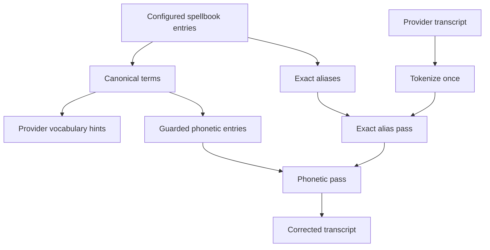

<!-- PAGE_ID: hark_08_spellbook -->

Relevant source files

The following files were used as evidence for this page:

- [crates/hark-spellbook/src/lib.rs:1-260](../../crates/hark-spellbook/src/lib.rs#L1-L260)
- [crates/hark-spellbook/src/matcher.rs:1-238](../../crates/hark-spellbook/src/matcher.rs#L1-L238)
- [crates/hark-spellbook/src/tokenize.rs:1-146](../../crates/hark-spellbook/src/tokenize.rs#L1-L146)
- [crates/hark-spellbook/src/snap.rs:1-107](../../crates/hark-spellbook/src/snap.rs#L1-L107)
- [crates/hark-spellbook/src/expander.rs:1-314](../../crates/hark-spellbook/src/expander.rs#L1-L314)
- [crates/hark-config/src/lib.rs:26-35](../../crates/hark-config/src/lib.rs#L26-L35)
- [crates/hark-config/src/lib.rs:295-373](../../crates/hark-config/src/lib.rs#L295-L373)
- [crates/hark-pipeline/src/lib.rs:158-204](../../crates/hark-pipeline/src/lib.rs#L158-L204)
- [crates/hark-pipeline/src/lib.rs:490-520](../../crates/hark-pipeline/src/lib.rs#L490-L520)
- [crates/hark-stt/src/openai_compatible.rs:47-80](../../crates/hark-stt/src/openai_compatible.rs#L47-L80)
- [crates/hark-stt/src/openai_transcribe.rs:53-75](../../crates/hark-stt/src/openai_transcribe.rs#L53-L75)
- [crates/hark-stt/src/deepgram.rs:29-47](../../crates/hark-stt/src/deepgram.rs#L29-L47)
- [crates/hark-stt/src/gemini_live.rs:170-200](../../crates/hark-stt/src/gemini_live.rs#L170-L200)
- [crates/hark-app/src/ui/spellbook/mod.rs:1-132](../../crates/hark-app/src/ui/spellbook/mod.rs#L1-L132)

# Spellbook

> **Related Pages**: [Transcription](TRANSCRIPTION.md), [Invocations](INVOCATIONS.md), [Voice Cleanup](VOICE_CLEANUP.md), [Configuration and Secrets](../core/CONFIGURATION.md)

---

<!-- BEGIN:AUTOGEN hark_08_spellbook_overview -->
## Overview

The spellbook is Hark's user-owned vocabulary. Each configuration entry has a canonical `term` and optional exact `aliases` for known mishearings. Canonical terms serve two independent paths: Hark post-corrects returned transcripts locally, and it sends the same terms to the selected STT provider as vocabulary hints. Aliases stay local because asking a provider to favor a known misspelling would work against the correction ([lib.rs:295-373](../../crates/hark-config/src/lib.rs#L295-L373)).

The `hark-spellbook` crate is pure text processing: no network, disk, or async runtime. `Corrector` precomputes match data when the pipeline starts and applies exact aliases before guarded phonetic inference for every transcript ([lib.rs:1-16](../../crates/hark-spellbook/src/lib.rs#L1-L16), [lib.rs:31-65](../../crates/hark-spellbook/src/lib.rs#L31-L65), [lib.rs:91-107](../../crates/hark-spellbook/src/lib.rs#L91-L107)).

Pipeline construction passes canonical terms into `ProviderConfig.bias_terms` and `(term, aliases)` pairs into `Corrector::new`; editing the spellbook persists the new entries and restarts the pipeline so both precomputed views update together ([lib.rs:188-203](../../crates/hark-pipeline/src/lib.rs#L188-L203), [lib.rs:490-520](../../crates/hark-pipeline/src/lib.rs#L490-L520), [mod.rs:1-17](../../crates/hark-app/src/ui/spellbook/mod.rs#L1-L17)).

Sources: [crates/hark-config/src/lib.rs:295-373](../../crates/hark-config/src/lib.rs#L295-L373), [crates/hark-spellbook/src/lib.rs:1-167](../../crates/hark-spellbook/src/lib.rs#L1-L167), [crates/hark-pipeline/src/lib.rs:188-203](../../crates/hark-pipeline/src/lib.rs#L188-L203), [crates/hark-pipeline/src/lib.rs:490-520](../../crates/hark-pipeline/src/lib.rs#L490-L520)
<!-- END:AUTOGEN hark_08_spellbook_overview -->

---

<!-- BEGIN:AUTOGEN hark_08_spellbook_matcher -->
## Phonetic Matcher

`Corrector` performs two ordered passes over one tokenization. The alias pass is exact and runs first; an alias is an explicit user instruction, so its claimed tokens cannot later be taken by a competing phonetic term. Aliases and canonical terms are both sorted longest-first to make multi-word matches win overlaps ([matcher.rs:99-168](../../crates/hark-spellbook/src/matcher.rs#L99-L168), [lib.rs:85-107](../../crates/hark-spellbook/src/lib.rs#L85-L107)).

Canonical term words choose their matching path at construction:

| Path | Eligibility | Rule |
|---|---|---|
| Exact-only | Fewer than four characters, contains a digit/non-letter, or cannot be usefully encoded | Lowercased token text must be equal |
| Phonetic | At least four Unicode alphabetic characters with a non-empty code | A primary/alternate Double Metaphone code intersects and Jaro-Winkler similarity is at least 0.85 |

Equal spellings always match without needing phonetic confirmation. Empty phonetic codes never match ([matcher.rs:170-210](../../crates/hark-spellbook/src/matcher.rs#L170-L210), [matcher.rs:228-238](../../crates/hark-spellbook/src/matcher.rs#L228-L238)). Invocations reuse this matcher at the stricter 0.90 threshold because a false positive can paste a whole canned response rather than rewrite one term ([expander.rs:17-31](../../crates/hark-spellbook/src/expander.rs#L17-L31)).

Before calling `rphonetic`, Hark folds input to the ASCII domain the library expects. Typographic apostrophes/quotes/dashes map to ASCII counterparts, common accented Latin letters map to bases, and other scripts or emoji are dropped; a resulting empty code falls back to exact-only matching. This prevents a multibyte character from triggering an invalid UTF-8 byte slice inside `rphonetic` while keeping cases such as `müller`/`muller` phonetically comparable ([matcher.rs:29-75](../../crates/hark-spellbook/src/matcher.rs#L29-L75)).

Sources: [crates/hark-spellbook/src/lib.rs:31-167](../../crates/hark-spellbook/src/lib.rs#L31-L167), [crates/hark-spellbook/src/matcher.rs:29-75](../../crates/hark-spellbook/src/matcher.rs#L29-L75), [crates/hark-spellbook/src/matcher.rs:99-238](../../crates/hark-spellbook/src/matcher.rs#L99-L238), [crates/hark-spellbook/src/expander.rs:17-31](../../crates/hark-spellbook/src/expander.rs#L17-L31)
<!-- END:AUTOGEN hark_08_spellbook_matcher -->

---

<!-- BEGIN:AUTOGEN hark_08_spellbook_tokenize -->
## Tokenization

A token stores the byte range of a word core in the original transcript plus a lowercase comparison copy. Punctuation outside the first and last alphanumeric character is excluded from the range, so splicing a canonical term preserves surrounding punctuation without reconstructing it ([tokenize.rs:1-20](../../crates/hark-spellbook/src/tokenize.rs#L1-L20), [tokenize.rs:28-52](../../crates/hark-spellbook/src/tokenize.rs#L28-L52)).

The tokenizer splits on whitespace and then on interior ASCII hyphens. It preserves byte-accurate spans for Unicode text and keeps interior apostrophes inside a word core.

| Input | Comparable tokens | Consequence |
|---|---|---|
| `modero, then` | `modero`, `then` | The comma survives replacement |
| `run hark-stt now` | `run`, `hark`, `stt`, `now` | One term shape matches spaced or hyphenated speech |
| `don't stop` | `don't`, `stop` | Interior apostrophe stays in the core |
| `müller café.` | `müller`, `café` | Unicode spans and lowercasing remain valid |
| `... -- !?` | none | Punctuation-only input is a no-op |

These cases are covered directly by tokenizer tests ([tokenize.rs:63-145](../../crates/hark-spellbook/src/tokenize.rs#L63-L145)). History selection uses the same tokenizer through `snap_to_tokens` and `snapped_text`, converting egui character ranges to token-aligned text so a clipped drag cannot create a correction the matcher will never see ([snap.rs:1-17](../../crates/hark-spellbook/src/snap.rs#L1-L17), [snap.rs:51-107](../../crates/hark-spellbook/src/snap.rs#L51-L107)).

Sources: [crates/hark-spellbook/src/tokenize.rs:1-145](../../crates/hark-spellbook/src/tokenize.rs#L1-L145), [crates/hark-spellbook/src/snap.rs:1-107](../../crates/hark-spellbook/src/snap.rs#L1-L107)
<!-- END:AUTOGEN hark_08_spellbook_tokenize -->

---

<!-- BEGIN:AUTOGEN hark_08_spellbook_biasing -->
## Provider Biasing

Only canonical terms become provider hints; aliases are known-wrong forms and remain local. `provider_config` copies `Settings.spellbook.terms()` into the provider-neutral `bias_terms` list, after which each adapter maps that list onto its own wire contract ([lib.rs:345-361](../../crates/hark-config/src/lib.rs#L345-L361), [lib.rs:164-203](../../crates/hark-pipeline/src/lib.rs#L164-L203)).

| Adapter path | Wire representation | Limit/ordering behavior |
|---|---|---|
| Whisper-family OpenAI-compatible | One comma-separated multipart `prompt` | Keeps entry order until an approximate 200-token/800-character budget is reached ([openai_compatible.rs:52-80](../../crates/hark-stt/src/openai_compatible.rs#L52-L80)) |
| `gpt-transcribe` | One multipart `keywords[]` field per term | No Hark-side term cap or prompt packing ([openai_transcribe.rs:53-75](../../crates/hark-stt/src/openai_transcribe.rs#L53-L75)) |
| Deepgram Nova | One URL query `keyterm` per term | URL-encoded, repeated, and unbounded by Hark ([deepgram.rs:29-47](../../crates/hark-stt/src/deepgram.rs#L29-L47)) |
| Gemini Live | `inputAudioTranscription.customVocabulary` array | Omitted when empty and capped at the API's 1,000-phrase limit ([gemini_live.rs:170-200](../../crates/hark-stt/src/gemini_live.rs#L170-L200)) |

The model selects the two OpenAI multipart contracts: `gpt-transcribe` routes to discrete `keywords[]`, while Whisper-family models and compatible endpoints retain the glossary prompt. Gemini Live is a separate WebSocket adapter and sends the vocabulary in its setup message ([lib.rs:168-203](../../crates/hark-pipeline/src/lib.rs#L168-L203)).

Cleanup protection is related but separate: the cleanup adapter receives canonical terms and includes only terms already present in the outgoing text, preventing the rewrite model from changing their spelling. See [Voice Cleanup](VOICE_CLEANUP.md).

Sources: [crates/hark-config/src/lib.rs:345-361](../../crates/hark-config/src/lib.rs#L345-L361), [crates/hark-pipeline/src/lib.rs:158-204](../../crates/hark-pipeline/src/lib.rs#L158-L204), [crates/hark-stt/src/openai_compatible.rs:52-80](../../crates/hark-stt/src/openai_compatible.rs#L52-L80), [crates/hark-stt/src/openai_transcribe.rs:53-75](../../crates/hark-stt/src/openai_transcribe.rs#L53-L75), [crates/hark-stt/src/deepgram.rs:29-47](../../crates/hark-stt/src/deepgram.rs#L29-L47), [crates/hark-stt/src/gemini_live.rs:170-200](../../crates/hark-stt/src/gemini_live.rs#L170-L200)
<!-- END:AUTOGEN hark_08_spellbook_biasing -->

---

<!-- BEGIN:AUTOGEN hark_08_spellbook_api -->
## Public API

The crate root exposes the transcript corrector, invocation matcher, and token-aligned selection helpers. Configuration remains in `hark-config`; the spellbook crate accepts plain owned strings and stays independent of the settings schema ([lib.rs:18-29](../../crates/hark-spellbook/src/lib.rs#L18-L29), [lib.rs:42-65](../../crates/hark-spellbook/src/lib.rs#L42-L65)).

| Item | Contract |
|---|---|
| `Corrector::new(&[(String, Vec<String>)])` | Precomputes canonical phonetic entries and exact aliases once ([lib.rs:42-58](../../crates/hark-spellbook/src/lib.rs#L42-L58)) |
| `Corrector::from_terms(&[String])` | Compatibility/convenience constructor with no aliases ([lib.rs:60-65](../../crates/hark-spellbook/src/lib.rs#L60-L65)) |
| `Corrector::correct(&str)` | Returns `(corrected_text, replacement_count)` and never errors; a no-match result means only “left as transcribed” ([lib.rs:67-123](../../crates/hark-spellbook/src/lib.rs#L67-L123)) |
| `snap_to_tokens` / `snapped_text` | Expand UI character selections to the actual tokenizer's word boundaries ([snap.rs:51-81](../../crates/hark-spellbook/src/snap.rs#L51-L81)) |
| `Expander`, `Expansion`, `Scope` | Invocation matching/result types documented on [Invocations](INVOCATIONS.md) ([expander.rs:33-71](../../crates/hark-spellbook/src/expander.rs#L33-L71)) |
| `phrase_word_count` / `normalized_phrase` | Share trigger validation and identity rules with the matcher ([expander.rs:298-314](../../crates/hark-spellbook/src/expander.rs#L298-L314)) |

`correct` tokenizes and encodes the transcript once, tracks consumed windows across the exact and phonetic passes, and applies sorted byte-range splices at the end. An already-canonical match consumes its window to prevent overlap but produces no splice and does not increment the replacement count ([lib.rs:72-167](../../crates/hark-spellbook/src/lib.rs#L72-L167)).

Sources: [crates/hark-spellbook/src/lib.rs:18-167](../../crates/hark-spellbook/src/lib.rs#L18-L167), [crates/hark-spellbook/src/snap.rs:51-81](../../crates/hark-spellbook/src/snap.rs#L51-L81), [crates/hark-spellbook/src/expander.rs:33-71](../../crates/hark-spellbook/src/expander.rs#L33-L71), [crates/hark-spellbook/src/expander.rs:298-314](../../crates/hark-spellbook/src/expander.rs#L298-L314)
<!-- END:AUTOGEN hark_08_spellbook_api -->

---

<!-- BEGIN:AUTOGEN hark_08_spellbook_edge -->
## Edge Cases

| Case | Current behavior |
|---|---|
| Empty entries, empty text, or punctuation-only text | Identity result with zero replacements ([lib.rs:67-79](../../crates/hark-spellbook/src/lib.rs#L67-L79), [tokenize.rs:125-130](../../crates/hark-spellbook/src/tokenize.rs#L125-L130)) |
| Exact alias competes with a phonetic term | Alias wins because explicit user intent runs first and shares the consumed-token set ([lib.rs:91-107](../../crates/hark-spellbook/src/lib.rs#L91-L107)) |
| Multi-word overlaps | Longer token count wins; canonical terms then use character length as the tiebreaker ([matcher.rs:99-129](../../crates/hark-spellbook/src/matcher.rs#L99-L129)) |
| Short words, digits, non-Latin text | Exact-only matching; phonetic inference is never forced where Double Metaphone is unreliable ([matcher.rs:29-75](../../crates/hark-spellbook/src/matcher.rs#L29-L75), [matcher.rs:170-180](../../crates/hark-spellbook/src/matcher.rs#L170-L180)) |
| Legacy `terms` / `bias_terms` config | Schema 2 migrates values into `[[spellbook.entries]]`, preserves existing entries, and stamps the current version ([lib.rs:26-35](../../crates/hark-config/src/lib.rs#L26-L35), [lib.rs:325-373](../../crates/hark-config/src/lib.rs#L325-L373)) |
| Common-word alias | Allowed, but the editor warns because an exact alias made entirely of common words can fire frequently; the warning does not block the user's choice ([edit.rs:102-134](../../crates/hark-app/src/ui/spellbook/edit.rs#L102-L134)) |

The editor saves automatically and restarts the pipeline after a change because corrector entries are baked at pipeline construction. A History selection becomes an alias while the user supplies the canonical term, preserving both what the provider heard and what should be injected ([mod.rs:1-17](../../crates/hark-app/src/ui/spellbook/mod.rs#L1-L17), [mod.rs:67-90](../../crates/hark-app/src/ui/spellbook/mod.rs#L67-L90)).

Sources: [crates/hark-spellbook/src/lib.rs:67-167](../../crates/hark-spellbook/src/lib.rs#L67-L167), [crates/hark-spellbook/src/matcher.rs:29-75](../../crates/hark-spellbook/src/matcher.rs#L29-L75), [crates/hark-config/src/lib.rs:26-35](../../crates/hark-config/src/lib.rs#L26-L35), [crates/hark-config/src/lib.rs:325-373](../../crates/hark-config/src/lib.rs#L325-L373), [crates/hark-app/src/ui/spellbook/mod.rs:1-90](../../crates/hark-app/src/ui/spellbook/mod.rs#L1-L90)
<!-- END:AUTOGEN hark_08_spellbook_edge -->

---
