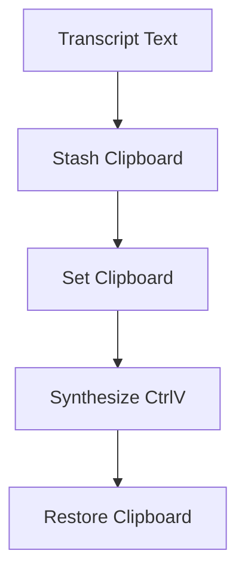

<!-- PAGE_ID: hark_10_text_injection -->
<details>
<summary>Relevant source files</summary>

The following files were used as evidence for this page:

- [crates/hark-inject/src/lib.rs:1-46](https://github.com/BoardPandas/Hark/blob/1c1738716fa4cd758b0c26ec94d0873d1bc35ac1/crates/hark-inject/src/lib.rs#L1-L46)
- [crates/hark-inject/src/lib.rs:56-88](https://github.com/BoardPandas/Hark/blob/1c1738716fa4cd758b0c26ec94d0873d1bc35ac1/crates/hark-inject/src/lib.rs#L56-L88)
- [crates/hark-inject/src/clipboard.rs:1-40](https://github.com/BoardPandas/Hark/blob/1c1738716fa4cd758b0c26ec94d0873d1bc35ac1/crates/hark-inject/src/clipboard.rs#L1-L40)
- [crates/hark-inject/src/clipboard.rs:42-64](https://github.com/BoardPandas/Hark/blob/1c1738716fa4cd758b0c26ec94d0873d1bc35ac1/crates/hark-inject/src/clipboard.rs#L42-L64)
- [crates/hark-inject/src/clipboard.rs:66-133](https://github.com/BoardPandas/Hark/blob/1c1738716fa4cd758b0c26ec94d0873d1bc35ac1/crates/hark-inject/src/clipboard.rs#L66-L133)
- [crates/hark-inject/src/keys.rs:1-14](https://github.com/BoardPandas/Hark/blob/1c1738716fa4cd758b0c26ec94d0873d1bc35ac1/crates/hark-inject/src/keys.rs#L1-L14)
- [crates/hark-inject/src/keys.rs:16-36](https://github.com/BoardPandas/Hark/blob/1c1738716fa4cd758b0c26ec94d0873d1bc35ac1/crates/hark-inject/src/keys.rs#L16-L36)
- [crates/hark-inject/src/keys.rs:38-45](https://github.com/BoardPandas/Hark/blob/1c1738716fa4cd758b0c26ec94d0873d1bc35ac1/crates/hark-inject/src/keys.rs#L38-L45)

</details>

# Text Injection

> **Related Pages**: [Architecture](../core/ARCHITECTURE.md), [Configuration and Secrets](../core/CONFIGURATION.md), [Transcription](TRANSCRIPTION.md)

---

<!-- BEGIN:AUTOGEN hark_10_text_injection_overview -->
## Overview

Text injection is the final step of the release-to-inject pipeline: it delivers the polished transcript into the cursor of whatever app is in the foreground. The `hark-inject` crate implements this with two strategies chosen by config: a clipboard-based paste sequence (stash the current clipboard, set the transcript, synthesize Ctrl+V, restore the stash) and a character-typing fallback that never touches the clipboard, for paste-hostile fields ([lib.rs:1-25](https://github.com/BoardPandas/Hark/blob/1c1738716fa4cd758b0c26ec94d0873d1bc35ac1/crates/hark-inject/src/lib.rs#L1-L25)).

The default strategy is `Clipboard`, which tries the paste path first and falls back to typing automatically if the clipboard path fails in a way that typing can recover from ([lib.rs:37-46](https://github.com/BoardPandas/Hark/blob/1c1738716fa4cd758b0c26ec94d0873d1bc35ac1/crates/hark-inject/src/lib.rs#L37-L46)). The `Type` strategy skips the clipboard entirely and always types ([lib.rs:64-69](https://github.com/BoardPandas/Hark/blob/1c1738716fa4cd758b0c26ec94d0873d1bc35ac1/crates/hark-inject/src/lib.rs#L64-L69)). An empty transcript is a no-op by design: it must not clobber the clipboard or synthesize any keystrokes ([lib.rs:73-76](https://github.com/BoardPandas/Hark/blob/1c1738716fa4cd758b0c26ec94d0873d1bc35ac1/crates/hark-inject/src/lib.rs#L73-L76)).



Sources: [lib.rs:1-25](https://github.com/BoardPandas/Hark/blob/1c1738716fa4cd758b0c26ec94d0873d1bc35ac1/crates/hark-inject/src/lib.rs#L1-L25), [lib.rs:37-46](https://github.com/BoardPandas/Hark/blob/1c1738716fa4cd758b0c26ec94d0873d1bc35ac1/crates/hark-inject/src/lib.rs#L37-L46), [lib.rs:64-88](https://github.com/BoardPandas/Hark/blob/1c1738716fa4cd758b0c26ec94d0873d1bc35ac1/crates/hark-inject/src/lib.rs#L64-L88)
<!-- END:AUTOGEN hark_10_text_injection_overview -->

---

<!-- BEGIN:AUTOGEN hark_10_text_injection_clipboard -->
## Clipboard Strategy

The clipboard path (`paste_via_clipboard`) runs a seven-step sequence: open the clipboard, stash whatever text is currently on it, set the transcript with retries, read back and verify the set took, sleep, synthesize the paste chord, sleep again, then restore the stash ([clipboard.rs:76-133](https://github.com/BoardPandas/Hark/blob/1c1738716fa4cd758b0c26ec94d0873d1bc35ac1/crates/hark-inject/src/clipboard.rs#L76-L133)).

The set-then-paste-then-restore sequence is a race with no OS-guaranteed timing: pasting immediately after a clipboard set can paste the OLD content, so the crate treats the read-back verify as load-bearing and never removes it ([clipboard.rs:1-12](https://github.com/BoardPandas/Hark/blob/1c1738716fa4cd758b0c26ec94d0873d1bc35ac1/crates/hark-inject/src/clipboard.rs#L1-L12)). If the verify mismatches, the call fails with `VerifyMismatch` rather than pasting stale content ([clipboard.rs:103-108](https://github.com/BoardPandas/Hark/blob/1c1738716fa4cd758b0c26ec94d0873d1bc35ac1/crates/hark-inject/src/clipboard.rs#L103-L108)).

The clipboard is a global object shared with every other process on the machine, so `set_text` calls run inside a bounded retry loop (`with_retries`) that only retries while the error is `ClipboardOccupied`; any other backend error fails immediately ([clipboard.rs:42-64](https://github.com/BoardPandas/Hark/blob/1c1738716fa4cd758b0c26ec94d0873d1bc35ac1/crates/hark-inject/src/clipboard.rs#L42-L64), [clipboard.rs:70-72](https://github.com/BoardPandas/Hark/blob/1c1738716fa4cd758b0c26ec94d0873d1bc35ac1/crates/hark-inject/src/clipboard.rs#L70-L72)). Restore uses the same retry loop, but a restore failure is only logged as a warning: by that point the dictation text is already pasted, so a failed restore is not treated as a failed dictation ([clipboard.rs:119-131](https://github.com/BoardPandas/Hark/blob/1c1738716fa4cd758b0c26ec94d0873d1bc35ac1/crates/hark-inject/src/clipboard.rs#L119-L131)).

| Setting | Default | Purpose | Source |
|---|---|---|---|
| `set_paste_delay_ms` | `50` | Delay after clipboard set, before the paste chord, to let the set settle | ([lib.rs:41](https://github.com/BoardPandas/Hark/blob/1c1738716fa4cd758b0c26ec94d0873d1bc35ac1/crates/hark-inject/src/lib.rs#L41), [clipboard.rs:110-111](https://github.com/BoardPandas/Hark/blob/1c1738716fa4cd758b0c26ec94d0873d1bc35ac1/crates/hark-inject/src/clipboard.rs#L110-L111)) |
| `paste_restore_delay_ms` | `50` | Delay after the paste chord, before restoring the stash, so the foreground app has time to read the clipboard | ([lib.rs:42](https://github.com/BoardPandas/Hark/blob/1c1738716fa4cd758b0c26ec94d0873d1bc35ac1/crates/hark-inject/src/lib.rs#L42), [clipboard.rs:116-117](https://github.com/BoardPandas/Hark/blob/1c1738716fa4cd758b0c26ec94d0873d1bc35ac1/crates/hark-inject/src/clipboard.rs#L116-L117)) |
| `clipboard_retries` | `8` | Max retry attempts for both the set and the restore, on `ClipboardOccupied` only | ([lib.rs:43](https://github.com/BoardPandas/Hark/blob/1c1738716fa4cd758b0c26ec94d0873d1bc35ac1/crates/hark-inject/src/lib.rs#L43), [clipboard.rs:89-101](https://github.com/BoardPandas/Hark/blob/1c1738716fa4cd758b0c26ec94d0873d1bc35ac1/crates/hark-inject/src/clipboard.rs#L89-L101)) |
| `RETRY_SPACING` (internal) | `15ms` | Sleep between retry attempts | ([clipboard.rs:66-68](https://github.com/BoardPandas/Hark/blob/1c1738716fa4cd758b0c26ec94d0873d1bc35ac1/crates/hark-inject/src/clipboard.rs#L66-L68)) |

```rust
// crates/hark-inject/src/clipboard.rs:83-107
let stashed: Option<String> = clipboard.get_text().ok();

with_retries(
    settings.clipboard_retries,
    RETRY_SPACING,
    || clipboard.set_text(text.to_string()),
    is_occupied,
)
.map_err(|(e, attempts)| {
    if is_occupied(&e) {
        ClipboardError::Busy { attempts }
    } else {
        ClipboardError::Backend(e.to_string())
    }
})?;

let now = clipboard.get_text().ok();
if now.as_deref() != Some(text) {
    return Err(ClipboardError::VerifyMismatch);
}
```

Accepted v1 limitation: `arboard`'s `set_text` round-trips TEXT only and clears every other clipboard format on set, so an image/RTF/HTML clipboard present before dictation is not preserved by stash/restore; full fidelity would need per-format `EnumClipboardFormats` handling and is out of scope until it hurts ([clipboard.rs:9-12](https://github.com/BoardPandas/Hark/blob/1c1738716fa4cd758b0c26ec94d0873d1bc35ac1/crates/hark-inject/src/clipboard.rs#L9-L12)).

Sources: [clipboard.rs:1-133](https://github.com/BoardPandas/Hark/blob/1c1738716fa4cd758b0c26ec94d0873d1bc35ac1/crates/hark-inject/src/clipboard.rs#L1-L133)
<!-- END:AUTOGEN hark_10_text_injection_clipboard -->

---

<!-- BEGIN:AUTOGEN hark_10_text_injection_keys -->
## Keystroke Fallback

Key synthesis is I/O glue built on `enigo`, deliberately pinned at version 0.6.1 because its synthesized events must carry the OS-level injected flag (`LLKHF_INJECTED` on Windows) that `hark-hotkey`'s own low-level hook filters on to ignore Hark's own paste chord; this contract has regressed across `enigo` versions before, so any version bump requires re-running the real-hardware check that the hook still ignores it ([keys.rs:1-8](https://github.com/BoardPandas/Hark/blob/1c1738716fa4cd758b0c26ec94d0873d1bc35ac1/crates/hark-inject/src/keys.rs#L1-L8)).

Two operations use this machinery: `send_paste`, which synthesizes the platform paste chord (Ctrl+V, or Cmd+V via `Key::Meta` on macOS), and `type_text`, which types the transcript character by character as the paste-hostile fallback ([keys.rs:16-45](https://github.com/BoardPandas/Hark/blob/1c1738716fa4cd758b0c26ec94d0873d1bc35ac1/crates/hark-inject/src/keys.rs#L16-L45)). `send_paste` always releases the modifier key even if the `V` click itself failed, because a stuck Ctrl key left pressed is worse than one failed paste ([keys.rs:24-35](https://github.com/BoardPandas/Hark/blob/1c1738716fa4cd758b0c26ec94d0873d1bc35ac1/crates/hark-inject/src/keys.rs#L24-L35)).

```rust
// crates/hark-inject/src/keys.rs:16-36
pub(crate) fn send_paste() -> Result<(), String> {
    let mut enigo = new_enigo()?;
    #[cfg(target_os = "macos")]
    let modifier = Key::Meta;
    #[cfg(not(target_os = "macos"))]
    let modifier = Key::Control;

    enigo
        .key(modifier, Direction::Press)
        .map_err(|e| format!("modifier press failed: {e}"))?;
    let result = enigo
        .key(Key::Unicode('v'), Direction::Click)
        .map_err(|e| format!("V click failed: {e}"));
    let release = enigo
        .key(modifier, Direction::Release)
        .map_err(|e| format!("modifier release failed: {e}"));
    result.and(release)
}
```

`type_text` is slower than pasting but touches no clipboard at all, which is what makes it the safe fallback for fields that reject paste ([keys.rs:38-45](https://github.com/BoardPandas/Hark/blob/1c1738716fa4cd758b0c26ec94d0873d1bc35ac1/crates/hark-inject/src/keys.rs#L38-L45)).

Sources: [keys.rs:1-45](https://github.com/BoardPandas/Hark/blob/1c1738716fa4cd758b0c26ec94d0873d1bc35ac1/crates/hark-inject/src/keys.rs#L1-L45)
<!-- END:AUTOGEN hark_10_text_injection_keys -->

---

<!-- BEGIN:AUTOGEN hark_10_text_injection_api -->
## Public API

The crate's entry point is `inject(text, settings)`, which maps the configured `Strategy` to an internal `Plan` and dispatches accordingly ([lib.rs:56-88](https://github.com/BoardPandas/Hark/blob/1c1738716fa4cd758b0c26ec94d0873d1bc35ac1/crates/hark-inject/src/lib.rs#L56-L88)). Strategy-to-plan mapping is pure logic kept separate from the I/O glue so it is unit-testable without touching a real clipboard or keyboard ([lib.rs:56-69](https://github.com/BoardPandas/Hark/blob/1c1738716fa4cd758b0c26ec94d0873d1bc35ac1/crates/hark-inject/src/lib.rs#L56-L69)).

| Item | Kind | Description | Source |
|---|---|---|---|
| `Strategy` | enum | `Clipboard` (default, paste with typing fallback) or `Type` (typing only, never touches the clipboard) | ([lib.rs:17-25](https://github.com/BoardPandas/Hark/blob/1c1738716fa4cd758b0c26ec94d0873d1bc35ac1/crates/hark-inject/src/lib.rs#L17-L25)) |
| `InjectSettings` | struct | Holds `strategy` plus the three timing/retry knobs | ([lib.rs:29-46](https://github.com/BoardPandas/Hark/blob/1c1738716fa4cd758b0c26ec94d0873d1bc35ac1/crates/hark-inject/src/lib.rs#L29-L46)) |
| `InjectError` | enum | `Clipboard(ClipboardError)` or `Typing(String)`, the two top-level failure kinds | ([lib.rs:48-54](https://github.com/BoardPandas/Hark/blob/1c1738716fa4cd758b0c26ec94d0873d1bc35ac1/crates/hark-inject/src/lib.rs#L48-L54)) |
| `inject(text, settings)` | function | The single public entry point; empty text is a no-op | ([lib.rs:73-88](https://github.com/BoardPandas/Hark/blob/1c1738716fa4cd758b0c26ec94d0873d1bc35ac1/crates/hark-inject/src/lib.rs#L73-L88)) |
| `ClipboardError` (re-exported) | enum | `Busy`, `VerifyMismatch`, `Backend`, `Paste`; see [Edge Cases](#edge-cases) | ([lib.rs:11](https://github.com/BoardPandas/Hark/blob/1c1738716fa4cd758b0c26ec94d0873d1bc35ac1/crates/hark-inject/src/lib.rs#L11), [clipboard.rs:20-30](https://github.com/BoardPandas/Hark/blob/1c1738716fa4cd758b0c26ec94d0873d1bc35ac1/crates/hark-inject/src/clipboard.rs#L20-L30)) |

`Strategy` intentionally mirrors `hark-config`'s equivalent enum without depending on that crate; the pipeline is responsible for mapping between the two, keeping `hark-inject` decoupled from configuration parsing ([lib.rs:15-16](https://github.com/BoardPandas/Hark/blob/1c1738716fa4cd758b0c26ec94d0873d1bc35ac1/crates/hark-inject/src/lib.rs#L15-L16)).

```rust
// crates/hark-inject/src/lib.rs:73-88
pub fn inject(text: &str, settings: &InjectSettings) -> Result<(), InjectError> {
    if text.is_empty() {
        return Ok(());
    }
    match plan_for(settings.strategy) {
        Plan::TypeOnly => keys::type_text(text).map_err(InjectError::Typing),
        Plan::ClipboardThenType => match clipboard::paste_via_clipboard(text, settings) {
            Ok(()) => Ok(()),
            Err(e) if e.should_fallback_to_typing() => {
                log::warn!("clipboard paste failed ({e}); falling back to char typing");
                keys::type_text(text).map_err(InjectError::Typing)
            }
            Err(e) => Err(InjectError::Clipboard(e)),
        },
    }
}
```

Sources: [lib.rs:1-116](https://github.com/BoardPandas/Hark/blob/1c1738716fa4cd758b0c26ec94d0873d1bc35ac1/crates/hark-inject/src/lib.rs#L1-L116)
<!-- END:AUTOGEN hark_10_text_injection_api -->

---

<!-- BEGIN:AUTOGEN hark_10_text_injection_edge -->
## Edge Cases

| Case | Detection | Handling | Source |
|---|---|---|---|
| Empty transcript | `text.is_empty()` checked before any I/O | Returns `Ok(())` immediately; never opens the clipboard or synthesizes keys | ([lib.rs:73-76](https://github.com/BoardPandas/Hark/blob/1c1738716fa4cd758b0c26ec94d0873d1bc35ac1/crates/hark-inject/src/lib.rs#L73-L76)) |
| Clipboard busy (another process holds it) | `arboard::Error::ClipboardOccupied` from `set_text` | Retried up to `clipboard_retries` times with `RETRY_SPACING` (15ms) between attempts; exhaustion yields `ClipboardError::Busy` and falls back to typing | ([clipboard.rs:70-72](https://github.com/BoardPandas/Hark/blob/1c1738716fa4cd758b0c26ec94d0873d1bc35ac1/crates/hark-inject/src/clipboard.rs#L70-L72), [clipboard.rs:89-101](https://github.com/BoardPandas/Hark/blob/1c1738716fa4cd758b0c26ec94d0873d1bc35ac1/crates/hark-inject/src/clipboard.rs#L89-L101)) |
| Clipboard set did not take (clipboard manager/sync tool interference) | Read-back after set does not match the text just set | Returns `ClipboardError::VerifyMismatch` before pasting, so stale content is never injected; falls back to typing | ([clipboard.rs:103-108](https://github.com/BoardPandas/Hark/blob/1c1738716fa4cd758b0c26ec94d0873d1bc35ac1/crates/hark-inject/src/clipboard.rs#L103-L108)) |
| Non-text clipboard content before dictation (image, RTF, HTML) | `clipboard.get_text()` on stash returns `Err`, stashed as `None` | That content is lost on restore; documented accepted v1 limitation, not a bug | ([clipboard.rs:83-85](https://github.com/BoardPandas/Hark/blob/1c1738716fa4cd758b0c26ec94d0873d1bc35ac1/crates/hark-inject/src/clipboard.rs#L83-L85), [clipboard.rs:9-12](https://github.com/BoardPandas/Hark/blob/1c1738716fa4cd758b0c26ec94d0873d1bc35ac1/crates/hark-inject/src/clipboard.rs#L9-L12)) |
| Restore fails after paste already happened | `with_retries` on the restore call returns `Err` | Logged as a warning only; the dictation itself is not treated as failed since the text is already injected | ([clipboard.rs:119-131](https://github.com/BoardPandas/Hark/blob/1c1738716fa4cd758b0c26ec94d0873d1bc35ac1/crates/hark-inject/src/clipboard.rs#L119-L131)) |
| Key synthesis itself fails (`Paste` error) | `ClipboardError::Paste(_)` from `send_paste` | `should_fallback_to_typing` returns `false` for this case only, since typing rides the same `enigo` machinery and would fail identically | ([clipboard.rs:32-39](https://github.com/BoardPandas/Hark/blob/1c1738716fa4cd758b0c26ec94d0873d1bc35ac1/crates/hark-inject/src/clipboard.rs#L32-L39)) |

Sources: [lib.rs:73-88](https://github.com/BoardPandas/Hark/blob/1c1738716fa4cd758b0c26ec94d0873d1bc35ac1/crates/hark-inject/src/lib.rs#L73-L88), [clipboard.rs:32-133](https://github.com/BoardPandas/Hark/blob/1c1738716fa4cd758b0c26ec94d0873d1bc35ac1/crates/hark-inject/src/clipboard.rs#L32-L133)
<!-- END:AUTOGEN hark_10_text_injection_edge -->

---
