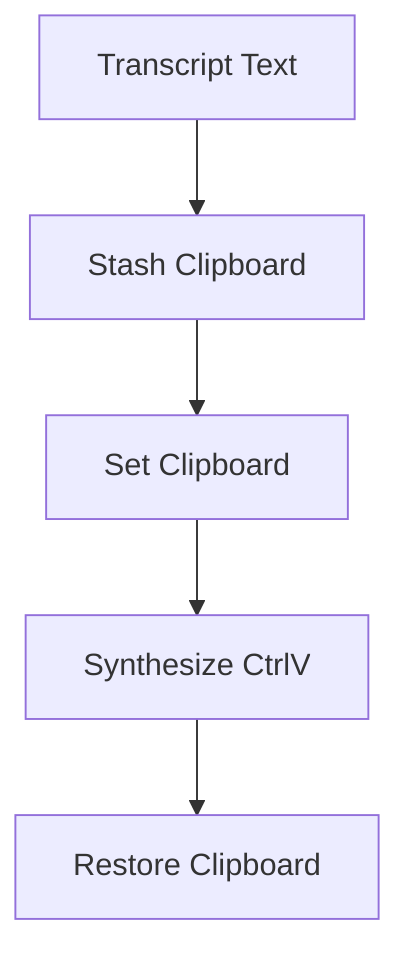

<!-- PAGE_ID: hark_10_text_injection -->
<details>
<summary>Relevant source files</summary>

The following files were used as evidence for this page:

- [crates/hark-inject/src/lib.rs:1-46](https://github.com/BoardPandas/Hark/blob/1c1738716fa4cd758b0c26ec94d0873d1bc35ac1/crates/hark-inject/src/lib.rs#L1-L46)
- [crates/hark-inject/src/lib.rs:56-88](https://github.com/BoardPandas/Hark/blob/1c1738716fa4cd758b0c26ec94d0873d1bc35ac1/crates/hark-inject/src/lib.rs#L56-L88)
- [crates/hark-inject/src/clipboard.rs:1-40](https://github.com/BoardPandas/Hark/blob/1c1738716fa4cd758b0c26ec94d0873d1bc35ac1/crates/hark-inject/src/clipboard.rs#L1-L40)
- [crates/hark-inject/src/clipboard.rs:42-64](https://github.com/BoardPandas/Hark/blob/1c1738716fa4cd758b0c26ec94d0873d1bc35ac1/crates/hark-inject/src/clipboard.rs#L42-L64)
- [crates/hark-inject/src/clipboard.rs:66-133](https://github.com/BoardPandas/Hark/blob/1c1738716fa4cd758b0c26ec94d0873d1bc35ac1/crates/hark-inject/src/clipboard.rs#L66-L133)
- [crates/hark-inject/src/keys.rs:1-14](https://github.com/BoardPandas/Hark/blob/1c1738716fa4cd758b0c26ec94d0873d1bc35ac1/crates/hark-inject/src/keys.rs#L1-L14)
- [crates/hark-inject/src/keys.rs:16-36](https://github.com/BoardPandas/Hark/blob/1c1738716fa4cd758b0c26ec94d0873d1bc35ac1/crates/hark-inject/src/keys.rs#L16-L36)
- [crates/hark-inject/src/keys.rs:38-45](https://github.com/BoardPandas/Hark/blob/1c1738716fa4cd758b0c26ec94d0873d1bc35ac1/crates/hark-inject/src/keys.rs#L38-L45)

</details>

# Text Injection

> **Related Pages**: [Architecture](../core/ARCHITECTURE.md), [Configuration and Secrets](../core/CONFIGURATION.md), [Transcription](TRANSCRIPTION.md)

---

<!-- BEGIN:AUTOGEN hark_10_text_injection_overview -->
## Overview

Text injection is the final step of the release-to-inject pipeline: it delivers the polished transcript into the cursor of whatever app is in the foreground. The `hark-inject` crate implements this with two strategies chosen by config: a clipboard-based paste sequence (stash the current clipboard, set the transcript, synthesize Ctrl+V, restore the stash) and a character-typing fallback that never touches the clipboard, for paste-hostile fields ([lib.rs:1-25](https://github.com/BoardPandas/Hark/blob/1c1738716fa4cd758b0c26ec94d0873d1bc35ac1/crates/hark-inject/src/lib.rs#L1-L25)).

The default strategy is `Clipboard`, which tries the paste path first and falls back to typing automatically if the clipboard path fails in a way that typing can recover from ([lib.rs:37-46](https://github.com/BoardPandas/Hark/blob/1c1738716fa4cd758b0c26ec94d0873d1bc35ac1/crates/hark-inject/src/lib.rs#L37-L46)). The `Type` strategy skips the clipboard entirely and always types ([lib.rs:64-69](https://github.com/BoardPandas/Hark/blob/1c1738716fa4cd758b0c26ec94d0873d1bc35ac1/crates/hark-inject/src/lib.rs#L64-L69)). An empty transcript is a no-op by design: it must not clobber the clipboard or synthesize any keystrokes ([lib.rs:73-76](https://github.com/BoardPandas/Hark/blob/1c1738716fa4cd758b0c26ec94d0873d1bc35ac1/crates/hark-inject/src/lib.rs#L73-L76)).


```mermaid
graph TD
    Text["Transcript Text"] --> Stash["Stash Clipboard"]
    Stash --> SetClip["Set Clipboard"]
    SetClip --> SynthPaste["Synthesize CtrlV"]
    SynthPaste --> Restore["Restore Clipboard"]
```

Sources: [lib.rs:1-25](https://github.com/BoardPandas/Hark/blob/1c1738716fa4cd758b0c26ec94d0873d1bc35ac1/crates/hark-inject/src/lib.rs#L1-L25), [lib.rs:37-46](https://github.com/BoardPandas/Hark/blob/1c1738716fa4cd758b0c26ec94d0873d1bc35ac1/crates/hark-inject/src/lib.rs#L37-L46), [lib.rs:64-88](https://github.com/BoardPandas/Hark/blob/1c1738716fa4cd758b0c26ec94d0873d1bc35ac1/crates/hark-inject/src/lib.rs#L64-L88)
<!-- END:AUTOGEN hark_10_text_injection_overview -->

---

<!-- BEGIN:AUTOGEN hark_10_text_injection_clipboard -->
## Clipboard Strategy

The transaction opens the clipboard, reads and stashes its text, replaces it, verifies the replacement, waits, sends the paste chord, waits for the target to read, and restores the stash. All clipboard reads and writes retry only `ClipboardOccupied`, with the configured bound. Only `ContentNotAvailable` means there is no text to preserve; another stash-read failure stops before replacement ([transaction and regressions](../../crates/hark-inject/src/clipboard.rs)).

Read-back verification prevents pasting stale clipboard content. A restoration guard is installed immediately after replacement succeeds, so verification failures, paste errors, and unwinding also attempt restoration. Paste errors retain the post-paste delay because the V key may already have reached the target before modifier release failed. Restoration errors are warnings and do not replace the primary result or cause duplicate fallback typing ([clipboard](../../crates/hark-inject/src/clipboard.rs), [fallback policy](../../crates/hark-inject/src/lib.rs)).

| Setting | Default | Purpose |
|---|---|---|
| `set_paste_delay_ms` | `50` | Wait after verification, before paste |
| `paste_restore_delay_ms` | `50` | Wait after every attempted paste, including an error, before restoration |
| `clipboard_retries` | `8` | Bound retries of stash, replacement, verification, and restoration on contention |
| `RETRY_SPACING` (internal) | `15ms` | Wait between retry attempts |

Accepted v1 limitation: only text is preserved. Setting text clears other clipboard formats, so image-only content and additional rich formats are not restored. A successful text paste is still successful if the OS refuses the later restoration; that failure is logged without another injection attempt.

Sources: [clipboard implementation](../../crates/hark-inject/src/clipboard.rs), [settings and fallback](../../crates/hark-inject/src/lib.rs)
<!-- END:AUTOGEN hark_10_text_injection_clipboard -->

---

<!-- BEGIN:AUTOGEN hark_10_text_injection_keys -->
## Keystroke Fallback

Key synthesis is I/O glue built on `enigo`, deliberately pinned at version 0.6.1 because its synthesized events must carry the OS-level injected flag (`LLKHF_INJECTED` on Windows) that `hark-hotkey`'s own low-level hook filters on to ignore Hark's own paste chord; this contract has regressed across `enigo` versions before, so any version bump requires re-running the real-hardware check that the hook still ignores it ([keys.rs:1-8](https://github.com/BoardPandas/Hark/blob/1c1738716fa4cd758b0c26ec94d0873d1bc35ac1/crates/hark-inject/src/keys.rs#L1-L8)).

Two operations use this machinery: `send_paste`, which synthesizes the platform paste chord (Ctrl+V, or Cmd+V via `Key::Meta` on macOS), and `type_text`, which types the transcript character by character as the paste-hostile fallback ([keys.rs:16-45](https://github.com/BoardPandas/Hark/blob/1c1738716fa4cd758b0c26ec94d0873d1bc35ac1/crates/hark-inject/src/keys.rs#L16-L45)). `send_paste` always releases the modifier key even if the `V` click itself failed, because a stuck Ctrl key left pressed is worse than one failed paste ([keys.rs:24-35](https://github.com/BoardPandas/Hark/blob/1c1738716fa4cd758b0c26ec94d0873d1bc35ac1/crates/hark-inject/src/keys.rs#L24-L35)).

```rust
// crates/hark-inject/src/keys.rs:16-36
pub(crate) fn send_paste() -> Result<(), String> {
    let mut enigo = new_enigo()?;
    #[cfg(target_os = "macos")]
    let modifier = Key::Meta;
    #[cfg(not(target_os = "macos"))]
    let modifier = Key::Control;

    enigo
        .key(modifier, Direction::Press)
        .map_err(|e| format!("modifier press failed: {e}"))?;
    let result = enigo
        .key(Key::Unicode('v'), Direction::Click)
        .map_err(|e| format!("V click failed: {e}"));
    let release = enigo
        .key(modifier, Direction::Release)
        .map_err(|e| format!("modifier release failed: {e}"));
    result.and(release)
}
```

`type_text` is slower than pasting but touches no clipboard at all, which is what makes it the safe fallback for fields that reject paste ([keys.rs:38-45](https://github.com/BoardPandas/Hark/blob/1c1738716fa4cd758b0c26ec94d0873d1bc35ac1/crates/hark-inject/src/keys.rs#L38-L45)).

Sources: [keys.rs:1-45](https://github.com/BoardPandas/Hark/blob/1c1738716fa4cd758b0c26ec94d0873d1bc35ac1/crates/hark-inject/src/keys.rs#L1-L45)
<!-- END:AUTOGEN hark_10_text_injection_keys -->

---

<!-- BEGIN:AUTOGEN hark_10_text_injection_api -->
## Public API

The crate's entry point is `inject(text, settings)`, which maps the configured `Strategy` to an internal `Plan` and dispatches accordingly ([lib.rs:56-88](https://github.com/BoardPandas/Hark/blob/1c1738716fa4cd758b0c26ec94d0873d1bc35ac1/crates/hark-inject/src/lib.rs#L56-L88)). Strategy-to-plan mapping is pure logic kept separate from the I/O glue so it is unit-testable without touching a real clipboard or keyboard ([lib.rs:56-69](https://github.com/BoardPandas/Hark/blob/1c1738716fa4cd758b0c26ec94d0873d1bc35ac1/crates/hark-inject/src/lib.rs#L56-L69)).

| Item | Kind | Description | Source |
|---|---|---|---|
| `Strategy` | enum | `Clipboard` (default, paste with typing fallback) or `Type` (typing only, never touches the clipboard) | ([lib.rs:17-25](https://github.com/BoardPandas/Hark/blob/1c1738716fa4cd758b0c26ec94d0873d1bc35ac1/crates/hark-inject/src/lib.rs#L17-L25)) |
| `InjectSettings` | struct | Holds `strategy` plus the three timing/retry knobs | ([lib.rs:29-46](https://github.com/BoardPandas/Hark/blob/1c1738716fa4cd758b0c26ec94d0873d1bc35ac1/crates/hark-inject/src/lib.rs#L29-L46)) |
| `InjectError` | enum | `Clipboard(ClipboardError)` or `Typing(String)`, the two top-level failure kinds | ([lib.rs:48-54](https://github.com/BoardPandas/Hark/blob/1c1738716fa4cd758b0c26ec94d0873d1bc35ac1/crates/hark-inject/src/lib.rs#L48-L54)) |
| `inject(text, settings)` | function | The single public entry point; empty text is a no-op | ([lib.rs:73-88](https://github.com/BoardPandas/Hark/blob/1c1738716fa4cd758b0c26ec94d0873d1bc35ac1/crates/hark-inject/src/lib.rs#L73-L88)) |
| `ClipboardError` (re-exported) | enum | `Busy`, `VerifyMismatch`, `Backend`, `Paste`; see [Edge Cases](#edge-cases) | ([lib.rs:11](https://github.com/BoardPandas/Hark/blob/1c1738716fa4cd758b0c26ec94d0873d1bc35ac1/crates/hark-inject/src/lib.rs#L11), [clipboard.rs:20-30](https://github.com/BoardPandas/Hark/blob/1c1738716fa4cd758b0c26ec94d0873d1bc35ac1/crates/hark-inject/src/clipboard.rs#L20-L30)) |

`Strategy` intentionally mirrors `hark-config`'s equivalent enum without depending on that crate; the pipeline is responsible for mapping between the two, keeping `hark-inject` decoupled from configuration parsing ([lib.rs:15-16](https://github.com/BoardPandas/Hark/blob/1c1738716fa4cd758b0c26ec94d0873d1bc35ac1/crates/hark-inject/src/lib.rs#L15-L16)).

```rust
// crates/hark-inject/src/lib.rs:73-88
pub fn inject(text: &str, settings: &InjectSettings) -> Result<(), InjectError> {
    if text.is_empty() {
        return Ok(());
    }
    match plan_for(settings.strategy) {
        Plan::TypeOnly => keys::type_text(text).map_err(InjectError::Typing),
        Plan::ClipboardThenType => match clipboard::paste_via_clipboard(text, settings) {
            Ok(()) => Ok(()),
            Err(e) if e.should_fallback_to_typing() => {
                log::warn!("clipboard paste failed ({e}); falling back to char typing");
                keys::type_text(text).map_err(InjectError::Typing)
            }
            Err(e) => Err(InjectError::Clipboard(e)),
        },
    }
}
```

Sources: [lib.rs:1-116](https://github.com/BoardPandas/Hark/blob/1c1738716fa4cd758b0c26ec94d0873d1bc35ac1/crates/hark-inject/src/lib.rs#L1-L116)
<!-- END:AUTOGEN hark_10_text_injection_api -->

---

<!-- BEGIN:AUTOGEN hark_10_text_injection_edge -->
## Edge Cases

| Case | Handling |
|---|---|
| Empty transcript | Return before opening the clipboard or synthesizing keys |
| Busy or failed stash read | Retry contention; abort before replacement on exhaustion or another backend error |
| Verification fails after replacement | Attempt restoration before returning; the configured strategy may fall back to typing |
| Empty or non-text clipboard | `ContentNotAvailable` permits an empty stash; non-text formats remain an accepted limitation |
| Paste synthesis fails | Wait for a possibly delivered paste, attempt restoration, and return the paste error without duplicate typing |
| Restore fails | Log a warning; preserve the original success or failure |

Sources: [clipboard transaction and tests](../../crates/hark-inject/src/clipboard.rs), [fallback policy](../../crates/hark-inject/src/lib.rs)
<!-- END:AUTOGEN hark_10_text_injection_edge -->

---

## macOS permissions

Before constructing the key-synthesis backend, Hark checks permission to post events. Missing Accessibility access produces a setup error instead of silently accepting text that cannot reach the target. macOS pastes with Command+V; its native hotkey listener ignores synthesized events. Grant access in Settings → General → Permissions, then retry ([keys](../../crates/hark-inject/src/keys.rs), [permission UI](../../crates/hark-app/src/macos.rs)).
