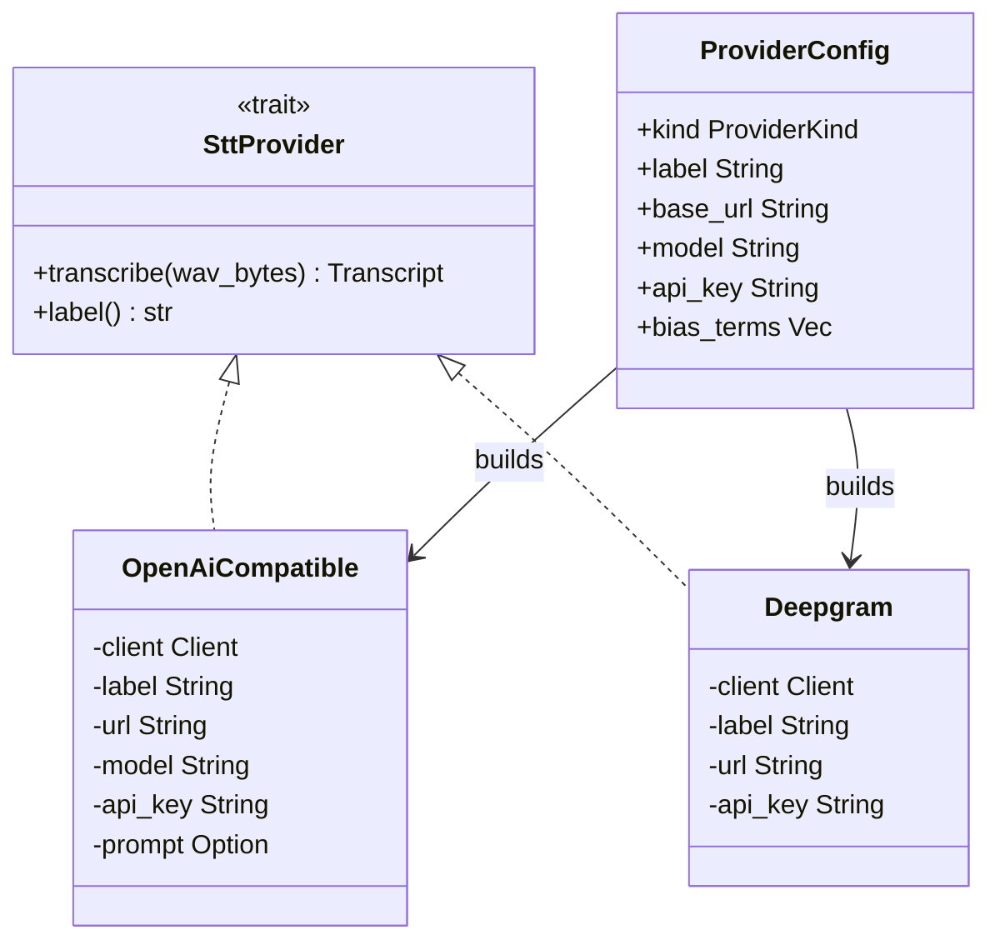

<!-- PAGE_ID: hark_07_transcription -->
<details>
<summary>Relevant source files</summary>

The following files were used as evidence for this page:

- [crates/hark-stt/src/lib.rs:1-69](https://github.com/BoardPandas/Hark/blob/1c1738716fa4cd758b0c26ec94d0873d1bc35ac1/crates/hark-stt/src/lib.rs#L1-L69)
- [crates/hark-stt/src/config.rs:1-44](https://github.com/BoardPandas/Hark/blob/1c1738716fa4cd758b0c26ec94d0873d1bc35ac1/crates/hark-stt/src/config.rs#L1-L44)
- [crates/hark-stt/src/openai_compatible.rs:1-208](https://github.com/BoardPandas/Hark/blob/1c1738716fa4cd758b0c26ec94d0873d1bc35ac1/crates/hark-stt/src/openai_compatible.rs#L1-L208)
- [crates/hark-stt/src/deepgram.rs:1-107](https://github.com/BoardPandas/Hark/blob/1c1738716fa4cd758b0c26ec94d0873d1bc35ac1/crates/hark-stt/src/deepgram.rs#L1-L107)
- [crates/hark-stt/src/wav.rs:1-114](https://github.com/BoardPandas/Hark/blob/1c1738716fa4cd758b0c26ec94d0873d1bc35ac1/crates/hark-stt/src/wav.rs#L1-L114)
- [crates/hark-stt/src/error.rs:1-106](https://github.com/BoardPandas/Hark/blob/1c1738716fa4cd758b0c26ec94d0873d1bc35ac1/crates/hark-stt/src/error.rs#L1-L106)
- [crates/hark-stt/src/metrics.rs:1-110](https://github.com/BoardPandas/Hark/blob/1c1738716fa4cd758b0c26ec94d0873d1bc35ac1/crates/hark-stt/src/metrics.rs#L1-L110)

</details>

# Transcription (STT Providers)

> **Related Pages**: [Architecture](../core/ARCHITECTURE.md), [Dictionary](DICTIONARY.md), [Voice Cleanup](VOICE_CLEANUP.md)

---

<!-- BEGIN:AUTOGEN hark_07_transcription_trait -->
## The SttProvider Trait

`hark-stt` is Hark's BYOK cloud speech-to-text crate: one `SttProvider` trait with per-contract adapters, deliberately I/O-thin so that WAV encoding, timing, and reporting stay in the caller (the pipeline worker thread) rather than in the adapters themselves ([lib.rs:1-7](https://github.com/BoardPandas/Hark/blob/1c1738716fa4cd758b0c26ec94d0873d1bc35ac1/crates/hark-stt/src/lib.rs#L1-L7)).

The trait exposes exactly two methods: a blocking `transcribe` that takes complete WAV bytes and returns a `Transcript`, and a `label` used in reports and errors ([lib.rs:33-41](https://github.com/BoardPandas/Hark/blob/1c1738716fa4cd758b0c26ec94d0873d1bc35ac1/crates/hark-stt/src/lib.rs#L33-L41)). `Transcript` carries the recognized text plus `request_ms`, the full HTTP round trip as observed by the caller, since that request is the dominant share of Hark's release-to-inject latency budget ([lib.rs:25-30](https://github.com/BoardPandas/Hark/blob/1c1738716fa4cd758b0c26ec94d0873d1bc35ac1/crates/hark-stt/src/lib.rs#L25-L30)).

```rust
/// A configured, reusable cloud transcription adapter.
pub trait SttProvider: Send {
    /// Blocking; called from the pipeline worker thread. `wav_bytes` is a
    /// complete 16 kHz mono WAV. Implementations must never log `api_key` or
    /// raw audio.
    fn transcribe(&self, wav_bytes: &[u8]) -> Result<Transcript, SttError>;

    /// Short label for reports and errors ("groq", "openai", "deepgram").
    fn label(&self) -> &str;
}
```

Sources: [lib.rs:27-41](https://github.com/BoardPandas/Hark/blob/1c1738716fa4cd758b0c26ec94d0873d1bc35ac1/crates/hark-stt/src/lib.rs#L27-L41)

Provider selection happens at construction time through `ProviderKind`, an enum with two variants distinguishing the multipart OpenAI-compatible contract from the Deepgram contract ([config.rs:1-9](https://github.com/BoardPandas/Hark/blob/1c1738716fa4cd758b0c26ec94d0873d1bc35ac1/crates/hark-stt/src/config.rs#L1-L9)). `ProviderConfig` bundles everything an adapter needs: the kind, a `label` used only in logs and errors, `base_url`, `model`, the BYOK `api_key`, and `bias_terms` (dictionary terms mapped per-adapter to either a `prompt` string or repeated `keyterm` query params) ([config.rs:11-28](https://github.com/BoardPandas/Hark/blob/1c1738716fa4cd758b0c26ec94d0873d1bc35ac1/crates/hark-stt/src/config.rs#L11-L28)). `ProviderConfig` deliberately has no derived `Debug`; a hand-written impl redacts `api_key` so a reflexive `{config:?}` in a future log line cannot leak it ([config.rs:30-43](https://github.com/BoardPandas/Hark/blob/1c1738716fa4cd758b0c26ec94d0873d1bc35ac1/crates/hark-stt/src/config.rs#L30-L43)).

The `build` function is the single construction point: it matches on `config.kind` and returns a boxed adapter, sharing the process-wide `reqwest::blocking::Client` passed in by the caller ([lib.rs:44-54](https://github.com/BoardPandas/Hark/blob/1c1738716fa4cd758b0c26ec94d0873d1bc35ac1/crates/hark-stt/src/lib.rs#L44-L54)). `shared_client` builds that one long-lived client with a 3 s connect timeout and a 15 s total timeout, both defined as crate constants (`CONNECT_TIMEOUT_MS`, `TOTAL_TIMEOUT_MS`) so keep-alive and TLS session resumption are reused across every utterance rather than rebuilt per press ([lib.rs:20-23](https://github.com/BoardPandas/Hark/blob/1c1738716fa4cd758b0c26ec94d0873d1bc35ac1/crates/hark-stt/src/lib.rs#L20-L23), [lib.rs:56-68](https://github.com/BoardPandas/Hark/blob/1c1738716fa4cd758b0c26ec94d0873d1bc35ac1/crates/hark-stt/src/lib.rs#L56-L68)).



Sources: [lib.rs:33-54](https://github.com/BoardPandas/Hark/blob/1c1738716fa4cd758b0c26ec94d0873d1bc35ac1/crates/hark-stt/src/lib.rs#L33-L54), [config.rs:1-43](https://github.com/BoardPandas/Hark/blob/1c1738716fa4cd758b0c26ec94d0873d1bc35ac1/crates/hark-stt/src/config.rs#L1-L43)
<!-- END:AUTOGEN hark_07_transcription_trait -->

---

<!-- BEGIN:AUTOGEN hark_07_transcription_openai -->
## OpenAI-Compatible Adapter

`OpenAiCompatible` implements a single code path against `POST {base_url}/audio/transcriptions` that covers both OpenAI itself and Groq, since both clone the same multipart contract ([openai_compatible.rs:1-3](https://github.com/BoardPandas/Hark/blob/1c1738716fa4cd758b0c26ec94d0873d1bc35ac1/crates/hark-stt/src/openai_compatible.rs#L1-L3)). The URL is built by `transcriptions_url`, tolerant of a trailing slash on `base_url` ([openai_compatible.rs:48-50](https://github.com/BoardPandas/Hark/blob/1c1738716fa4cd758b0c26ec94d0873d1bc35ac1/crates/hark-stt/src/openai_compatible.rs#L48-L50)).

The multipart body is assembled by hand into a buffered `Vec<u8>` rather than through `reqwest::blocking::multipart`. That crate streams multipart bodies through a channel to reqwest's internal runtime, so a connect or timeout failure surfaces as an opaque "send failed because receiver is gone" body error with both `is_connect()` and `is_timeout()` false, which breaks the error taxonomy; a buffered body keeps transport errors classifiable and keeps assembly unit-testable ([openai_compatible.rs:5-10](https://github.com/BoardPandas/Hark/blob/1c1738716fa4cd758b0c26ec94d0873d1bc35ac1/crates/hark-stt/src/openai_compatible.rs#L5-L10)). `build_multipart_body` writes each text field followed by the file part (`name="file"`, a fixed `filename`, `Content-Type: audio/wav`) using a boundary computed by `multipart_boundary`, which extends a fixed prefix until it provably does not occur anywhere in the WAV payload ([openai_compatible.rs:95-133](https://github.com/BoardPandas/Hark/blob/1c1738716fa4cd758b0c26ec94d0873d1bc35ac1/crates/hark-stt/src/openai_compatible.rs#L95-L133)).

Text fields are `model`, `response_format=json`, `language=en`, and an optional `prompt` used for biasing ([openai_compatible.rs:83-93](https://github.com/BoardPandas/Hark/blob/1c1738716fa4cd758b0c26ec94d0873d1bc35ac1/crates/hark-stt/src/openai_compatible.rs#L83-L93)). Auth is a Bearer token carrying the BYOK `api_key` ([openai_compatible.rs:162](https://github.com/BoardPandas/Hark/blob/1c1738716fa4cd758b0c26ec94d0873d1bc35ac1/crates/hark-stt/src/openai_compatible.rs#L162)).

```rust
/// Whisper-family biasing: bias terms ride the `prompt` field as a
/// comma-separated glossary, included in order until the approximate token
/// budget is spent; the rest are dropped (a term that would cross the
/// budget is dropped even if a later, shorter one might fit — order is the
/// user's priority signal).
pub fn prompt_from_bias_terms(bias_terms: &[String]) -> (Option<String>, usize) {
    let budget_chars = PROMPT_TOKEN_BUDGET * 4;
    ...
}
```

Sources: [openai_compatible.rs:52-80](https://github.com/BoardPandas/Hark/blob/1c1738716fa4cd758b0c26ec94d0873d1bc35ac1/crates/hark-stt/src/openai_compatible.rs#L52-L80)

Whisper-family models truncate prompts at 224 tokens, so `PROMPT_TOKEN_BUDGET` is set to 200 with a ~4-chars-per-token heuristic, leaving headroom ([openai_compatible.rs:52-54](https://github.com/BoardPandas/Hark/blob/1c1738716fa4cd758b0c26ec94d0873d1bc35ac1/crates/hark-stt/src/openai_compatible.rs#L52-L54)). Terms are appended in order until the next term would cross the character budget; that term and every one after it are dropped, since input order is treated as the user's priority signal ([openai_compatible.rs:62-80](https://github.com/BoardPandas/Hark/blob/1c1738716fa4cd758b0c26ec94d0873d1bc35ac1/crates/hark-stt/src/openai_compatible.rs#L62-L80)). If zero terms fit, `prompt_from_bias_terms` returns `None` so the `prompt` field is omitted entirely rather than sent empty ([openai_compatible.rs:79](https://github.com/BoardPandas/Hark/blob/1c1738716fa4cd758b0c26ec94d0873d1bc35ac1/crates/hark-stt/src/openai_compatible.rs#L79)). The constructor logs only the count of included vs. total terms, never the term text, since bias terms are user content ([openai_compatible.rs:28-35](https://github.com/BoardPandas/Hark/blob/1c1738716fa4cd758b0c26ec94d0873d1bc35ac1/crates/hark-stt/src/openai_compatible.rs#L28-L35)).

`transcribe` times the request with `Instant::now()`, posts the assembled body, classifies transport failures via `error_for_transport`, reads the `Retry-After` header, and on a non-success status maps the response through `error_for_status`; on success it parses the JSON `text` field via `parse_response` and returns a `Transcript` with the elapsed `request_ms` ([openai_compatible.rs:149-195](https://github.com/BoardPandas/Hark/blob/1c1738716fa4cd758b0c26ec94d0873d1bc35ac1/crates/hark-stt/src/openai_compatible.rs#L149-L195)).

Sources: [openai_compatible.rs:1-208](https://github.com/BoardPandas/Hark/blob/1c1738716fa4cd758b0c26ec94d0873d1bc35ac1/crates/hark-stt/src/openai_compatible.rs#L1-L208)
<!-- END:AUTOGEN hark_07_transcription_openai -->

---

<!-- BEGIN:AUTOGEN hark_07_transcription_deepgram -->
## Deepgram Adapter

Deepgram earns its own adapter rather than sharing the OpenAI-compatible path because its `keyterm` biasing (nova-3 and later) maps directly onto Hark's dictionary feature ([deepgram.rs:1-3](https://github.com/BoardPandas/Hark/blob/1c1738716fa4cd758b0c26ec94d0873d1bc35ac1/crates/hark-stt/src/deepgram.rs#L1-L3)). It speaks `POST {base_url}/v1/listen` with `Token` auth and a raw `audio/wav` body, in contrast to the OpenAI-compatible multipart contract.

`listen_url` builds the request URL once at construction time: it appends `model`, `smart_format=true`, and one repeated (URL-encoded) `keyterm` query parameter per bias term, so multi-word terms are supported ([deepgram.rs:32-47](https://github.com/BoardPandas/Hark/blob/1c1738716fa4cd758b0c26ec94d0873d1bc35ac1/crates/hark-stt/src/deepgram.rs#L32-L47)). Because the URL (including keyterms) is fixed at construction, `Deepgram::new` is fallible and returns `Result<Self, SttError>` if `base_url` fails to parse ([deepgram.rs:18-26](https://github.com/BoardPandas/Hark/blob/1c1738716fa4cd758b0c26ec94d0873d1bc35ac1/crates/hark-stt/src/deepgram.rs#L18-L26), [deepgram.rs:32-37](https://github.com/BoardPandas/Hark/blob/1c1738716fa4cd758b0c26ec94d0873d1bc35ac1/crates/hark-stt/src/deepgram.rs#L32-L37)).

```rust
impl SttProvider for Deepgram {
    fn transcribe(&self, wav_bytes: &[u8]) -> Result<Transcript, SttError> {
        let started = Instant::now();
        let response = self
            .client
            .post(&self.url)
            .header("Authorization", format!("Token {}", self.api_key))
            .header("Content-Type", "audio/wav")
            .body(wav_bytes.to_vec())
            .send()
            .map_err(|e| error_for_transport(&self.label, TOTAL_TIMEOUT_MS, &e))?;
        ...
    }
}
```

Sources: [deepgram.rs:70-88](https://github.com/BoardPandas/Hark/blob/1c1738716fa4cd758b0c26ec94d0873d1bc35ac1/crates/hark-stt/src/deepgram.rs#L70-L88)

The response is walked defensively: `parse_response` extracts `results.channels[0].alternatives[0].transcript` through a chain of `Option` lookups on the raw `serde_json::Value`, returning a `SttError::Provider` with a truncated body snippet if any step in the chain is absent ([deepgram.rs:50-68](https://github.com/BoardPandas/Hark/blob/1c1738716fa4cd758b0c26ec94d0873d1bc35ac1/crates/hark-stt/src/deepgram.rs#L50-L68)). `retry_after_secs`, the `Retry-After` header parser, is reused from the OpenAI-compatible module rather than duplicated ([deepgram.rs:6](https://github.com/BoardPandas/Hark/blob/1c1738716fa4cd758b0c26ec94d0873d1bc35ac1/crates/hark-stt/src/deepgram.rs#L6), [deepgram.rs:83](https://github.com/BoardPandas/Hark/blob/1c1738716fa4cd758b0c26ec94d0873d1bc35ac1/crates/hark-stt/src/deepgram.rs#L83)).

The two adapters share the same overall request/response shape (time the send, classify transport errors, map non-success statuses, parse a provider-specific body) but differ in every wire-level detail:

| | OpenAI-Compatible | Deepgram |
|---|---|---|
| Endpoint | `POST {base_url}/audio/transcriptions` ([openai_compatible.rs:48-50](https://github.com/BoardPandas/Hark/blob/1c1738716fa4cd758b0c26ec94d0873d1bc35ac1/crates/hark-stt/src/openai_compatible.rs#L48-L50)) | `POST {base_url}/v1/listen` ([deepgram.rs:33](https://github.com/BoardPandas/Hark/blob/1c1738716fa4cd758b0c26ec94d0873d1bc35ac1/crates/hark-stt/src/deepgram.rs#L33)) |
| Auth | `Authorization: Bearer {api_key}` via `.bearer_auth()` ([openai_compatible.rs:162](https://github.com/BoardPandas/Hark/blob/1c1738716fa4cd758b0c26ec94d0873d1bc35ac1/crates/hark-stt/src/openai_compatible.rs#L162)) | `Authorization: Token {api_key}` header ([deepgram.rs:76](https://github.com/BoardPandas/Hark/blob/1c1738716fa4cd758b0c26ec94d0873d1bc35ac1/crates/hark-stt/src/deepgram.rs#L76)) |
| Body | Hand-assembled `multipart/form-data` with text fields + file part ([openai_compatible.rs:111-133](https://github.com/BoardPandas/Hark/blob/1c1738716fa4cd758b0c26ec94d0873d1bc35ac1/crates/hark-stt/src/openai_compatible.rs#L111-L133)) | Raw WAV bytes, `Content-Type: audio/wav` ([deepgram.rs:77-78](https://github.com/BoardPandas/Hark/blob/1c1738716fa4cd758b0c26ec94d0873d1bc35ac1/crates/hark-stt/src/deepgram.rs#L77-L78)) |
| Biasing param | `prompt` text field, comma-separated glossary ([openai_compatible.rs:56-80](https://github.com/BoardPandas/Hark/blob/1c1738716fa4cd758b0c26ec94d0873d1bc35ac1/crates/hark-stt/src/openai_compatible.rs#L56-L80)) | Repeated `keyterm` query params, one per term ([deepgram.rs:32-47](https://github.com/BoardPandas/Hark/blob/1c1738716fa4cd758b0c26ec94d0873d1bc35ac1/crates/hark-stt/src/deepgram.rs#L32-L47)) |
| Response parse | `serde::Deserialize` struct with a `text` field ([openai_compatible.rs:136-147](https://github.com/BoardPandas/Hark/blob/1c1738716fa4cd758b0c26ec94d0873d1bc35ac1/crates/hark-stt/src/openai_compatible.rs#L136-L147)) | Manual `Option` chain into `results.channels[0].alternatives[0].transcript` ([deepgram.rs:50-68](https://github.com/BoardPandas/Hark/blob/1c1738716fa4cd758b0c26ec94d0873d1bc35ac1/crates/hark-stt/src/deepgram.rs#L50-L68)) |

Sources: [deepgram.rs:1-107](https://github.com/BoardPandas/Hark/blob/1c1738716fa4cd758b0c26ec94d0873d1bc35ac1/crates/hark-stt/src/deepgram.rs#L1-L107), [openai_compatible.rs:48-195](https://github.com/BoardPandas/Hark/blob/1c1738716fa4cd758b0c26ec94d0873d1bc35ac1/crates/hark-stt/src/openai_compatible.rs#L48-L195)
<!-- END:AUTOGEN hark_07_transcription_deepgram -->

---

<!-- BEGIN:AUTOGEN hark_07_transcription_wav -->
## WAV Encoding

Hark standardizes on 16 kHz mono PCM16 WAV throughout the STT layer, expressed as three crate constants: `SAMPLE_RATE = 16_000`, `CHANNELS = 1`, `BITS_PER_SAMPLE = 16` ([wav.rs:8-10](https://github.com/BoardPandas/Hark/blob/1c1738716fa4cd758b0c26ec94d0873d1bc35ac1/crates/hark-stt/src/wav.rs#L8-L10)).

`encode_wav_16k_mono` takes `&[f32]` samples in `[-1.0, 1.0]` directly, matching the format the audio ring buffer produces, and writes a complete RIFF/WAVE header (`fmt ` chunk, then `data` chunk) followed by clamped, scaled `i16` samples ([wav.rs:12-37](https://github.com/BoardPandas/Hark/blob/1c1738716fa4cd758b0c26ec94d0873d1bc35ac1/crates/hark-stt/src/wav.rs#L12-L37)):

```rust
pub fn encode_wav_16k_mono(samples: &[f32]) -> Vec<u8> {
    let data_len = (samples.len() * 2) as u32;
    let byte_rate = SAMPLE_RATE * u32::from(CHANNELS) * u32::from(BITS_PER_SAMPLE) / 8;
    let block_align = CHANNELS * BITS_PER_SAMPLE / 8;
    ...
    for &s in samples {
        let clamped = s.clamp(-1.0, 1.0);
        out.extend_from_slice(&((clamped * 32767.0) as i16).to_le_bytes());
    }
    out
}
```

Sources: [wav.rs:12-37](https://github.com/BoardPandas/Hark/blob/1c1738716fa4cd758b0c26ec94d0873d1bc35ac1/crates/hark-stt/src/wav.rs#L12-L37)

`parse_wav_16k_mono` is the reverse path, used to validate audio fixtures and decode them back to samples for encode-time measurement rather than by the hot path ([wav.rs:3-4](https://github.com/BoardPandas/Hark/blob/1c1738716fa4cd758b0c26ec94d0873d1bc35ac1/crates/hark-stt/src/wav.rs#L3-L4)). It walks RIFF chunks generically (accounting for `LIST` or `fact` chunks that some TTS/DAW output inserts between `fmt ` and `data`, and for word-alignment padding on odd-sized chunks) and rejects anything that is not exactly the 16 kHz mono PCM16 contract, so results across providers stay comparable ([wav.rs:54-113](https://github.com/BoardPandas/Hark/blob/1c1738716fa4cd758b0c26ec94d0873d1bc35ac1/crates/hark-stt/src/wav.rs#L54-L113)). Rejections include a missing `RIFF`/`WAVE` header, a too-short `fmt` chunk, a missing `fmt` or `data` chunk, a non-PCM or non-16-bit format, and a sample rate or channel count other than 16 kHz mono, all surfaced as `SttError::BadAudio` ([wav.rs:59-101](https://github.com/BoardPandas/Hark/blob/1c1738716fa4cd758b0c26ec94d0873d1bc35ac1/crates/hark-stt/src/wav.rs#L59-L101)). `WavInfo::duration_secs` derives clip length from decoded sample count, sample rate, and channel count ([wav.rs:49-51](https://github.com/BoardPandas/Hark/blob/1c1738716fa4cd758b0c26ec94d0873d1bc35ac1/crates/hark-stt/src/wav.rs#L49-L51)).

Sources: [wav.rs:1-114](https://github.com/BoardPandas/Hark/blob/1c1738716fa4cd758b0c26ec94d0873d1bc35ac1/crates/hark-stt/src/wav.rs#L1-L114)
<!-- END:AUTOGEN hark_07_transcription_wav -->

---

<!-- BEGIN:AUTOGEN hark_07_transcription_errors -->
## Errors and Metrics

`SttError` is the crate's single error taxonomy, and every variant is documented as safe to log: none carries an API key, an `Authorization` header, or raw audio bytes ([error.rs:3-5](https://github.com/BoardPandas/Hark/blob/1c1738716fa4cd758b0c26ec94d0873d1bc35ac1/crates/hark-stt/src/error.rs#L3-L5)).

| Variant | Meaning | Source |
|---|---|---|
| `Http { provider, detail }` | Transport-level failure (DNS, connect refused, TLS, broken pipe) | [error.rs:9-10](https://github.com/BoardPandas/Hark/blob/1c1738716fa4cd758b0c26ec94d0873d1bc35ac1/crates/hark-stt/src/error.rs#L9-L10) |
| `Auth { provider }` | 401/403; message never echoes the key | [error.rs:12-14](https://github.com/BoardPandas/Hark/blob/1c1738716fa4cd758b0c26ec94d0873d1bc35ac1/crates/hark-stt/src/error.rs#L12-L14) |
| `RateLimited { provider, retry_after_s }` | 429; `retry_after_s` from the `Retry-After` header when present | [error.rs:16-22](https://github.com/BoardPandas/Hark/blob/1c1738716fa4cd758b0c26ec94d0873d1bc35ac1/crates/hark-stt/src/error.rs#L16-L22) |
| `Timeout { provider, configured_ms }` | The configured total request timeout elapsed | [error.rs:24-29](https://github.com/BoardPandas/Hark/blob/1c1738716fa4cd758b0c26ec94d0873d1bc35ac1/crates/hark-stt/src/error.rs#L24-L29) |
| `BadAudio(String)` | Audio handed to an adapter (or fixture) is not usable | [error.rs:31-33](https://github.com/BoardPandas/Hark/blob/1c1738716fa4cd758b0c26ec94d0873d1bc35ac1/crates/hark-stt/src/error.rs#L31-L33) |
| `Provider { provider, detail }` | Non-success status or unparseable body; `detail` truncated | [error.rs:35-38](https://github.com/BoardPandas/Hark/blob/1c1738716fa4cd758b0c26ec94d0873d1bc35ac1/crates/hark-stt/src/error.rs#L35-L38) |

`error_for_status` maps an HTTP status code to the taxonomy as a pure function (unit-testable without a network): 401/403 to `Auth`, 429 to `RateLimited` carrying the parsed `Retry-After` value, and everything else to `Provider` with the status code and a truncated body snippet ([error.rs:56-75](https://github.com/BoardPandas/Hark/blob/1c1738716fa4cd758b0c26ec94d0873d1bc35ac1/crates/hark-stt/src/error.rs#L56-L75)). `error_for_transport` maps a `reqwest::Error` similarly, splitting out `Timeout` (distinguishing connect-phase timeouts, which use the shorter `CONNECT_TIMEOUT_MS`, from total-request timeouts) because timeouts are the pipeline's only retry-once candidate ([error.rs:81-105](https://github.com/BoardPandas/Hark/blob/1c1738716fa4cd758b0c26ec94d0873d1bc35ac1/crates/hark-stt/src/error.rs#L81-L105)). Body snippets going into `Provider` and parse errors are capped at `BODY_SNIPPET_MAX = 300` characters via `truncate_snippet`, so an error can never drag a huge or binary response body into logs ([error.rs:41-52](https://github.com/BoardPandas/Hark/blob/1c1738716fa4cd758b0c26ec94d0873d1bc35ac1/crates/hark-stt/src/error.rs#L41-L52)).

`metrics.rs` is a pure, model- and network-free measurement module used by the spike harness rather than the production hot path ([metrics.rs:1-3](https://github.com/BoardPandas/Hark/blob/1c1738716fa4cd758b0c26ec94d0873d1bc35ac1/crates/hark-stt/src/metrics.rs#L1-L3)). `normalize_text` lowercases text, drops punctuation, and collapses whitespace so comparisons are robust to casing/spacing noise ([metrics.rs:7-25](https://github.com/BoardPandas/Hark/blob/1c1738716fa4cd758b0c26ec94d0873d1bc35ac1/crates/hark-stt/src/metrics.rs#L7-L25)); `levenshtein` computes char-level edit distance ([metrics.rs:28-48](https://github.com/BoardPandas/Hark/blob/1c1738716fa4cd758b0c26ec94d0873d1bc35ac1/crates/hark-stt/src/metrics.rs#L28-L48)); `divergence_ratio` normalizes that distance by the longer of the two (post-normalize) string lengths ([metrics.rs:51-59](https://github.com/BoardPandas/Hark/blob/1c1738716fa4cd758b0c26ec94d0873d1bc35ac1/crates/hark-stt/src/metrics.rs#L51-L59)); and `contains_term` checks whether a dictionary term appears in transcribed text after normalization, padding both sides with spaces for multi-word safety ([metrics.rs:62-66](https://github.com/BoardPandas/Hark/blob/1c1738716fa4cd758b0c26ec94d0873d1bc35ac1/crates/hark-stt/src/metrics.rs#L62-L66)). `LatencyTally` accumulates `request_ms` samples and exposes nearest-rank `p50`/`p95` percentiles plus `min`/`max`, which is how the release-to-inject latency SLA gets measured across providers ([metrics.rs:69-109](https://github.com/BoardPandas/Hark/blob/1c1738716fa4cd758b0c26ec94d0873d1bc35ac1/crates/hark-stt/src/metrics.rs#L69-L109)).

Sources: [error.rs:1-106](https://github.com/BoardPandas/Hark/blob/1c1738716fa4cd758b0c26ec94d0873d1bc35ac1/crates/hark-stt/src/error.rs#L1-L106), [metrics.rs:1-110](https://github.com/BoardPandas/Hark/blob/1c1738716fa4cd758b0c26ec94d0873d1bc35ac1/crates/hark-stt/src/metrics.rs#L1-L110)
<!-- END:AUTOGEN hark_07_transcription_errors -->

---

<!-- BEGIN:AUTOGEN hark_07_transcription_gotchas -->
## Provider Gotchas

**Groq bills a 10 s minimum per transcription request.** Groq is reached through the same `OpenAiCompatible` adapter as OpenAI (it shares the multipart `/audio/transcriptions` contract), so there is no code-level distinction between the two providers beyond `ProviderConfig.base_url` and `model` ([openai_compatible.rs:1-3](https://github.com/BoardPandas/Hark/blob/1c1738716fa4cd758b0c26ec94d0873d1bc35ac1/crates/hark-stt/src/openai_compatible.rs#L1-L3), [config.rs:1-6](https://github.com/BoardPandas/Hark/blob/1c1738716fa4cd758b0c26ec94d0873d1bc35ac1/crates/hark-stt/src/config.rs#L1-L6)); the 10 s minimum billing is an external account/billing fact of Groq's API rather than something enforced in this crate, so every short push-to-talk utterance sent to Groq is billed as if it were 10 s.

**`keyterm` and legacy `keywords` are mutually exclusive by model generation.** The Deepgram adapter only implements `keyterm` query params, valid for nova-3 and later models ([deepgram.rs:1-3](https://github.com/BoardPandas/Hark/blob/1c1738716fa4cd758b0c26ec94d0873d1bc35ac1/crates/hark-stt/src/deepgram.rs#L1-L3), [deepgram.rs:32-47](https://github.com/BoardPandas/Hark/blob/1c1738716fa4cd758b0c26ec94d0873d1bc35ac1/crates/hark-stt/src/deepgram.rs#L32-L47)); there is no `keywords` fallback path in this adapter, so configuring an older nova-2-class model in `ProviderConfig.model` would send `keyterm` params that model generation does not honor. Keep `model` pinned to a nova-3+ model when biasing matters.

**Transport is `reqwest` blocking on worker threads; one long-lived client.** Neither adapter constructs its own `reqwest::blocking::Client`, both take a shared `Client` at construction ([openai_compatible.rs:26-44](https://github.com/BoardPandas/Hark/blob/1c1738716fa4cd758b0c26ec94d0873d1bc35ac1/crates/hark-stt/src/openai_compatible.rs#L26-L44), [deepgram.rs:18-26](https://github.com/BoardPandas/Hark/blob/1c1738716fa4cd758b0c26ec94d0873d1bc35ac1/crates/hark-stt/src/deepgram.rs#L18-L26)), built once per process by `shared_client` with fixed connect/total timeouts ([lib.rs:59-68](https://github.com/BoardPandas/Hark/blob/1c1738716fa4cd758b0c26ec94d0873d1bc35ac1/crates/hark-stt/src/lib.rs#L59-L68)). The crate never spins up a tokio runtime; every `.send()` call blocks the calling (pipeline worker) thread directly ([lib.rs:5-7](https://github.com/BoardPandas/Hark/blob/1c1738716fa4cd758b0c26ec94d0873d1bc35ac1/crates/hark-stt/src/lib.rs#L5-L7)). This is why the OpenAI-compatible adapter hand-assembles multipart bodies instead of using `reqwest::blocking::multipart`, which streams through a channel to an internal runtime and would otherwise corrupt the transport-error classification that `error_for_transport` depends on ([openai_compatible.rs:5-10](https://github.com/BoardPandas/Hark/blob/1c1738716fa4cd758b0c26ec94d0873d1bc35ac1/crates/hark-stt/src/openai_compatible.rs#L5-L10), [error.rs:81-105](https://github.com/BoardPandas/Hark/blob/1c1738716fa4cd758b0c26ec94d0873d1bc35ac1/crates/hark-stt/src/error.rs#L81-L105)).

Sources: [openai_compatible.rs:1-44](https://github.com/BoardPandas/Hark/blob/1c1738716fa4cd758b0c26ec94d0873d1bc35ac1/crates/hark-stt/src/openai_compatible.rs#L1-L44), [deepgram.rs:1-47](https://github.com/BoardPandas/Hark/blob/1c1738716fa4cd758b0c26ec94d0873d1bc35ac1/crates/hark-stt/src/deepgram.rs#L1-L47), [lib.rs:56-68](https://github.com/BoardPandas/Hark/blob/1c1738716fa4cd758b0c26ec94d0873d1bc35ac1/crates/hark-stt/src/lib.rs#L56-L68), [error.rs:81-105](https://github.com/BoardPandas/Hark/blob/1c1738716fa4cd758b0c26ec94d0873d1bc35ac1/crates/hark-stt/src/error.rs#L81-L105)
<!-- END:AUTOGEN hark_07_transcription_gotchas -->

---
