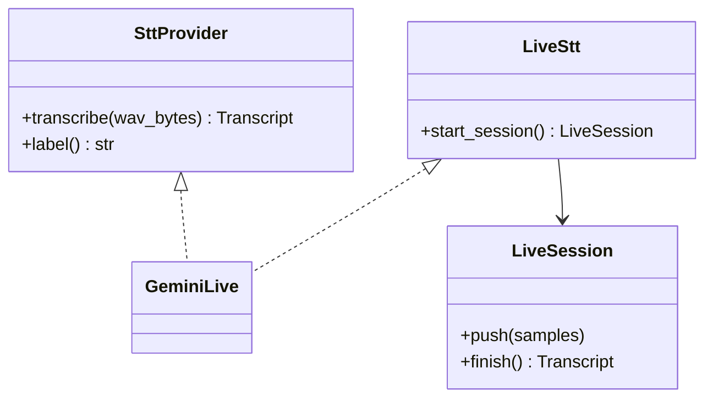

<!-- PAGE_ID: hark_07_transcription -->

Relevant source files

The following files were used as evidence for this page:

- [crates/hark-stt/src/lib.rs](../../crates/hark-stt/src/lib.rs)
- [crates/hark-stt/src/config.rs](../../crates/hark-stt/src/config.rs)
- [crates/hark-stt/src/openai_compatible.rs](../../crates/hark-stt/src/openai_compatible.rs)
- [crates/hark-stt/src/openai_transcribe.rs](../../crates/hark-stt/src/openai_transcribe.rs)
- [crates/hark-stt/src/deepgram.rs](../../crates/hark-stt/src/deepgram.rs)
- [crates/hark-stt/src/gemini_live.rs](../../crates/hark-stt/src/gemini_live.rs)
- [crates/hark-stt/src/wav.rs](../../crates/hark-stt/src/wav.rs)
- [crates/hark-stt/src/error.rs](../../crates/hark-stt/src/error.rs)
- [crates/hark-stt/src/metrics.rs](../../crates/hark-stt/src/metrics.rs)

# Transcription (STT Providers)

> **Related Pages**: [Architecture](../core/ARCHITECTURE.md), [On-Device STT](ON_DEVICE_STT.md), [Spellbook](SPELLBOOK.md), [Voice Cleanup](VOICE_CLEANUP.md)

---

<!-- BEGIN:AUTOGEN hark_07_transcription_trait -->
## Batch and Live Provider Traits

`hark-stt` separates finished-clip transcription from streaming. `SttProvider::transcribe` accepts a complete 16 kHz mono WAV and blocks on the pipeline worker. `LiveStt` opens a single-use `LiveSession`; the session accepts 16 kHz mono samples while the key is held and finalizes at release ([lib.rs:44-81](../../crates/hark-stt/src/lib.rs#L44-L81)).

`Transcript` always contains `text`, optionally marks a fused provider result as `cleaned`, and records provider request time. That optional field is a capability signal: the pipeline skips its separate cleanup call when a provider already performed cleanup ([lib.rs:30-42](../../crates/hark-stt/src/lib.rs#L30-L42)).

`build` constructs one of five internal adapter kinds: Whisper-family OpenAI-compatible, OpenAI gpt-transcribe, Deepgram, Gemini Live, or the internal Gemini batch adapter. `build_live` returns a streaming adapter only for Gemini Live builds with the `live` feature ([lib.rs:84-128](../../crates/hark-stt/src/lib.rs#L84-L128), [config.rs:1-20](../../crates/hark-stt/src/config.rs#L1-L20)). The app-facing provider choices currently route to Deepgram, OpenAI-compatible Whisper, OpenAI gpt-transcribe, Gemini Live, or optional local STT.

```mermaid
classDiagram
    class SttProvider {
        +transcribe(wav_bytes) Transcript
        +label() str
    }
    class LiveStt {
        +start_session() LiveSession
    }
    class LiveSession {
        +push(samples)
        +finish() Transcript
    }
    class GeminiLive
    SttProvider <|.. GeminiLive
    LiveStt <|.. GeminiLive
    LiveStt --> LiveSession
```

The process shares one blocking HTTP client with 3-second connect and 15-second total request bounds. Gemini alone owns a private current-thread Tokio runtime for WebSocket I/O; it does not turn the rest of Hark into an async application ([lib.rs:130-155](../../crates/hark-stt/src/lib.rs#L130-L155), [gemini_live.rs:653-686](../../crates/hark-stt/src/gemini_live.rs#L653-L686)).
<!-- END:AUTOGEN hark_07_transcription_trait -->

---

<!-- BEGIN:AUTOGEN hark_07_transcription_openai -->
## OpenAI-Compatible and gpt-transcribe Adapters

Both adapters POST a hand-built multipart body to `{base_url}/audio/transcriptions`, authenticate with a Bearer token, and parse the same JSON `text` envelope. Buffering multipart data keeps transport failures classifiable and makes boundary construction testable ([openai_compatible.rs:1-10](../../crates/hark-stt/src/openai_compatible.rs#L1-L10), [openai_compatible.rs:95-195](../../crates/hark-stt/src/openai_compatible.rs#L95-L195)).

They intentionally use different vocabulary fields:

| Contract | Models | Spellbook bias |
|---|---|---|
| OpenAI-compatible | Whisper-family endpoints, including compatible third parties | One ordered, budgeted comma-separated `prompt` glossary ([openai_compatible.rs:52-93](../../crates/hark-stt/src/openai_compatible.rs#L52-L93)) |
| OpenAI gpt-transcribe | OpenAI's gpt-transcribe contract | Repeated `keywords[]` fields with `languages[]=en`; no synthetic `prompt` ([openai_transcribe.rs:53-75](../../crates/hark-stt/src/openai_transcribe.rs#L53-L75)) |

The split is contractual, not cosmetic. Selecting a gpt-transcribe model uses `OpenAiTranscribe`, while Whisper-compatible models keep the prompt-based adapter. Both return verbatim `Transcript` values with `cleaned: None` ([openai_transcribe.rs:77-126](../../crates/hark-stt/src/openai_transcribe.rs#L77-L126)).
<!-- END:AUTOGEN hark_07_transcription_openai -->

---

<!-- BEGIN:AUTOGEN hark_07_transcription_deepgram -->
## Deepgram and Gemini Live

Deepgram uses `POST {base_url}/v1/listen`, `Token` authentication, a raw `audio/wav` body, `smart_format=true`, and one URL-encoded `keyterm` parameter per spellbook term. Its parser defensively walks `results.channels[0].alternatives[0].transcript` ([deepgram.rs:18-99](../../crates/hark-stt/src/deepgram.rs#L18-L99)).

Gemini Live uses a WebSocket session and can receive audio during the key hold. `GeminiLiveSession::push` converts samples to PCM16, sends them, and drains incoming transcript segments so a long hold does not fill the receive buffer. `finish` ends the turn or uses already completed segments and returns a normal `Transcript` ([gemini_live.rs:724-809](../../crates/hark-stt/src/gemini_live.rs#L724-L809)).

Gemini supports two rendering modes:

- `Verbatim` is the default and leaves fillers and self-corrections intact.
- `Smart` asks Gemini to format and remove disfluencies in the same round trip. The returned string is placed in both `text` and `cleaned`; the latter tells the pipeline not to clean it again ([gemini_live.rs:104-134](../../crates/hark-stt/src/gemini_live.rs#L104-L134), [gemini_live.rs:355-376](../../crates/hark-stt/src/gemini_live.rs#L355-L376)).

Streaming is an accelerator, never the only copy of a dictation. The pipeline pump reads the audio ring without consuming it, so an unavailable or broken live session can fall back to batch. Smart mode is the deliberate exception to replay because spoken edit commands can legally erase a turn, making a replay semantically unsafe ([gemini_live.rs:116-123](../../crates/hark-stt/src/gemini_live.rs#L116-L123), [Architecture](../core/ARCHITECTURE.md#the-release-to-inject-pipeline)).
<!-- END:AUTOGEN hark_07_transcription_deepgram -->

---

<!-- BEGIN:AUTOGEN hark_07_transcription_wav -->
## WAV and Streaming Audio

Batch and fallback adapters receive complete 16 kHz, mono, PCM16 WAV. `encode_wav_16k_mono` clamps `f32` samples, writes the RIFF header, and produces two-byte PCM samples ([wav.rs:8-37](../../crates/hark-stt/src/wav.rs#L8-L37)).

`parse_wav_16k_mono` walks chunks rather than assuming a fixed 44-byte header, then rejects any non-PCM16, non-mono, or non-16 kHz input. Gemini's batch fallback uses it to recover samples from the same WAV contract ([wav.rs:54-118](../../crates/hark-stt/src/wav.rs#L54-L118), [gemini_live.rs:690-710](../../crates/hark-stt/src/gemini_live.rs#L690-L710)).

Live sessions bypass the WAV container and accept already-resampled `f32` samples. This preserves a single sample contract while avoiding container work during the hold. Finished-clip peak normalization cannot be reproduced in a stream because the peak is unknown until release; the pipeline logs any gain the live path therefore skipped ([Architecture](../core/ARCHITECTURE.md#the-release-to-inject-pipeline)).
<!-- END:AUTOGEN hark_07_transcription_wav -->

---

<!-- BEGIN:AUTOGEN hark_07_transcription_errors -->
## Errors and Metrics

`SttError` distinguishes transport, authentication, rate limiting, timeout, bad-audio, and provider failures. Every variant is designed to be safe to display and log: it carries no key, authorization header, or audio bytes ([error.rs:1-49](../../crates/hark-stt/src/error.rs#L1-L49)).

HTTP 401/403 errors retain only a bounded machine-readable reason, 429 retains `Retry-After`, other provider bodies are truncated, and connect-class failures receive a stable `connect failed` prefix used by the pipeline retry predicate ([error.rs:51-155](../../crates/hark-stt/src/error.rs#L51-L155)). Gemini additionally scrubs `key=...` from WebSocket errors because its key appears in the socket URL ([gemini_live.rs:136-155](../../crates/hark-stt/src/gemini_live.rs#L136-L155)).

`request_ms` covers the adapter's observed request/session time. Pipeline history separately records full release-to-inject time, so provider latency and product latency remain distinguishable.
<!-- END:AUTOGEN hark_07_transcription_errors -->

---

<!-- BEGIN:AUTOGEN hark_07_transcription_gotchas -->
## Provider Gotchas

- Never log provider configuration with a derived `Debug`; `ProviderConfig` redacts the key explicitly ([config.rs:25-66](../../crates/hark-stt/src/config.rs#L25-L66)).
- Whisper-compatible `prompt`, OpenAI `keywords[]`, Deepgram `keyterm`, and Gemini vocabulary are different wire contracts. Do not merge their adapters because their URLs happen to look similar.
- `Transcript::cleaned` is not a second independent Gemini transcript in Smart mode. It mirrors `text` and acts as the skip-cleanup flag; use Verbatim when a guaranteed literal record is required ([gemini_live.rs:355-376](../../crates/hark-stt/src/gemini_live.rs#L355-L376)).
- A live failure may replay through batch only within the single retry budget. Authentication and rate-limit failures do not retry ([Architecture](../core/ARCHITECTURE.md#retry-and-latency-discipline)).
- Feature-gating removes Gemini WebSocket support cleanly: batch adapters remain blocking, and `build_live` returns `None` without the `live` feature ([lib.rs:105-127](../../crates/hark-stt/src/lib.rs#L105-L127)).
<!-- END:AUTOGEN hark_07_transcription_gotchas -->

---
