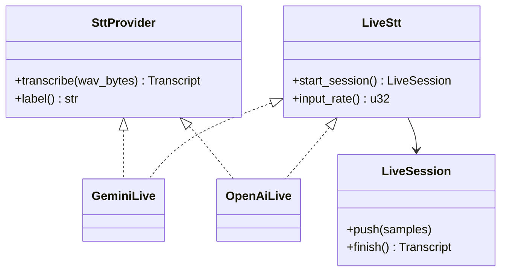

<!-- PAGE_ID: hark_07_transcription -->

Relevant source files

The following files were used as evidence for this page:

- [crates/hark-stt/src/lib.rs](../../crates/hark-stt/src/lib.rs)
- [crates/hark-stt/src/config.rs](../../crates/hark-stt/src/config.rs)
- [crates/hark-stt/src/openai_compatible.rs](../../crates/hark-stt/src/openai_compatible.rs)
- [crates/hark-stt/src/openai_transcribe.rs](../../crates/hark-stt/src/openai_transcribe.rs)
- [crates/hark-stt/src/deepgram.rs](../../crates/hark-stt/src/deepgram.rs)
- [crates/hark-stt/src/gemini_live.rs](../../crates/hark-stt/src/gemini_live.rs)
- [crates/hark-stt/src/openai_live.rs](../../crates/hark-stt/src/openai_live.rs)
- [crates/hark-stt/src/wav.rs](../../crates/hark-stt/src/wav.rs)
- [crates/hark-stt/src/error.rs](../../crates/hark-stt/src/error.rs)
- [crates/hark-stt/src/metrics.rs](../../crates/hark-stt/src/metrics.rs)
- [crates/hark-stt/src/meeting.rs](../../crates/hark-stt/src/meeting.rs)

# Transcription (STT Providers)

> **Related Pages**: [Architecture](../core/ARCHITECTURE.md), [On-Device STT](ON_DEVICE_STT.md), [Spellbook](SPELLBOOK.md), [Voice Cleanup](VOICE_CLEANUP.md), [Meetings](MEETINGS.md)

---

<!-- BEGIN:AUTOGEN hark_07_transcription_trait -->
## Batch and Live Provider Traits

`hark-stt` separates finished-clip transcription from streaming. `SttProvider::transcribe` accepts a complete 16 kHz mono WAV and blocks on the pipeline worker. `LiveStt` opens a single-use `LiveSession`; the session accepts mono samples while the key is held and finalizes at release. The rate those samples arrive at is the adapter's, not the pipeline's: `LiveStt::input_rate()` defaults to the pipeline's 16 kHz (Gemini Live), and OpenAI live overrides it to 24 kHz, the only rate OpenAI's realtime API accepts ([lib.rs:48-83](../../crates/hark-stt/src/lib.rs#L48-L83), [openai_live.rs `INPUT_RATE`](../../crates/hark-stt/src/openai_live.rs)).

`Transcript` always contains `text`, optionally marks a fused provider result as `cleaned`, and records provider request time. That optional field is a capability signal: the pipeline skips its separate cleanup call when a provider already performed cleanup ([lib.rs](../../crates/hark-stt/src/lib.rs)).

`build` constructs one of six internal adapter kinds: Whisper-family OpenAI-compatible, OpenAI gpt-transcribe, Deepgram, Gemini Live, OpenAI live (its realtime replay, which Test connection uses), or the internal Gemini batch adapter. `build_live` returns a streaming adapter for Gemini Live and OpenAI live, and only in builds with the `live` feature ([lib.rs:111-166](../../crates/hark-stt/src/lib.rs#L111-L166), [config.rs:1-26](../../crates/hark-stt/src/config.rs#L1-L26)). `OpenAiLive` is a routing value only: config never stores it, and the user reaches it through the OpenAI provider's Live transcribe toggle. The app-facing provider choices currently route to Deepgram, OpenAI-compatible Whisper, OpenAI gpt-transcribe or OpenAI live, Gemini Live, or optional local STT ([pipeline lib.rs `stt_route`](../../crates/hark-pipeline/src/lib.rs)).

Separate meeting-only paths sit beside these traits: `hark-stt::meeting` sends a long-form Deepgram request, while `meeting_gemini` processes independent track windows. Neither implements the dictation `SttProvider` trait. Saved-recording re-runs explicitly send the retained stereo MP3 unchanged to Deepgram; Gemini is selected for processing after Stop (see [Meetings](MEETINGS.md#gemini-files-final-pass)).

```mermaid
classDiagram
    class SttProvider {
        +transcribe(wav_bytes) Transcript
        +label() str
    }
    class LiveStt {
        +start_session() LiveSession
        +input_rate() u32
    }
    class LiveSession {
        +push(samples)
        +finish() Transcript
    }
    class GeminiLive
    class OpenAiLive
    SttProvider <|.. GeminiLive
    LiveStt <|.. GeminiLive
    SttProvider <|.. OpenAiLive
    LiveStt <|.. OpenAiLive
    LiveStt --> LiveSession
```

The process shares one blocking HTTP client with 3-second connect and 15-second total request bounds. Every Hark HTTP client trusts only Mozilla's root set compiled in from `webpki-root-certs` (`tls_certs_only`), never the OS certificate store, so a locally installed CA cannot intercept requests carrying the user's key. reqwest 0.13.2+ removed the `webpki-roots` feature that used to provide this, and requesting it silently held reqwest at 0.13.1 ([lib.rs](../../crates/hark-stt/src/lib.rs)). The two live adapters, Gemini Live and OpenAI live, each own a private current-thread Tokio runtime for WebSocket I/O, entered only through `block_on` from the pipeline worker; neither turns the rest of Hark into an async application ([lib.rs:1-10](../../crates/hark-stt/src/lib.rs#L1-L10), [gemini_live.rs:1046-1057](../../crates/hark-stt/src/gemini_live.rs#L1046-L1057), [openai_live.rs `OpenAiLive::new`](../../crates/hark-stt/src/openai_live.rs)). The meeting final pass builds its own client, `final_pass_client`, on the same static roots: `FINAL_PASS_CONNECT_TIMEOUT_MS` is 15,000 ms, because a TLS handshake on a weak cellular link can outlast dictation's 3-second bound and nothing is waiting on the pass, and `FINAL_PASS_TIMEOUT_MS` is 900,000 ms (15 min), because the request both uploads the recording and waits on Deepgram's own processing. Both clients go through one private `build_client(connect_ms, total_ms)`, so every caller takes a named budget ([meeting.rs:22-36](../../crates/hark-stt/src/meeting.rs#L22-L36), [lib.rs:168-198](../../crates/hark-stt/src/lib.rs#L168-L198)).
<!-- END:AUTOGEN hark_07_transcription_trait -->

---

<!-- BEGIN:AUTOGEN hark_07_transcription_openai -->
## OpenAI-Compatible and gpt-transcribe Adapters

Both adapters POST a hand-built multipart body to `{base_url}/audio/transcriptions`, authenticate with a Bearer token, and parse the same JSON `text` envelope. Buffering multipart data keeps transport failures classifiable and makes boundary construction testable ([openai_compatible.rs:1-10](../../crates/hark-stt/src/openai_compatible.rs#L1-L10), [openai_compatible.rs:95-195](../../crates/hark-stt/src/openai_compatible.rs#L95-L195)).

They intentionally use different vocabulary fields:

| Contract | Models | Spellbook bias |
|---|---|---|
| OpenAI-compatible | Whisper-family endpoints, including compatible third parties | One ordered, budgeted comma-separated `prompt` glossary ([openai_compatible.rs:52-93](../../crates/hark-stt/src/openai_compatible.rs#L52-L93)) |
| OpenAI gpt-transcribe | OpenAI's gpt-transcribe contract | Repeated `keywords[]` fields with `languages[]=en`; no synthetic `prompt` ([openai_transcribe.rs:53-75](../../crates/hark-stt/src/openai_transcribe.rs#L53-L75)) |

The split is contractual, not cosmetic. Selecting a gpt-transcribe model uses `OpenAiTranscribe`, while Whisper-compatible models keep the prompt-based adapter. Both return verbatim `Transcript` values with `cleaned: None` ([openai_transcribe.rs:77-126](../../crates/hark-stt/src/openai_transcribe.rs#L77-L126)). `gpt-live-transcribe` reaches neither: the multipart endpoint rejects it, so `uses_keywords_biasing` deliberately excludes it and the route sends it to the realtime adapter instead ([config lib.rs:244-284](../../crates/hark-config/src/lib.rs#L244-L284), [OpenAI Live Transcribe](#openai-live-transcribe)).
<!-- END:AUTOGEN hark_07_transcription_openai -->

---

<!-- BEGIN:AUTOGEN hark_07_transcription_deepgram -->
## Deepgram and Gemini Live

Deepgram uses `POST {base_url}/v1/listen`, `Token` authentication, a raw `audio/wav` body, `smart_format=true`, and one URL-encoded `keyterm` parameter per spellbook term. Its parser defensively walks `results.channels[0].alternatives[0].transcript` ([deepgram.rs:18-99](../../crates/hark-stt/src/deepgram.rs#L18-L99)).

Gemini Live uses a WebSocket session and can receive audio during the key hold. `GeminiLiveSession::push` converts samples to PCM16, sends them, and drains incoming transcript segments so a long hold does not fill the receive buffer. The drain never arms a timer: `turn_driver` yields once so `block_on` takes one zero-timeout I/O driver turn, then frames are read with `now_or_never`, at most 64 per drain. The first version used `timeout(Duration::ZERO, socket.next())`, and a zero deadline still rounds up to a 1 ms tick that Windows stretches to about 15.6 ms; after every 100 ms chunk that cost a 25-second meeting chunk about 3.9 s. The OpenAI live drain already worked this way ([gemini_live.rs:668-724](../../crates/hark-stt/src/gemini_live.rs#L668-L724), [gemini_live.rs:1308](../../crates/hark-stt/src/gemini_live.rs#L1308)). `finish` ends the turn or uses already completed segments and returns a normal `Transcript` ([gemini_live.rs](../../crates/hark-stt/src/gemini_live.rs)).

Meetings reuse the replay path for their live-transcript chunks through `build_meeting_chunks` ([lib.rs](../../crates/hark-stt/src/lib.rs)), which tunes Gemini Live with `Finalize::MEETING_CHUNK`: a 15 s per-frame and 45 s total finalise wait instead of dictation's 8 s and 15 s, and a turn in which the server produced no word at all (no interim, no final) is an empty transcript rather than a timeout. A 20–30 s chunk can pass the loudness gate on a cough or keystrokes and hold no speech, and Gemini answers such a turn with silence; the first real 20-minute call logged 19 of those as failures. Dictation keeps the timeout: the user pressed the key to say something.

Gemini supports two rendering modes:

- `Verbatim` is the default and leaves fillers and self-corrections intact.
- `Smart` asks Gemini to format and remove disfluencies in the same round trip. The returned string is placed in both `text` and `cleaned`; the latter tells the pipeline not to clean it again ([gemini_live.rs](../../crates/hark-stt/src/gemini_live.rs), [gemini_live.rs](../../crates/hark-stt/src/gemini_live.rs)). Smart runs the audio through a language model, so it also drops openers ("So basically,"), carries out spoken instructions ("Drop all the other bullet points.") instead of transcribing them, and can answer a request-shaped dictation ("Add the following MCP server") with Gemini's canned "I'm just a language model and can't help with that." The first two are indistinguishable from ordinary cleanup. The refusal is not: `checked_text` turns a short Smart result that both describes the model and declines into an error, so the clip replays in Verbatim and the literal words come back ([gemini_live.rs:179-186](../../crates/hark-stt/src/gemini_live.rs#L179-L186), [gemini_live.rs:444-494](../../crates/hark-stt/src/gemini_live.rs#L444-L494)).

Streaming is an accelerator, never the only copy of a dictation. The pipeline pump reads the audio ring without consuming it, so an unavailable or broken live session can fall back to batch. A failed Smart stream is never replayed in Smart: a spoken edit command can strand a turn, and resending the same request hung again, so `fallback_config` replays the clip in Verbatim and the user's cleanup voice polishes it like any verbatim dictation ([gemini_live.rs:171-178](../../crates/hark-stt/src/gemini_live.rs#L171-L178), [pipeline lib.rs `fallback_config`](../../crates/hark-pipeline/src/lib.rs), [Architecture](../core/ARCHITECTURE.md#the-release-to-inject-pipeline)).

**The meeting final pass** is a third, unrelated use of Deepgram: one `multichannel=true&diarize=true&utterances=true` request over a whole stereo recording (left = Me/microphone, right = Them/system audio), sent after the call ends to replace the live Me/Them transcript with diarized "Speaker N" utterances within Them. Deepgram diarizes channel 0 too, so `speaker` is forced to `None` there rather than splitting "Me" into two speakers ([meeting.rs:1-6](../../crates/hark-stt/src/meeting.rs#L1-L6), [meeting.rs:52-75](../../crates/hark-stt/src/meeting.rs#L52-L75)). The finisher uploads the meeting's 64 kbps stereo MP3 archive when audio compression is on (`deepgram_final_pass_encoded` with `MeetingEncoding::Mp3`, unchanged bytes, channel separation intact), about 8x less data than the WAVs: a 40-minute call is 19 MB instead of 155 MB. With compression off it streams the WAV pair. The request body is streamed rather than buffered (an hour of stereo 16 kHz PCM16 is ~115 MB), which reopens the multipart-masks-transport-errors failure mode even without the `multipart` feature; `classify_final_pass_error` falls back to walking the transport error's `source()` chain for the underlying `io::Error` before giving up and reporting a generic transport error ([meeting.rs:6-15](../../crates/hark-stt/src/meeting.rs#L6-L15)). `FailureKind::of` sorts a failed pass for the retry scheduler: transport errors and timeouts (including a dropped upload found in the source chain) are `Network` and the only retryable kind; 401/403, 429, other HTTP errors, and rejected audio are `Auth`, `RateLimited`, `Provider`, and `BadAudio` and are never retried, so no 4xx is ever resent. A connect timeout reports the 15-second connect bound, and a request-builder error is a `Provider` error rather than a network one. Each kind has a stable slug stored as the meeting's `failed:<reason>` status ([meeting.rs:38-82](../../crates/hark-stt/src/meeting.rs#L38-L82), [meeting.rs:240-313](../../crates/hark-stt/src/meeting.rs#L240-L313)). Parsing clamps every utterance's timestamps into `[0, audio_ms]` (Deepgram has invented an end time past the audio length before) and drops blank transcripts ([meeting.rs:112-121](../../crates/hark-stt/src/meeting.rs#L112-L121)). See [Meetings](MEETINGS.md#deepgram-final-pass) for where this fits in a call's lifecycle.
<!-- END:AUTOGEN hark_07_transcription_deepgram -->

---

<!-- BEGIN:AUTOGEN hark_07_transcription_openai_live -->
## OpenAI Live Transcribe

OpenAI live streams a dictation to `gpt-live-transcribe` over OpenAI's realtime WebSocket while the key is held, so release leaves only the tail and the commit. It earns its own adapter for the same reason Gemini Live did: the REST multipart endpoint does not accept the model, and a socket is the only way to upload during the hold. The CP0 probe (2026-10-29, a 10.3 s clip) measured commit to final transcript at about 500 ms p50 (419 to 731 ms), against 667 ms for warm gpt-transcribe batch. The gain shrinks on short clips, whose batch upload is small ([openai_live.rs module docs](../../crates/hark-stt/src/openai_live.rs), [plan §5](../../tasks/2026-10-29-plan-openai-live.md)).

It is not a separate provider. `[provider] kind = "openai"` with `live = true` routes to it and uses the same `openai` keychain entry, so the key is never entered twice. A hand-edited `model` that starts with `gpt-live-` routes there too, because the contract belongs to the model. A pinned batch model stays in `model` and is never sent to the realtime API. A build without the `live` feature runs what the toggle being off would run (the pinned batch model, else gpt-transcribe) and logs one warning, rather than failing every dictation ([config lib.rs:261-284](../../crates/hark-config/src/lib.rs#L261-L284), [pipeline lib.rs `stt_route`, `provider_config`](../../crates/hark-pipeline/src/lib.rs)). The voice still runs: the adapter returns a verbatim transcript with `cleaned: None`, and cleanup inheritance treats it as OpenAI ([Voice Cleanup](VOICE_CLEANUP.md#cleanup-adapter)).

The toggle covers dictation only. Meeting live-transcript chunks ignore it and always take the batch route (gpt-transcribe), so a meeting is never billed at the live rate ([Meetings](MEETINGS.md)).

**Wire flow** (all in [openai_live.rs](../../crates/hark-stt/src/openai_live.rs)):

1. **Connect.** `realtime_url` turns the OpenAI HTTPS base URL into `wss://…/realtime?intent=transcription`. There is no model in the URL (it would select a conversation session) and no `OpenAI-Beta` header (the pre-GA interface). `authorized_request` puts the key in an `Authorization: Bearer` header marked sensitive. TCP, TLS and upgrade share a 4 s bound (`CONNECT_TIMEOUT_MS`), the same as Gemini Live.
2. **Configure.** `session_update` sends `session.type = "transcription"`, `audio.input.format = {type: "audio/pcm", rate: 24000}`, `transcription = {model, languages: ["en"], delay: "xhigh"}` plus sanitized spellbook `keywords`, and `turn_detection: null` (no server VAD; push-to-talk ends the turn). `session::connect` does **not** wait for `session.updated`. Client events on one connection are processed in order, and the roughly 420 ms ack would otherwise land on a short hold's release. An `error` sent instead fails the session from the next read.
3. **Stream.** `OpenAiLiveSession::push` buffers samples into 100 ms chunks (`CHUNK_SAMPLES`, 2,400 samples at 24 kHz) and sends each as `input_audio_buffer.append` with base64 PCM16 LE audio (`append_message`). After every chunk, and after a push too short to send one, `session::drain` takes whatever the server has already sent (non-blocking, at most 64 frames). That keeps roughly 30 deltas per turn from backing up, and a refused session ends mid-hold rather than at release.
4. **Commit.** `OpenAiLiveSession::finish` appends the tail and pads it with silence so the turn carries at least 100 ms (`commit_padding`, `MIN_COMMIT_SAMPLES`). `session::finish` then sends `input_audio_buffer.commit` and reads until `conversation.item.input_audio_transcription.completed` arrives for the `item_id` named by `input_audio_buffer.committed`. Below 100 ms the server answers `input_audio_buffer_commit_empty`; padded, it returns `""` instead of an error.

`Turn` is the single place a transcript is collected. The mid-hold drain and the finalizer both feed `Turn::absorb`, because Gemini Live once lost words to two read paths that disagreed. It matches `completed` and `failed` on this turn's `item_id`, keeps a bounded handful of outcomes that arrive before `committed`, and ignores another item's outcome. Deltas are counted and discarded, since Hark injects once, at release. Frames are accepted as text or binary JSON (every frame CP0 saw was text), and `parse_server_message` logs an unknown event type by its slug-shaped name only.

**`delay` and keywords.** `DELAY` is hard-coded to `xhigh`, with no user setting. In CP0 (one run per value) `medium`, `high` and `xhigh` matched batch gpt-transcribe at 4% WER, while omitted, `minimal` and `low` reached 9%. Commit-to-final showed no trend by delay, and earlier partials buy nothing when only the final text is injected. The API rejects the *whole* `session.update` over one keyword that spans lines or contains `<` or `>`. So `sanitize_keywords` drops those characters, turns control characters into spaces, collapses whitespace, and drops empty and duplicate terms; `keywords` is omitted entirely when nothing is left.

**Budgets** (`Finalize`). Every socket write is bounded at 5 s (`SEND_TIMEOUT_MS`), because these writes run inside `block_on` on the only thread consuming push-to-talk events. A streamed turn may go 3 s between frames while finalizing (`Finalize::STREAM`; CP0's commit-to-final peaked at 731 ms). A replayed clip, which still has the whole utterance to transcribe, may go 8 s (`Finalize::REPLAY`). Both share a 15 s ceiling that a stream of deltas cannot push back, equal to the batch adapters' total budget. A stalled finalize logs frame, delta, committed and configured counts, never text.

**Fallback and the replay path.** Streaming is an accelerator here too. When the stream cannot start, fails mid-hold, or finishes with an empty transcript, the dictation falls back to the batch route over REST: gpt-transcribe (or a pinned batch model) with the same key, sent the preserved 16 kHz clip as the dictation's one retry. With on-device Fallback armed and ready, a failed stream goes on-device first, and the cloud request rescues a local failure. Primary on-device mode never opens a session at all ([pipeline lib.rs `fallback_config`, `live_adapter`](../../crates/hark-pipeline/src/lib.rs), [worker.rs:466-475](../../crates/hark-pipeline/src/worker.rs#L466-L475), [local.rs:105-150](../../crates/hark-pipeline/src/local.rs#L105-L150)).

`OpenAiLive::transcribe` is the realtime replay of a finished clip, and Test connection uses it so that a pass proves the live path itself. It parses the stored 16 kHz WAV and upsamples it to 24 kHz with one whole-clip `process_all` (`upsample_16k_to_24k`) *before* `block_on`, so CPU work stays off the runtime. It then runs one session (`session::run`) under `Finalize::REPLAY`.

**Error mapping.** A bad key does **not** fail the handshake. The upgrade succeeds (HTTP 101), and the refusal arrives as an `error` event with `code: "invalid_api_key"`, followed by close code 3000. The server's free-text `message` is never read, because OpenAI quotes a masked key in it; `RemoteError` keeps only slug-shaped `code`, `type` and `param`. `remote_error` and `close_error` map them onto the taxonomy the HTTP adapters use:

| Server says | `SttError` |
|---|---|
| `invalid_api_key`, or type `authentication_error` | `Auth`, 401 |
| `insufficient_quota`, `account_deactivated`, `organization_deactivated`, `permission_denied`, `access_denied`, or type `permission_error` | `Auth`, 403 |
| `rate_limit_exceeded`, or type `rate_limit_error` | `RateLimited` |
| Close code 3000 / 3003 before the transcript | `Auth`, 401 / 403, keeping only the reason's last slug |
| A refused HTTP upgrade | `error_for_status`, the same status and reason-slug rules as REST |
| Anything else | `Provider`, with the slug-shaped code, type and param |

Every error leaving the adapter passes through `scrub` (via `redact`), which removes the key itself, any `sk-…` fragment, and any Bearer token. `socket_error` keeps a WebSocket error's category and status, never its Display text. Logs carry lengths, counts and milliseconds only, and `ServerEvent`'s hand-written `Debug` prints a transcript's character count, not its text.

`examples/openai_live_probe.rs` (`required-features = ["live"]`) is the committed CP0 probe. It reads `OPENAI_API_KEY` from the environment, never prints it, and dumps raw frames with timings. Re-run it before trusting a change to the wire contract ([probe](../../crates/hark-stt/examples/openai_live_probe.rs)).
<!-- END:AUTOGEN hark_07_transcription_openai_live -->

---

<!-- BEGIN:AUTOGEN hark_07_transcription_wav -->
## WAV and Streaming Audio

Batch and fallback adapters receive complete 16 kHz, mono, PCM16 WAV. `encode_wav_16k_mono` clamps `f32` samples, writes the RIFF header, and produces two-byte PCM samples ([wav.rs:8-37](../../crates/hark-stt/src/wav.rs#L8-L37)).

`parse_wav_16k_mono` walks chunks rather than assuming a fixed 44-byte header, then rejects any non-PCM16, non-mono, or non-16 kHz input. Both live adapters' replay paths use it to recover samples from the same WAV contract, and OpenAI live then upsamples them to 24 kHz ([wav.rs:65-129](../../crates/hark-stt/src/wav.rs#L65-L129), [gemini_live.rs](../../crates/hark-stt/src/gemini_live.rs), [openai_live.rs `OpenAiLive::transcribe`](../../crates/hark-stt/src/openai_live.rs)). `samples_to_pcm16_le` is the one PCM16 LE encoder both live adapters put on the wire, whatever rate each streams at ([wav.rs:39-48](../../crates/hark-stt/src/wav.rs#L39-L48)).

Live sessions bypass the WAV container and accept already-resampled `f32` samples at the rate the adapter declares. The pump resamples straight from the device rate to that rate with one stateful `StreamResampler::with_target` per utterance. Going device to 24 kHz directly for OpenAI keeps the 8 to 12 kHz band that a detour through 16 kHz would cut. The assembled clip the batch path uses stays 16 kHz ([stream.rs:8-12](../../crates/hark-pipeline/src/stream.rs#L8-L12), [stream.rs:105](../../crates/hark-pipeline/src/stream.rs#L105), [Audio Capture](AUDIO_CAPTURE.md)). Finished-clip peak normalization cannot be reproduced in a stream because the peak is unknown until release; the pipeline logs any gain the live path therefore skipped ([Architecture](../core/ARCHITECTURE.md#the-release-to-inject-pipeline)).
<!-- END:AUTOGEN hark_07_transcription_wav -->

---

<!-- BEGIN:AUTOGEN hark_07_transcription_errors -->
## Errors and Metrics

`SttError` distinguishes transport, authentication, rate limiting, timeout, bad-audio, and provider failures. Adapter diagnostics use trusted labels, status codes, and structural information without keys, authorization headers, audio, transcript text, vocabulary, or response snippets ([error.rs](../../crates/hark-stt/src/error.rs)).

HTTP 401/403 errors retain only an allowlisted machine-readable reason, 429 retains seconds-form `Retry-After`, and other unsuccessful responses retain the HTTP status. Transport errors use fixed categories, never the underlying error string or URL; connect-class failures retain the stable `connect failed` prefix used by the retry predicate. Malformed JSON reports only its error category and numeric line/column, because a parser's full message can quote user text. These rules also apply to fused Gemini responses and Deepgram meeting final-pass parsing ([error mapping](../../crates/hark-stt/src/error.rs), [Gemini parsing](../../crates/hark-stt/src/gemini.rs), [meeting adapter](../../crates/hark-stt/src/meeting.rs), [privacy regressions](../../crates/hark-stt/tests/error_privacy.rs)).

Gemini Live reports WebSocket error categories, HTTP status, I/O kinds, and numeric close codes without copying request URLs or server close reasons. OpenAI live follows the same rules and adds its own close-code and server-error mapping ([OpenAI Live Transcribe](#openai-live-transcribe)). Unexpected message diagnostics retain known protocol field names but replace unknown keys with `<unknown>`, preventing arbitrary JSON keys from becoming logged content ([gemini_live.rs](../../crates/hark-stt/src/gemini_live.rs)).

`request_ms` covers the adapter's observed request/session time. Pipeline history separately records full release-to-inject time, so provider latency and product latency remain distinguishable.
Live finalization requires `generationComplete` or `turnComplete`. A socket
close or EOF before that marker is an error even if some final transcript
segments arrived, allowing the pipeline to replay the full preserved recording
within its existing retry budget. A frame containing both final text and the
completion marker retains both. The intentional quiet-meeting timeout still
returns an empty result; a disconnected meeting socket does not count as silence
([finalizer and local WebSocket regressions](../../crates/hark-stt/src/gemini_live.rs)).
<!-- END:AUTOGEN hark_07_transcription_errors -->

---

<!-- BEGIN:AUTOGEN hark_07_transcription_gotchas -->
### Gemini Files meeting adapter

`hark-stt::meeting_gemini` is a blocking adapter for explicitly selected post-call
processing. It uploads one mono window, requests a structured transcript, and
attempts remote deletion on every result. It uses a reused client with redirects
disabled, the same static trust roots as the shared client, bounded response bodies, credential-free errors, and no global runtime.
Window-local speaker identity and conservative omission checks are described in
[Meetings](MEETINGS.md#gemini-files-final-pass). It does not implement `SttProvider`
or replace Gemini Live dictation
([adapter](../../crates/hark-stt/src/meeting_gemini.rs),
[window worker](../../crates/hark-pipeline/src/meeting/gemini_final.rs)). Its
tests run the full upload, finalize, inference, and DELETE sequence against a
local mock server. That server switches each accepted socket back to blocking:
on Windows an accepted socket inherits the listener's non-blocking mode, and
the tests failed at random with `WouldBlock` until it did.

## Provider Gotchas

- Never log provider configuration with a derived `Debug`; `ProviderConfig` redacts the key explicitly ([config.rs:28-75](../../crates/hark-stt/src/config.rs#L28-L75)).
- Whisper-compatible `prompt`, OpenAI `keywords[]`, OpenAI live's `keywords` in `session.update`, Deepgram `keyterm`, and Gemini vocabulary are different wire contracts. Do not merge their adapters because their URLs happen to look similar.
- OpenAI's realtime API accepts only 24 kHz PCM16: `rate: 16000` fails `session.update` with `integer_below_min_value`. The live input rate is therefore per provider (`LiveStt::input_rate()`), never a pipeline constant ([openai_live.rs `INPUT_RATE`](../../crates/hark-stt/src/openai_live.rs)).
- An OpenAI realtime session with a bad key opens successfully. Only the `error` event that follows says so, so an adapter that checks the handshake alone reports a bad key as a mid-session failure ([openai_live.rs `remote_error`](../../crates/hark-stt/src/openai_live.rs)).
- A failed or empty OpenAI live stream falls back to gpt-transcribe over REST, not to a second realtime session. Test connection is the one caller of the realtime replay (`OpenAiLive::transcribe`), so a passing test proves the live path, not the fallback.
- Live transcribe is dictation-only. Meeting live-transcript chunks take the batch route whatever the toggle says, so they are never billed at the live rate.
- `Transcript::cleaned` is not a second independent Gemini transcript in Smart mode. It mirrors `text` and acts as the skip-cleanup flag; use Verbatim when a guaranteed literal record is required ([gemini_live.rs](../../crates/hark-stt/src/gemini_live.rs)).
- Smart is the wrong mode for dictating prompts to another AI tool: it treats them as instructions to itself. The cleanup voice cannot override it, because Smart skips the voice entirely; only Speech to text → Transcript → Verbatim does ([form.rs:392-409](../../crates/hark-app/src/ui/settings/form.rs#L392-L409)).
- A live failure may replay through batch only within the single retry budget. Authentication and rate-limit failures do not retry ([Architecture](../core/ARCHITECTURE.md#retry-and-latency-discipline)).
- Feature-gating removes both WebSocket adapters cleanly: batch adapters remain blocking, and `build_live` returns `None` without the `live` feature. `hark-app` turns it on through `live-stt` (with `gemini-live` kept as an alias), and a build without it hides Gemini and the Live transcribe toggle from Settings ([lib.rs:135-166](../../crates/hark-stt/src/lib.rs#L135-L166), [hark-app Cargo.toml](../../crates/hark-app/Cargo.toml)).
- The meeting final pass and the dictation `SttProvider`s are unrelated adapters that happen to share a base URL: `hark-stt::meeting` builds its own request and has no `SttProvider` impl, so it is not selectable as a dictation provider and is never on the release-to-inject hot path.
<!-- END:AUTOGEN hark_07_transcription_gotchas -->

---
