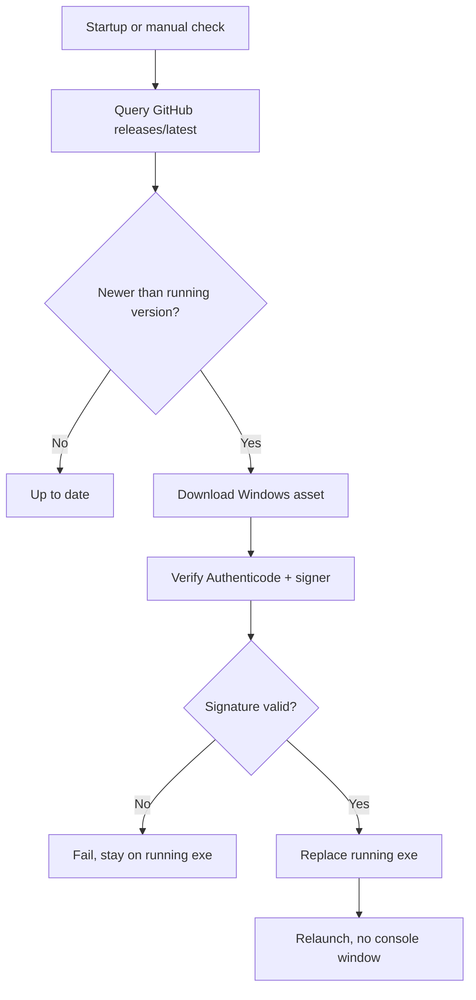

<!-- PAGE_ID: hark_11_updates_autostart -->
<details>
<summary>Relevant source files</summary>

The following files were used as evidence for this page:

- [crates/hark-update/src/lib.rs:1-340](https://github.com/BoardPandas/Hark/blob/1c1738716fa4cd758b0c26ec94d0873d1bc35ac1/crates/hark-update/src/lib.rs#L1-L340)
- [crates/hark-update/src/verify.rs:1-220](https://github.com/BoardPandas/Hark/blob/1c1738716fa4cd758b0c26ec94d0873d1bc35ac1/crates/hark-update/src/verify.rs#L1-L220)
- [crates/hark-autostart/src/lib.rs:1-204](https://github.com/BoardPandas/Hark/blob/1c1738716fa4cd758b0c26ec94d0873d1bc35ac1/crates/hark-autostart/src/lib.rs#L1-L204)
- [crates/hark-app/src/update.rs:1-228](https://github.com/BoardPandas/Hark/blob/1c1738716fa4cd758b0c26ec94d0873d1bc35ac1/crates/hark-app/src/update.rs#L1-L228)

</details>

# Updates and Autostart

> **Related Pages**: [Desktop UI](DESKTOP_UI.md), [Release and Packaging](../operations/RELEASE_AND_PACKAGING.md), [Overview](../OVERVIEW.md)

---

<!-- BEGIN:AUTOGEN hark_11_updates_autostart_overview -->
## Overview

Hark ships as a single signed portable `.exe` published as a GitHub release asset, and updates itself in place rather than relying on a package manager or store (`crates/hark-update/src/lib.rs:1-18`). A separate crate, `hark-autostart`, registers Hark to launch hidden into the tray at login by writing directly to the Windows `Run` registry key (`crates/hark-autostart/src/lib.rs:1-21`).

The update lifecycle has four stages, each blocking and run on a worker thread so the UI thread never stalls: check the GitHub Releases API against the running SemVer, download the signed Windows asset next to the running exe, verify its Authenticode signature and publisher against the running exe, then swap the exe and relaunch ([lib.rs:1-18](https://github.com/BoardPandas/Hark/blob/1c1738716fa4cd758b0c26ec94d0873d1bc35ac1/crates/hark-update/src/lib.rs#L1-L18)). On non-Windows targets, signature verification always refuses and the app falls back to opening the GitHub release page instead of self-installing ([verify.rs:11-23](https://github.com/BoardPandas/Hark/blob/1c1738716fa4cd758b0c26ec94d0873d1bc35ac1/crates/hark-update/src/verify.rs#L11-L23)).



Sources: [lib.rs:1-18](https://github.com/BoardPandas/Hark/blob/1c1738716fa4cd758b0c26ec94d0873d1bc35ac1/crates/hark-update/src/lib.rs#L1-L18), [verify.rs:1-23](https://github.com/BoardPandas/Hark/blob/1c1738716fa4cd758b0c26ec94d0873d1bc35ac1/crates/hark-update/src/verify.rs#L1-L23)
<!-- END:AUTOGEN hark_11_updates_autostart_overview -->

---

<!-- BEGIN:AUTOGEN hark_11_updates_autostart_checker -->
## Update Checker

`hark_update::check` asks the GitHub Releases API for the latest release of `BoardPandas/Hark` and compares its tag, parsed as SemVer, against `current_version` (typically `env!("CARGO_PKG_VERSION")`) ([lib.rs:112-158](https://github.com/BoardPandas/Hark/blob/1c1738716fa4cd758b0c26ec94d0873d1bc35ac1/crates/hark-update/src/lib.rs#L112-L158)). It calls `releases/latest`, which GitHub excludes drafts and prereleases from, so only real published releases are ever offered ([lib.rs:115-117](https://github.com/BoardPandas/Hark/blob/1c1738716fa4cd758b0c26ec94d0873d1bc35ac1/crates/hark-update/src/lib.rs#L115-L117)).

```rust
pub fn check(
    client: &reqwest::blocking::Client,
    current_version: &str,
) -> Result<Option<ReleaseInfo>, UpdateError> {
    let current = parse_version(current_version)?;
    let url = format!("https://api.github.com/repos/{REPO_OWNER}/{REPO_NAME}/releases/latest");

    let release: GhRelease = client
        .get(&url)
        .header(reqwest::header::USER_AGENT, USER_AGENT)
        .header(reqwest::header::ACCEPT, "application/vnd.github+json")
        .send()?
        .error_for_status()?
        .json()?;

    let latest = parse_version(release.tag_name.trim_start_matches('v'))?;
    if latest <= current {
        return Ok(None);
    }
    // ...picks the Windows asset and builds ReleaseInfo
}
```

Sources: [lib.rs:118-158](https://github.com/BoardPandas/Hark/blob/1c1738716fa4cd758b0c26ec94d0873d1bc35ac1/crates/hark-update/src/lib.rs#L118-L158)

GitHub requires a `User-Agent` header on every API request or it returns 403, so `check` and `download` both set one derived from the crate's own version (`hark-update/<version> (BoardPandas/Hark)`) ([lib.rs:32-37](https://github.com/BoardPandas/Hark/blob/1c1738716fa4cd758b0c26ec94d0873d1bc35ac1/crates/hark-update/src/lib.rs#L32-L37)). The published asset is matched by filename suffix (`-windows-x64.exe`), not an exact name, so a version bump in the middle of the filename never breaks the picker ([lib.rs:39-41](https://github.com/BoardPandas/Hark/blob/1c1738716fa4cd758b0c26ec94d0873d1bc35ac1/crates/hark-update/src/lib.rs#L39-L41), [lib.rs:139-142](https://github.com/BoardPandas/Hark/blob/1c1738716fa4cd758b0c26ec94d0873d1bc35ac1/crates/hark-update/src/lib.rs#L139-L142)). `Ok(None)` is returned when the release is not strictly newer, so callers cannot show a stale or same-version update prompt ([lib.rs:133-137](https://github.com/BoardPandas/Hark/blob/1c1738716fa4cd758b0c26ec94d0873d1bc35ac1/crates/hark-update/src/lib.rs#L133-L137)).

`ReleaseInfo` is the shared shape both the checker and the app UI operate on:

| Field | Type | Purpose |
|---|---|---|
| `version` | `String` | Normalized SemVer, e.g. `0.14.0` ([lib.rs:71-73](https://github.com/BoardPandas/Hark/blob/1c1738716fa4cd758b0c26ec94d0873d1bc35ac1/crates/hark-update/src/lib.rs#L71-L73)) |
| `tag` | `String` | The raw git tag, e.g. `v0.14.0` ([lib.rs:74-75](https://github.com/BoardPandas/Hark/blob/1c1738716fa4cd758b0c26ec94d0873d1bc35ac1/crates/hark-update/src/lib.rs#L74-L75)) |
| `notes` | `String` | Release notes body, may be empty ([lib.rs:76-77](https://github.com/BoardPandas/Hark/blob/1c1738716fa4cd758b0c26ec94d0873d1bc35ac1/crates/hark-update/src/lib.rs#L76-L77)) |
| `html_url` | `String` | Release page URL, used for the "view release" / macOS fallback path ([lib.rs:78-79](https://github.com/BoardPandas/Hark/blob/1c1738716fa4cd758b0c26ec94d0873d1bc35ac1/crates/hark-update/src/lib.rs#L78-L79)) |
| `asset_name` / `asset_url` | `String` | Windows asset filename and direct download URL, empty when the release has no Windows asset ([lib.rs:80-83](https://github.com/BoardPandas/Hark/blob/1c1738716fa4cd758b0c26ec94d0873d1bc35ac1/crates/hark-update/src/lib.rs#L80-L83)) |

`ReleaseInfo::has_windows_asset()` reports whether `asset_url` is non-empty; the UI uses it to decide between self-install and opening the release page ([lib.rs:86-92](https://github.com/BoardPandas/Hark/blob/1c1738716fa4cd758b0c26ec94d0873d1bc35ac1/crates/hark-update/src/lib.rs#L86-L92)). Once a release passes the version check, `download` streams the Windows asset to `<dir-of-running-exe>/<asset_name>.download`, staging it on the same volume the running exe lives on, which the later in-place swap requires ([lib.rs:160-187](https://github.com/BoardPandas/Hark/blob/1c1738716fa4cd758b0c26ec94d0873d1bc35ac1/crates/hark-update/src/lib.rs#L160-L187)). Because a binary download can run far longer than the STT client's 15 s total timeout, the download request overrides it with a 600 s ceiling ([lib.rs:43-45](https://github.com/BoardPandas/Hark/blob/1c1738716fa4cd758b0c26ec94d0873d1bc35ac1/crates/hark-update/src/lib.rs#L43-L45), [lib.rs:175](https://github.com/BoardPandas/Hark/blob/1c1738716fa4cd758b0c26ec94d0873d1bc35ac1/crates/hark-update/src/lib.rs#L175)).

Sources: [lib.rs:1-158](https://github.com/BoardPandas/Hark/blob/1c1738716fa4cd758b0c26ec94d0873d1bc35ac1/crates/hark-update/src/lib.rs#L1-L158), [lib.rs:160-187](https://github.com/BoardPandas/Hark/blob/1c1738716fa4cd758b0c26ec94d0873d1bc35ac1/crates/hark-update/src/lib.rs#L160-L187)
<!-- END:AUTOGEN hark_11_updates_autostart_checker -->

---

<!-- BEGIN:AUTOGEN hark_11_updates_autostart_verify -->
## Signature Verification

Before a downloaded build is ever allowed to replace the running exe, `verify` runs two gates on Windows, both of which must pass (`crates/hark-update/src/verify.rs:1-9`):

1. **`WinVerifyTrust`**: confirms the file carries a valid Authenticode signature chaining to a trusted root, rejecting unsigned, tampered, or untrusted files ([verify.rs:61-117](https://github.com/BoardPandas/Hark/blob/1c1738716fa4cd758b0c26ec94d0873d1bc35ac1/crates/hark-update/src/verify.rs#L61-L117)).
2. **Signer-subject match**: the downloaded exe's signer must equal the *running* exe's signer, so a validly-signed binary from a different publisher is still refused ([verify.rs:26-48](https://github.com/BoardPandas/Hark/blob/1c1738716fa4cd758b0c26ec94d0873d1bc35ac1/crates/hark-update/src/verify.rs#L26-L48)).

This design self-anchors to whoever signed the already-installed copy; no certificate string is hardcoded in the app ([verify.rs:7-9](https://github.com/BoardPandas/Hark/blob/1c1738716fa4cd758b0c26ec94d0873d1bc35ac1/crates/hark-update/src/verify.rs#L7-L9)). If the running exe itself is unsigned (a dev build), the signer match cannot anchor, so `verify` falls back to the trusted-signature check alone and logs a warning rather than silently accepting or hard-failing ([verify.rs:41-47](https://github.com/BoardPandas/Hark/blob/1c1738716fa4cd758b0c26ec94d0873d1bc35ac1/crates/hark-update/src/verify.rs#L41-L47)):

```rust
match std::env::current_exe().ok().and_then(|p| signer_subject(&p).ok()) {
    Some(running_signer) if running_signer == staged_signer => {
        log::info!("update signer verified: {staged_signer}");
        Ok(())
    }
    Some(running_signer) => Err(UpdateError::Verification(format!(
        "downloaded update is signed by \"{staged_signer}\", not the running app's publisher \"{running_signer}\""
    ))),
    None => {
        log::warn!(
            "running exe is unsigned; accepting update on trusted-signature check alone \
             (downloaded signer: {staged_signer})"
        );
        Ok(())
    }
}
```

Sources: [verify.rs:25-49](https://github.com/BoardPandas/Hark/blob/1c1738716fa4cd758b0c26ec94d0873d1bc35ac1/crates/hark-update/src/verify.rs#L25-L49)

The signer subject is read from the exe's embedded PKCS#7 signature via `CryptQueryObject` and `CryptMsgGetParam`, then resolved to a certificate in the query's store with `CertFindCertificateInStore` and rendered as a simple display name with `CertGetNameStringW` ([verify.rs:121-200](https://github.com/BoardPandas/Hark/blob/1c1738716fa4cd758b0c26ec94d0873d1bc35ac1/crates/hark-update/src/verify.rs#L121-L200), [verify.rs:203-220](https://github.com/BoardPandas/Hark/blob/1c1738716fa4cd758b0c26ec94d0873d1bc35ac1/crates/hark-update/src/verify.rs#L203-L220)). On non-Windows targets there is no published artifact to self-install, so `verify` is a stub that always returns `UpdateError::Verification` and the UI is expected to open the release page instead ([verify.rs:18-23](https://github.com/BoardPandas/Hark/blob/1c1738716fa4cd758b0c26ec94d0873d1bc35ac1/crates/hark-update/src/verify.rs#L18-L23)):

```rust
#[cfg(not(windows))]
pub fn verify(_staged: &Path) -> Result<(), UpdateError> {
    Err(UpdateError::Verification(
        "self-install is only supported on Windows".to_string(),
    ))
}
```

_TBD_, no macOS-specific signature verification path exists in `verify.rs`; the doc comment confirms self-install is Windows-only and macOS always falls back to the browser release page (`crates/hark-update/src/verify.rs:11-12`).

| Gate | API | Failure mode | Source |
|---|---|---|---|
| Trust chain | `WinVerifyTrust` | Non-zero status returns `UpdateError::Verification` with the hex status code | [verify.rs:91-115](https://github.com/BoardPandas/Hark/blob/1c1738716fa4cd758b0c26ec94d0873d1bc35ac1/crates/hark-update/src/verify.rs#L91-L115) |
| Signer identity | `CertFindCertificateInStore` + subject compare | Mismatched signer, or no embedded signature at all, returns `UpdateError::Verification` | [verify.rs:154-192](https://github.com/BoardPandas/Hark/blob/1c1738716fa4cd758b0c26ec94d0873d1bc35ac1/crates/hark-update/src/verify.rs#L154-L192) |

Sources: [verify.rs:1-220](https://github.com/BoardPandas/Hark/blob/1c1738716fa4cd758b0c26ec94d0873d1bc35ac1/crates/hark-update/src/verify.rs#L1-L220)
<!-- END:AUTOGEN hark_11_updates_autostart_verify -->

---

<!-- BEGIN:AUTOGEN hark_11_updates_autostart_appglue -->
## App Integration

`hark-app`'s `update.rs` owns a single `Updater` state machine shared by the startup banner and the Settings section, so both surfaces always agree on where the update is in its lifecycle ([update.rs:1-4](https://github.com/BoardPandas/Hark/blob/1c1738716fa4cd758b0c26ec94d0873d1bc35ac1/crates/hark-app/src/update.rs#L1-L4)). Network and disk work run on detached worker threads and report back over an `mpsc` channel; the UI thread only drains results in `Updater::poll`, called every frame, and never blocks ([update.rs:6-11](https://github.com/BoardPandas/Hark/blob/1c1738716fa4cd758b0c26ec94d0873d1bc35ac1/crates/hark-app/src/update.rs#L6-L11), [update.rs:196-227](https://github.com/BoardPandas/Hark/blob/1c1738716fa4cd758b0c26ec94d0873d1bc35ac1/crates/hark-app/src/update.rs#L196-L227)).

`Phase` models every stage the UI can render:

| Phase | Meaning | Source |
|---|---|---|
| `Idle` | Nothing attempted this session | [update.rs:25-26](https://github.com/BoardPandas/Hark/blob/1c1738716fa4cd758b0c26ec94d0873d1bc35ac1/crates/hark-app/src/update.rs#L25-L26) |
| `Checking` | A check is in flight | [update.rs:27-28](https://github.com/BoardPandas/Hark/blob/1c1738716fa4cd758b0c26ec94d0873d1bc35ac1/crates/hark-app/src/update.rs#L27-L28) |
| `UpToDate` | Checked, running build is current | [update.rs:29-30](https://github.com/BoardPandas/Hark/blob/1c1738716fa4cd758b0c26ec94d0873d1bc35ac1/crates/hark-app/src/update.rs#L29-L30) |
| `Available(ReleaseInfo)` | A newer release exists | [update.rs:31-32](https://github.com/BoardPandas/Hark/blob/1c1738716fa4cd758b0c26ec94d0873d1bc35ac1/crates/hark-app/src/update.rs#L31-L32) |
| `Installing(ReleaseInfo)` | Downloading + verifying the newer release | [update.rs:33-34](https://github.com/BoardPandas/Hark/blob/1c1738716fa4cd758b0c26ec94d0873d1bc35ac1/crates/hark-app/src/update.rs#L33-L34) |
| `Ready { release, staged }` | Verified and staged; a restart finishes the update | [update.rs:35-39](https://github.com/BoardPandas/Hark/blob/1c1738716fa4cd758b0c26ec94d0873d1bc35ac1/crates/hark-app/src/update.rs#L35-L39) |
| `Failed(String)` | Last check or install failed, message is user-facing | [update.rs:40-41](https://github.com/BoardPandas/Hark/blob/1c1738716fa4cd758b0c26ec94d0873d1bc35ac1/crates/hark-app/src/update.rs#L40-L41) |

`start_check` and `start_install` each build a fresh `reqwest::blocking::Client` per operation via `hark_stt::shared_client()` rather than sharing the pipeline's hot-path client, since update checks are rare and off the latency-critical path ([update.rs:9-11](https://github.com/BoardPandas/Hark/blob/1c1738716fa4cd758b0c26ec94d0873d1bc35ac1/crates/hark-app/src/update.rs#L9-L11), [update.rs:112-136](https://github.com/BoardPandas/Hark/blob/1c1738716fa4cd758b0c26ec94d0873d1bc35ac1/crates/hark-app/src/update.rs#L112-L136), [update.rs:140-172](https://github.com/BoardPandas/Hark/blob/1c1738716fa4cd758b0c26ec94d0873d1bc35ac1/crates/hark-app/src/update.rs#L140-L172)). Both are no-ops while `is_busy()` is already true, which is `true` exactly during `Checking` or `Installing` ([update.rs:86-88](https://github.com/BoardPandas/Hark/blob/1c1738716fa4cd758b0c26ec94d0873d1bc35ac1/crates/hark-app/src/update.rs#L86-L88), [update.rs:113-115](https://github.com/BoardPandas/Hark/blob/1c1738716fa4cd758b0c26ec94d0873d1bc35ac1/crates/hark-app/src/update.rs#L113-L115), [update.rs:141-143](https://github.com/BoardPandas/Hark/blob/1c1738716fa4cd758b0c26ec94d0873d1bc35ac1/crates/hark-app/src/update.rs#L141-L143)).

`can_self_install()` gates the UI's choice between an in-place install and linking out to the release page: it is only `true` on Windows when the current release phase carries a `ReleaseInfo` with a Windows asset, so macOS users always land on the "view release" path described in `ReleaseInfo::html_url` ([update.rs:90-94](https://github.com/BoardPandas/Hark/blob/1c1738716fa4cd758b0c26ec94d0873d1bc35ac1/crates/hark-app/src/update.rs#L90-L94)):

```rust
pub fn can_self_install(&self) -> bool {
    cfg!(windows) && self.release().is_some_and(|r| r.has_windows_asset())
}
```

The startup banner and the Settings page share `banner_visible()`, which only raises the banner for `Available`, `Installing`, or `Ready`, and stays hidden once the user calls `dismiss_banner()` until the next successful check re-arms it ([update.rs:96-109](https://github.com/BoardPandas/Hark/blob/1c1738716fa4cd758b0c26ec94d0873d1bc35ac1/crates/hark-app/src/update.rs#L96-L109), [update.rs:207-210](https://github.com/BoardPandas/Hark/blob/1c1738716fa4cd758b0c26ec94d0873d1bc35ac1/crates/hark-app/src/update.rs#L207-L210)). `restart()` calls `hark_update::apply` then `hark_update::relaunch`; on success the process exits and never returns, and if relaunch fails after the exe was already swapped, the failure message tells the user to reopen Hark manually rather than silently leaving them on the old, now-deleted build ([update.rs:174-194](https://github.com/BoardPandas/Hark/blob/1c1738716fa4cd758b0c26ec94d0873d1bc35ac1/crates/hark-app/src/update.rs#L174-L194)).

Sources: [update.rs:1-228](https://github.com/BoardPandas/Hark/blob/1c1738716fa4cd758b0c26ec94d0873d1bc35ac1/crates/hark-app/src/update.rs#L1-L228)
<!-- END:AUTOGEN hark_11_updates_autostart_appglue -->

---

<!-- BEGIN:AUTOGEN hark_11_updates_autostart_autostart -->
## Launch at Login

`hark-autostart` manages a value named `Hark` under `HKCU\Software\Microsoft\Windows\CurrentVersion\Run`, whose data is the quoted current-exe path plus a `--hidden` flag ([lib.rs:1-7](https://github.com/BoardPandas/Hark/blob/1c1738716fa4cd758b0c26ec94d0873d1bc35ac1/crates/hark-autostart/src/lib.rs#L1-L7), [lib.rs:26-33](https://github.com/BoardPandas/Hark/blob/1c1738716fa4cd758b0c26ec94d0873d1bc35ac1/crates/hark-autostart/src/lib.rs#L26-L33)). The Settings toggle drives `reconcile(enabled)`: enabling writes or overwrites the value, self-healing a stale path after an in-place upgrade; disabling deletes it ([lib.rs:44-48](https://github.com/BoardPandas/Hark/blob/1c1738716fa4cd758b0c26ec94d0873d1bc35ac1/crates/hark-autostart/src/lib.rs#L44-L48), [lib.rs:81-88](https://github.com/BoardPandas/Hark/blob/1c1738716fa4cd758b0c26ec94d0873d1bc35ac1/crates/hark-autostart/src/lib.rs#L81-L88)):

```rust
pub(super) fn reconcile(enabled: bool) -> Result<(), Error> {
    if enabled {
        let exe = current_exe()?;
        write_value(RUN_SUBKEY, RUN_VALUE_NAME, &command_for(&exe))
    } else {
        remove_value(RUN_SUBKEY, RUN_VALUE_NAME)
    }
}
```

Sources: [lib.rs:81-88](https://github.com/BoardPandas/Hark/blob/1c1738716fa4cd758b0c26ec94d0873d1bc35ac1/crates/hark-autostart/src/lib.rs#L81-L88)

The crate deliberately touches only the `Run` *value*, never the `StartupApproved\Run` flag Windows uses to record a Task Manager "disable". A user who turns Hark off in Task Manager stays in control: the `Run` value is still present but Windows ignores it, and the app never rewrites the approval flag to override that choice ([lib.rs:9-13](https://github.com/BoardPandas/Hark/blob/1c1738716fa4cd758b0c26ec94d0873d1bc35ac1/crates/hark-autostart/src/lib.rs#L9-L13)). Writing the key in-process via the `winreg` crate is deliberate too: the release binary is windowless (`windows_subsystem = "windows"`), so shelling out to `reg.exe` or PowerShell would flash a focus-stealing console window, a documented LL-G HIGH-severity gotcha ([lib.rs:14-18](https://github.com/BoardPandas/Hark/blob/1c1738716fa4cd758b0c26ec94d0873d1bc35ac1/crates/hark-autostart/src/lib.rs#L14-L18)).

| Function | Behavior | Source |
|---|---|---|
| `reconcile(enabled)` | Idempotent: enabling twice rewrites the same value; disabling when absent is a no-op | [lib.rs:46-48](https://github.com/BoardPandas/Hark/blob/1c1738716fa4cd758b0c26ec94d0873d1bc35ac1/crates/hark-autostart/src/lib.rs#L46-L48) |
| `is_enabled()` | True when the startup entry exists and points at the current exe; used for diagnostics/tests only, nothing on the hot path reads the registry | [lib.rs:50-55](https://github.com/BoardPandas/Hark/blob/1c1738716fa4cd758b0c26ec94d0873d1bc35ac1/crates/hark-autostart/src/lib.rs#L50-L55), [lib.rs:90-96](https://github.com/BoardPandas/Hark/blob/1c1738716fa4cd758b0c26ec94d0873d1bc35ac1/crates/hark-autostart/src/lib.rs#L90-L96) |
| `remove_value` | Deletes the value if present; a missing subkey or value is treated as success | [lib.rs:106-120](https://github.com/BoardPandas/Hark/blob/1c1738716fa4cd758b0c26ec94d0873d1bc35ac1/crates/hark-autostart/src/lib.rs#L106-L120) |
| `read_value` | Returns `None` when either the subkey or the value is absent, never errors on "not configured" | [lib.rs:122-136](https://github.com/BoardPandas/Hark/blob/1c1738716fa4cd758b0c26ec94d0873d1bc35ac1/crates/hark-autostart/src/lib.rs#L122-L136) |

_TBD_, no macOS login-item implementation exists yet. The module doc explicitly calls out that non-Windows targets get no-op stubs so the desktop app compiles everywhere, and that the macOS login item (`SMAppService` / `LaunchAgent`) is a separate, unbuilt task (`crates/hark-autostart/src/lib.rs:20-21`, [lib.rs:178-189](https://github.com/BoardPandas/Hark/blob/1c1738716fa4cd758b0c26ec94d0873d1bc35ac1/crates/hark-autostart/src/lib.rs#L178-L189)):

```rust
#[cfg(not(windows))]
mod imp {
    use super::Error;

    pub(super) fn reconcile(_enabled: bool) -> Result<(), Error> {
        Ok(())
    }

    pub(super) fn is_enabled() -> Result<bool, Error> {
        Ok(false)
    }
}
```

Sources: [lib.rs:1-204](https://github.com/BoardPandas/Hark/blob/1c1738716fa4cd758b0c26ec94d0873d1bc35ac1/crates/hark-autostart/src/lib.rs#L1-L204)
<!-- END:AUTOGEN hark_11_updates_autostart_autostart -->

---
