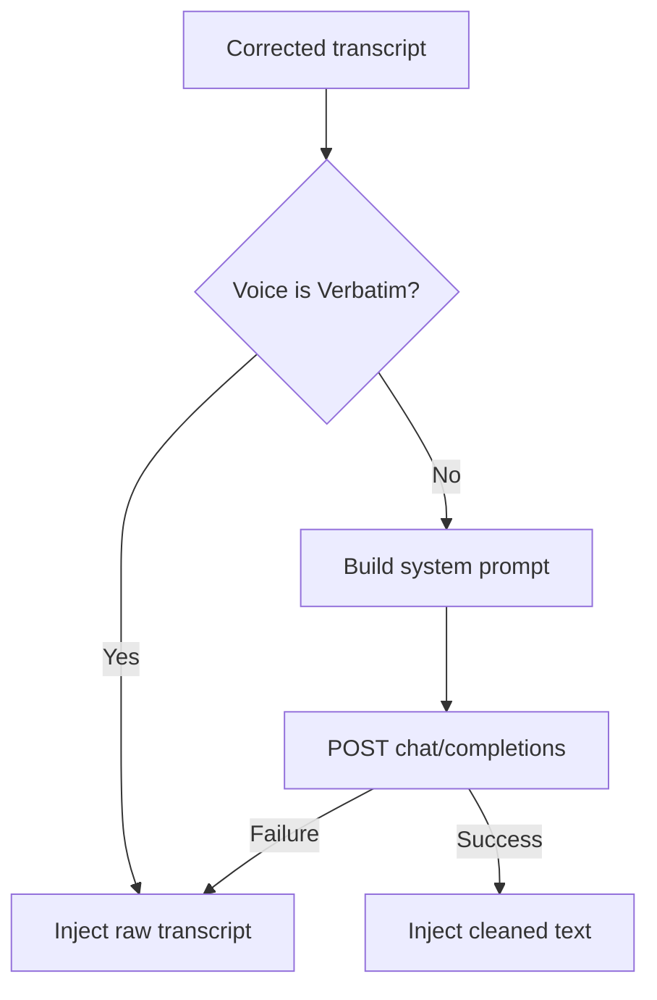

<!-- PAGE_ID: hark_09_voice_cleanup -->
<details>
<summary>Relevant source files</summary>

The following files were used as evidence for this page:

- [crates/hark-voice/src/lib.rs:1-49](https://github.com/BoardPandas/Hark/blob/1c1738716fa4cd758b0c26ec94d0873d1bc35ac1/crates/hark-voice/src/lib.rs#L1-L49)
- [crates/hark-voice/src/voices.rs:1-155](https://github.com/BoardPandas/Hark/blob/1c1738716fa4cd758b0c26ec94d0873d1bc35ac1/crates/hark-voice/src/voices.rs#L1-L155)
- [crates/hark-voice/src/openai_compatible.rs:1-287](https://github.com/BoardPandas/Hark/blob/1c1738716fa4cd758b0c26ec94d0873d1bc35ac1/crates/hark-voice/src/openai_compatible.rs#L1-L287)
- [crates/hark-voice/src/error.rs:1-111](https://github.com/BoardPandas/Hark/blob/1c1738716fa4cd758b0c26ec94d0873d1bc35ac1/crates/hark-voice/src/error.rs#L1-L111)

</details>

# Voice Cleanup

> **Related Pages**: [Transcription](TRANSCRIPTION.md), [Dictionary](DICTIONARY.md), [Configuration and Secrets](../core/CONFIGURATION.md)

---

<!-- BEGIN:AUTOGEN hark_09_voice_cleanup_overview -->
## Overview

Voice cleanup is an optional, single BYOK LLM call that rewrites the raw, dictionary-corrected transcript into the user's chosen register before injection ([lib.rs:1-5](https://github.com/BoardPandas/Hark/blob/1c1738716fa4cd758b0c26ec94d0873d1bc35ac1/crates/hark-voice/src/lib.rs#L1-L5)). `Voice::Verbatim` never triggers a call at all: the pipeline short-circuits before a `CleanupProvider` adapter is even constructed ([lib.rs:4](https://github.com/BoardPandas/Hark/blob/1c1738716fa4cd758b0c26ec94d0873d1bc35ac1/crates/hark-voice/src/lib.rs#L4), [openai_compatible.rs:212-220](https://github.com/BoardPandas/Hark/blob/1c1738716fa4cd758b0c26ec94d0873d1bc35ac1/crates/hark-voice/src/openai_compatible.rs#L212-L220)).

`hark-voice` follows the same I/O-thin discipline as `hark-stt`: pure, unit-testable request/response functions with a thin `reqwest::blocking` shell on top, run on the pipeline worker thread with no tokio runtime, and no code path that ever logs API keys, prompts, or transcript text ([lib.rs:7-10](https://github.com/BoardPandas/Hark/blob/1c1738716fa4cd758b0c26ec94d0873d1bc35ac1/crates/hark-voice/src/lib.rs#L7-L10)). Cleanup failure is always fail-open: the pipeline injects the uncleaned transcript rather than blocking on a retry, and the adapter deliberately never retries ([openai_compatible.rs:192-195](https://github.com/BoardPandas/Hark/blob/1c1738716fa4cd758b0c26ec94d0873d1bc35ac1/crates/hark-voice/src/openai_compatible.rs#L192-L195)).



Sources: [lib.rs:1-49](https://github.com/BoardPandas/Hark/blob/1c1738716fa4cd758b0c26ec94d0873d1bc35ac1/crates/hark-voice/src/lib.rs#L1-L49), [openai_compatible.rs:192-234](https://github.com/BoardPandas/Hark/blob/1c1738716fa4cd758b0c26ec94d0873d1bc35ac1/crates/hark-voice/src/openai_compatible.rs#L192-L234)
<!-- END:AUTOGEN hark_09_voice_cleanup_overview -->

---

<!-- BEGIN:AUTOGEN hark_09_voice_cleanup_voices -->
## Voice Presets

Five voices are supported; each maps to a display name and, except for `Verbatim`, a fixed rewrite instruction that seeds the per-request system prompt ([voices.rs:10-33](https://github.com/BoardPandas/Hark/blob/1c1738716fa4cd758b0c26ec94d0873d1bc35ac1/crates/hark-voice/src/voices.rs#L10-L33)).

| Voice | Name string | Behavior |
|---|---|---|
| `Verbatim` | `"verbatim"` | Never calls the cleanup adapter; pipeline injects the raw transcript ([voices.rs:9](https://github.com/BoardPandas/Hark/blob/1c1738716fa4cd758b0c26ec94d0873d1bc35ac1/crates/hark-voice/src/voices.rs#L9), [openai_compatible.rs:215-220](https://github.com/BoardPandas/Hark/blob/1c1738716fa4cd758b0c26ec94d0873d1bc35ac1/crates/hark-voice/src/openai_compatible.rs#L215-L220)) |
| `Clean` | `"clean"` | Fixes punctuation, capitalization, filler words, false starts, and repeated words; preserves wording, meaning, and tone ([voices.rs:119-121](https://github.com/BoardPandas/Hark/blob/1c1738716fa4cd758b0c26ec94d0873d1bc35ac1/crates/hark-voice/src/voices.rs#L119-L121)) |
| `Professional` | `"professional"` | Rewrites in a polished business register suitable for a colleague ([voices.rs:123-125](https://github.com/BoardPandas/Hark/blob/1c1738716fa4cd758b0c26ec94d0873d1bc35ac1/crates/hark-voice/src/voices.rs#L123-L125)) |
| `Casual` | `"casual"` | Rewrites in a relaxed, conversational register, still fixing fillers and false starts ([voices.rs:127-129](https://github.com/BoardPandas/Hark/blob/1c1738716fa4cd758b0c26ec94d0873d1bc35ac1/crates/hark-voice/src/voices.rs#L127-L129)) |
| `Custom` | `"custom"` | Uses the user's own prompt text verbatim as the instruction ([voices.rs:142](https://github.com/BoardPandas/Hark/blob/1c1738716fa4cd758b0c26ec94d0873d1bc35ac1/crates/hark-voice/src/voices.rs#L142)) |

`Voice::from_str` parses these names case-insensitively and whitespace-trimmed, shared by the config's `voice.default` field and the CLI's `--voice` flag; an unrecognized name yields `UnknownVoice`, whose `Display` lists the valid names ([voices.rs:53-67](https://github.com/BoardPandas/Hark/blob/1c1738716fa4cd758b0c26ec94d0873d1bc35ac1/crates/hark-voice/src/voices.rs#L53-L67), [voices.rs:40-49](https://github.com/BoardPandas/Hark/blob/1c1738716fa4cd758b0c26ec94d0873d1bc35ac1/crates/hark-voice/src/voices.rs#L40-L49)).

Two gates run before any request is built:

- **Word-count gate** (`skips_cleanup`): short utterances (fewer than `min_words` Unicode-whitespace-separated tokens) skip cleanup even for a non-Verbatim voice; `min_words == 0` disables the gate, and an exactly-at-threshold transcript is not skipped ([voices.rs:73-78](https://github.com/BoardPandas/Hark/blob/1c1738716fa4cd758b0c26ec94d0873d1bc35ac1/crates/hark-voice/src/voices.rs#L73-L78)).
- **Present-terms filter** (`present_terms`): only dictionary terms that actually (case-insensitively) appear in the outgoing text are candidates for the protected-terms clause, keeping the prompt small for the common case ([voices.rs:83-90](https://github.com/BoardPandas/Hark/blob/1c1738716fa4cd758b0c26ec94d0873d1bc35ac1/crates/hark-voice/src/voices.rs#L83-L90)).

```rust
// crates/hark-voice/src/voices.rs:131-154
pub fn system_prompt(voice: Voice, custom_prompt: &str, present_terms: &[&str]) -> Option<String> {
    let instruction = match voice {
        Voice::Verbatim => return None,
        Voice::Clean => CLEAN_INSTRUCTION,
        Voice::Professional => PROFESSIONAL_INSTRUCTION,
        Voice::Casual => CASUAL_INSTRUCTION,
        Voice::Custom => custom_prompt,
    };
    let mut prompt = instruction.to_string();
    let kept = budgeted_terms(present_terms);
    if !kept.is_empty() {
        prompt.push_str(" Leave these terms exactly as written: ");
        prompt.push_str(&kept.join(", "));
        prompt.push('.');
    }
    prompt.push(' ');
    prompt.push_str(RETURN_ONLY_CLAUSE);
    Some(prompt)
}
```

The protected-terms clause is capped at a 400-token budget (chars/4 heuristic, same style as `hark-stt`'s `prompt_from_bias_terms`); terms are kept in dictionary order until the budget would be exceeded, and the first term that would cross it (and everything after) is dropped ([voices.rs:92-113](https://github.com/BoardPandas/Hark/blob/1c1738716fa4cd758b0c26ec94d0873d1bc35ac1/crates/hark-voice/src/voices.rs#L92-L113)). Every prompt, including `Custom`, ends with the shared `RETURN_ONLY_CLAUSE` instructing the model to return only the rewritten text with no commentary or surrounding quotes ([voices.rs:116-117](https://github.com/BoardPandas/Hark/blob/1c1738716fa4cd758b0c26ec94d0873d1bc35ac1/crates/hark-voice/src/voices.rs#L116-L117)).

Sources: [voices.rs:1-155](https://github.com/BoardPandas/Hark/blob/1c1738716fa4cd758b0c26ec94d0873d1bc35ac1/crates/hark-voice/src/voices.rs#L1-L155)
<!-- END:AUTOGEN hark_09_voice_cleanup_voices -->

---

<!-- BEGIN:AUTOGEN hark_09_voice_cleanup_adapter -->
## Cleanup Adapter

`OpenAiCompatibleChat` is the one live adapter, targeting the OpenAI-compatible `POST {base_url}/chat/completions` contract shared by OpenAI and Groq (a chat product Deepgram does not have, so Deepgram is rejected earlier at config validation) ([openai_compatible.rs:1-5](https://github.com/BoardPandas/Hark/blob/1c1738716fa4cd758b0c26ec94d0873d1bc35ac1/crates/hark-voice/src/openai_compatible.rs#L1-L5), [openai_compatible.rs:16-18](https://github.com/BoardPandas/Hark/blob/1c1738716fa4cd758b0c26ec94d0873d1bc35ac1/crates/hark-voice/src/openai_compatible.rs#L16-L18)). It shares the process-wide `reqwest::blocking::Client` (an `Arc` internally) rather than building one per request ([openai_compatible.rs:209-233](https://github.com/BoardPandas/Hark/blob/1c1738716fa4cd758b0c26ec94d0873d1bc35ac1/crates/hark-voice/src/openai_compatible.rs#L209-L233)).

`CleanupConfig` carries everything needed to build one adapter, resolved by the pipeline from `hark-config` plus the key from `hark-keychain` or STT-key reuse:

| Field | Purpose |
|---|---|
| `label` | Short human label for logs/errors ("openai", "groq"); never the key ([openai_compatible.rs:152-154](https://github.com/BoardPandas/Hark/blob/1c1738716fa4cd758b0c26ec94d0873d1bc35ac1/crates/hark-voice/src/openai_compatible.rs#L152-L154)) |
| `base_url` | e.g. `https://api.openai.com/v1`; chat and STT share base URLs ([openai_compatible.rs:155-156](https://github.com/BoardPandas/Hark/blob/1c1738716fa4cd758b0c26ec94d0873d1bc35ac1/crates/hark-voice/src/openai_compatible.rs#L155-L156)) |
| `model` | e.g. `gpt-5-nano`, `llama-3.1-8b-instant` ([openai_compatible.rs:157-158](https://github.com/BoardPandas/Hark/blob/1c1738716fa4cd758b0c26ec94d0873d1bc35ac1/crates/hark-voice/src/openai_compatible.rs#L157-L158)) |
| `api_key` | From the keychain or STT-key reuse; never logged ([openai_compatible.rs:159-160](https://github.com/BoardPandas/Hark/blob/1c1738716fa4cd758b0c26ec94d0873d1bc35ac1/crates/hark-voice/src/openai_compatible.rs#L159-L160)) |
| `temperature` | Serialized only when present; OpenAI's GPT-5 family rejects any non-default temperature with a 400 ([openai_compatible.rs:161-163](https://github.com/BoardPandas/Hark/blob/1c1738716fa4cd758b0c26ec94d0873d1bc35ac1/crates/hark-voice/src/openai_compatible.rs#L161-L163)) |
| `reasoning_effort` | Serialized only when present; OpenAI GPT-5 family only ([openai_compatible.rs:164-165](https://github.com/BoardPandas/Hark/blob/1c1738716fa4cd758b0c26ec94d0873d1bc35ac1/crates/hark-voice/src/openai_compatible.rs#L164-L165)) |
| `voice` | The effective voice; `Verbatim` is rejected at construction ([openai_compatible.rs:166-168](https://github.com/BoardPandas/Hark/blob/1c1738716fa4cd758b0c26ec94d0873d1bc35ac1/crates/hark-voice/src/openai_compatible.rs#L166-L168)) |
| `custom_prompt` | The user's prompt text, used only for `Voice::Custom` ([openai_compatible.rs:169-170](https://github.com/BoardPandas/Hark/blob/1c1738716fa4cd758b0c26ec94d0873d1bc35ac1/crates/hark-voice/src/openai_compatible.rs#L169-L170)) |
| `dictionary_terms` | Subset to the present-terms clause per request ([openai_compatible.rs:171-173](https://github.com/BoardPandas/Hark/blob/1c1738716fa4cd758b0c26ec94d0873d1bc35ac1/crates/hark-voice/src/openai_compatible.rs#L171-L173)) |

`CleanupConfig` deliberately has no `Debug` derive; its manual `impl Debug` redacts `api_key` as `"<redacted>"` and `custom_prompt` as `"<user content>"` so a reflexive `{config:?}` in some future log line cannot leak either ([openai_compatible.rs:176-190](https://github.com/BoardPandas/Hark/blob/1c1738716fa4cd758b0c26ec94d0873d1bc35ac1/crates/hark-voice/src/openai_compatible.rs#L176-L190)).

Per call, `clean()` assembles the request fresh (the protected-terms clause depends on the outgoing text), sends it with Bearer auth and a tighter timeout than STT, and never retries because a failed cleanup call has a graceful fallback:

```rust
// crates/hark-voice/src/openai_compatible.rs:237-260
fn clean(&self, text: &str) -> Result<Cleaned, CleanupError> {
    let present = present_terms(text, &self.dictionary_terms);
    let prompt = system_prompt(self.voice, &self.custom_prompt, &present)
        .expect("non-verbatim voice enforced at construction");
    let body = build_request_body(
        &self.model,
        &prompt,
        text,
        self.temperature,
        self.reasoning_effort.as_deref(),
    );

    let started = Instant::now();
    let response = self
        .client
        .post(&self.url)
        .bearer_auth(&self.api_key)
        .header(reqwest::header::CONTENT_TYPE, "application/json")
        .timeout(Duration::from_millis(CLEANUP_TIMEOUT_MS))
        .body(body)
        .send()
        .map_err(|e| error_for_transport(&self.label, CLEANUP_TIMEOUT_MS, &e))?;
    // ...
```

The output-token cap (`max_completion_tokens`) is derived per request rather than fixed: input is estimated at chars/4, doubled plus a 256 headroom, and clamped to `[512, 4096]` so reasoning models (which spend reasoning tokens from the same budget) don't return truncated, empty content ([openai_compatible.rs:20-33](https://github.com/BoardPandas/Hark/blob/1c1738716fa4cd758b0c26ec94d0873d1bc35ac1/crates/hark-voice/src/openai_compatible.rs#L20-L33)). Both OpenAI and Groq have converged on `max_completion_tokens` (Groq deprecates `max_tokens`), so there is no per-provider branching in the request body ([openai_compatible.rs:41-56](https://github.com/BoardPandas/Hark/blob/1c1738716fa4cd758b0c26ec94d0873d1bc35ac1/crates/hark-voice/src/openai_compatible.rs#L41-L56)).

Sources: [openai_compatible.rs:1-287](https://github.com/BoardPandas/Hark/blob/1c1738716fa4cd758b0c26ec94d0873d1bc35ac1/crates/hark-voice/src/openai_compatible.rs#L1-L287)
<!-- END:AUTOGEN hark_09_voice_cleanup_adapter -->

---

<!-- BEGIN:AUTOGEN hark_09_voice_cleanup_api -->
## Public API

`hark-voice`'s crate root re-exports the pure prompt/gate helpers alongside the error taxonomy and defines the shared adapter trait and timing constants ([lib.rs:12-19](https://github.com/BoardPandas/Hark/blob/1c1738716fa4cd758b0c26ec94d0873d1bc35ac1/crates/hark-voice/src/lib.rs#L12-L19)).

| Item | Kind | Purpose |
|---|---|---|
| `CleanupProvider` | trait | The cleanup analog of `SttProvider`; `clean(&self, text: &str) -> Result<Cleaned, CleanupError>` plus `label()`, so pipeline worker tests can script it like `MockProvider` ([lib.rs:40-48](https://github.com/BoardPandas/Hark/blob/1c1738716fa4cd758b0c26ec94d0873d1bc35ac1/crates/hark-voice/src/lib.rs#L40-L48)) |
| `Cleaned` | struct | One cleanup result: `text` (rewritten) and `request_ms` (full HTTP round trip, added to release-to-inject latency) ([lib.rs:33-36](https://github.com/BoardPandas/Hark/blob/1c1738716fa4cd758b0c26ec94d0873d1bc35ac1/crates/hark-voice/src/lib.rs#L33-L36)) |
| `CONNECT_TIMEOUT_MS` | const | `3_000`; the shared HTTP client's connect bound, mirrored here so transport-error mapping names the right bound ([lib.rs:21-24](https://github.com/BoardPandas/Hark/blob/1c1738716fa4cd758b0c26ec94d0873d1bc35ac1/crates/hark-voice/src/lib.rs#L21-L24)) |
| `CLEANUP_TIMEOUT_MS` | const | `10_000`; per-request total timeout, tighter than STT's 15 s since cleanup failure falls back gracefully and never retries ([lib.rs:26-29](https://github.com/BoardPandas/Hark/blob/1c1738716fa4cd758b0c26ec94d0873d1bc35ac1/crates/hark-voice/src/lib.rs#L26-L29)) |
| `Voice`, `UnknownVoice`, `system_prompt`, `present_terms`, `skips_cleanup`, `RETURN_ONLY_CLAUSE` | re-exports | Pure prompt-assembly and gating primitives from `voices.rs` ([lib.rs:17-19](https://github.com/BoardPandas/Hark/blob/1c1738716fa4cd758b0c26ec94d0873d1bc35ac1/crates/hark-voice/src/lib.rs#L17-L19)) |
| `CleanupError`, `error_for_status`, `error_for_transport` | re-exports | The error taxonomy and its HTTP/transport mapping functions from `error.rs` ([lib.rs:16](https://github.com/BoardPandas/Hark/blob/1c1738716fa4cd758b0c26ec94d0873d1bc35ac1/crates/hark-voice/src/lib.rs#L16)) |

`OpenAiCompatibleChat` and `CleanupConfig` are exported from the `openai_compatible` submodule (kept public, not re-exported at the crate root) rather than the crate root itself, since the trait/data-only surface at the root is what the pipeline and tests script against ([lib.rs:13](https://github.com/BoardPandas/Hark/blob/1c1738716fa4cd758b0c26ec94d0873d1bc35ac1/crates/hark-voice/src/lib.rs#L13)).

Sources: [lib.rs:1-49](https://github.com/BoardPandas/Hark/blob/1c1738716fa4cd758b0c26ec94d0873d1bc35ac1/crates/hark-voice/src/lib.rs#L1-L49)
<!-- END:AUTOGEN hark_09_voice_cleanup_api -->

---

<!-- BEGIN:AUTOGEN hark_09_voice_cleanup_errors -->
## Error Handling

`CleanupError` mirrors `SttError`'s taxonomy deliberately; the two crates keep separate small enums rather than sharing an error crate, treated as conscious non-work rather than a missing abstraction ([error.rs:1-7](https://github.com/BoardPandas/Hark/blob/1c1738716fa4cd758b0c26ec94d0873d1bc35ac1/crates/hark-voice/src/error.rs#L1-L7)). Every variant is safe to log: none carries an API key, an Authorization header, a prompt, or transcript text ([error.rs:3-5](https://github.com/BoardPandas/Hark/blob/1c1738716fa4cd758b0c26ec94d0873d1bc35ac1/crates/hark-voice/src/error.rs#L3-L5)).

| Variant | Trigger | Notes |
|---|---|---|
| `Http { provider, detail }` | Transport-level failure: DNS, connect refused, TLS, broken pipe | Distinguished from `Timeout` so logs name the failure class ([error.rs:13-14](https://github.com/BoardPandas/Hark/blob/1c1738716fa4cd758b0c26ec94d0873d1bc35ac1/crates/hark-voice/src/error.rs#L13-L14)) |
| `Auth { provider }` | HTTP 401/403 | Message never echoes the key ([error.rs:16-18](https://github.com/BoardPandas/Hark/blob/1c1738716fa4cd758b0c26ec94d0873d1bc35ac1/crates/hark-voice/src/error.rs#L16-L18)) |
| `RateLimited { provider, retry_after_s }` | HTTP 429 | `retry_after_s` parsed from the `Retry-After` header when present ([error.rs:20-26](https://github.com/BoardPandas/Hark/blob/1c1738716fa4cd758b0c26ec94d0873d1bc35ac1/crates/hark-voice/src/error.rs#L20-L26)) |
| `Timeout { provider, configured_ms }` | Per-request cleanup timeout elapsed | `configured_ms` reflects the connect bound (`CONNECT_TIMEOUT_MS`) instead of the caller's value when the timeout occurred during connect ([error.rs:28-33](https://github.com/BoardPandas/Hark/blob/1c1738716fa4cd758b0c26ec94d0873d1bc35ac1/crates/hark-voice/src/error.rs#L28-L33), [error.rs:87-98](https://github.com/BoardPandas/Hark/blob/1c1738716fa4cd758b0c26ec94d0873d1bc35ac1/crates/hark-voice/src/error.rs#L87-L98)) |
| `Provider { provider, detail }` | Non-success status, unparseable body, or empty completion content | `detail` truncated to `BODY_SNIPPET_MAX` (300 chars) so logs stay clean ([error.rs:35-38](https://github.com/BoardPandas/Hark/blob/1c1738716fa4cd758b0c26ec94d0873d1bc35ac1/crates/hark-voice/src/error.rs#L35-L38), [error.rs:41-52](https://github.com/BoardPandas/Hark/blob/1c1738716fa4cd758b0c26ec94d0873d1bc35ac1/crates/hark-voice/src/error.rs#L41-L52)) |

`error_for_status` maps a non-success HTTP status to the taxonomy purely (no network), routing 401/403 to `Auth`, 429 to `RateLimited`, and everything else to `Provider` with a truncated body snippet ([error.rs:56-75](https://github.com/BoardPandas/Hark/blob/1c1738716fa4cd758b0c26ec94d0873d1bc35ac1/crates/hark-voice/src/error.rs#L56-L75)). `error_for_transport` classifies a `reqwest::Error`: a connect-phase timeout is reported against `CONNECT_TIMEOUT_MS` rather than the caller-supplied bound, and non-timeout connect failures are annotated `"connect failed (no network, DNS, or provider down): "` ([error.rs:82-110](https://github.com/BoardPandas/Hark/blob/1c1738716fa4cd758b0c26ec94d0873d1bc35ac1/crates/hark-voice/src/error.rs#L82-L110)).

On the fallback path, `parse_response` in the adapter treats an empty or missing `choices[0].message.content` as a `Provider` error rather than returning empty text, carrying `finish_reason` in the detail because `"length"` there means reasoning tokens exhausted the `max_completion_tokens` budget (otherwise indistinguishable from a provider bug) ([openai_compatible.rs:88-131](https://github.com/BoardPandas/Hark/blob/1c1738716fa4cd758b0c26ec94d0873d1bc35ac1/crates/hark-voice/src/openai_compatible.rs#L88-L131)). Every `CleanupError` variant is treated identically by the pipeline: fail-open (inject the uncleaned transcript) with no retry ([lib.rs:2-5](https://github.com/BoardPandas/Hark/blob/1c1738716fa4cd758b0c26ec94d0873d1bc35ac1/crates/hark-voice/src/lib.rs#L2-L5), [openai_compatible.rs:192-195](https://github.com/BoardPandas/Hark/blob/1c1738716fa4cd758b0c26ec94d0873d1bc35ac1/crates/hark-voice/src/openai_compatible.rs#L192-L195)).

Sources: [error.rs:1-111](https://github.com/BoardPandas/Hark/blob/1c1738716fa4cd758b0c26ec94d0873d1bc35ac1/crates/hark-voice/src/error.rs#L1-L111), [openai_compatible.rs:88-131](https://github.com/BoardPandas/Hark/blob/1c1738716fa4cd758b0c26ec94d0873d1bc35ac1/crates/hark-voice/src/openai_compatible.rs#L88-L131)
<!-- END:AUTOGEN hark_09_voice_cleanup_errors -->

---
