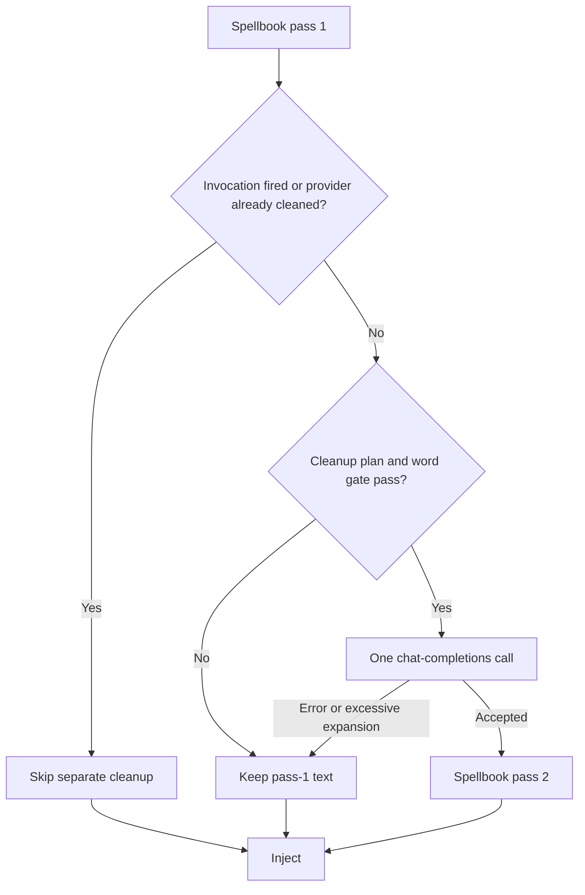

<!-- PAGE_ID: hark_09_voice_cleanup -->

Relevant source files

The following files were used as evidence for this page:

- [crates/hark-voice/src/lib.rs:1-49](../../crates/hark-voice/src/lib.rs#L1-L49)
- [crates/hark-voice/src/voices.rs:1-281](../../crates/hark-voice/src/voices.rs#L1-L281)
- [crates/hark-voice/src/openai_compatible.rs:1-286](../../crates/hark-voice/src/openai_compatible.rs#L1-L286)
- [crates/hark-voice/src/error.rs:1-160](../../crates/hark-voice/src/error.rs#L1-L160)
- [crates/hark-config/src/voice.rs:1-338](../../crates/hark-config/src/voice.rs#L1-L338)
- [crates/hark-config/src/lib.rs:114-140](../../crates/hark-config/src/lib.rs#L114-L140)
- [crates/hark-pipeline/src/lib.rs:270-370](../../crates/hark-pipeline/src/lib.rs#L270-L370)
- [crates/hark-pipeline/src/worker.rs:440-618](../../crates/hark-pipeline/src/worker.rs#L440-L618)
- [crates/hark-stt/src/lib.rs:30-42](../../crates/hark-stt/src/lib.rs#L30-L42)
- [crates/hark-stt/src/gemini_live.rs:355-375](../../crates/hark-stt/src/gemini_live.rs#L355-L375)

# Voice Cleanup

> **Related Pages**: [Transcription](TRANSCRIPTION.md), [Spellbook](SPELLBOOK.md), [Invocations](INVOCATIONS.md), [Configuration and Secrets](../core/CONFIGURATION.md)

---

<!-- BEGIN:AUTOGEN hark_09_voice_cleanup_overview -->
## Overview

Voice cleanup is Hark's optional rewrite stage between transcription/spellbook processing and text injection. For a resolved non-Verbatim voice, Hark sends one corrected transcript to an OpenAI-compatible chat-completions endpoint; `Voice::Verbatim`, an unresolved provider, short text, an invocation, or an already-cleaned fused transcript makes no separate cleanup call ([lib.rs:1-10](../../crates/hark-voice/src/lib.rs#L1-L10), [worker.rs:550-580](../../crates/hark-pipeline/src/worker.rs#L550-L580)).

Cleanup is deliberately fail-open. There is no retry: any adapter, timeout, parsing, expansion-guard, or provider failure injects the pre-cleanup text instead of losing the dictation or doubling worst-case latency. The crate uses blocking `reqwest` on the existing pipeline worker and never logs API keys, prompts, spellbook terms, or transcript text ([lib.rs:7-10](../../crates/hark-voice/src/lib.rs#L7-L10), [openai_compatible.rs:192-195](../../crates/hark-voice/src/openai_compatible.rs#L192-L195), [worker.rs:560-617](../../crates/hark-pipeline/src/worker.rs#L560-L617)).

```mermaid
graph TD
    A["Spellbook pass 1"] --> B{"Invocation fired or provider already cleaned?"}
    B -->|"Yes"| C["Skip separate cleanup"]
    B -->|"No"| D{"Cleanup plan and word gate pass?"}
    D -->|"No"| E["Keep pass-1 text"]
    D -->|"Yes"| F["One chat-completions call"]
    F -->|"Error or excessive expansion"| E
    F -->|"Accepted"| G["Spellbook pass 2"]
    C --> H["Inject"]
    E --> H
    G --> H
```

The configured voice and the provider are resolved independently. A non-Verbatim voice may inherit an OpenAI, Groq, or Gemini STT provider and key, use an explicit cleanup provider/key, or degrade to Verbatim with a startup warning when no chat-capable provider resolves ([voice.rs:248-338](../../crates/hark-config/src/voice.rs#L248-L338)).

Sources: [crates/hark-voice/src/lib.rs:1-49](../../crates/hark-voice/src/lib.rs#L1-L49), [crates/hark-config/src/voice.rs:248-338](../../crates/hark-config/src/voice.rs#L248-L338), [crates/hark-pipeline/src/worker.rs:550-618](../../crates/hark-pipeline/src/worker.rs#L550-L618)
<!-- END:AUTOGEN hark_09_voice_cleanup_overview -->

---

<!-- BEGIN:AUTOGEN hark_09_voice_cleanup_voices -->
## Voice Presets

Hark currently recognizes 11 voice names. Parsing is case-insensitive and whitespace-tolerant; configuration and the CLI share the same names ([voices.rs:8-98](../../crates/hark-voice/src/voices.rs#L8-L98)).

| Voice | Intended transformation |
|---|---|
| `verbatim` | No cleanup adapter and no call |
| `grammar` | Correct grammar, spelling, punctuation, and capitalization without rephrasing |
| `clean` | Remove fillers/false starts/repetition while keeping wording and tone |
| `professional` | Polish into a business register |
| `casual` | Keep a relaxed conversational register |
| `notes` | Produce concise first-person work/ticket notes |
| `concise` | Remove repetition and redundancy while preserving facts |
| `direct` | Lead with the point and remove hedging/warm-up phrases |
| `plain` | Use courteous, non-technical wording without adding explanations |
| `pirate` | Novelty pirate diction while retaining facts and length |
| `custom` | Use the user's prompt text as the instruction |

The built-in instructions are defined together so their behavior is explicit and testable ([voices.rs:170-216](../../crates/hark-voice/src/voices.rs#L170-L216)). Every built-in prompt also receives a no-em/en-dash clause and a length-discipline clause; `custom` is the escape hatch and receives neither, because deliberate expansion or formatting may be the user's request. All prompts end with the return-only clause, and present spellbook terms are protected within a bounded 400-token-equivalent budget ([voices.rs:110-168](../../crates/hark-voice/src/voices.rs#L110-L168), [voices.rs:243-280](../../crates/hark-voice/src/voices.rs#L243-L280)).

The default settings are `clean`, skip below five words, and reject built-in output above a 1.4x ratio (with three words of absolute slack); zero disables either gate. The post-response expansion guard does not apply to `custom` ([voice.rs:49-84](../../crates/hark-config/src/voice.rs#L49-L84), [voices.rs:218-240](../../crates/hark-voice/src/voices.rs#L218-L240)).

Sources: [crates/hark-voice/src/voices.rs:8-120](../../crates/hark-voice/src/voices.rs#L8-L120), [crates/hark-voice/src/voices.rs:145-280](../../crates/hark-voice/src/voices.rs#L145-L280), [crates/hark-config/src/voice.rs:49-84](../../crates/hark-config/src/voice.rs#L49-L84)
<!-- END:AUTOGEN hark_09_voice_cleanup_voices -->

---

<!-- BEGIN:AUTOGEN hark_09_voice_cleanup_adapter -->
## Cleanup Adapter

`OpenAiCompatibleChat` is the live cleanup adapter. It sends buffered JSON to `POST {base_url}/chat/completions` with Bearer authentication and the process-wide blocking HTTP client. The same contract serves OpenAI, Groq, Gemini's OpenAI-compatible endpoint, and user-supplied compatible endpoints; Deepgram has no chat product and is rejected by configuration validation ([openai_compatible.rs:1-18](../../crates/hark-voice/src/openai_compatible.rs#L1-L18), [voice.rs:87-160](../../crates/hark-config/src/voice.rs#L87-L160), [voice.rs:191-223](../../crates/hark-config/src/voice.rs#L191-L223)).

The provider resolver supports these paths:

| Configuration | Result |
|---|---|
| Verbatim voice | No provider or key is needed |
| Explicit `[voice.provider]` | Uses the configured kind/base URL/model and a cleanup account key |
| OpenAI, Groq, or Gemini STT with no override | Inherits the provider and already-resolved STT key; Gemini defaults to its `/v1beta/openai` chat URL and `gemini-3.5-flash-lite` model |
| Deepgram or generic OpenAI-compatible STT with no override | Degrades to Verbatim with a warning because STT support does not prove a chat endpoint exists |

The resolution rules and presets live in `hark-config`, while pipeline construction performs key lookup, builds the adapter, and converts every missing-key/build failure into `None` so STT still starts ([voice.rs:115-189](../../crates/hark-config/src/voice.rs#L115-L189), [voice.rs:225-338](../../crates/hark-config/src/voice.rs#L225-L338), [lib.rs:289-370](../../crates/hark-pipeline/src/lib.rs#L289-L370)).

Each request builds a system prompt from the effective voice and terms present in that transcript, derives `max_completion_tokens` from input length with a 512-to-4096 clamp, applies a 10-second request timeout, and never retries ([openai_compatible.rs:20-85](../../crates/hark-voice/src/openai_compatible.rs#L20-L85), [openai_compatible.rs:236-281](../../crates/hark-voice/src/openai_compatible.rs#L236-L281)). `CleanupConfig` has a manual `Debug` implementation that redacts the API key and custom prompt and reports only the spellbook-term count ([openai_compatible.rs:146-190](../../crates/hark-voice/src/openai_compatible.rs#L146-L190)).

Sources: [crates/hark-voice/src/openai_compatible.rs:1-286](../../crates/hark-voice/src/openai_compatible.rs#L1-L286), [crates/hark-config/src/voice.rs:87-189](../../crates/hark-config/src/voice.rs#L87-L189), [crates/hark-config/src/voice.rs:225-338](../../crates/hark-config/src/voice.rs#L225-L338), [crates/hark-pipeline/src/lib.rs:289-370](../../crates/hark-pipeline/src/lib.rs#L289-L370)
<!-- END:AUTOGEN hark_09_voice_cleanup_adapter -->

---

<!-- BEGIN:AUTOGEN hark_09_voice_cleanup_pipeline -->
## Pipeline Behavior

After a non-empty transcription, the worker applies spellbook pass 1 and then checks invocations. A fired invocation is user-authored canned text, so it skips cleanup and the second spellbook pass entirely. A fused provider result also skips the separate cleanup call, preventing a second rewrite and bill ([worker.rs:451-476](../../crates/hark-pipeline/src/worker.rs#L451-L476), [worker.rs:550-558](../../crates/hark-pipeline/src/worker.rs#L550-L558)).

For an ordinary transcript with a cleanup plan:

1. Text below `skip_below_words` passes through unchanged.
2. The adapter performs one rewrite request.
3. A built-in voice response beyond `max_expansion_ratio` plus the three-word grace is rejected; `custom` is exempt.
4. An accepted response goes through spellbook pass 2 to repair any protected term the model still changed.
5. Any error returns pass-1 text with no cleanup timing/model attribution.

This control flow is implemented in `cleaned_text` and keeps history honest: cleanup metadata appears only when its response actually shaped the injected text ([worker.rs:542-618](../../crates/hark-pipeline/src/worker.rs#L542-L618)).

Gemini Live has a distinct fused `smart` mode. In that mode the single returned string is put in both `Transcript.text` and `Transcript.cleaned`; the marker tells the worker to skip Hark's separate voice call. This reduces one round trip but cannot preserve a guaranteed verbatim transcript, which is why the configured default remains `verbatim` ([lib.rs:30-42](../../crates/hark-stt/src/lib.rs#L30-L42), [gemini_live.rs:355-375](../../crates/hark-stt/src/gemini_live.rs#L355-L375), [lib.rs:114-140](../../crates/hark-config/src/lib.rs#L114-L140)). History labels that result as voice `smart` and attributes the STT model as the cleanup model; ordinary skipped/failed cleanup is labeled `verbatim` with no cleanup model ([worker.rs:496-530](../../crates/hark-pipeline/src/worker.rs#L496-L530)).

Sources: [crates/hark-pipeline/src/worker.rs:451-530](../../crates/hark-pipeline/src/worker.rs#L451-L530), [crates/hark-pipeline/src/worker.rs:542-618](../../crates/hark-pipeline/src/worker.rs#L542-L618), [crates/hark-stt/src/gemini_live.rs:355-375](../../crates/hark-stt/src/gemini_live.rs#L355-L375), [crates/hark-config/src/lib.rs:114-140](../../crates/hark-config/src/lib.rs#L114-L140)
<!-- END:AUTOGEN hark_09_voice_cleanup_pipeline -->

---

<!-- BEGIN:AUTOGEN hark_09_voice_cleanup_api -->
## Public API

The crate root keeps the reusable behavior small and provider-neutral ([lib.rs:12-49](../../crates/hark-voice/src/lib.rs#L12-L49)).

| Item | Contract |
|---|---|
| `CleanupProvider` | Blocking, `Send` trait with `clean(text)` and a safe provider label; pipeline tests can replace it with a scripted cleaner |
| `Cleaned` | Accepted text plus full request wall time |
| `Voice` / `UnknownVoice` | Runtime voice enum and parsing error with the valid names |
| `system_prompt` / `present_terms` | Pure per-request prompt assembly and protected-term filtering |
| `skips_cleanup` / `over_expanded` | Pure pre-request and post-response gates |
| `CleanupError` / mapping helpers | Log-safe error taxonomy and pure status/transport classification |
| `CONNECT_TIMEOUT_MS` / `CLEANUP_TIMEOUT_MS` | 3-second connection bound and 10-second per-request bound |

The concrete `CleanupConfig` and `OpenAiCompatibleChat` stay in the public `openai_compatible` module rather than being re-exported from the root. Construction rejects `Verbatim`, because reaching the adapter for a voice that promises no call is a caller bug handled by the pipeline's fail-open build path ([openai_compatible.rs:146-234](../../crates/hark-voice/src/openai_compatible.rs#L146-L234)).

Sources: [crates/hark-voice/src/lib.rs:12-49](../../crates/hark-voice/src/lib.rs#L12-L49), [crates/hark-voice/src/openai_compatible.rs:146-234](../../crates/hark-voice/src/openai_compatible.rs#L146-L234)
<!-- END:AUTOGEN hark_09_voice_cleanup_api -->

---

<!-- BEGIN:AUTOGEN hark_09_voice_cleanup_errors -->
## Error Handling

`CleanupError` intentionally mirrors the STT error categories while remaining a separate small enum. Every variant is designed to be safe to log and carries no API key, Authorization header, prompt, spellbook term, or transcript text ([error.rs:1-48](../../crates/hark-voice/src/error.rs#L1-L48)).

| Variant | Trigger and sanitization |
|---|---|
| `Http` | DNS, connect, TLS, or other transport failure; request headers/body are never included |
| `Auth` | HTTP 401/403, including the status and at most a short machine-readable `error.code`/`error.type`; raw auth bodies are not echoed because providers may repeat key fragments |
| `RateLimited` | HTTP 429, with optional seconds-form `Retry-After` |
| `Timeout` | Connect or request timeout, reporting the bound actually hit |
| `Provider` | Other HTTP status, malformed response, or empty completion; detail is capped at 300 characters |

The auth-specific scrub is the important current distinction: a 401 adds “check your API key” only when no safe reason slug exists, while a 403 does not misdiagnose quota/project access as a bad key. The mapping extracts only a whitespace-free slug of at most 64 bytes and never carries the provider's prose body into `Auth` ([error.rs:16-27](../../crates/hark-voice/src/error.rs#L16-L27), [error.rs:63-125](../../crates/hark-voice/src/error.rs#L63-L125)). Transport mapping distinguishes the shared 3-second connect timeout from the 10-second request timeout ([error.rs:127-160](../../crates/hark-voice/src/error.rs#L127-L160)).

Successful HTTP status is not sufficient: parsing requires a non-empty `choices[0].message.content`. Missing/empty content becomes `Provider`, with `finish_reason` retained so token-budget exhaustion is distinguishable from a malformed provider response. The pipeline treats all variants identically after logging the safe summary: inject the uncleaned transcript and record no cleanup attribution ([openai_compatible.rs:88-131](../../crates/hark-voice/src/openai_compatible.rs#L88-L131), [worker.rs:613-617](../../crates/hark-pipeline/src/worker.rs#L613-L617)).

Sources: [crates/hark-voice/src/error.rs:1-160](../../crates/hark-voice/src/error.rs#L1-L160), [crates/hark-voice/src/openai_compatible.rs:88-131](../../crates/hark-voice/src/openai_compatible.rs#L88-L131), [crates/hark-pipeline/src/worker.rs:613-617](../../crates/hark-pipeline/src/worker.rs#L613-L617)
<!-- END:AUTOGEN hark_09_voice_cleanup_errors -->

---
