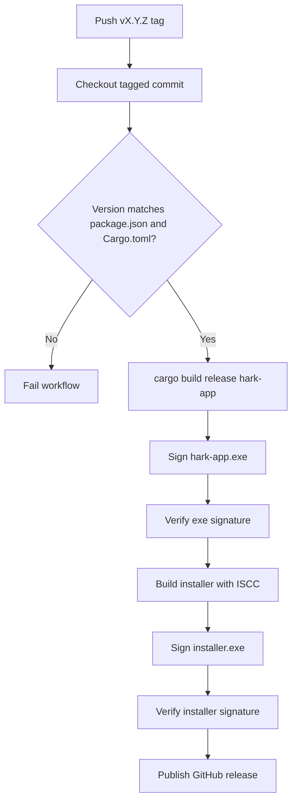

<!-- PAGE_ID: hark_13_release_packaging -->
<details>
<summary>Relevant source files</summary>

The following files were used as evidence for this page:

- [installer/hark.iss:1-96](https://github.com/BoardPandas/Hark/blob/1c1738716fa4cd758b0c26ec94d0873d1bc35ac1/installer/hark.iss#L1-L96)
- [.github/workflows/release.yml:1-223](https://github.com/BoardPandas/Hark/blob/1c1738716fa4cd758b0c26ec94d0873d1bc35ac1/.github/workflows/release.yml#L1-L223)
- [.github/RELEASING.md:1-77](https://github.com/BoardPandas/Hark/blob/1c1738716fa4cd758b0c26ec94d0873d1bc35ac1/.github/RELEASING.md#L1-L77)
- [package.json:1-7](https://github.com/BoardPandas/Hark/blob/1c1738716fa4cd758b0c26ec94d0873d1bc35ac1/package.json#L1-L7)
- [Cargo.toml:1-29](https://github.com/BoardPandas/Hark/blob/1c1738716fa4cd758b0c26ec94d0873d1bc35ac1/Cargo.toml#L1-L29)
- [installer/hark.iss:36-65](https://github.com/BoardPandas/Hark/blob/1c1738716fa4cd758b0c26ec94d0873d1bc35ac1/installer/hark.iss#L36-L65)
- [.github/workflows/release.yml:54-76](https://github.com/BoardPandas/Hark/blob/1c1738716fa4cd758b0c26ec94d0873d1bc35ac1/.github/workflows/release.yml#L54-L76)
- [.github/workflows/release.yml:126-140](https://github.com/BoardPandas/Hark/blob/1c1738716fa4cd758b0c26ec94d0873d1bc35ac1/.github/workflows/release.yml#L126-L140)

</details>

# Release and Packaging

> **Related Pages**: [Getting Started](../GETTING_STARTED.md), [Updates and Autostart](../features/UPDATES_AND_AUTOSTART.md), [Overview](../OVERVIEW.md)

---

<!-- BEGIN:AUTOGEN hark_13_release_packaging_overview -->
## Overview

Cutting a Hark release means pushing a `vMAJOR.MINOR.PATCH` tag; everything after that (build, sign, verify, package, publish) is automated by a single GitHub Actions job (`.github/workflows/release.yml:1-223`). The workflow builds `hark-app` on `windows-latest`, signs the binary with Azure Trusted Signing, packages it into a per-user Inno Setup installer, signs that installer too, verifies both signatures, and publishes a GitHub release carrying the installer and a portable exe (`.github/workflows/release.yml:44-223`).

The trigger is either a pushed tag matching `v*` or a manual `workflow_dispatch` run against an existing tag (`.github/workflows/release.yml:25-33`). A `concurrency` group keyed on the tag prevents two runs from racing on the same release (`.github/workflows/release.yml:39-41`).



Both the installer (`Hark-<version>-windows-x64-setup.exe`, the headline download) and a renamed copy of the raw binary (`Hark-<version>-windows-x64.exe`, portable) are attached to the release, along with auto-generated release notes (`.github/workflows/release.yml:204-222`).

Sources: [release.yml:1-223](https://github.com/BoardPandas/Hark/blob/1c1738716fa4cd758b0c26ec94d0873d1bc35ac1/.github/workflows/release.yml#L1-L223), [RELEASING.md:1-34](https://github.com/BoardPandas/Hark/blob/1c1738716fa4cd758b0c26ec94d0873d1bc35ac1/.github/RELEASING.md#L1-L34)
<!-- END:AUTOGEN hark_13_release_packaging_overview -->

---

<!-- BEGIN:AUTOGEN hark_13_release_packaging_installer -->
## Windows Installer

The installer is defined by an Inno Setup 6 script that CI invokes with `/DAppVersion=<x.y.z> /DSourceExe=<path to signed hark-app.exe>` (`installer/hark.iss:15-19`). It intentionally installs per-user with no elevation.

| Setting | Value | Why |
|---|---|---|
| `PrivilegesRequired` | `lowest` | No admin/UAC prompt; makes `{autopf}` resolve to `%LOCALAPPDATA%\Programs\Hark` instead of Program Files ([hark.iss:45-49](https://github.com/BoardPandas/Hark/blob/1c1738716fa4cd758b0c26ec94d0873d1bc35ac1/installer/hark.iss#L45-L49)) |
| `AppId` | fixed GUID `8F2A6C31-...` | Keys upgrades and uninstall; must **never** change ([hark.iss:37-38](https://github.com/BoardPandas/Hark/blob/1c1738716fa4cd758b0c26ec94d0873d1bc35ac1/installer/hark.iss#L37-L38)) |
| `ArchitecturesAllowed` / `ArchitecturesInstallIn64BitMode` | `x64compatible` | The exe is x64 only; refuses 32-bit Windows ([hark.iss:50-52](https://github.com/BoardPandas/Hark/blob/1c1738716fa4cd758b0c26ec94d0873d1bc35ac1/installer/hark.iss#L50-L52)) |
| `OutputBaseFilename` | `Hark-{#AppVersion}-windows-x64-setup` | Produces `installer\Output\Hark-<ver>-windows-x64-setup.exe` ([hark.iss:53-54](https://github.com/BoardPandas/Hark/blob/1c1738716fa4cd758b0c26ec94d0873d1bc35ac1/installer/hark.iss#L53-L54)) |
| `CloseApplications` / `RestartApplications` | `yes` / `no` | An autostarted Hark may be running during upgrade; Restart Manager closes it so the exe can be replaced, and it relaunches via `[Run]` or at next login instead of being force-restarted ([hark.iss:60-64](https://github.com/BoardPandas/Hark/blob/1c1738716fa4cd758b0c26ec94d0873d1bc35ac1/installer/hark.iss#L60-L64)) |

Installed files, shortcuts, and the autostart registry seed are declared in dedicated sections:

```ini
[Files]
Source: "{#SourceExe}"; DestDir: "{app}"; DestName: "{#AppExeName}"; Flags: ignoreversion

[Icons]
Name: "{group}\{#AppName}"; Filename: "{app}\{#AppExeName}"
Name: "{group}\Uninstall {#AppName}"; Filename: "{uninstallexe}"
Name: "{autodesktop}\{#AppName}"; Filename: "{app}\{#AppExeName}"; Tasks: desktopicon

[Registry]
Root: HKCU; Subkey: "Software\Microsoft\Windows\CurrentVersion\Run"; \
    ValueType: string; ValueName: "{#RunValueName}"; \
    ValueData: """{app}\{#AppExeName}"" --hidden"; \
    Flags: uninstalldeletevalue
```

Sources: [hark.iss:73-88](https://github.com/BoardPandas/Hark/blob/1c1738716fa4cd758b0c26ec94d0873d1bc35ac1/installer/hark.iss#L73-L88)

The `[Registry]` entry seeds launch-at-login so it works immediately after a fresh install, mirroring the exact format `hark-autostart` writes at runtime (quoted path plus `--hidden`), and `uninstalldeletevalue` removes it on uninstall so the value can never point at a deleted exe (`installer/hark.iss:81-88`). The desktop shortcut is opt-in via the `desktopicon` task, unchecked by default (`installer/hark.iss:70-71`). The `[Run]` step deliberately omits `--hidden` so a fresh install's first launch shows the onboarding window (no STT key configured yet), while `skipifsilent` keeps unattended installs headless (`installer/hark.iss:90-95`). User data at `%APPDATA%\hark` (`config.toml` + `history.db`) is intentionally left in place on uninstall (`installer/hark.iss:12-13`).

Sources: [hark.iss:1-96](https://github.com/BoardPandas/Hark/blob/1c1738716fa4cd758b0c26ec94d0873d1bc35ac1/installer/hark.iss#L1-L96)
<!-- END:AUTOGEN hark_13_release_packaging_installer -->

---

<!-- BEGIN:AUTOGEN hark_13_release_packaging_workflow -->
## Release Workflow

The `release` job runs on `windows-latest` with `contents: write` permission (needed to create the release and upload assets) and checks out the tagged commit (`.github/workflows/release.yml:36-50`).

| Step | Action |
|---|---|
| Resolve and verify version | Parses the tag against `^v\d+\.\d+\.\d+$`, then fails the run if it disagrees with `package.json` or the Cargo workspace version ([release.yml:54-76](https://github.com/BoardPandas/Hark/blob/1c1738716fa4cd758b0c26ec94d0873d1bc35ac1/.github/workflows/release.yml#L54-L76)) |
| Install Rust | `dtolnay/rust-toolchain@stable`, no explicit pin; relies on the workspace `rust-version = "1.97"` floor to error on an older stable ([release.yml:77-81](https://github.com/BoardPandas/Hark/blob/1c1738716fa4cd758b0c26ec94d0873d1bc35ac1/.github/workflows/release.yml#L77-L81)) |
| Build release binary | `cargo build --release -p hark-app` ([release.yml:87-88](https://github.com/BoardPandas/Hark/blob/1c1738716fa4cd758b0c26ec94d0873d1bc35ac1/.github/workflows/release.yml#L87-L88)) |
| Preflight signing secrets | Checks each Azure secret's trimmed length and throws if any is empty, so a misconfigured secret fails with a clear message instead of an opaque `SignerSign()` error deep in signtool ([release.yml:94-120](https://github.com/BoardPandas/Hark/blob/1c1738716fa4cd758b0c26ec94d0873d1bc35ac1/.github/workflows/release.yml#L94-L120)) |
| Sign `hark-app.exe` | `Azure/artifact-signing-action@v2` against `target\release`, SHA256 digest, RFC3161 timestamp ([release.yml:126-140](https://github.com/BoardPandas/Hark/blob/1c1738716fa4cd758b0c26ec94d0873d1bc35ac1/.github/workflows/release.yml#L126-L140)) |
| Verify the signature | `Get-AuthenticodeSignature`; throws unless `Status -eq 'Valid'` and a timestamper certificate is present ([release.yml:143-151](https://github.com/BoardPandas/Hark/blob/1c1738716fa4cd758b0c26ec94d0873d1bc35ac1/.github/workflows/release.yml#L143-L151)) |
| Install Inno Setup + build installer | `choco install innosetup`, then invokes `ISCC.exe` with `/DAppVersion` and `/DSourceExe` pointing at the already-signed exe ([release.yml:156-170](https://github.com/BoardPandas/Hark/blob/1c1738716fa4cd758b0c26ec94d0873d1bc35ac1/.github/workflows/release.yml#L156-L170)) |
| Sign and verify the installer | Same Azure signing action and `Get-AuthenticodeSignature` check, now against `installer\Output` ([release.yml:174-199](https://github.com/BoardPandas/Hark/blob/1c1738716fa4cd758b0c26ec94d0873d1bc35ac1/.github/workflows/release.yml#L174-L199)) |
| Stage the signed assets | Copies the exe to a friendly portable filename (Authenticode lives in the PE, not the filename, so the copy stays signed) and records both asset paths as job outputs ([release.yml:204-212](https://github.com/BoardPandas/Hark/blob/1c1738716fa4cd758b0c26ec94d0873d1bc35ac1/.github/workflows/release.yml#L204-L212)) |
| Publish the GitHub release | `softprops/action-gh-release@v3`, `generate_release_notes: true`, uploading both the installer and portable exe ([release.yml:214-223](https://github.com/BoardPandas/Hark/blob/1c1738716fa4cd758b0c26ec94d0873d1bc35ac1/.github/workflows/release.yml#L214-L223)) |

The version-resolution step's core check:

```powershell
$version = $ref.TrimStart('v')
$pkg = (Get-Content package.json -Raw | ConvertFrom-Json).version
if ($version -ne $pkg) {
  throw "Tag '$ref' (version '$version') does not match package.json version '$pkg'. Bump package.json or retag."
}
```

Sources: [release.yml:60-64](https://github.com/BoardPandas/Hark/blob/1c1738716fa4cd758b0c26ec94d0873d1bc35ac1/.github/workflows/release.yml#L60-L64)

The exe is signed **before** `ISCC` packages it, and the installer is signed again **after** packaging, so both the bundled binary and the setup wrapper carry valid Authenticode signatures (`.github/workflows/release.yml:153-155`).

Sources: [release.yml:1-223](https://github.com/BoardPandas/Hark/blob/1c1738716fa4cd758b0c26ec94d0873d1bc35ac1/.github/workflows/release.yml#L1-L223)
<!-- END:AUTOGEN hark_13_release_packaging_workflow -->

---

<!-- BEGIN:AUTOGEN hark_13_release_packaging_signing -->
## Signing and Secrets

Signing uses Azure Trusted Signing (now branded "Artifact Signing"; the `Azure/trusted-signing-action` redirects to `Azure/artifact-signing-action`) (`.github/RELEASING.md:6-7`). Credentials are synced from Doppler into the repository's GitHub Actions secrets, and the workflow reads these exact names:

| Secret | What it is |
|---|---|
| `AZURE_CLIENT_ID` | Service principal (app registration) client ID ([RELEASING.md:43](https://github.com/BoardPandas/Hark/blob/1c1738716fa4cd758b0c26ec94d0873d1bc35ac1/.github/RELEASING.md#L43)) |
| `AZURE_TENANT_ID` | Entra tenant ID ([RELEASING.md:44](https://github.com/BoardPandas/Hark/blob/1c1738716fa4cd758b0c26ec94d0873d1bc35ac1/.github/RELEASING.md#L44)) |
| `AZURE_CLIENT_SECRET` | Service principal client secret ([RELEASING.md:45](https://github.com/BoardPandas/Hark/blob/1c1738716fa4cd758b0c26ec94d0873d1bc35ac1/.github/RELEASING.md#L45)) |
| `AZURE_TRUSTED_SIGNING_ENDPOINT` | Region endpoint, e.g. `https://eus.codesigning.azure.net/`; must match the account's region or signing 403s ([RELEASING.md:46](https://github.com/BoardPandas/Hark/blob/1c1738716fa4cd758b0c26ec94d0873d1bc35ac1/.github/RELEASING.md#L46)) |
| `AZURE_TRUSTED_SIGNING_ACCOUNT_NAME` | Trusted Signing account name ([RELEASING.md:47](https://github.com/BoardPandas/Hark/blob/1c1738716fa4cd758b0c26ec94d0873d1bc35ac1/.github/RELEASING.md#L47)) |
| `AZURE_TRUSTED_SIGNING_CERT_PROFILE_NAME` | Certificate profile name ([RELEASING.md:48](https://github.com/BoardPandas/Hark/blob/1c1738716fa4cd758b0c26ec94d0873d1bc35ac1/.github/RELEASING.md#L48)) |

Before signing, a preflight step logs each secret's trimmed length (never the value) and throws if any is empty, since `DefaultAzureCredential` fails deep inside signtool with an opaque error otherwise (`.github/workflows/release.yml:90-120`). The signing action reads the service principal from its own `with:` inputs rather than step `env:`, because passing credentials via `env:` does not reach the scope `DefaultAzureCredential` needs (`.github/workflows/release.yml:122-125`).

One-time Azure setup requires granting the service principal the **Trusted Signing Certificate Profile Signer** role scoped to the certificate profile, and completing Microsoft's identity validation review (roughly 1-20 business days; public-trust validation is currently limited to organizations in the US, Canada, EU, and UK) (`.github/RELEASING.md:53-68`).

Every signature is stamped with an RFC3161 timestamp against `http://timestamp.acs.microsoft.com`, so it stays valid after the signing certificate rotates (`.github/workflows/release.yml:139-140`, `.github/RELEASING.md:72-73`). A silent no-op signing step must fail the build rather than ship unsigned, which is why both the exe and installer signing steps are followed by an explicit `Get-AuthenticodeSignature` check (`.github/workflows/release.yml:142-143`).

Sources: [RELEASING.md:36-68](https://github.com/BoardPandas/Hark/blob/1c1738716fa4cd758b0c26ec94d0873d1bc35ac1/.github/RELEASING.md#L36-L68), [release.yml:90-140](https://github.com/BoardPandas/Hark/blob/1c1738716fa4cd758b0c26ec94d0873d1bc35ac1/.github/workflows/release.yml#L90-L140)
<!-- END:AUTOGEN hark_13_release_packaging_signing -->

---

<!-- BEGIN:AUTOGEN hark_13_release_packaging_version -->
## Version Lockstep

`package.json`'s `version` field is the repo's release source of truth (`package.json:3`). The root `Cargo.toml` `[workspace.package]` version must be kept identical, because the compiled binary reports its version via `env!("CARGO_PKG_VERSION")`, and the in-app update checker compares that against GitHub release tags (`Cargo.toml:19-23`).

```toml
[workspace.package]
# Kept in lockstep with package.json (the release source of truth): the built
# binary reports this via env!("CARGO_PKG_VERSION"), and the update checker
# compares it against GitHub release tags. release.yml fails if they drift.
version = "0.14.1"
edition = "2021"
rust-version = "1.97"
license = "MIT"
```

Sources: [Cargo.toml:19-27](https://github.com/BoardPandas/Hark/blob/1c1738716fa4cd758b0c26ec94d0873d1bc35ac1/Cargo.toml#L19-L27)

The release workflow enforces this at release time rather than trusting it was done at commit time: it reads `[workspace.package] version` out of `Cargo.toml` with a regex and throws if it disagrees with the tag (which must itself already match `package.json`) (`.github/workflows/release.yml:65-72`).

| File | Field | Role |
|---|---|---|
| `package.json` | `version` | Source of truth for the release version ([package.json:3](https://github.com/BoardPandas/Hark/blob/1c1738716fa4cd758b0c26ec94d0873d1bc35ac1/package.json#L3)) |
| `Cargo.toml` | `[workspace.package] version` | Must match `package.json`; compiled into the binary via `CARGO_PKG_VERSION` ([Cargo.toml:19-23](https://github.com/BoardPandas/Hark/blob/1c1738716fa4cd758b0c26ec94d0873d1bc35ac1/Cargo.toml#L19-L23)) |
| Git tag | `vMAJOR.MINOR.PATCH` | Must equal both of the above or the workflow fails before building ([release.yml:59-72](https://github.com/BoardPandas/Hark/blob/1c1738716fa4cd758b0c26ec94d0873d1bc35ac1/.github/workflows/release.yml#L59-L72)) |

A missed Cargo bump is therefore caught at release time rather than shipping a binary that misreports its own version, per the pre-commit changelog/version discipline in `.claude/rules/commit-changelog.md`.

Sources: [package.json:1-7](https://github.com/BoardPandas/Hark/blob/1c1738716fa4cd758b0c26ec94d0873d1bc35ac1/package.json#L1-L7), [Cargo.toml:1-29](https://github.com/BoardPandas/Hark/blob/1c1738716fa4cd758b0c26ec94d0873d1bc35ac1/Cargo.toml#L1-L29), [release.yml:54-76](https://github.com/BoardPandas/Hark/blob/1c1738716fa4cd758b0c26ec94d0873d1bc35ac1/.github/workflows/release.yml#L54-L76)
<!-- END:AUTOGEN hark_13_release_packaging_version -->

---
