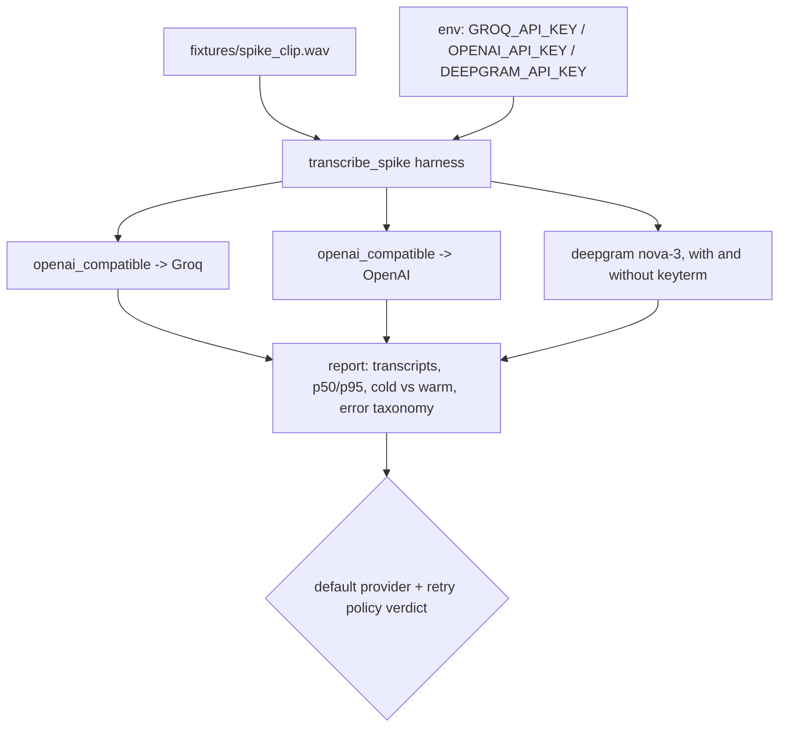

# Spec: Phase 1 STT Spike, BYOK Cloud Adapters (v2, replaces the sherpa-onnx spike)

**Date:** 2026-07-15
**Phase:** Foundation (Phase 1, blocking prerequisite; must pass before any pipeline code)
**Feature slug:** `phase1-stt-spike`
**Depends on:** nothing. **Blocks:** all Phase 1 pipeline work and the Phase 2 dictionary design.
**Supersedes:** the v1 version of this file (sherpa-onnx + Parakeet + hotwords A/B). The local model was rejected 2026-07-15 for footprint; local model assets and `scripts/fetch-model.sh` are already deleted.

## 1. Overview

A minimal, runnable Rust harness that proves Hark's new core assumption end-to-end: a 16 kHz mono WAV can be transcribed by BYOK cloud providers from Rust with acceptable release-to-inject latency, through two adapters behind one trait:

1. **`openai-compatible`**: multipart `POST {base_url}/audio/transcriptions` with Bearer auth. One code path, two providers: Groq (`https://api.groq.com/openai/v1`, model `whisper-large-v3-turbo`) and OpenAI (`https://api.openai.com/v1`, models `gpt-4o-mini-transcribe` / `gpt-4o-transcribe` / `whisper-1`).
2. **`deepgram`**: `POST https://api.deepgram.com/v1/listen?model=nova-3` with raw `audio/wav` body and `Token` auth, including a **`keyterm` biasing smoke test** (this is why Deepgram earns an adapter: it maps onto Hark's dictionary feature).

The spike also decides the harness-level questions the plan left open: real p50/p95 latency per provider for 2-15 s clips (marketing numbers are not comparable), the value of a warm reused HTTP client vs a cold one, and a first error taxonomy (bad key, timeout, 429, network down).

**Definition of done:** `cargo run --example transcribe_spike` prints, for each configured provider: transcript, latency table (N=20, p50/p95, cold vs warm client), the Deepgram keyterm A/B result, and a final **default-provider recommendation + retry-policy proposal** for the Phase 1 pipeline.

## 2. Architecture

### Files to create / change

```
crates/hark-stt/
  Cargo.toml                        # DROP sherpa-onnx; add reqwest (blocking) etc.
  src/lib.rs                        # SttProvider trait + shared request plumbing
  src/config.rs                     # ProviderConfig (kind, base_url, model, key source)
  src/error.rs                      # SttError (thiserror): Http, Auth, RateLimited, Timeout, BadAudio, Provider
  src/openai_compatible.rs          # multipart /audio/transcriptions adapter (OpenAI + Groq)
  src/deepgram.rs                   # /v1/listen adapter incl. keyterm query params
  src/metrics.rs                    # keep: latency tally (p50/p95) logic is reusable
  examples/transcribe_spike.rs      # the harness: run adapters, time, A/B keyterm, verdict
  tests/adapter_pure.rs             # pure-logic unit tests (no network)
  fixtures/spike_clip.wav           # short English clip, 16 kHz mono, known transcript, contains 1-2 dictionary-ish terms
  fixtures/expected.txt             # known-good transcript for the clip
```

### The API this seeds (`crates/hark-stt/src/lib.rs`)

```rust
pub enum ProviderKind { OpenAiCompatible, Deepgram }

pub struct ProviderConfig {
    pub kind: ProviderKind,
    pub base_url: String,        // e.g. "https://api.groq.com/openai/v1"
    pub model: String,           // e.g. "whisper-large-v3-turbo"
    pub api_key: String,         // spike: from env; app: from keyring
    pub bias_terms: Vec<String>, // mapped per adapter: prompt (openai) / keyterm (deepgram)
}

pub struct Transcript { pub text: String, pub request_ms: u128 }

pub trait SttProvider: Send {
    /// Blocking; called from the pipeline worker thread. `wav_bytes` is a complete
    /// 16 kHz mono WAV. Implementations must never log api_key or raw audio.
    fn transcribe(&self, wav_bytes: &[u8]) -> Result<Transcript, SttError>;
}

pub fn build(config: &ProviderConfig) -> Result<Box<dyn SttProvider>, SttError>;
```

Constructors take a shared `reqwest::blocking::Client` (one long-lived client per process for keep-alive + TLS resumption). The harness owns WAV loading, timing loops, and reporting so the adapters stay reusable by the eventual pipeline.

### Data flow (spike)



## 3. Implementation Steps (checkpoints)

Each checkpoint is a commit-sized chunk. This spike is **buildable and runnable on the Windows dev box** (network code is cross-platform; there is no per-OS inference runtime anymore). macOS validation folds into the Phase 1 pipeline work.

### Checkpoint 0: de-sherpa and a green build
1. Rewrite `crates/hark-stt/Cargo.toml`: remove `sherpa-onnx`; add:
   ```toml
   [dependencies]
   reqwest = { version = "0.13", default-features = false, features = ["blocking", "multipart", "rustls-tls-webpki-roots", "json"] }
   serde = { version = "1", features = ["derive"] }
   serde_json = "1"
   thiserror = "2"
   [dev-dependencies]
   hound = "3.5"   # harness-side wav sanity checks
   ```
2. Replace `src/lib.rs` / `src/config.rs` / `src/error.rs` contents with the trait + config + error skeletons above; keep `src/metrics.rs` (p50/p95 tally logic carries over). Update the crate `description`.
3. Record a `fixtures/spike_clip.wav` (a few seconds, 16 kHz mono, English, containing at least one uncommon term for the keyterm test) and its `fixtures/expected.txt`. Keep it small enough to commit (a 5 s clip is ~160 KB).
4. **Gate:** `cargo build` and `cargo clippy --all-targets -- -D warnings` pass with no native-lib downloads of any kind.

### Checkpoint 1: openai-compatible adapter
5. Implement `openai_compatible.rs`: multipart form (`file` = wav bytes as `spike_clip.wav`, `model`, optional `prompt` from `bias_terms`, `response_format=json`, `language=en`), Bearer auth, explicit timeout (connect ~3 s, total ~15 s), parse `{ "text": ... }`.
6. Harness: read key + base URL from env (`GROQ_API_KEY`, `OPENAI_API_KEY`; skip a provider cleanly if its key is absent); transcribe the fixture once; print transcript.
7. **Gate:** non-empty, sane transcript from at least Groq (edit distance to `expected.txt` small); keys never appear in any log/error output (verify by grepping harness output).

### Checkpoint 2: latency measurement
8. For each configured openai-compatible provider: N=20 warm-client runs plus a fresh-client cold run; record per-run wall time; print p50/p95/min/max and cold-vs-warm delta. Include WAV-encode time separately (from raw f32 samples via a small helper, since the pipeline will encode from the ring buffer).
9. **Gate:** a table exists with real numbers; note whether warm-client reuse materially beats cold (expect yes: TLS handshake). If p95 for Groq on a ~5 s clip exceeds ~2 s on a normal connection, flag it in the verdict rather than hiding it.

### Checkpoint 3: deepgram adapter + keyterm A/B
10. Implement `deepgram.rs`: `POST /v1/listen?model=nova-3&smart_format=true` (+ repeated `keyterm=` query params from `bias_terms`), header `Authorization: Token <key>`, body raw `audio/wav`, parse `results.channels[0].alternatives[0].transcript`.
11. A/B on the fixture: transcribe 5x without `keyterm`, 5x with the uncommon term(s) passed as `keyterm`; report whether the term is recognized correctly in each arm.
12. **Gate:** Deepgram returns sane text; the A/B table prints. (If keyterm shows no lift on this clip, that is a finding, not a failure; phonetic post-correction remains the primary dictionary path either way.)

### Checkpoint 4: error taxonomy + verdict
13. Deliberately exercise failure modes against one provider: wrong key (expect 401 mapped to `SttError::Auth`), unreachable host / airplane-mode (expect `SttError::Http`/`Timeout` quickly, not a hang), and confirm timeouts fire at the configured bound. Map 429 to `RateLimited` (code path + unit test; don't force a real 429).
14. Print the final verdict block: recommended default provider (+model) for lowest p95, recommended retry policy (proposal: one retry on timeout/connect error only, never on 4xx), and any cost caveats (Groq 10 s billing minimum).
15. **Gate:** verdict prints; observed numbers and any surprises are written into §12 below and routed to LL-G / agent-memory.

## 4. Data Model

None. No database (SQLite arrives in Phase 4). Persistent artifacts: the committed fixture WAV + expected transcript. API keys live only in env vars for the spike.

## 5. API Contract

External: the two provider HTTP contracts pinned above (multipart `/audio/transcriptions`; Deepgram `/v1/listen`). Internal: `SttProvider::transcribe(&[u8]) -> Result<Transcript, SttError>` (§2), which the Phase 1 pipeline will call from a worker thread. Keep the trait signature stable.

## 6. Acceptance Criteria

1. `cargo build` succeeds with **zero native-lib or model downloads**; `sherpa-onnx` is gone from the workspace.
2. `cargo run --example transcribe_spike` prints a non-empty, sane transcript for the fixture from every provider whose key is configured, and skips unconfigured providers with a clear message.
3. A latency table: N=20 warm runs per provider, p50/p95/min/max, cold-vs-warm delta, WAV-encode time shown separately.
4. Deepgram keyterm A/B table (with/without bias terms) prints a recognized-term comparison.
5. Failure modes behave: bad key = clear auth error; no network = fast, bounded failure (no hang past the configured timeout); 429 mapping unit-tested.
6. No API key or raw audio bytes appear in logs, errors, or panics.
7. A printed verdict: default provider + model, retry policy, cost caveats.
8. `cargo clippy --all-targets -- -D warnings` and `cargo fmt --check` clean; `cargo nextest run` passes (pure-logic tests: multipart field assembly, keyterm query encoding, error mapping, p50/p95 tally).

## 7. Out of Scope

- Live microphone capture / `cpal` ring buffer (Phase 1 pipeline proper).
- Global push-to-talk hooks (separate Phase 1 work).
- Clipboard/`enigo` injection.
- Keychain integration (`keyring` arrives with the pipeline; spike uses env vars).
- BYOK cleanup/voices (Phase 3). Dictionary system proper (Phase 2; this spike only smoke-tests keyterm).
- Streaming/WebSocket adapters (deferred; batch-per-utterance is the Phase 1 architecture).
- ElevenLabs / Mistral / AssemblyAI adapters (deferred).
- The opt-in local fallback model (later phase).

## 8. Assumptions / Open Questions

- ⚠ Exact JSON error shapes per provider (401/429 bodies) are unconfirmed; capture real samples during Checkpoint 4 and encode them in the error mapping tests.
- ⚠ Groq free-tier rate limits may throttle the N=20 loop; if so, add a small inter-run delay and note it (the pipeline never bursts anyway).
- ⚠ `gpt-4o-transcribe` vs `gpt-4o-mini-transcribe` vs `whisper-1` quality/latency trade-off is measured, not assumed; the harness takes the model name as a parameter.
- Timeouts assumed: 3 s connect, 15 s total (tunable constants).
- The fixture clip is assumed clean enough that edit-distance to `expected.txt` is a fair sanity check (reuse the v1 spike's edit-distance helper if it survived in `metrics.rs`).

## 9. Test Plan

- **Unit (no network), `tests/adapter_pure.rs`:** multipart form field assembly (model/prompt/language present, file part named correctly); Deepgram URL building (keyterm repetition, URL encoding of multi-word terms); HTTP-status to `SttError` mapping (200/401/429/500/timeout); p50/p95 tally math; WAV-encode helper produces a valid header for known input (validated with `hound`).
- **Harness-driven (network, real keys):** transcripts, latency table, keyterm A/B, failure drills; these map to Acceptance Criteria 2-7 and are the spike's printed report, not `cargo test`.
- **Test data:** `fixtures/spike_clip.wav` + `fixtures/expected.txt` (committed; small).

## 10. Error Handling

| Failure mode | Handling |
|---|---|
| Provider key env var missing | Harness skips that provider with an explicit "skipped: no key" line; never a panic. |
| 401 / 403 | `SttError::Auth(provider)`; message says "check your API key", never echoes the key. |
| 429 | `SttError::RateLimited { retry_after }` (parse header if present). Harness reports it; pipeline policy: surface to user, no auto-retry storm. |
| Connect failure / DNS / offline | `SttError::Http` within the 3 s connect timeout; message distinguishes "no network" from "provider down" where reqwest allows. |
| Total timeout exceeded | `SttError::Timeout(configured_ms)`; the future pipeline's retry-once candidate. |
| Non-JSON / unexpected body | `SttError::Provider(raw_snippet_truncated)`; truncate so logs stay clean. |
| Fixture not 16 kHz mono | Harness-side validation error before any request (keeps provider results comparable). |

## 11. Rollback Plan

Self-contained: all changes live in `crates/hark-stt` and this spec. To undo, `git revert` the spike commits; nothing else depends on the crate yet. If the verdict is "cloud latency unacceptable" (e.g. p95 well above ~2 s on a good connection for short clips), the plan re-opens the local-model question with the small-footprint candidate (`whisper-rs` + `tiny.en`, ~75 MB) before any pipeline code is written; that decision goes back to the user first.

## 12. Lessons Learned / Gotchas

Pre-seeded (verified 2026-07-15; full cites in `.claude/agent-memory/explorer/hark_cloud_stt_providers.md` and `hark_cloud_stt_rust_stack.md`):
- OpenAI + Groq share the multipart `/audio/transcriptions` shape; one adapter, two providers.
- Groq bills a 10 s minimum per request; short utterances cost as 10 s.
- Deepgram `keyterm` requires nova-3+; weighted `keywords` is nova-2 legacy; mutually exclusive.
- `deepgram` crate 0.10 is pre-1.0 "Community" and drags full tokio; call REST directly with reqwest instead.
- `ureq` multipart is unstable as of 3.3.0; reqwest blocking is the safe choice.
- reqwest-blocking on a dedicated worker thread means no tokio executor exists to starve (LL-G blocking-io rule is moot until a streaming adapter appears).

Fill in during/after implementation:
- [ ] Measured p50/p95 per provider/model on real clips + connection → `.claude/agent-memory/patterns.md` and LL-G if surprising.
- [ ] Real 401/429/error body shapes per provider → encode in tests, note in LL-G.
- [ ] Cold-vs-warm client delta (is connection reuse worth pre-warming at app launch?) → patterns.md.
- [ ] Whether Deepgram keyterm shows real lift on dictionary-ish terms → informs Phase 2 design.
- [ ] Any Windows-specific TLS/proxy gotchas with rustls → LL-G (`kb/rust`).
- [ ] Failed approaches and dead ends → `.claude/agent-memory/debugging.md`.
