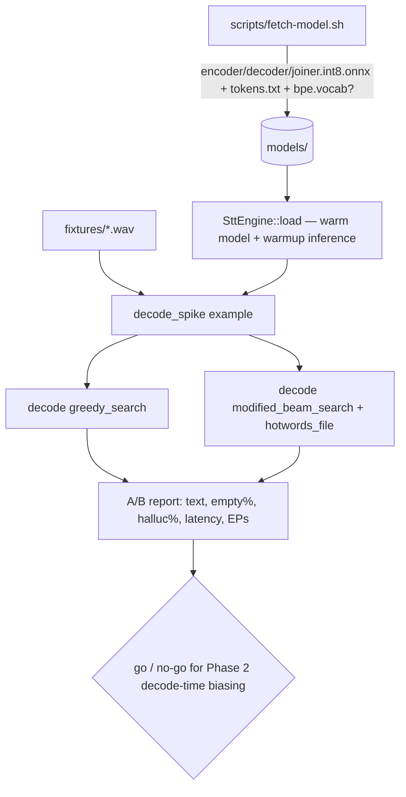

# Spec: Phase 1 STT Spike — sherpa-onnx + Parakeet TDT 0.6B v2 (with hotwords A/B)

**Date:** 2026-07-15
**Phase:** Foundation (Phase 1, blocking prerequisite — must pass before any pipeline code)
**Feature slug:** `phase1-stt-spike`
**Depends on:** nothing (greenfield). **Blocks:** all of Phase 1 pipeline work and the Phase 2 dictionary design.

## 1. Overview

A minimal, runnable Rust program that proves Hark's core speech-to-text assumption end-to-end: the official **`sherpa-onnx` crate (v1.13.4)** loads **Parakeet TDT 0.6B v2 (English)**, batch-decodes a 16 kHz mono wav to text with the model kept warm, and — the load-bearing risk — that **hotword/contextual biasing is reachable from Rust** and how badly it is affected by the known sherpa-onnx **issue #3267** (`modified_beam_search` hallucinates/returns empty ~20% of the time on Parakeet TDT).

Per the decisions taken while speccing:
- **Run target: macOS + Windows only.** The decode/hotwords proof is validated on the real target OSes (CoreML on macOS, DirectML/CPU on Windows). Execution-provider availability is therefore *in scope for this spike*, not deferred. The code is authored on the Fedora dev box (`cargo build` may work there via the Linux prebuilt lib, but Linux is **not** a validation target).
- **Code fate: seeds `crates/hark-stt`.** Working spike code becomes the first real module of the STT crate plus an example harness — not a throwaway.
- **#3267: prove *and* measure.** The harness runs an A/B (greedy vs modified_beam_search) N times and records the empty/hallucination rate, turning the biggest Phase 2 risk into data.
- **Assets: fetch script + gitignored model**; a short English wav fixture ships for the hotword test.

**Definition of done:** a `cargo run --example decode_spike` (on macOS and Windows) that prints a transcript for a known clip, reports warm vs cold decode latency, reports which execution providers work, and prints an A/B table quantifying #3267 — ending in a printed **go / no-go recommendation for decode-time hotword biasing in Phase 2**.

## 2. Architecture

### Files to create

```
Cargo.toml                          # workspace root: members = ["crates/hark-stt"]
.gitignore                          # ignore /models, /target
rustfmt.toml                        # edition + import settings
clippy.toml                         # (optional) lint config
scripts/fetch-model.sh              # download + extract Parakeet TDT v2 int8 into models/
crates/hark-stt/
  Cargo.toml                        # sherpa-onnx dep + example wiring
  src/lib.rs                        # SttEngine: load (warm), decode, config — the reusable seed
  src/config.rs                     # SttConfig, DecodingMethod, HotwordConfig
  src/error.rs                      # SttError (thiserror)
  examples/decode_spike.rs          # the spike harness: decode + EP probe + #3267 A/B + verdict
  tests/decode_pure.rs              # unit tests for the pure logic that needs no model/hardware
  fixtures/hark_hotword_test.wav    # short English clip w/ known transcript + dictionary terms
  fixtures/hotwords.txt             # a few bias phrases, one per line (+ optional :score)
  fixtures/expected.txt             # known-good transcript for hark_hotword_test.wav
models/                             # (gitignored) fetched Parakeet TDT v2 int8 archive contents
```

### Data flow (spike)



### The reusable API this seeds (`crates/hark-stt/src/lib.rs`)

```rust
pub struct SttConfig {
    pub encoder: PathBuf, pub decoder: PathBuf, pub joiner: PathBuf, pub tokens: PathBuf,
    pub provider: String,            // "cpu" | "coreml" | "directml" | "cuda"
    pub decoding: DecodingMethod,    // Greedy | ModifiedBeamSearch { max_active_paths }
    pub hotwords: Option<HotwordConfig>, // file + score + bpe_vocab + modeling_unit
    pub num_threads: i32,
}
pub struct Transcript { pub text: String, pub decode_ms: u128 }

impl SttEngine {
    pub fn load(cfg: SttConfig) -> Result<Self, SttError>;   // builds recognizer, runs 1 warmup decode
    pub fn decode(&self, samples: &[f32], sample_rate: u32) -> Result<Transcript, SttError>;
}
```

Keep `SttEngine` free of I/O beyond the model; the harness owns wav loading, timing, and reporting so the engine stays reusable by the eventual pipeline.

## 3. Implementation Steps (checkpoints)

Each checkpoint is a commit-sized chunk. Commit + `/compact` between them. **Checkpoints 0–1 can be built on Fedora; Checkpoints 2–4 must be run on macOS and Windows.**

### Checkpoint 0 — Workspace, assets, and a green build
1. `Cargo.toml` (workspace, `resolver = "2"` or `"3"`, member `crates/hark-stt`). `.gitignore` for `/models` and `/target`. `rustfmt.toml`.
2. `crates/hark-stt/Cargo.toml`:
   ```toml
   [dependencies]
   sherpa-onnx = "1.13.4"     # module path is `sherpa_onnx`; default feature = "static" auto-downloads the prebuilt native lib
   thiserror = "2"
   [dev-dependencies]
   # (wav loading uses sherpa_onnx::Wave::read — no hound needed)
   ```
3. `scripts/fetch-model.sh` — download + extract:
   ```sh
   #!/usr/bin/env bash
   set -euo pipefail
   mkdir -p models && cd models
   url="https://github.com/k2-fsa/sherpa-onnx/releases/download/asr-models/sherpa-onnx-nemo-parakeet-tdt-0.6b-v2-int8.tar.bz2"
   curl -L -O "$url"
   tar xjf "$(basename "$url")"
   ls sherpa-onnx-nemo-parakeet-tdt-0.6b-v2-int8/   # expect encoder.int8.onnx, decoder.int8.onnx, joiner.int8.onnx, tokens.txt, test_wavs/
   ```
   Archive ≈ 1.3 GB (encoder.int8.onnx ~622 M, decoder ~6.9 M, joiner ~1.7 M, tokens.txt, `test_wavs/0.wav`).
4. `src/error.rs`, `src/config.rs` skeletons; `src/lib.rs` compiles with a stub `load`/`decode`.
5. **Gate:** `cargo build` succeeds and the sherpa-onnx prebuilt native lib auto-downloads (no manual ONNX Runtime install). Confirm on **both macOS and Windows** (this is the first cross-platform link check). Record whether `cc`/`cmake` are needed transitively.
   - *Gotcha:* if auto-download fails, set `SHERPA_ONNX_LIB_DIR` to a manually fetched lib archive (`sherpa-onnx-v1.13.4-<platform>-static-lib.tar.bz2`).

### Checkpoint 1 — Warm decode with greedy_search
6. Implement `SttEngine::load`: build `OfflineRecognizerConfig`, set `model_config.transducer = OfflineTransducerModelConfig { encoder, decoder, joiner }`, `model_config.tokens`, `model_config.provider`, `model_config.num_threads`; `OfflineRecognizer::create(&cfg)`. Run **one warmup decode** on a silence or the test wav inside `load` so the first real decode is not cold.
7. Implement `decode`: `let stream = recognizer.create_stream(); stream.accept_waveform(sr, samples); recognizer.decode(&stream); stream.get_result().text`. Time it with `std::time::Instant` (allowed here — this is app timing, not test assertion).
8. Load the wav via `sherpa_onnx::Wave::read(path)` → `.sample_rate()`, `.samples()` (`&[f32]`). Assert 16 kHz mono; if not, error clearly.
9. `examples/decode_spike.rs`: load engine (provider="cpu"), decode `models/.../test_wavs/0.wav` and `fixtures/hark_hotword_test.wav`, print transcript + `decode_ms`, and print **cold-vs-warm** timing (first decode before warmup vs after).
10. **Gate:** transcript for the shipped `test_wavs/0.wav` is non-empty and sane; warm decode of a few-second clip is well under 1 s on the target hardware. Record the numbers.

### Checkpoint 2 — Execution-provider probe (macOS/Windows)
11. Parameterize `provider` and loop over candidates per OS: macOS `["cpu", "coreml"]`; Windows `["cpu", "directml", "cuda"]`. For each, attempt `load` + one decode; catch failures.
12. **Gate:** print a table of which providers actually initialize and decode on the prebuilt lib. CPU must work everywhere. **Record which GPU EPs are available** — this resolves the open "CoreML/DirectML availability in the auto-downloaded lib" question that the plan flagged. If a desired EP is missing, note whether a `shared`-feature build or a custom lib is needed (follow-up, not a blocker for the spike verdict).

### Checkpoint 3 — Hotwords reachability + the `bpe_vocab` gate
13. **First, resolve the `bpe_vocab` question.** Hotwords on NeMo TDT (PR #3077) require `model_config.modeling_unit` + `model_config.bpe_vocab`. Check the extracted archive for a `bpe.vocab` (or similar). If absent, attempt to proceed without it and observe the error; document whether it must be generated NeMo-side. **This gate decides whether decode-time biasing is even constructible today.**
14. Build a hotword config: `config.decoding_method = "modified_beam_search"`, `config.hotwords_file = fixtures/hotwords.txt`, `config.hotwords_score = 2.0` (tunable), `model_config.modeling_unit = "bpe"`, `model_config.bpe_vocab = <path>` if required. `fixtures/hotwords.txt`: a few phrases, one per line, optional `:score` (e.g. `PARAKEET :3.0`).
15. **Gate:** the modified_beam_search + hotwords config **constructs and decodes without panicking**, returning text (possibly wrong/empty — that's Checkpoint 4's job to quantify). If it cannot be constructed (e.g. missing bpe_vocab with no workaround), record that as the finding and skip to the verdict — the answer is "decode-time biasing not viable now; phonetic-only for Phase 2."

### Checkpoint 4 — #3267 A/B measurement + verdict
16. Across the fixture wavs (shipped `test_wavs/0.wav` + `fixtures/hark_hotword_test.wav`, ideally one with a boosted term genuinely present in audio and one without), run **N = 20** decodes per method:
    - **A:** `greedy_search`, no hotwords.
    - **B:** `modified_beam_search` + hotwords.
17. For each method/wav, tally: **empty-output rate**, **hallucination rate** (heuristic: output for a known-clean clip diverging from `fixtures/expected.txt` beyond a small edit-distance threshold, or grossly wrong length), whether the **boosted term appeared** (B only), and decode latency distribution.
18. Print an A/B table and a one-line **verdict**:
    - If B's empty+halluc rate is low (say < ~5%) and hotwords land → *decode-time biasing viable; keep as experimental-but-usable in Phase 2.*
    - If B reproduces the ~20% #3267 failure → *ship Phase 2 on greedy_search + phonetic post-correction; gate decode biasing behind an experimental flag; re-check #3267 upstream before revisiting.*
19. **Gate:** the verdict prints, and the observed rates are written into the Lessons Learned section of this file and routed to LL-G / agent-memory.

## 4. Data Model

None. The spike touches no database (SQLite arrives in Phase 4). The only persistent artifacts are the gitignored model files under `models/` and the committed fixtures.

## 5. API Contract

No network/HTTP API (BYOK cleanup is Phase 3, out of scope). The "contract" is the internal Rust API in §2 (`SttConfig` / `SttEngine::load` / `decode` / `Transcript`), which the Phase 1 pipeline will consume. Keep signatures stable; the pipeline will call `decode(&[f32], u32)` from a worker thread.

## 6. Acceptance Criteria

The tester/implementer can check each:
1. `scripts/fetch-model.sh` populates `models/` with the four model files + `tokens.txt`; `models/` is gitignored (not committed).
2. `cargo build` (workspace) succeeds on **macOS and Windows** and auto-fetches the sherpa-onnx native lib without a manual ONNX Runtime install.
3. `cargo run --example decode_spike` prints a **non-empty, sane transcript** for the shipped `test_wavs/0.wav`.
4. Warm decode of a few-second clip is **< 1 s** on the target hardware; the report shows warm materially faster than cold (warmup works).
5. The EP probe prints which providers initialize/decode; **CPU works on both OSes**, and CoreML (macOS) / DirectML (Windows) availability is explicitly recorded (available or not).
6. The `bpe_vocab` question is answered in writing (present in archive / must be generated / not needed).
7. The modified_beam_search + hotwords path either decodes without panic, **or** its inability to construct is recorded as the finding.
8. An **A/B table quantifying #3267** (empty% + halluc% for greedy vs modified_beam_search over N=20) and a printed **go/no-go verdict** for Phase 2 decode-time biasing.
9. `cargo clippy --all-targets -- -D warnings` and `cargo fmt --check` are clean; `cargo nextest run` (pure-logic tests) passes.

## 7. Out of Scope

- Live microphone capture / `cpal` ring buffer (Phase 1 pipeline proper).
- Global push-to-talk hooks (CGEventTap / `WH_KEYBOARD_LL`) — separate Phase 1 spike.
- Clipboard/`enigo` injection.
- BYOK cleanup, voices, and the LLM adapter (Phase 3).
- SQLite history/stats and the egui UI (Phases 4).
- Full dictionary system (Phase 2) — this spike only *measures whether decode-time biasing is viable*; it does not build the dictionary.
- Linux as a validation target (build-only there).
- fp16 / full-precision model variants (int8 only for the spike). *Follow-up implied: if int8 accuracy disappoints, evaluate fp16.*

## 8. Assumptions / Open Questions

Defaults chosen for questions not separately confirmed; implementer should verify the ⚠ items during the spike (they are why this is a spike):
- ⚠ **EP selection is a runtime `provider` string, not a Cargo feature** (crate exposes `static`/`shared`/`mic`, no CUDA/DirectML/CoreML feature strings were found). Verify CoreML/DirectML are compiled into the auto-downloaded prebuilt lib. *If not*, a `shared` build against a platform ONNX Runtime with the EP may be required.
- ⚠ **`bpe.vocab` availability** in the release archive is unconfirmed and gates the hotword path (Checkpoint 3).
- ⚠ Full-precision/fp16 archive internal filenames unconfirmed (irrelevant unless we switch off int8).
- Assumed `hotwords_score = 2.0` and `max_active_paths = 4` as starting points (tunable; over-boosting causes false insertions).
- Assumed N = 20 A/B runs is enough to observe #3267's non-determinism; increase if variance is high but counts are borderline.
- Assumed the shipped `test_wavs/0.wav` is acceptable as the "known clean" clip; `fixtures/expected.txt` will hold its transcript (capture it on first successful decode).
- `model_type` is auto-detected by sherpa-onnx for Parakeet; set `"nemo_transducer"` explicitly only if auto-detection fails.

## 9. Test Plan

Hardware/model-dependent behavior is validated by the harness on macOS/Windows (see Acceptance Criteria); only pure logic is unit-tested on the dev box.

- **Unit (dev-box, no model/hardware) — `tests/decode_pure.rs`:**
  - wav-format guard: a helper that rejects non-16 kHz or non-mono input returns a clear error.
  - hotwords-file writer/parser round-trip: `phrase :score` lines parse to (phrase, score) and re-serialize identically.
  - A/B tally logic: given synthetic result lists (some empty, some divergent), the empty%/halluc% computation is correct.
  - edit-distance/hallucination threshold helper behaves at boundaries (equal, 1-edit, gross-divergence).
- **Harness-driven (macOS/Windows), not `cargo test`:** decode correctness, latency, EP probe, hotword construction, #3267 A/B — these are the spike's printed report and map to Acceptance Criteria 3–8.
- **Test data:** shipped `test_wavs/0.wav`; `fixtures/hark_hotword_test.wav` (short English, known transcript, contains at least one term also placed in `hotwords.txt`); `fixtures/hotwords.txt`; `fixtures/expected.txt`.

## 10. Error Handling

| Failure mode | Handling |
|---|---|
| Model files missing under `models/` | `SttEngine::load` returns `SttError::ModelNotFound(path)` with the fetch-script hint; harness prints "run scripts/fetch-model.sh". |
| Native lib auto-download fails (offline/mirror) | Document `SHERPA_ONNX_LIB_DIR` fallback; surface the underlying link error, don't swallow. |
| Requested provider unavailable (e.g. CoreML absent) | Catch at `load`, log "provider X unavailable, falling back to cpu", continue the probe — never hard-crash the whole run. |
| wav not 16 kHz mono | `SttError::BadAudioFormat { got_sr, got_channels }` before decode. |
| `bpe_vocab` required but absent | Record finding; construct without it and report the exact error; do not fake success. |
| modified_beam_search returns empty/garbage | Expected under #3267 — counted, not treated as a crash. |
| decode panics inside the native lib | Isolate each A/B iteration so one panic doesn't abort the whole measurement (catch/report per-iteration where feasible; otherwise note the crashing input). |

User-facing (harness stdout) messages are plain and actionable ("CoreML not available in prebuilt lib; used CPU. See §8."). No end-user UI exists yet.

## 11. Rollback Plan

Self-contained and trivially reversible: the spike lives entirely in new files (`crates/hark-stt/`, `scripts/`, workspace `Cargo.toml`, fixtures) and touches nothing else. To undo: delete `crates/hark-stt/`, `scripts/fetch-model.sh`, `models/`, and the workspace root `Cargo.toml`. No migrations, no shared state, no other work affected. If the verdict is "STT stack not viable," the plan's Lessons Learned records why and Phase 1 re-scopes (e.g. evaluate an alternative ASR) before any pipeline code is written — which is exactly the point of doing this first.

## 12. Lessons Learned / Gotchas

Pre-seeded (verified 2026-07-15; see `.claude/agent-memory/explorer/sherpa_onnx_rust_api.md` and `hark_stt_stack_risk.md`):
- Use `sherpa-onnx = "1.13.4"` (module `sherpa_onnx`); **not** the deprecated `sherpa-rs`.
- Load wavs with `sherpa_onnx::Wave::read` — no `hound` dependency needed.
- Hotword config fields confirmed present on the Rust structs (`decoding_method`, `hotwords_file`, `hotwords_score`, `modeling_unit`, `bpe_vocab`) but **no Rust hotwords example exists upstream** — treat as a spike, not a given.
- `modified_beam_search` + Parakeet TDT carries open bug **sherpa-onnx #3267** (~20% empty/hallucinated, non-deterministic) — the whole reason for the Checkpoint 4 A/B.

Fill in during/after implementation:
- [ ] Observed empty% / hallucination% for greedy vs modified_beam_search (the #3267 data) → route to LL-G via `/add-lesson`.
- [ ] Whether `bpe.vocab` ships in the release archive (yes/no/how-to-generate) → LL-G.
- [ ] Which execution providers the prebuilt lib supports on macOS/Windows → LL-G + `.claude/agent-memory/patterns.md`.
- [ ] Warm decode latency numbers on real target hardware → `.claude/agent-memory/patterns.md`.
- [ ] Any Fedora/macOS/Windows build-link gotchas (cc/cmake, SHERPA_ONNX_LIB_DIR) → LL-G (`kb/rust`).
- [ ] Failed approaches (what didn't build/decode and why) → `.claude/agent-memory/debugging.md`.
