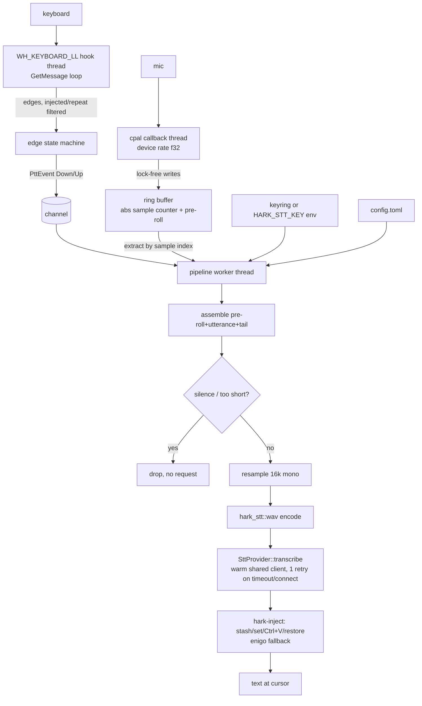

# Spec: Phase 1 Pipeline, Capture -> Hotkey -> STT -> Inject (Verbatim core loop)

**Date:** 2026-07-16
**Phase:** Foundation (Phase 1, the pipeline proper; the STT spike is its blocking prerequisite and has PASSED)
**Feature slug:** `phase1-pipeline`
**Depends on:** `tasks/2026-07-15-phase1-stt-spike.md` (PASSED 2026-07-16: verdict Deepgram nova-3 default, p50 150 ms / p95 630 ms warm; cloud BYOK validated). Consumes the stable `SttProvider` trait from `crates/hark-stt`.
**Blocks:** Phase 2 (dictionary), Phase 3 (voices/cleanup), Phase 4 (settings/history UI + SQLite).
**Platform posture:** **Windows-first.** All Windows checkpoints are buildable and runnable on this dev box. macOS is folded into the final checkpoint and every macOS item is explicitly marked **NEEDS MAC** (this machine is Windows-only; it cannot compile or validate the CGEventTap / Accessibility path).

---

## 1. Overview

Turn the proven STT adapter into the real dictation loop: **hold the push-to-talk key, speak, release, and the transcribed English text is injected at the cursor in any app.** Phase 1 is Verbatim only (no dictionary, no cleanup, no UI). Concretely:

1. **Continuous audio capture** (`cpal`) into a lock-free ring buffer that always retains a short pre-roll, so the words spoken in the ~300 ms *before* the key registers are not lost.
2. **Native push-to-talk** via a `WH_KEYBOARD_LL` low-level keyboard hook on a dedicated message-loop thread (NOT the `global-hotkey` crate), emitting clean key-down / key-up edges for a user-configurable key.
3. **A pipeline worker thread** that, on release, assembles `pre-roll + utterance + tail` from the ring buffer, resamples to 16 kHz mono, encodes a WAV, calls `SttProvider::transcribe` on the one long-lived pre-warmed HTTP client (Deepgram nova-3 default), and hands the text to injection. One retry on Timeout / connect-class Http only, never on 4xx.
4. **Injection** via clipboard stash -> set -> synthesize Ctrl+V -> restore, with an `enigo` char-typing fallback for paste-hostile fields.
5. **BYOK key** from the OS keychain (`keyring`), with a dev env-var override; never in TOML, never logged. Minimal TOML settings loader (provider, model, base URL, PTT key).
6. A thin **dev binary** (`hark-cli`) that wires the loop and blocks on Ctrl+C. The tray + egui UI is a later phase; the crate layout is chosen so the future UI binary owns `main()` and reuses the pipeline unchanged.

**Definition of done (Windows):** `cargo run -p hark-cli` starts the loop; holding the configured key, speaking, and releasing injects the raw provider transcript at the cursor in an arbitrary Windows app, on the one long-lived warm client, within the spike's measured latency plus a small injection cost. All pure-logic units test green; `cargo clippy --all-targets -- -D warnings` and `cargo fmt --check` clean. macOS parity is a separate, explicitly-flagged checkpoint validated on real hardware.

---

## 2. Architecture

### 2.1 Crate layout decision

The master plan (`tasks/plan-repo.md` §5) already decomposes Hark into ~10 crates. **This spec implements the Phase 1 subset of that decomposition rather than inventing a parallel structure**, and defers UI/SQLite crates. Decision on the orchestration question the task poses (`hark-pipeline` vs a single `hark-core`): **a `hark-pipeline` library crate plus a thin `hark-cli` binary**, not a monolithic `hark-core`.

**Why `hark-pipeline` (lib) + thin `hark-cli` (bin), justified:**
- The orchestration (state machine + thread wiring) must be reusable *verbatim* by the future `hark-app`/`hark-ui` binary that owns the tray + egui main thread. Keeping it in a library, with only wiring in the binary, makes the eventual swap (dev CLI -> tray app) a small change, not a refactor.
- It keeps `eframe`/`egui`/`tray-icon` out of Phase 1 entirely, so the hot path is built and measured with zero UI weight.
- A single `hark-core` bundling capture + hotkey + inject + orchestration would blur the boundaries the master plan already drew and make the UI extraction harder. The subset approach honors the existing architecture.

**Phase 1 crates (workspace members):**

| Crate | New? | Responsibility (Phase 1 scope) |
|---|---|---|
| `hark-stt` | exists (green) | `SttProvider` trait + adapters + `wav` encoder. **Signature frozen; do not change.** |
| `hark-audio` | new | cpal capture, device-rate -> 16 kHz mono resample, ring buffer w/ absolute sample counter, window assembly (pre-roll/tail), silence gate. |
| `hark-hotkey` | new | `WH_KEYBOARD_LL` hook + message-loop thread (Windows); CGEventTap (macOS, final checkpoint); configurable key; edge detection; `PttSource` boundary. |
| `hark-inject` | new | arboard clipboard stash/set/paste/restore + enigo Ctrl+V and char-typing fallback. |
| `hark-keychain` | new | `keyring` wrapper + dev env-var override; never logs. |
| `hark-config` | new | TOML settings load/defaults (provider, model, base URL, PTT key, bias-terms placeholder). **SQLite half of the planned `hark-store` is deferred to Phase 4.** |
| `hark-pipeline` | new | worker-thread state machine; owns the pre-warmed shared client; glues audio + hotkey + stt + inject. |
| `hark-cli` | new | thin dev binary: load config -> resolve key -> pre-warm client -> spawn threads -> block on Ctrl+C. Becomes `hark-app` (tray/egui) later. |

**Deferred (not created in Phase 1):** `hark-dictionary` (Phase 2), `hark-voice` (Phase 3), `hark-store` SQLite (Phase 4), `hark-ui`/`hark-app` (Phase 4). `hark-config` is a deliberately-minimal stand-in for the settings half of `hark-store` so we do not pull `rusqlite` in early.

**Per-crate `CLAUDE.md`:** create only where distinct discipline is load-bearing:
- `crates/hark-hotkey/CLAUDE.md` — the message-pump-or-no-callbacks rule, the `LLKHF_INJECTED` ignore rule, dedicated-thread ownership.
- `crates/hark-audio/CLAUDE.md` — the WASAPI COM-apartment init rule and the "never block / never allocate in the cpal callback" rule.
- `crates/hark-inject/CLAUDE.md` — the clipboard timing race + non-text-format clobber limitation.
(`hark-stt/CLAUDE.md` is already planned in the master plan when that crate is documented; not this spec's job.)

### 2.2 File plan (all source files kept < 500 lines; split as noted)

```
crates/hark-audio/
  Cargo.toml
  src/lib.rs            # public API: Capture, AudioClip, window assembly entry points
  src/ring.rs           # lock-free ring buffer + absolute sample counter (PURE, unit-tested)
  src/resample.rs       # device-rate -> 16 kHz mono (PURE, unit-tested)
  src/window.rs         # pre-roll/tail sample-index math + silence gate (PURE, unit-tested)
  src/capture_win.rs    # cpal stream build on a dedicated COM-init thread (I/O; run-on-real-HW)
  CLAUDE.md

crates/hark-hotkey/
  Cargo.toml
  src/lib.rs            # PttSource boundary + PttEvent; spawn_listener(key, tx)
  src/edges.rs          # key-down/up edge state machine, injected/repeat filtering (PURE, unit-tested)
  src/hook_win.rs       # WH_KEYBOARD_LL install + GetMessage loop (I/O; run-on-real-HW)
  src/hook_mac.rs       # CGEventTap (FINAL CHECKPOINT; NEEDS MAC)
  CLAUDE.md

crates/hark-inject/
  Cargo.toml
  src/lib.rs            # inject(text, &Settings) -> Result; strategy selection
  src/clipboard.rs      # stash/set/verify/restore w/ retry loop (I/O; thin pure helpers tested)
  src/keys.rs           # enigo Ctrl+V + char-typing fallback (I/O)
  CLAUDE.md

crates/hark-keychain/
  Cargo.toml
  src/lib.rs            # resolve_key(): env override -> keyring; never logs

crates/hark-config/
  Cargo.toml
  src/lib.rs            # Settings struct + TOML load/defaults (PURE parse tested)

crates/hark-pipeline/
  Cargo.toml
  src/lib.rs            # run(config): spawn + wire threads; owns shared client
  src/state.rs          # Idle/Recording/Transcribing/Injecting transitions (PURE, unit-tested)
  src/worker.rs         # the worker loop: assemble -> encode -> transcribe -> inject (I/O)
  src/retry.rs          # retry-decision predicate over SttError (PURE, unit-tested)

crates/hark-cli/
  Cargo.toml
  src/main.rs           # thin wiring; Ctrl+C; logging that never prints key/audio

config/
  default-config.toml   # committed default settings
```

### 2.3 Data flow



The `main` thread in Phase 1 (the `hark-cli` binary) only spawns the three worker threads and parks on Ctrl+C; it owns no hot-path work. This preserves the **UI-on-main-thread** invariant for free and mirrors exactly what the future tray/egui binary will do (it will own the event loop on main and spawn the same three threads).

### 2.4 Verified crate versions (checked 2026-07-16; re-verify before pinning)

| Crate | Version | Features | Why / gotcha |
|---|---|---|---|
| `cpal` | `0.18.1` | default (WASAPI built-in) | Pin `SampleFormat::F32` explicitly; do not trust `default_input_config()` heuristics. |
| `rubato` | **verify at impl** | — | Arbitrary-ratio resampler for device-rate -> 16 kHz. Version not researched here; confirm latest before pinning. See §8. |
| `windows` (windows-rs) | `0.62.2` | `Win32_Foundation`, `Win32_UI_WindowsAndMessaging`, `Win32_UI_Input_KeyboardAndMouse` | Higher-level than `windows-sys`; typed callback marshaling for the hook. **Do not use `winapi` (legacy).** |
| `enigo` | `0.6.1` | `default-features = false` on Win/mac (drops X11) | `Enigo::new(&Settings)`; `Keyboard`/`Mouse` trait split. |
| `arboard` | `3.6.1` | consider disabling `image-data` if unused | Cross-platform (Win + mac) clipboard; text-only round-trip (see clobber gotcha §10/§12). |
| `keyring` | `=4.1.5` | `v1` (bundles native backends) | **Pin exact patch** (3 releases in ~2 days); backend model changed from the 2.x/3.x cargo-feature style. |
| `serde` / `toml` | `1` / latest | `derive` | Settings parsing. |
| `crossbeam-channel` *or* `std::sync::mpsc` | — | — | Hotkey -> pipeline events. `std::sync::mpsc` is sufficient; no extra dep needed. |

`clipboard-win` is **not** adopted: arboard covers Windows + macOS in one code path, matching the "avoid premature abstraction" rule. Revisit only if full non-text-format clipboard fidelity becomes a requirement.

---

## 3. Implementation Steps (checkpoints)

Each checkpoint is a commit-sized chunk with a hard gate. Per the commit rules, every commit updates `CHANGELOG.md` and bumps at least the patch version. Windows checkpoints (0-6) are fully buildable/runnable here; the macOS checkpoint (7) is validated on real hardware only.

### Checkpoint 0: workspace scaffolding, green build
1. Add the six new crates to the workspace `Cargo.toml` members. Create each with an empty `lib.rs`/`main.rs` and its `Cargo.toml` dependency block (versions from §2.4; `rubato` pinned after the §8 check).
2. Confirm `hark-stt` still builds untouched (do not modify it).
3. **Gate:** `cargo build --workspace` and `cargo clippy --all-targets -- -D warnings` pass with no behavior and no native-lib downloads. `cargo fmt --check` clean.

### Checkpoint 1: hark-config + hark-keychain
4. `hark-config`: `Settings` struct (provider kind, base_url, model, ptt_key, `bias_terms: Vec<String>` placeholder for Phase 2) + TOML loader with sane defaults (default provider Deepgram nova-3; default PTT key = Right Ctrl, see §8). Commit `config/default-config.toml`.
5. `hark-keychain`: `resolve_key(provider) -> Result<String, KeyError>` with precedence **env override (`HARK_STT_KEY`) first, then keyring**. The env override is the dev/CI path (aligns with the Doppler secrets flow: keys injected as env at run time, never pasted). Debug/Display impls must never print the key.
6. **Gate:** unit tests: TOML parse + defaults + unknown-key tolerance; key-source precedence (env beats keyring; both-absent yields a clear error, not a panic). No key value ever formatted into a log line (assert in a test). Clippy clean.

### Checkpoint 2: hark-audio capture + resample + ring buffer
7. `ring.rs`: fixed-capacity lock-free SPSC ring buffer holding f32 samples plus a monotonically increasing **absolute sample counter**, so any subsystem can request "samples [start_abs .. end_abs)". Capacity sized for pre-roll + max-utterance cap + tail (see §8). PURE.
8. `resample.rs`: device-rate -> 16 kHz mono. Use `rubato` for arbitrary ratios (devices commonly report 44.1 kHz, which is **not** an integer multiple of 16 kHz). If the device already reports 16 kHz support, bypass resampling. Downmix multi-channel to mono by averaging. PURE (operates on sample slices).
9. `window.rs`: given down/up absolute sample indices, compute `[down - preroll .. up + tail)`; RMS/duration **silence gate** that reports "drop, do not transcribe" for empty/too-short/too-quiet clips (prevents pointless requests and Groq's 10 s-minimum billing on silence). PURE.
10. `capture_win.rs`: build the cpal input stream on a **dedicated thread that owns COM init**, at the device's default config (`F32`), writing into the ring buffer from the callback with **no allocation and no blocking primitives** (see cpal #970 gotcha, §12). Expose `start()` returning a handle that keeps the stream + ring alive.
11. **Gate:** pure-logic tests green (ring wrap/read-by-index boundaries, resample length math e.g. 48k->16k is exactly 3:1 and 44.1k->16k ratio, mono downmix, pre-roll/tail window math, silence gate thresholds). Live capture is flagged **run-on-real-HW** (cannot validate mic here). Clippy clean.

### Checkpoint 3: hark-hotkey (Windows) + edge detection
12. `edges.rs`: pure state machine translating a stream of raw key events into `PttEvent::Down` / `PttEvent::Up` for the configured key, **filtering auto-repeat** (down-while-already-down) and **ignoring `LLKHF_INJECTED`** events (so our own synthesized Ctrl+V never re-triggers PTT, §12). PURE.
13. `hook_win.rs`: install `SetWindowsHookExW(WH_KEYBOARD_LL, ...)` on a **dedicated OS thread whose entire body is a `GetMessage`/`DispatchMessage` loop** (the hook delivers callbacks only while that thread pumps messages, §12). Feed raw events into `edges.rs`; emit `PttEvent` over the channel to the pipeline.
14. `lib.rs`: a `PttSource` boundary (`fn spawn_listener(key: PttKey, tx: Sender<PttEvent>) -> ListenerHandle`) so CGEventTap slots in behind the same signature in Checkpoint 7 without touching the pipeline.
15. **Gate:** edge-detection unit tests green (down/up transitions, auto-repeat suppression, injected-flag ignore, wrong-key ignore). Hook install itself flagged **run-on-real-HW**. Clippy clean.

### Checkpoint 4: hark-inject
16. `clipboard.rs`: stash current clipboard **text** -> set new text -> **read-back verify** the set took -> synthesize paste -> restore stashed text. Wrap every clipboard open in a **bounded retry loop** (clipboard is a global object; `ClipboardOccupied` happens in practice, §12). Insert a **short, tunable delay** between set and paste and between paste and restore (the set->paste->restore race pastes stale content otherwise, §12). Document the **non-text-format clobber** limitation (arboard round-trips text only; images/RTF/HTML present before dictation are not preserved) as an accepted v1 behavior.
17. `keys.rs`: enigo `Enigo::new(&Settings)`; synthesize Ctrl+V; provide a **char-typing fallback** for paste-hostile fields (typed directly, no clipboard touch). Strategy selection lives in `lib.rs::inject`.
18. **Gate:** builds + clippy clean. Pure helpers tested (strategy selection, retry-count policy). The synth/clipboard I/O is glue verifiable only on real Windows — say so explicitly. Add a **real-HW integration check** that our own hook sees enigo's Ctrl+V and correctly ignores it (guards the injected-flag feedback loop, §12).

### Checkpoint 5: hark-pipeline orchestration
19. `state.rs`: pure `PipelineState` transitions `Idle -> Recording -> Transcribing -> Injecting -> Idle`, with defined handling for edge cases (Up with no matching Down; new Down while Transcribing -> ignore or queue; error -> back to Idle). PURE.
20. `retry.rs`: pure predicate `should_retry(&SttError) -> bool` == true only for `Timeout` and connect-class `Http`, never 4xx (`Auth`/`RateLimited`/`Provider`). PURE. Matches the spike verdict.
21. `worker.rs`: the worker thread. On `Down` record the down sample index; on `Up` record the up index, wait until the ring buffer has produced `up + tail` samples, assemble the window (§2.2 `hark-audio`), run the silence gate, resample, `hark_stt::wav::encode_wav_16k_mono`, `provider.transcribe` on the **shared pre-warmed client** with **at most one retry** per `retry.rs`, then call `hark_inject::inject`. History/stats writes are Phase 4 and off the hot path anyway.
22. `lib.rs::run(config)`: build the shared `reqwest::blocking::Client` **once at startup and pre-warm it** (the spike measured a 0.4-0.9 s cold penalty; fire a tiny warm-up request or rely on the first real request but log the cold cost). Spawn audio + hotkey + worker threads; return a handle.
23. **Gate:** pure tests green (state transitions incl. the edge cases; retry predicate over every `SttError` variant; window-assembly integration with a synthetic ring buffer + fixture samples asserting sample counts, never wall-clock). Clippy clean.

### Checkpoint 6: hark-cli dev binary (Windows end-to-end)
24. `main.rs`: load config -> `resolve_key` -> `hark_pipeline::run`. Block on Ctrl+C; clean shutdown. Logging via a minimal logger that **structurally cannot** emit the key or raw audio (log lengths/counts, never contents).
25. Note (not required to trigger in Phase 1): once this binary becomes the tray app, any **console child process must set `CREATE_NO_WINDOW` (0x0800_0000)** (LL-G HIGH, §12). The Phase 1 dev binary is a plain console app so the flag is moot *here*, but the codepaths that later spawn children (signing, launch-at-login) must carry it.
26. **Gate (real-HW milestone):** `cargo run -p hark-cli` on Windows; hold the configured key, speak, release; the raw provider transcript appears at the cursor in an arbitrary app (Notepad, a browser field). Latency subjectively matches the spike (Deepgram p50 ~150 ms warm) plus a small injection cost. Verify warm-client reuse (no per-press TLS handshake). Clippy + fmt clean.

### Checkpoint 7: macOS parity (NEEDS MAC, real hardware only)
27. `hook_mac.rs`: implement `PttSource` with a **CGEventTap**. A CGEventTap requires a `CFRunLoop` on its thread; document that in the future `hark-app` the tap-owning run loop coordinates with the **main-thread** UI ownership rule (the tap can run on a dedicated thread with its own run loop; validate this does not fight the egui/winit main loop on Mac). Feed events into the same `edges.rs`.
28. Validate `hark-inject` on macOS: enigo + arboard both require **Accessibility** permission (and mic capture requires the **microphone** permission); confirm the app triggers the prompts and degrades gracefully when denied (never silently fails to inject/record, per design guardrails §6).
29. **Gate (NEEDS MAC):** builds on macOS; end-to-end hold-speak-release injects text on a real Mac; permission prompts appear and denial is handled. Everything in this checkpoint is unverifiable on the Windows dev box and must be run by a human on macOS.

---

## 4. Data Model

No database (SQLite is Phase 4). Persistent artifact: `config/default-config.toml` plus the user's `config.toml` in the OS config dir. In-memory types:

```
Settings            { provider_kind, base_url, model, ptt_key, bias_terms: Vec<String> }
PttKey              # a serializable key identifier (default: Right Ctrl)
PttEvent            = Down | Up
PipelineState       = Idle | Recording | Transcribing | Injecting
AudioClip           { samples_16k_mono: Vec<f32>, ... }   # produced by window assembly
InjectStrategy      = ClipboardPaste | TypeChars
```

API keys live in the OS keychain (or the `HARK_STT_KEY` env override for dev/CI); never in TOML, never in a struct that gets logged.

## 5. API Contract

- **External:** unchanged from the spike (Deepgram `/v1/listen`, OpenAI-compatible `/audio/transcriptions`). The pipeline adds no new external calls.
- **Internal boundaries (keep stable so the future UI binary reuses them):**
  - `hark_stt::SttProvider::transcribe(&[u8]) -> Result<Transcript, SttError>` — **frozen; do not change.**
  - `hark_stt::wav::encode_wav_16k_mono(&[f32]) -> Vec<u8>` — reused as-is (spike measured ~3.7 ms).
  - `hark_audio`: `Capture::start() -> CaptureHandle`; `CaptureHandle::assemble_window(down_abs, up_abs) -> Option<AudioClip>` (None == silence-gated).
  - `hark_hotkey::spawn_listener(PttKey, Sender<PttEvent>) -> ListenerHandle` — one signature, two platform impls.
  - `hark_inject::inject(text: &str, &InjectSettings) -> Result<(), InjectError>`.
  - `hark_keychain::resolve_key(provider) -> Result<String, KeyError>`.
  - `hark_config::Settings::load(path) -> Result<Settings, ConfigError>`.

## 6. Acceptance Criteria

1. `cargo build --workspace` succeeds with zero native-lib/model downloads; `hark-stt` untouched and still green.
2. `cargo run -p hark-cli` on Windows runs the loop; hold-speak-release injects the raw transcript at the cursor in an arbitrary app.
3. Pre-roll works: words spoken ~200-300 ms before the key registers are present in the transcript (verified by speaking immediately on press).
4. The shared HTTP client is built once and reused warm across presses (no per-press TLS handshake; cold cost paid at most once at launch).
5. Retry fires at most once and only on Timeout/connect-class Http; a bad key (`Auth`) or `RateLimited` never triggers a retry.
6. Silence / too-short holds produce no network request.
7. Injection restores the prior clipboard **text**; the non-text clobber limitation is documented, not silently surprising.
8. Our own keyboard hook does not re-trigger PTT on enigo's synthesized Ctrl+V (injected-flag ignore verified on real HW).
9. No API key or raw audio ever appears in any log, error, or panic (grep-verified).
10. `cargo clippy --all-targets -- -D warnings`, `cargo fmt --check`, and `cargo nextest run` (pure-logic units) all clean.
11. macOS checkpoint validated separately on real hardware (NEEDS MAC): end-to-end inject + permission prompts.

## 7. Out of Scope

- Dictionary / phonetic post-correction / provider biasing (Phase 2; `bias_terms` is a plumbed placeholder only).
- Voices / BYOK cleanup LLM call (Phase 3).
- SQLite history + stats, retention pruning (Phase 4).
- egui settings/history window, tray icon, first-run onboarding (Phase 4).
- Streaming/WebSocket STT adapters (deferred; would introduce tokio, see §12).
- Packaging, signing, notarization, launch-at-login, single-instance guard (Phase 5).
- Full non-text clipboard-format preservation (documented v1 limitation).
- Multi-provider runtime switching UI (config-file only in Phase 1).

## 8. Assumptions / Open Questions

- ⚠ **`rubato` version not researched.** Confirm the latest stable and its resampler-type API before pinning (Checkpoint 0/2). If a dependency is undesirable and *all* target devices report a 48 kHz mix format, a hand-written 3:1 anti-aliased decimator is viable, but 44.1 kHz devices (non-integer ratio) make a general resampler the safer default. Decide at Checkpoint 2.
- ⚠ **Default PTT key.** Proposed default: **Right Ctrl** (rarely used for other chords, easy to hold, present on most keyboards). F13-style keys are cleaner but absent on many laptops. The key is user-configurable from day one (design guardrails §3); confirm the default with the user.
- ⚠ **cpal callback -> ring buffer handoff** carries a live risk (cpal #970: pushing from the callback into some channel/ring types silently stops the stream). Validate the chosen ring buffer under real capture on target hardware at Checkpoint 2 before building on it.
- ⚠ **Clipboard set->paste->restore delay** has no OS-guaranteed minimum; the ~30-50 ms figure is a community rule of thumb. Tune empirically on real Windows at Checkpoint 4; it adds directly to release-to-inject (acceptable: Deepgram p50 is ~150 ms, leaving headroom under the ~2 s bound).
- ⚠ **Tail duration vs latency.** Waiting for `up + tail` (~200 ms) before transcribing adds a fixed ~200 ms to every dictation. Confirm the tail length is worth it or make it configurable.
- ⚠ **Max-utterance cap** for ring-buffer sizing: assume 60 s max hold; on exceed, transcribe what we have rather than grow unbounded. Confirm.
- Assume one STT provider active at a time in Phase 1 (from config); runtime switching is Phase 4.
- Assume the future `hark-app` will spawn the same three worker threads from its main-thread event loop; `hark-pipeline::run` is designed for that.

## 9. Test Plan

Per `.claude/rules/tests.md`: unit tests inline (`#[cfg(test)]`), integration tests in `tests/`, **no wall-clock asserts** (assert sample counts / buffer lengths / state, not timings), and hardware/network glue isolated so its pure logic is testable without a mic, keyboard hook, clipboard, or live network.

**Pure-logic units (run on this box, no HW/network):**
- `hark-audio`: ring buffer wrap + read-by-absolute-index boundaries; resample output length for 48k->16k (exact 3:1) and 44.1k->16k; multi-channel-to-mono downmix; pre-roll/tail window index math (including pre-roll clamped at buffer start); silence-gate thresholds (empty, sub-min-duration, sub-RMS).
- `hark-hotkey`: edge state machine (down/up, auto-repeat suppression, `LLKHF_INJECTED` ignore, wrong-key ignore).
- `hark-inject`: strategy selection (paste vs type-chars), retry-count policy, read-back-verify decision.
- `hark-keychain`: key-source precedence (env > keyring > error), and a test asserting the key never appears in `format!("{:?}")` output.
- `hark-config`: TOML parse, defaults, unknown-field tolerance.
- `hark-pipeline`: `PipelineState` transitions incl. edge cases (Up-without-Down, Down-while-Transcribing, error->Idle); `should_retry` over **every** `SttError` variant; window-assembly integration against a synthetic ring buffer + committed fixture samples asserting resulting sample counts.

**Run-on-real-HW (cannot validate here; assert manually per checkpoint gate):**
- Live cpal capture + pre-roll correctness; `WH_KEYBOARD_LL` install + real key edges; clipboard paste/restore on real apps; enigo Ctrl+V + our-hook-ignores-injected; full end-to-end latency feel (Windows CP6, macOS CP7).

**Reuse:** the spike's `fixtures/spike_clip.wav` (16 kHz mono, known transcript) for window-assembly and encode sanity where a real clip helps.

## 10. Error Handling

| Failure mode | Handling |
|---|---|
| No STT key (keyring empty and env unset) | `hark-cli` exits at startup with a clear "no API key; set `HARK_STT_KEY` or store one in the keychain" message. Never a panic. (Phase 4 replaces this with first-run onboarding.) |
| Provider `Auth` (401/403) | Surfaced from `SttError::Auth`; logged as "check your API key" without echoing the key; **no retry**. |
| Provider `RateLimited` (429) | `SttError::RateLimited`; surfaced; **no auto-retry storm** (Phase 1 logs it; UI toast is Phase 5). |
| `Timeout` / connect-class `Http` | **One** retry on the shared client; if it fails again, drop the dictation with a logged error (no partial injection). |
| Provider returns empty/garbage text | Inject nothing on empty; log. (Dictionary/cleanup that would repair this is later phases.) |
| Silence / too-short hold | Window assembler returns `None`; worker drops it, no request, no injection. |
| cpal stream fails to build / device lost | `hark-audio` returns an error at `start()`; `hark-cli` reports "no usable microphone" and exits (Phase 5 adds live device-loss recovery). |
| Hook install fails (`SetWindowsHookExW` returns null) | `hark-hotkey` returns an error; `hark-cli` reports it and exits; never silently runs deaf. |
| Clipboard occupied (`ClipboardOccupied`) | Bounded retry loop (~3-10 attempts, short spacing); on exhaustion, fall back to enigo char-typing rather than failing the dictation. |
| Injected Ctrl+V re-caught by our hook | `LLKHF_INJECTED` filter in `edges.rs` drops it before it reaches PTT state (unit-tested + real-HW checked). |
| macOS Accessibility / mic permission denied | Graceful, visible failure with a pointer to System Settings (NEEDS MAC; design guardrails §6). |

## 11. Rollback Plan

Every checkpoint is a self-contained commit; `git revert` peels them back in reverse with no cross-crate entanglement (the pipeline is the only crate that depends on the others, and it lands last among the libraries). `hark-stt` is never modified, so the proven spike stays green throughout. If a foundational assumption fails:
- **cpal callback -> ring handoff proves unreliable** (cpal #970 bites): fall back to a `Mutex<VecDeque>` drained by a puller thread, or a different ring crate; localized to `hark-audio/src/ring.rs` + `capture_win.rs`.
- **`WH_KEYBOARD_LL` proves unreliable for held keys**: the `PttSource` boundary lets an alternative (raw input, or a vetted crate) slot in behind the same signature without touching the pipeline.
- **Clipboard injection proves too racy/destructive**: make enigo char-typing the default strategy (slower but no clipboard mutation); `hark-inject` already contains both paths.
- **Latency regresses badly vs the spike** once real capture + injection are in the loop: the spike's Rollback Plan still applies (re-open the local-model question with `whisper-rs` + `tiny.en`), but only after confirming the regression is provider latency and not our own capture/inject overhead.

## 12. Lessons Learned / Gotchas

**Pre-seeded from LL-G (verified 2026-07-16) — HIGH severity Rust entries:**
- [ ] **Console-window flashing** (`kb/rust/gui-subsystem-console-child-window.md`, HIGH): once `hark-cli` becomes the `windows_subsystem="windows"` tray binary, every console child process (signing, `taskkill`, launch-at-login) must set `CREATE_NO_WINDOW` (0x0800_0000) via `CommandExt::creation_flags`, or a console flashes and steals focus. Moot for the Phase 1 console dev binary; carry it into any child-spawning codepath.
- [ ] **Blocking IO on a tokio executor** (`kb/rust/blocking-io-on-tokio.md`, HIGH): **stays moot** for the whole Phase 1 pipeline — all HTTP is `reqwest::blocking` on the worker thread; no executor exists to starve. Becomes live only if a future streaming STT adapter introduces tokio; keep that runtime scoped to the adapter and blocking IO off it.
- [ ] **reqwest multipart masks transport errors** (`kb/rust/reqwest-multipart-masks-transport-errors.md`, HIGH): already handled in `hark-stt` (hand-assembled buffered multipart body); the pipeline inherits the correct error taxonomy. Do not "simplify" `hark-stt` back onto reqwest's `multipart` feature.
- [ ] **reqwest 0.13 TLS feature rename** (`kb/rust/reqwest-013-tls-feature-rename.md`, MEDIUM): TLS features are `rustls` + `webpki-roots`, not the old umbrella `rustls-tls-webpki-roots`; already reflected in `hark-stt`.

**Pre-seeded from 2026-07-16 crate research (verify versions before pinning):**
- [ ] **WASAPI shared mode does NOT give 16 kHz and does NOT resample for you** — capture at the device default (usually 48 kHz f32) and resample to 16 kHz mono ourselves. 48k->16k is exactly 3:1; 44.1k->16k is not integer, so a general resampler (`rubato`) is the safe default.
- [ ] **cpal WASAPI COM apartment** — build the stream on a dedicated thread that owns `CoInitializeEx`; if egui/winit or the hook thread inits COM with a different mode first on a shared thread, cpal gets `RPC_E_CHANGED_MODE`. Do not share the cpal thread with the UI/hook thread.
- [ ] **cpal #970 (open)** — pushing from the input callback into some channel/ring types can silently stop the stream firing, no error. Use a pre-allocated lock-free SPSC ring with plain writes (no alloc, no OS sync primitive) in the callback, and validate under real capture before relying on it.
- [ ] **`WH_KEYBOARD_LL` needs a running message pump** — the hook delivers callbacks only while its installing thread runs a `GetMessage`/`DispatchMessage` loop. The hotkey thread's entire body must be that loop; it cannot park/sleep and cannot be the cpal thread.
- [ ] **enigo's synthesized Ctrl+V IS seen by our own hook** — injected events are not exempt from the hook chain. Check `KBDLLHOOKSTRUCT.flags & LLKHF_INJECTED` and ignore injected events, or dictation paste-injects into an infinite PTT loop. The injected-flag contract has regressed across enigo versions before (RustDesk #14667): pin enigo and keep the real-HW test that asserts the hook ignores our own Ctrl+V.
- [ ] **arboard round-trips text only** — `set_text` clears all other clipboard formats, so stash/restore silently drops any pre-existing image/RTF/HTML. Accepted v1 limitation; document it. Full fidelity would need per-format `EnumClipboardFormats` handling (not worth it now).
- [ ] **Clipboard is a global object** — `OpenClipboard` fails with `ClipboardOccupied` when another process holds it; wrap every open in a bounded retry loop.
- [ ] **set -> paste -> restore is a race** — setting the clipboard then immediately synthesizing Ctrl+V then immediately restoring can paste the OLD content. Mitigate with a short tunable delay after set (before paste) and after paste (before restore), plus a read-back verify; no OS-guaranteed timing exists, tune empirically.
- [ ] **`keyring` 4.x changed its backend model** and releases fast — pin an exact patch (`=4.1.5` as of today), use the `v1` umbrella feature, and re-verify at the packaging milestone.
- [ ] **Use `windows` (windows-rs) not `winapi`** for the Win32 FFI; `winapi` is legacy. Features: `Win32_Foundation`, `Win32_UI_WindowsAndMessaging`, `Win32_UI_Input_KeyboardAndMouse`.
- [ ] **BP KB is SaaS/web-oriented** — the security and error-handling FOUNDATIONAL entries (tenant access, structured web logging, key rotation) do not map to a single-user native desktop app. Hark's applicable rules (secrets only in keychain, never log keys/audio, validate at boundaries, `Result`/`?`) already live in `CLAUDE.md` and `.claude/rules/rust.md`.

**Discovered during implementation (route new items to LL-G via `/add-lesson`):**
- [x] **rubato 4.0.0 (2026-07-09) restructured the whole API** (routed to LL-G): the `FftFixedIn`/`SincFixedIn`/`FftFixedInOut` family named in §8 no longer exists. v4 = `Fft` + `FixedSync::{Input,Output,Both}` + the `audioadapter` buffer abstraction (`InterleavedSlice` wraps a plain mono slice; `process_all` returns `InterleavedOwned`, `take_data()` for the raw vec). Whole-clip resampling MUST use `process_all(&adapter, input_len, None)`: it resets, trims the FFT startup delay, and returns exactly `ceil(input_len * ratio)` frames (ceil, NOT round). A single oversized `process()` call leaves leading silence and truncates the tail. Verified hands-on: exact 3:1 from 48 kHz, non-integer 44.1 kHz, and sub-chunk-length clips all pass; a head-signal RMS test guards the delay trim. Three major versions in 8 months: re-verify at every bump.
- [x] **cpal 0.18 API deltas vs older snippets:** `sample_rate()` returns a bare `u32` (no `SampleRate` tuple struct), and `build_input_stream` takes `StreamConfig` by value, not by reference. Compile errors, not silent, but they will bite any pre-0.18 example code.
- [x] **PTT default changed to a chord at user review: Left Ctrl + Left Win.** `edges.rs` became a chord tracker (engage on last member down, release on first member up, re-engage on partial re-press). No swallowing needed: Windows marks a Win press "used in a chord" when another key goes down while it is held, so the Start menu does not fire on release of Ctrl+Win. Tail = 150 ms (configurable), max hold = 120 s (also user-confirmed).
- [x] **`hark_stt::Transcript` has no `Debug` impl** (deliberate frozen-crate hygiene), so `Result<Transcript, _>::unwrap_err()` does not compile in dependent tests; unwrap errors by hand with a `match`.
- [x] **Connect-class retry detection rides a string prefix contract.** `SttError::Http` does not structurally distinguish connect failures; `hark-stt` (frozen) prefixes them with `"connect failed"`. `hark-pipeline/src/retry.rs` pins that contract with a localhost bind-then-drop connect-refused test so drift fails loudly at test time.
- [x] **Windows dev box smoke test (2026-07-16):** default input is 48 kHz F32 (as predicted), the LL hook installs, and the Deepgram pre-warm measured 218 ms on this network. The interactive hold-speak-release gate remains for a human (see CP6 gate).
